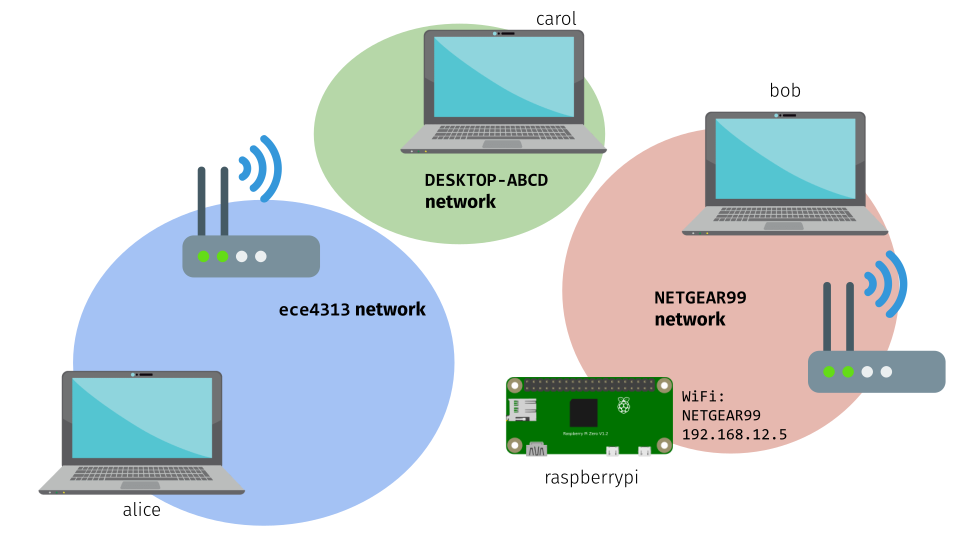

# Connecting to your Raspberry Pi (in person students)


This semester, we'll use the Raspberry Pi for a series of lab exercises and to prototype your project design.  You'll need to be very comfortable setting up a connection to your Pi over a local wireless network, so that you can run software utilities or custom code on your Pi.

In this lab exercise, we'll practice connecting to the Pi using different configurations, so that you can work with your Pi both in the lab (if you attend in person) and at home.

## By the end of this session...

* **If you are attending in-person**, you will be able to get a terminal session on your Pi (using SSH) or a GUI session on your Pi (using VNC) over the lab WiFi network.
* You will also be able to get a terminal session on your Pi (using SSH) or a GUI session on your Pi (using VNC) using a mobile hotspot from your laptop or mobile phone.
* **If you are attending remote**, you will be able to get a terminal session on your Pi (using SSH) or a GUI session on your Pi (using VNC) over your home WiFi network or a mobile hotspot from your laptop or mobile phone.


## Lab report

You will submit your lab work in Gradescope. You will upload some screenshots and answer some questions as described in the Gradescope assignment. You do not have to include anything else (e.g. no description of procedure, etc.) 

\newpage


## Prepare your workstation

In this lab session, you'll learn two ways to connect to your Pi: using a terminal session over an SSH connection, and using a GUI session over VNC.

Here's what an SSH connection looks like. Note that you only have access to a terminal on the Pi when using SSH - you can't run any applications that require a graphical interface. However, in most cases we'll only need a terminal anyway, and a terminal-only connection is much faster and smoother.

{ width=70% }

You'll need to install some software on your laptop. For SSH, you will need a terminal and an SSH client:

* If you are using a Mac or Linux device, the built-in terminal that comes with your operating system should include an SSH client. Make sure you know how to open the Terminal application that comes with your operating system. (Ask for help if you can't!)
* If you are using a Windows device and you do not already have an SSH client, you will have to download and install one. I recommend Git Bash, which you can download here: [`https://git-scm.com/downloads`](https://git-scm.com/downloads). Once you have downloaded and installed this application, make sure you know how to open a Git Bash terminal. (Ask for help if you can't!)

Once you have a terminal window open, run

```
ssh
```

You should see some usage information, like this (although not necessarily identical to this):

```
usage: ssh [-46AaCfGgKkMNnqsTtVvXxYy] [-B bind_interface]
           [-b bind_address] [-c cipher_spec] [-D [bind_address:]port]
           [-E log_file] [-e escape_char] [-F configfile] [-I pkcs11]
           [-i identity_file] [-J [user@]host[:port]] [-L address]
           [-l login_name] [-m mac_spec] [-O ctl_cmd] [-o option] [-p port]
           [-Q query_option] [-R address] [-S ctl_path] [-W host:port]
           [-w local_tun[:remote_tun]] destination [command]
```

This shows that you have an SSH client! If you aren't able to run an SSH client and see usage information, stop and ask for help.

\newpage


While we'll mostly work directly in the terminal using SSH, sometimes we'll need to run an application on the Pi using a graphical user interface.  We can establish a GUI connection using VNC.

Here's what a VNC connection looks like. Note that you have access to a graphical interface on the Pi when using VNC, but the connection may not be as smooth as an SSH session.

{ width=60% }


To use VNC to connect to your Pi, you will need to download the RealVNC viewer. It is available for most platforms at [`https://www.realvnc.com/en/connect/download/viewer/`](https://www.realvnc.com/en/connect/download/viewer/).

Make sure you know how to open VNC viewer. It will look like this when you run it for the first time:

{ width=60% }

If you aren't able to open the VNC viewer (as in Figure 3), stop and ask for help.

\newpage

## Connecting to your Pi over a private local network

Once you have the software in place to connect to your Pi, you need to have the right network configuration! We will always connect to the Pi over a private "local" network. This means that the Pi and the device you are connecting to the Pi *from* need to be connected to *the same* wireless network.

For example, in the following scenario, the Pi is connected to the `ece4313` WiFi network. Alice is connected to the `ece4313` network provided by a wireless router, Bob is connected the `nyu` WiFi network, and Carol has used her laptop to create a WiFi hotspot called `DESKTOP-ABCD`. In this configuration, only Alice can connect to the Pi.

{ width=70% }

However, if the Pi is configured to connect to Carol's `DESKTOP-ABCD` network whenever it is available, then Carol will be able to connect to the Pi, and Alice will not be able to connect to the Pi:

{ width=70% }

\newpage 

In the next example, Bob has used his mobile phone to create a WiFi hotspot, and connected both his laptop and the Pi to the phone's hotspot. Bob will be able to connect to the Pi from his laptop. (Alice and Carol cannot connect to the Pi in this scenario).

{ width=70% }

Finally, consider one last scenario. In this configuration, Bob is at home, where he has a wireless router that provides a WiFi network named `NETGEAR99`. Bob's laptop and Pi are configured to connect to `NETGEAR99`, so Bob is able to connect to the Pi. 

{ width=70% }

Depending on whether you attend in person or remote, you may find certain network configurations more convenient than others. However, *everyone* in the class should learn how to set up a WiFi network using their laptop (like Carol in Figure 5) or phone (like Bob in Figure 6) and use it to connect to their Pi, so that you can use your Pi at home when necessary.

\newpage


### In-person: connecting to your Pi using the lab WiFi network

When you attend lab sessions in person, you'll use the `ece4313` network in the lab to connect to your Pi (like Alice in Figure 4). For this to work, both your Pi and your laptop should be connected to the `ece4313` network, which is available in our lab space (LC011). 

(Note: you may want to connect your mobile phone to the lab Zoom meeting, so that you maintain a reliable connection to Zoom even when you change the network configuration on your laptop.)

Use the wireless network connection utility on your laptop to connect to the network `ece4313`, using `CompEDP1` as the password. Note that if your laptop is connected to the `nyu` network (like Bob in Figure 1), you won't be able to reach your Pi. If at any point you lose connectivity to the `ece4313` network, you'll have to re-connect to the network in order to reach your Pi.


Your lab kit includes either a Raspberry Pi Model 3B+ or a Raspberry Pi Zero Wireless, a micro USB power supply, and a micro SD card. Look at your Pi, and identify the location of important status LEDs, buttons, and jacks. If you have a Pi Zero, pay special attention to the location of the micro USB power jack; note that there are two micro USB jacks right next to one another. One of these has the words `PWR IN` printed next to it on the PCB, and the other has `USB`. 


(Make sure the power supply is _not_ connected yet.) A micro SD card is already prepared for you with the Raspberry Pi OS disk image, and a configuration that tells your Pi to connect to the `ece4313` network when it's available ^[Appendix A describes how to create a new SD card with this configuration, in case the one you were given becomes corrupted. Your SD card may become corrupted if you disconnect the power supply before the Pi has fully shut down.]. Put the micro SD card into the slot on the Pi. The gold contacts on the micro SD card will lie on the Pi and the writing on the micro SD card will face up, when it is seated properly.

Finally, plug in the micro USB power supply, and then connect it to the power jack on your Pi. If you have a Model 3B+, the power LED will turn on, and the disk activity LED will flash occasionally as the Pi boots. If you have the Zero W, the disk activity LED will flash occasionally as the Pi boots.

The Pi will automatically connect to the `ece4313` network when in the lab, so your laptop and your Pi should be on the same network! However, there's one more step before you can establish an SSH or VNC connection to the Pi; you need to know its address on the local network, by checking on the router administration page.


\newpage


\newpage


Once you have the IP address assigned to your Pi, you can prepare to connect to it over SSH. Make sure your own laptop is still connected to the `ece4313` network. Then, run 

```
ssh pi@A.B.C.D
```

where in place of the `A.B.C.D`, you put the IP address that you just noted. You may see a message like:

```
The authenticity of host 'A.B.C.D (A.B.C.D)' can't be established.
ECDSA key fingerprint is SHA256:l3xQS590+jnJ/8N9PC/nosB7tk0bTIvA099WCFlrjtA.
Are you sure you want to continue connecting (yes/no/[fingerprint])? 
```

Type `yes` and hit \menu{Enter}.Then, enter the password `raspberry` when prompted. You may not see anything appear in the terminal output when you type the password - this is a security feature, so that anyone eavesdropping over your shoulder can't tell how many characters are in the password. It will look like you're not typing anything, but that's OK - just type the word out anyway, and hit \keys{Enter} 

Your terminal prompt should now look like this

```
pi@raspberrypi:~ $ 
```

indicating that you are in a terminal session on the Pi, and any commands you run will run on the Pi, not your laptop.

Now that you have a terminal session on the Pi, you can also enable VNC on the Pi, so that you can also establish a graphical connection. The Raspberry Pi OS includes a configuration tool called `raspi-config` that we can use to enable VNC. Run

```
sudo raspi-config
```

(`sudo` is a utility that lets you run any command with elevated privileges. To make changes to the system configuration, you will need elevated privileges.) 

Within `raspi-config`, 

* Use the arrow keys to navigate to \menu{Interfacing Options} and hit \keys{Enter}. 
* Navigate to \menu{VNC} and hit \keys{Enter} again. 
* When asked "Would you like the VNC server to be enabled" use the \keys{Tab} key to toggle the answer so that `Yes` is highlighted. Then hit \keys{Enter} to accept your choice. 
* After a few seconds, you should see a message saying that "The VNC Server is enabled." Hit \keys{Enter} to confirm.
* Use \keys{Esc} to close `raspi-config`.

Then, you can close your SSH session with the following command:

```
exit
```


\newpage


Now, open the RealVNC Viewer, and in the address bar at the top, type the address of *your* Pi. (It's not necessarily the same as the address shown in my screenshot!) Then, hit \keys{Enter}.


On some occasions, you may see a message about the VNC server's signature, and will have to press \keys{Yes} or \keys{Continue} to confirm that you want to connect. Then, in the Authentication dialog, enter `pi` as the username and `raspberry` as the password, and hit \keys{OK}.

The first time you connect using VNC, you may be prompted to set your time zone and keyboard configuration. Also, you may see a message warning you that "SSH is enabled and the default password for the 'pi' user has not been changed". You can press \menu{OK} to acknowledge the warning.

Then, you'll see the Raspberry Pi OS desktop:

{ width=60% }

You can click on the Raspberry icon in the top left to see the application menu. You can also use the folder icon in the top left to explore the filesystem on the Pi, the globe icon to open a browser, or the terminal icon to open a terminal.

You can close the VNC viewer and re-connect at any time.

\newpage 

### In-person: connecting to your Pi using your own WiFi hotspot

Since you may sometimes need to attend lab sessions from home, you should make sure that you can connect to your Pi even outside the lab (when the `ece4313` network is not available to you.) It's important that you are able to connect to your Pi outside of this lab:

* in case you have to attend a lab session from home because you have symptoms, or are quarantining due to potential exposure,
* in case we all have to attend a lab session from home, either because the University switches to remote learning or because the instructor has symptoms or is quarantining,
* for later in the semester - so that you can work on your project outside of scheduled lab sessions.

You can use your mobile phone or laptop to create a WiFi hotspot, and configure your Pi to connect to this hotspot (as shown in Figure 5 and Figure 6), as long as:

* The WiFi hotspot is on the 2.4GHz WiFi band, not on 5GHz. The Pi Zero W only supports the 2.4GHz WiFi band.
* The WiFi hotspot should use an authentication method that is supported by the Pi. In these instructions, we assume standard home network authentication methods; enterprise authentication may be more complicated.

The following links will show you how to create a hotspot on an Android or iPhone device. Open the link for the platform that you have available to you, and start your hotspot!

* [Create a WiFi hotspot on your Android phone](https://support.google.com/android/answer/9059108?hl=en). If your wireless carrier limits tethering, you can [turn off mobile data](https://support.google.com/android/answer/9083864?hl=en) before you create the WiFi hotspot. If mobile data is turned off, the devices connected to your WiFi hotspot won't have Internet access, but they will be able to connect to one another over the hotspot network.
* [Create a WiFi hotspot on your iPhone](https://support.apple.com/en-us/HT204023). Note: The default SSID of the iPhone hotspot is set according to the name of the iPhone, for example, "Fraida’s iPhone". It's easier to work with an SSID that does not have any spaces or special characters, like the apostrophe. If you're willing, you can change the iPhones name in the General settings tab to a name which does not contain any special characters, save, and enable the hotspot again. 

Identify the WiFi network name (SSID) and password that your device uses for its mobile hotspot. You will configure your Pi to connect to that network.

Your Pi and your laptop should still be connected to the `ece4313` network, so you can connect to your Pi using SSH. In a terminal session on your Pi, run

```
iwlist wlan0 scan
```

This will show you all of the WiFi networks visible to your Pi. Make sure you can see your personal hotspot! If not, try running 

```
iwlist wlan0 scan
```


again - sometimes, it will only "see" the network it is currently connected to on the first try, but will find other networks in a subsequent scan.

If you can't find your hotspot network in this list, ask for help!

If your WiFi hotspot has spaces or special characters in it, you may have trouble configuring your Pi to connect to it using its human-readable name. Instead, you can [get its hex encoding](https://www.convertstring.com/EncodeDecode/HexEncode), and use that to connect. (But note the different instructions below - if you use the hex encoded version, you won't enclose the SSID in quotes when adding it to the configuration file.)

Once you are sure that your Pi can see your hotspot network, run

```
sudo nano /etc/wpa_supplicant/wpa_supplicant.conf
```

This will open the network configuration file in `nano`, a terminal-based text editor. You should see the following file contents:

```
ctrl_interface=DIR=/var/run/wpa_supplicant GROUP=netdev
update_config=1
country=US

network={
	ssid="ece4313"
	psk="CompEDP1"
}
```

indicating that the Pi is configured to connect to the `ece4313` network with passphrase `CompEDP1`.


Add a network with the SSID and password of your mobile hotspot. For example, if your SSID is `E71210` and the passphrase is `00934596`, the file will look like this:

```
ctrl_interface=DIR=/var/run/wpa_supplicant GROUP=netdev
update_config=1
country=US

network={
  ssid="ece4313"
  psk="CompEDP1"
}

network={
  ssid="E71210"
  psk="00934596"
}
```

If you are using a hex-encoded SSID, because your network name has spaces or special characters in it, don't enclose the hex-encoded SSID in quotes. For example: 


```
ctrl_interface=DIR=/var/run/wpa_supplicant GROUP=netdev
update_config=1
country=US

network={
  ssid="ece4313"
  psk="CompEDP1"
}

network={
  ssid=4537313231300A
  psk="00934596"
}
```

\newpage

Also, define priorities, so that if both networks are available your personal hotspot will be preferred. Give your personal hotspot a higher priority (larger numeric values are higher priority):


```
ctrl_interface=DIR=/var/run/wpa_supplicant GROUP=netdev
update_config=1
country=US

network={
  ssid="ece4313"
  psk="CompEDP1"
  priority=1
}

network={
  ssid="E71210"
  psk="00934596"
  priority=2
}
```

To save (write **o**ut) the file, use \keys{Ctrl+O}, and hit \keys{Enter} when prompted (at the bottom) to accept the file name. Look for a message indicating "Wrote N lines" (or similar). Then, quit `nano` with \keys{Ctrl+X}.

(Note: you can add as many networks as you like to this file. For example, if you have a home WiFi network that you want your Pi to connect to, you can add it, too.)

Now, reboot your Pi:

```
sudo reboot
```

While you wait for your Pi to come back online, connect your laptop to your mobile hotspot. Remember that your Pi and your laptop need to be on the same network, so if your Pi connects to your mobile hotspot, so should your laptop!

When the Pi comes back online, you may be able to reach it even without knowing its IP address. In a *local* terminal window on your laptop, run

```
ping raspberrypi.local
```

(if the `ping` process does not stop by itself, you can stop it with \keys{Ctrl + C}.) If you received some response, great! Make sure you can SSH into your Pi with

```
ssh pi@raspberrypi.local
```

and use `raspberry` as the password.


If not, you'll have to find out the Pi's IP address from your mobile phone:

* On Android devices, in the Mobile Hotspot menu, look for a Connected Devices section which lists the currently connected devices. If you see `raspberrypi` appear in this list, you can click on it to find out the IP address assigned to the Pi.
* On an iPhone, you can install the (free) Network Analyzer app. Open it, and select the LAN tab at the bottom of the screen. Tap the Scan button to see the IP address of every device currently connected to your network.

Then, make sure you can reach that address - in a terminal session, run

```
ping A.B.C.D
```

substituting the IP address you found in place of `A.B.C.D` above. (If the `ping` process does not stop by itself, you can stop it with \keys{Ctrl + C}.) Make sure you get some response! Then, verify that you can SSH into your Pi with

```
ssh pi@A.B.C.D
```

again, substituting the IP address you found in place of `A.B.C.D`, and use `raspberry` as the password.

On the Pi, run

```
iwconfig wlan0
```

to see the current network configuration. 

**Lab report**: Take a screenshot of the mobile hotspot configuration page on your phone (showing your mobile hotspot SSID; you can redact the password if it is visible) and a screenshot of the terminal showing the `iwconfig wlan0` command and its output on your Pi. Also save the contents of the `wpa_supplicant.conf` file, either by taking a screenshot or by copying the text from the terminal into a plaintext file on your laptop.

As an alternative to a mobile hotspot, you can also configure your laptop to act as a hotspot. However, once you start a hotspot on your laptop, you're likely to lose your connection to your Pi! So, before you start any hotspot on your laptop, find out what SSID and password it will have, and configure your Pi to connect to that network (as described above). Make sure to give it higher priority than the lab network - otherwise, the Pi will just connect to the lab network, and you won't be able to test whether your hotspot works!

Once you have configured the `wpa_supplicant.conf` file on your Pi, power off your Pi by running

```
sudo shutdown now
```

in an SSH session on your Pi.  Wait for your Pi to turn off (the disk activity LED should stop blinking completely) and then carefully unplug the power supply from the micro USB port.

Then, start your WiFi hotspot:

* [Create a WiFi hotspot on Windows 10](https://support.microsoft.com/en-us/help/4027762/windows-use-your-pc-as-a-mobile-hotspot). There is an important caveat here: if you are connected to an existing WiFi network, this will *share* it on the same wireless frequency band that you are connected on. But, the Pi Zero W only supports the 2.4GHz WiFi band, not the 5GHz WiFi band. Before you start the hotspot, your Windows PC should be connected to a WiFi network on the 2.4GHz WiFi band.  
* [Create a WiFi hotspot on Windows 7 or 8](https://archive.codeplex.com/?p=virtualrouter) (third-party software, open source.)  If you set it to share an existing WiFi connection, make sure your Windows PC is connected to a WiFi network that is on the 2.4GHz WiFi band, not the 5GHz WiFi band.
* [Create a WiFi hotspot on Windows with Connectify (third-party software, use free version)](https://www.connectify.me/free-wifi-hotspot-software-app/)
* [Create a WiFi hotspot on your Mac](https://support.apple.com/guide/mac-help/share-internet-connection-mac-network-users-mchlp1540/mac)


Finally, restore power to your Pi. Wait a few minutes for it to boot. Then, in a *local* terminal window on your laptop, run

```
ping raspberrypi.local
```

(if the `ping` process does not stop by itself, you can stop it with \keys{Ctrl + C}.) If you received some response, great! Make sure you can SSH into your Pi with

```
ssh pi@raspberrypi.local
```

and use `raspberry` as the password.


If not, you'll have to find out the Pi's IP address from your laptop. You should be able to see a list of connected devices from the Mobile Hotspot configuration page in Windows 10 or from the Connectify GUI. On a MAC, you can find out the IP address of your Pi by running

```
arp -a
```

Once you know the Pi's IP address, make sure you can reach that address - in a terminal session, run

```
ping A.B.C.D
```

substituting the IP address you found in place of `A.B.C.D` above. (If the `ping` process does not stop by itself, you can stop it with \keys{Ctrl + C}.) Make sure you get some response! Then, verify that you can SSH into your Pi with

```
ssh pi@A.B.C.D
```

again, substituting the IP address you found in place of `A.B.C.D`, and use `raspberry` as the password.

**Lab report**: On your Pi, run

```
iwconfig wlan0
```

to see the name of the wireless network your Pi is connected to.

**Lab report**: Take a screenshot of the mobile hotspot configuration page on your laptop (showing your mobile hotspot SSID; you can redact the password if it is visible) and a screenshot of the terminal showing the `iwconfig wlan0` command and its output on your Pi. Also save the contents of the `wpa_supplicant.conf` file, either by taking a screenshot or by copying the text from the terminal into a plaintext file on your laptop.


\newpage

### Remote: connecting to your Pi by impersonating the lab network

The easiest way to connect to your Pi for the first time is to impersonate the network in our lab, LC011! 

The micro SD card in your kit is already prepared for you with the Raspberry Pi OS disk image, and a configuration that tells your Pi to connect to the `ece4313` network when it's available. If you can set up a network with this name and password at home, your Pi will connect to it automatically. Then, you'll be able to access your Pi to configure it to connect to other networks (if you want).

This approach will work if you are able to create a WiFi hotspot from your phone or laptop, *and* you can make the network name whatever you want. You will need to create a WiFi hotspot with the same name and password as our lab network: the password will be \menu{ece4313} and the password will be \menu{CompEDP1}. 

(This may involve making some changes to the configuration of your personal device - phone or laptop. You don't have to make these changes permanently, though; you can use this approach to gain access the first time, and then configure your Pi to connect to another network and revert the changes to your personal device.)

Depending on the devices available to you, these may allow you to create a network with a name and password that *you* define, so you can set it to look exactly like our lab network:

* [Create a WiFi hotspot on Windows 10](https://support.microsoft.com/en-us/help/4027762/windows-use-your-pc-as-a-mobile-hotspot). You should be able to edit the network name, password, and on some devices you may even be able to set the frequency band (to 2.4GHz). There is an important caveat here: if you are connected to an existing WiFi network, this will *share* it on the same wireless frequency band that you are connected on. But, the Pi Zero W only supports the 2.4GHz WiFi band, not the 5GHz WiFi band. Before you start the hotspot, your Windows PC should be connected to a WiFi network on the 2.4GHz WiFi band.  
* [Create a WiFi hotspot on Windows 7 or 8](https://archive.codeplex.com/?p=virtualrouter) (third-party software, open source.) You should be able to set the network name and password. Note: If you set it to share an existing WiFi connection, make sure your Windows PC is connected to a WiFi network that is on the 2.4GHz WiFi band, not the 5GHz WiFi band.
* [Create a WiFi hotspot on your Android phone](https://support.google.com/android/answer/9059108?hl=en). You should be able to edit the network name and password. If your wireless carrier limits tethering and you don't want to use up this limited data allowance, you can [turn off mobile data](https://support.google.com/android/answer/9083864?hl=en) before you create the WiFi hotspot. If mobile data is turned off, the devices connected to your WiFi hotspot won't have Internet access, but they will be able to connect to one another over the hotspot network. 
* [Create a WiFi hotspot on your iPhone](https://support.apple.com/en-us/HT204023). The default SSID of the iPhone hotspot is set according to the name of the iPhone, for example, "Fraida’s iPhone". You can [change the iPhones name](https://support.apple.com/en-us/HT201997) in the General settings tab, save, and enable the hotspot again. Also set the hotspot password.
* Unfortunately, I have not been able to find a solution for OS X to set up a WiFi hotspot with arbitrary name and password. 

If you are using a mobile phone to create the `ece4313` network, you should also connect your laptop to this network. In order to reach your Pi, your laptop will have to be on the same network. 

\newpage

Once your `ece4313` network is up and your laptop is also connected to it, you are ready to start your Pi.


Your lab kit includes either a Raspberry Pi Model 3B+ or a Raspberry Pi Zero Wireless, a micro USB power supply, and a micro SD card. Look at your Pi, and identify the location of important status LEDs, buttons, and jacks. If you have a Pi Zero, pay special attention to the location of the micro USB power jack; note that there are two micro USB jacks right next to one another. One of these has the words `PWR IN` printed next to it on the PCB, and the other has `USB`. 


(Make sure your Pi is *not* plugged in yet.) A micro SD card is already prepared for you with the Raspberry Pi OS disk image, and a configuration that tells your Pi to connect to the `ece4313` network when it's available. Put the micro SD card into the slot on the Pi. The gold contacts on the micro SD card will lie on the Pi and the writing on the micro SD card will face up, when it is seated properly.


Finally, plug in the micro USB power supply, and then connect it to the power jack on your Pi. If you have a Model 3B+, the power LED will turn on, and the disk activity LED will flash occasionally as the Pi boots. If you have the Zero W, the disk activity LED will flash occasionally as the Pi boots.

Wait a few minutes for your Pi to boot. It may take some time, especially the first time it boots a freshly created SD card.

The next step will be to find out how to reach your Pi on the network. First, check if you can reach it by name. In a *local* terminal window on your laptop, run

```
ping raspberrypi.local
```

(if the `ping` process does not stop by itself, you can stop it with \keys{Ctrl + C}.) If you received some response, great! 


\newpage

If not, you'll have to find out the Pi's IP address from whatever device the WiFi hotspot is on:

* On Windows 10 devices using Mobile Hotspot, you should be able to see a list of connected devices from the Mobile Hotspot configuration page.
* On Windows devices using Virtual Router, you should be able to see a list of connected devices in the Virtual Router interface.
* On Android devices, in the Mobile Hotspot menu, look for a Connected Devices section which lists the currently connected devices. If you see `raspberrypi` appear in this list, you can click on it to find out the IP address assigned to the Pi.
* On an iPhone, you can install the (free) Network Analyzer app. Open it, and select the LAN tab at the bottom of the screen. Tap the Scan button to see the IP address of every device currently connected to your network.

Then, make sure you can reach that address - in a terminal session, run

```
ping A.B.C.D
```

substituting the IP address you found in place of `A.B.C.D` above. (If the `ping` process does not stop by itself, you can stop it with \keys{Ctrl + C}.)  

Once you have the IP address assigned to your Pi, you can prepare to connect to it over SSH. Make sure your laptop is still connected to the `ece4313` network. Then, run 

```
ssh pi@A.B.C.D
```

where in place of the `A.B.C.D`, you put the IP address that you just noted, or you can use 

```
ssh pi@raspberrypi.local
```

if you were able to `ping` your Pi by name.

You may see a message like:

```
The authenticity of host 'A.B.C.D (A.B.C.D)' can't be established.
ECDSA key fingerprint is SHA256:l3xQS590+jnJ/8N9PC/nosB7tk0bTIvA099WCFlrjtA.
Are you sure you want to continue connecting (yes/no/[fingerprint])? 
```

Type `yes` and hit \menu{Enter}.Then, enter the password `raspberry` when prompted. You may not see anything appear in the terminal output when you type the password - this is a security feature, so that anyone eavesdropping over your shoulder can't tell how many characters are in the password. It will look like you're not typing anything, but that's OK - just type the word out anyway, and hit \keys{Enter} 

Your terminal prompt should now look like this

```
pi@raspberrypi:~ $ 
```

indicating that you are in a terminal session on the Pi, and any commands you run will run on the Pi, not your laptop.

**Lab report**: Take a screenshot of the terminal showing the `iwconfig wlan0` command and its output on your Pi. Also take a screenshot of the mobile hotspot configuration page on your laptop or phone (whichever device you are using for the hotspot.)

\newpage 

### Remote: connect to home WiFi network (with current SSH connection)

If you have access to your Pi over SSH, you can now configure it to connect to your existing home WiFi network, instead of a mobile hotspot created by your phone or laptop.

This will work as long as:

* The WiFi network is on the 2.4GHz WiFi band, not on 5GHz. The Pi Zero W only supports the 2.4GHz WiFi band.
* The WiFi network uses an authentication method that is supported by the Pi. In these instructions, we assume standard home network authentication methods; enterprise authentication may be more complicated.


Find out your home WiFi network SSID and password. In a terminal session on your Pi (over SSH), run

```
iwlist wlan0 scan
```

This will show you all of the WiFi networks visible to your Pi. Make sure you can see your home network! If not, try running 

```
iwlist wlan0 scan
```


again - sometimes, it will only "see" the network it is currently connected to on the first try, but will find other networks in a subsequent scan.

If you can't find your home WiFi network in this list, ask for help!

If your WiFi network name has spaces or special characters in it, you may have trouble configuring your Pi to connect to it using its human-readable name. Instead, you can [get its hex encoding](https://www.convertstring.com/EncodeDecode/HexEncode), and use that to connect. (But note the different instructions below - if you use the hex encoded version, you won't enclose the SSID in quotes when adding it to the configuration file.)

Once you are sure that your Pi can see your home network, run

```
sudo nano /etc/wpa_supplicant/wpa_supplicant.conf
```

This will open the network configuration file in `nano`, a terminal-based text editor. You should see the following file contents:

```
ctrl_interface=DIR=/var/run/wpa_supplicant GROUP=netdev
update_config=1
country=US

network={
	ssid="ece4313"
	psk="CompEDP1"
}
```

indicating that the Pi is configured to connect to the `ece4313` network with passphrase `CompEDP1`.

\newpage

Add a network with the SSID and password of your home WiFi. For example, if your SSID is `E71210` and the passphrase is `00934596`, the file will look like this:

```
ctrl_interface=DIR=/var/run/wpa_supplicant GROUP=netdev
update_config=1
country=US

network={
  ssid="ece4313"
  psk="CompEDP1"
}

network={
  ssid="E71210"
  psk="00934596"
}
```

If you are using a hex-encoded SSID, because your network name has spaces or special characters in it, don't enclose the hex-encoded SSID in quotes. For example: 


```
ctrl_interface=DIR=/var/run/wpa_supplicant GROUP=netdev
update_config=1
country=US

network={
  ssid="ece4313"
  psk="CompEDP1"
}

network={
  ssid=4537313231300A
  psk="00934596"
}
```

Also, define priorities, so that if both networks are available your personal hotspot will be preferred. Give a larger numeric priority to the network that you want the Pi to connect to first, if both are available. For example, in the following configuration my home network is preferred:


```
ctrl_interface=DIR=/var/run/wpa_supplicant GROUP=netdev
update_config=1
country=US

network={
  ssid="ece4313"
  psk="CompEDP1"
  priority=1
}

network={
  ssid="E71210"
  psk="00934596"
  priority=2
}
```

To save (write **o**ut) the file, use \keys{Ctrl+O}, and hit \keys{Enter} when prompted (at the bottom) to accept the file name. Look for a message indicating "Wrote N lines" (or similar). Then, quit `nano` with \keys{Ctrl+X}.

Now, reboot your Pi:

```
sudo reboot
```

While you wait for your Pi to come back online, connect your laptop to your home network. Remember that your Pi and your laptop need to be on the same network, so if your Pi connects to your home network, so should your laptop!

When the Pi comes back online, you may be able to reach it even without knowing its IP address. In a *local* terminal window on your laptop, run

```
ping raspberrypi.local
```

(if the `ping` process does not stop by itself, you can stop it with \keys{Ctrl + C}.) If you received some response, great! Make sure you can SSH into your Pi with

```
ssh pi@raspberrypi.local
```

and use `raspberry` as the password.

If not, you can also try

```
ping raspberrypi.home
```

and if that works, make sure you can SSH into your Pi with

```
ssh pi@raspberrypi.home
```

and use `raspberry` as the password.


If not, you'll have to find out the Pi's IP address from your home router's administration page. You may have to Google your router's model number to find out how to access and log in to this administration page.

Once you know the Pi's IP address, make sure you can reach that address - in a terminal session, run

```
ping A.B.C.D
```

substituting the IP address you found in place of `A.B.C.D` above. (If the `ping` process does not stop by itself, you can stop it with \keys{Ctrl + C}.) Make sure you get some response! Then, verify that you can SSH into your Pi with

```
ssh pi@A.B.C.D
```

again, substituting the IP address you found in place of `A.B.C.D`, and use `raspberry` as the password.

On the Pi, run

```
iwconfig wlan0
```

to see the current network configuration. 

**Lab report**: Take a screenshot of the terminal showing the `iwconfig wlan0` command and its output on your Pi. Also save the contents of the `wpa_supplicant.conf` file, either by taking a screenshot or by copying the text from the terminal into a plaintext file on your laptop.


\newpage 

### Remote: connect to home WiFi network (no current SSH connection)

If you weren't able to gain access to your Pi over SSH in the first place, or if you accidentally broke this connection (for example, with a typo in the `wpa_supplicant.conf` file), you will need to edit the contents of the micro SD card to gain access.

You should have a micro SD to USB adapter in your lab kit (although if you have a micro SD card reader on your laptop, you can use that directly.) Power off the Pi, and carefully remove the micro SD card. Put it into the micro SD USB adapter and plug it into your computer.

The `boot` filesystem on the micro SD card should be visible, once you plug it in. You will need to add a file with the name `wpa_supplicant.conf` to this directory.  Then when the Pi boots, that file will be copied to the `/etc/wpa_supplicant/wpa_supplicant.conf` location. From there, the Pi will use it to determine what network to connect to.

Use the instructions in the previous section to determine the contents of the `wpa_supplicant.conf` file. When you save this file, be careful - it must be saved as a plaintext file, and it should not have any extra file extension! (Sometimes Windows will add a file extension automatically and invisibly, if you're not careful.) I recommend using `nano` inside a terminal session to create the file, then copy it over to the `boot` directory on the micro SD card. 

When you are finished, safely remove the micro USB, and put it back in your (unplugged) Pi. Then, plug in your Pi, and verify that it connects to your home network, and that you can access it over SSH (following the instructions in the previous section).


\newpage

### Remote: VNC connection

Once you have a terminal session on the Pi (using your preferred network), you can also enable VNC on the Pi, so that you can also establish a graphical connection. The Raspberry Pi OS includes a configuration tool called `raspi-config` that we can use to enable VNC. Run

```
sudo raspi-config
```

(`sudo` is a utility that lets you run any command with elevated privileges. To make changes to the system configuration, you will need elevated privileges.) 

Within `raspi-config`, 

* Use the arrow keys to navigate to \menu{Interfacing Options} and hit \keys{Enter}. 
* Navigate to \menu{VNC} and hit \keys{Enter} again. 
* When asked "Would you like the VNC server to be enabled" use the \keys{Tab} key to toggle the answer so that `Yes` is highlighted. Then hit \keys{Enter} to accept your choice. 
* After a few seconds, you should see a message saying that "The VNC Server is enabled." Hit \keys{Enter} to confirm.
* Use \keys{Esc} to close `raspi-config`.

Then, you can close your SSH session with the following command:

```
exit
```


Now, open the RealVNC Viewer, and in the address bar at the top, type the address of *your* Pi. (It's not necessarily the same as the address shown in my screenshot!) Then, hit \keys{Enter}.


On some occasions, you may see a message about the VNC server's signature, and will have to press \keys{Yes} or \keys{Continue} to confirm that you want to connect. Then, in the Authentication dialog, enter `pi` as the username and `raspberry` as the password, and hit \keys{OK}.

The first time you connect using VNC, you may be prompted to set your time zone and keyboard configuration. Also, you may see a message warning you that "SSH is enabled and the default password for the 'pi' user has not been changed". You can press \menu{OK} to acknowledge the warning.

Then, you'll see the Raspberry Pi OS desktop:

{ width=60% }

You can click on the Raspberry icon in the top left to see the application menu. You can also use the folder icon in the top left to explore the filesystem on the Pi, the globe icon to open a browser, or the terminal icon to open a terminal.

You can close the VNC viewer and re-connect at any time.

\newpage 


## Using the Linux terminal

Open an SSH session on your Pi (using any network that is convenient for you). In this section, we'll learn some basic commands for use on the Pi's Linux-based operating system.


In this section, you'll learn how to use the following Linux utilities and commands:  `pwd`, `ls`, `mkdir`, `cd`, `nano`, `cat`, `mv`, `rm`, `sudo`, `shutdown`, `reboot`, `exit`, and `scp`. 

The first group of commands - `pwd`, `ls`, `mkdir`, `cd`, `mv`, `rm` - are useful for navigating and manipulating the filesystem. 

First, check where you are currently located in the filesystem with the `pwd` ("**p**rint **w**orking **d**irectory") command:

```
pwd
```

Usually, when you open a new terminal window, it will be "in" your home directory - the directory allocated to your user account for storing files and configurations. In this case, the username we are logged in with is `pi` and our home directory is `/home/pi`.

Next, **l**i**s**t the contents of the directory you are in:

```
ls
```

To create a new directory inside our current directory, run `mkdir` and specify a name for the new directory, like

```
mkdir lab1
```

Run 

```
ls
```

again and verify that you can see the new directory you have just created.

You can **c**hange **d**irectory by running `cd` and specifying the directory you want to change to. For example, to change to the directory you've just created, run

```
cd lab1
```

and then use 

```
pwd
```

again to verify your current working directory.

You may have noticed that when you run the `pwd` command, it gives you 
a full path staring with  `/`, followed by several directory names separated by a `/` character.
Any path that starts with a  `/` (the root of the filesystem) 
is a _full path_. For example, after running the commands above, I would see
the following output for `pwd`:

```
/home/pi/lab1
```

When you run commands that involve a file or directory, you can always 
give a full path, which starts with a `/` and contains the entire directory
tree up until the file or directory you are interested in. For example, you can 
run 

```
cd /home/pi/lab1
```

to navigate to the `lab1` directory . Alternatively, you can give a path that is _relative_ to the directory you are in. For example, when I am inside my home directory (`/home/pi`), which has a directory called `lab1` inside it, I can navigate into the `lab1` directory with a relative path:

```
cd lab1
```

or the absolute path:
 

```
cd /home/pi/lab1
```


Next, we will create a file and edit its contents. Use `cd` to navigate to the `lab1` directory you created. Then we will create a `hello.txt` file and open it for editing in one command, using `nano`, a terminal-based text editor:

```
nano hello.txt
```

Type your name and net ID into this file, then use \keys{Ctrl + O} to write it 
**o**ut to file, and hit \keys{Enter} to confirm the file name to which to save.
Near the bottom of the screen, it should say e.g. "[ Wrote 1 line ]".
Then use \keys{Ctrl + X} to exit `nano` and return to your terminal prompt.

To see the contents of a file, we can print the contents of the file 
to the terminal output with `cat`:

```
cat hello.txt
```

Instead of typing out the entire command, the terminal supports a useful feature known as tab auto-completion, in which you can start typing out a command or filename, and it will fill in the rest for you when you press the \keys{Tab} key. 

Try it now - type

```
cat he
```

and then hit the \keys{Tab} key. Does it fill in the rest of the filename for you? You can then hit \keys{Enter} to see the contents of the file again.

To copy a file, we use `cp`, and give the source and destination file names (or paths)
as arguments. For example, if you want to put a copy of `hello.txt` in your home directory (`/home/pi`), you
can run

```
cp hello.txt /home/pi/hello.txt
```

To move (or rename) a file, we use the `mv` command:

```
mv hello.txt hello-4313.txt
```

Note that we used a `-` in the file name - it's better to use `-` or `_` characters rather than spaces in file names.

We can use `rm` to delete a file - for example:

```
rm /home/pi/lab1/hello-4313.txt
```

With `rm`, there is no "Recycle Bin" and no getting back files you've 
deleted accidentally - so be very, very careful.


You can also remove a directory with the `rm` command, although to remove a directory you'll need to add the `-R` argument:

```
rm -R /home/pi/lab1
```

It's often useful to be able to see and re-run commands you've previously run. 

You can use the up arrow and down arrow keys to scroll 
through your previous commands. For example, if you want to re-run the previous command with a small modification, you would:

* Use the up arrow key to see the previous command,
* Use the right and left arrow keys to position your cursor within the command, and make the desired changes,
* then hit \keys{Enter} to run the modified version.

Or, to see your command history all at once, run

```
history
```


The commands you have run so far did not require any special privileges. However, we'll sometimes need to run commands that are 
available only to the administrator, called the "root" user. To run a command as the "root" user, we preface the command with `sudo`.

For example, the `reboot` command, which performs a graceful (software) reboot, is only available to the "root" user. If you try to run

```
reboot
```

you will get a "Permission denied" error.

However, you can reboot the Pi by running

```
sudo reboot
```

You'll see the Pi reboot. Wait a few minutes for it to come up, then use SSH again to get a terminal on the Pi.

(As a general tip, if you ever get a permission error on a Linux system, consider whether you should have prefaced the command you ran with `sudo`!)

To end an SSH session without turning the board off, just run

```
exit
```

to disconnect from the board and return to your regular terminal prompt.

Next, we will learn how to use SCP - the SSH copy utility - to transfer the files we've saved on the BBB, to another host.

In a *local* terminal on your *laptop* (NOT on the Pi - check the terminal prompt to be sure!), make sure that your current location in the filesystem is one you can write to, such as your Documents or Desktop folder. (You can use the `pwd`, `ls`, and `cd` commands you just learned in the terminal on Linux, Mac, or Git Bash on Windows to help you locate yourself in the filesystem on your laptop!)


After you have navigated to an appropriate location, run

```
scp pi@raspberrypi.local:/home/pi/hello.txt .
```

to copy the file from `/home/pi/hello.txt` on the Pi to your laptop. Enter the password (`raspberry`) when prompted. 

Here's a brief explanation of the different parts of the `scp` command:

* `scp` is followed by a space, then its two arguments. The first argument is the source of the file you want to copy, and the second argument is the destination you want to copy to.
* `pi` is your username on the system where the file you want to copy is located
* `@` separates the username and hostname or address
* `raspberrypi.local` is the address of the system where the file you want to copy is located. (Alternatively, you can use the address, e.g. `192.168.7.2`.)
* `:` separates the hostname and the absolute path of the file you want to copy.
* `/home/pi/hello.txt` is the absolute path of the file you want to copy.
* The last argument is the location you want to copy the file _to_. The shorthand `.` says "Copy to the directory that I'm running this command _from_." (That's why it's important to run this command from a location that you can write to - because you're attempting to copy a file to that location in your filesystem.)

**Note**: If you get a "Permission denied" error at this point, make sure you are running this command from a location on your laptop that you have the necessary privileges to write to!


Make sure you can locate the files you've just transferred using the file explorer on your laptop.

**Lab report**: Take a screenshot of your terminal, showing the `scp` command and its output indicating a successful file transfer. Also, open the `hello.txt` file *on your laptop* (not on the Pi!), and take a screenshot showing the open file and its contents.


## Safely shut down your Pi


When you're finished, use SSH to connect to your Pi again, then perform a graceful (software) shutdown - run

```
sudo shutdown now
```

Wait for the disk activity LED on your Pi to stop blinking completely. Then, carefully disconnect the micro USB power cable from your Pi. Don't pull the micro USB power cable out of the Pi forcefully, since you may break the jack off the board. Instead, apply pressure to the micro USB jack with one hand while you gently remove the power cable with the other.

\newpage

## Appendix A: Preparing a new micro SD card

If the micro SD card that is provided for you becomes corrupted, you may need to prepare a new one. This appendix includes instructions for preparing a micro SD card with the Raspberry Pi OS image, and configuring it to enable SSH and to connect to the `ece4313` network the first time it boots.

This process will erase everything on the micro SD card, so you should only attempt this if your existing card becomes unusable.

To prepare the micro SD card for use, we will use a free application called [Etcher](https://www.balena.io/etcher/). Download Etcher onto your laptop: [`https://www.balena.io/etcher/`](https://www.balena.io/etcher/)

You will also need to download the Raspberry Pi OS image from [https://www.raspberrypi.org/downloads/raspberry-pi-os/](https://www.raspberrypi.org/downloads/raspberry-pi-os/). Several versions are available on that page; we are using the "Image with desktop and recommended software based on Debian Buster" with release date 2020-08-20.

To use Etcher to write an image to a micro SD card:

* Open Etcher.
* Click \keys{Select Image}, and choose the image file from the download location, e.g. `2020-08-20-raspios-buster-armhf-full.zip`.
* Insert your micro SD card into a USB-micro SD adapter, then plug it into your computer's USB port.
* Click \keys{Select Target}, and make sure that Etcher has found the micro SD card to write to. (To be safe, you may want to make sure any other USB flash drives or portable drives are physically disconnected from your computer, so you can't accidentally overwrite them.)
* Click \keys{Flash}.
* When it's finished, you can close Etcher. 

Before you can use this SD card in a Raspberry Pi, you will need to configure it to

* enable SSH, and
* connect to the `ece4313` network (and/or any other network that you need your Pi to connect to)

Open a terminal, and navigate to the SD card filesystem named `boot`. At the terminal prompt, inside this filesystem, run:

```
touch ssh
```

to create a blank file called `ssh` inside the `boot` directory. This will enable SSH when the Pi boots for the first time.

Also, in your terminal, run

```
nano wpa_supplicant.conf
```

to create a new WiFi configuration file using `nano`.

Put the following contents (exactly!) in the file.

```
country=US
ctrl_interface=DIR=/var/run/wpa_supplicant GROUP=netdev
update_config=1

network={
    ssid="ece4313"
    psk="CompEDP1"
}
```

To save (write **o**ut) the file, use \keys{Ctrl+O}, and hit \keys{Enter} when prompted (at the bottom) to accept the file name. Look for a message indicating "Wrote 8 lines" (or similar). Then, quit `nano` with \keys{Ctrl+X}.

Make sure that the files have been created: run

```
ls
```

and check that both files (`ssh` and `wpa_supplicant.conf`) appear. Also check the file contents by running

```
cat ssh
```

(this file should be blank), and

```
cat wpa_supplicant.conf
```

(this file should be exactly as shown above.)

Once you have completed this configuration, you can remove the micro SD card from the USB adapter, and use it with your Pi. Your Pi will be configured exactly as it was when you got it in your kit. You will have lost any files, software updates, or configuration changes that you made since then.