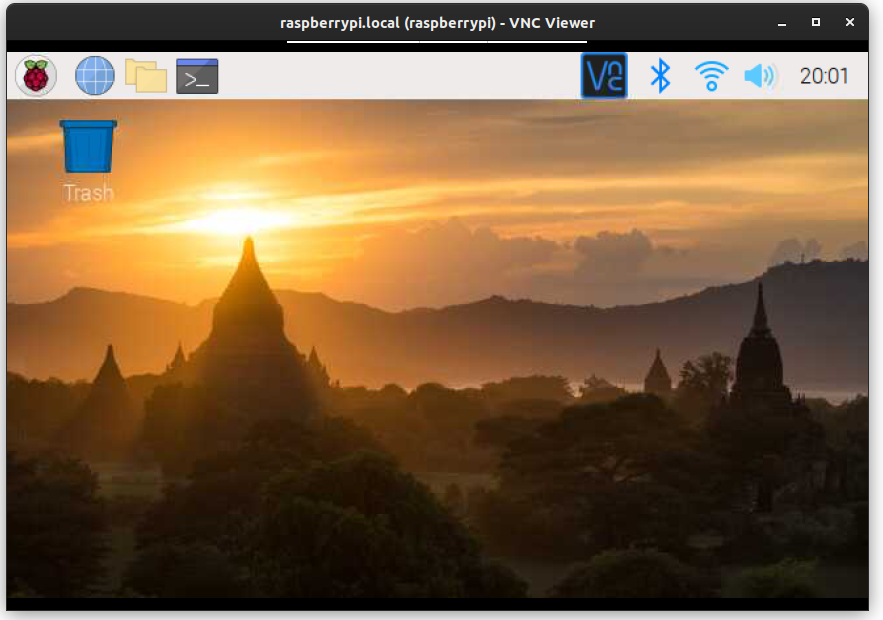

This semester, we'll use the Raspberry Pi for a series of lab exercises and to prototype your project design.  In this lab exercise, we'll practice connecting to the Pi using different configurations, so that you can work with your Pi both in the lab (if you attend in person) and at home.

<!--

## By the end of this session...

Students will be able to:

* Locate the main components on the Pi Zero W board
* Describe "headless" use of a Pi
* Identify the components needed for "headless" use of a Pi, and for using a Pi with a local interface
* Explain how the Pi boots its operating system from external SD card
* Prepare an SD card for "first boot" in headless mode
* Connect to a Pi in "headless" mode using SSH, using the lab network
* Connect to a Pi GUI in "headless" mode using VNC
* Connect to a Pi in "headless" mode over a personal WiFi network
* Utilize the Linux operating system on the Pi for basic tasks including creating, editing, moving, renaming, deleting, and listing files and directories
* Transfer files to and from a Pi using SCP or with VNC software
* Run a basic browser-based interface on a Pi

-->

## Notes

* Please be careful with lab equipment, and treat it gently. (For example: when removing the power supply from your Pi, don't yank the cable out of the jack, since you may pull the jack right off the PCB. Instead, hold the jack against the board with one hand while removing the cable with the other hand.)
* You will submit your lab work in Gradescope. You will upload screenshots/photos and answer some questions as described in the Gradescope assignment. You do not have to write anything else (e.g. no description of procedure, etc.) 
* Read each subsection of this lab manual in its entirety before you start following the instructions in it. Some instructions are modified by explanations that come afterwards.
* Although you may work with a partner, this collaboration is limited to discussion and comparison. Your partner is not allowed to construct or modify your circuit, log in to your Pi, or run commands or write code on your Pi. Similarly, you are not allowed to do these things for your partner. 
* For your lab report, you must submit data, code, screenshots, and photos from your own experiment. You are not allowed to use your lab partner's data, code, screenshots, or photos.
* For any question in the lab report that is marked "Individual work", you should *not* collaborate with your lab partner or anyone else (even via discussion). You can use your notes, the lab manual, or the lecture slides and video to help you answer these questions.


\newpage


## Prepare your workstation

In this lab session, you'll practice two ways to connect to your Pi: using a terminal session over an SSH connection, and using a GUI session over VNC.

Here's what an SSH connection looks like. Note that you only have access to a terminal on the Pi when using SSH - you can't run any applications that require a graphical interface. However, in most cases we'll only need a terminal anyway, and a terminal-only connection is much faster and smoother.

{ width=70% }

For SSH, you will need a terminal and an SSH client:

* If you are using a Mac or Linux device, the built-in terminal that comes with your operating system includes an SSH client. Make sure you know how to open the Terminal application that comes with your operating system. 
* If you are using a Windows device and you do not already have an SSH client, you will have to download and install one. I recommend Git Bash, which you can download here: [`https://git-scm.com/downloads`](https://git-scm.com/downloads). Once you have downloaded and installed this application, make sure you know how to open a Git Bash terminal.

Once you have a terminal window open, run

```
ssh
```

You should see some usage information, like this (although not necessarily identical to this):

```
usage: ssh [-46AaCfGgKkMNnqsTtVvXxYy] [-B bind_interface]
           [-b bind_address] [-c cipher_spec] [-D [bind_address:]port]
           [-E log_file] [-e escape_char] [-F configfile] [-I pkcs11]
           [-i identity_file] [-J [user@]host[:port]] [-L address]
           [-l login_name] [-m mac_spec] [-O ctl_cmd] [-o option] [-p port]
           [-Q query_option] [-R address] [-S ctl_path] [-W host:port]
           [-w local_tun[:remote_tun]] destination [command]
```

This shows that you have an SSH client! If you aren't able to run an SSH client and see usage information, stop and ask for help.


While we'll mostly work directly in the terminal using SSH, sometimes we'll need to run an application on the Pi using a graphical user interface.  We can establish a GUI connection using VNC.

Here's what a VNC connection looks like. Note that you have access to a graphical interface on the Pi when using VNC, but the connection may not be as smooth as an SSH session.

{ width=60% }


To use VNC to connect to your Pi, you will need to download the RealVNC viewer. It is available for most platforms at [`https://www.realvnc.com/en/connect/download/viewer/`](https://www.realvnc.com/en/connect/download/viewer/).

Make sure you know how to open VNC viewer. It will look like this when you run it for the first time:

{ width=60% }

\newpage

# Connecting to your Pi

## Turn on your Pi for a headless session

Your lab kit includes a Raspberry Pi Zero Wireless, a micro USB power supply, and a micro SD card. Look at your Pi, and identify the location of important jacks and status LEDs. Pay special attention to the location of the micro USB power jack; note that there are two micro USB jacks right next to one another. One of these has the words `PWR IN` printed next to it on the PCB, and the other has the word `USB`.

{ width=40% }

Don't connect the power supply yet - first, you'll make sure the SD card is installed correctly. Put the micro SD card into the slot on the Pi. The gold contacts on the micro SD card will lie on the Pi and the writing on the micro SD card will face up, when it is seated properly.

Finally, plug in the micro USB power supply, and then connect it to the power jack on your Pi. The disk activity LED will flash occasionally as the Pi boots.

## Establish an SSH connection over the ece4313 network

When you are working in the LC011 lab, you'll use the `ece4313` network in the lab to connect to your Pi. For this to work, both your Pi and your laptop should be connected to the `ece4313` network, which is available in our lab space (LC011). 

Use the wireless network connection utility on your laptop to connect to the network `ece4313`, using `CompEDP1` as the password. Note that if your laptop is connected to the `nyu` network, you won't be able to reach your Pi. If at any point you lose connectivity to the `ece4313` network, you'll have to re-connect to the network in order to reach your Pi.

Next, you'll need to know the IP address that is assigned to your Pi on the `ece4313` network. Find the numbered sticker on your Pi. Your Pi will have address `192.168.0.N`, where `N` is the number written on the sticker. (This applies only to the `ece4313` network - on another network, your Pi will have a different address!)

Now, in a terminal on your laptop, run

```
ssh pi@192.168.0.N
```

where `N` is the number written on the sticker. You may see a message like:

```
The authenticity of host '192.168.0.N (192.168.0.N)' can't be established.
ECDSA key fingerprint is SHA256:l3xQS590+jnJ/8N9PC/nosB7tk0bTIvA099WCFlrjtA.
Are you sure you want to continue connecting (yes/no/[fingerprint])? 
```

Type `yes` and hit `Enter`.Then, enter the password `raspberry` when prompted. You may not see anything appear in the terminal output when you type the password - this is a security feature, so that anyone eavesdropping over your shoulder can't tell how many characters are in the password. It will look like you're not typing anything, but that's OK - just type the word out anyway, and hit `Enter`.

Your terminal prompt should now look like this

```
pi@raspberrypi:~ $ 
```

indicating that you are in a terminal session on the Pi, and any commands you run will run on the Pi, not your laptop.

---

**Lab report**: Prepare an instruction/checklist document for yourself to use in the future when you need to establish an SSH connection to your Pi over the `ece4313` network. Your list should include instructions specifically for *your* laptop, describing how to:

1. Connect your laptop to the `ece4313` network. Show a screenshot that demonstrates how you can tell you have done this step successfully.
2. Power on the Pi and have it load the operating system from SD card. Show a photo that demonstrates how you can tell you have done this step successfully.
3. Open a terminal on your laptop. Show a screenshot that demonstrates how you can tell you have done this step successfully.
4. Identify the address of your Pi on the `ece4313` network. Show a photo to demonstrate.
5. Use SSH to connect to a terminal session on your Pi, with this address. Show a photo that demonstrates how you can tell you have done this step successfully.

---

\newpage

## Enable VNC and establish a VNC session over the ece4313 network

Now that you have a terminal session on the Pi, you can also enable VNC on the Pi, so that you can also establish a graphical connection. The Raspberry Pi OS includes a configuration tool called `raspi-config` that we can use to enable VNC. Run

```
sudo raspi-config
```

(`sudo` is a utility that lets you run any command with elevated privileges. To make changes to the system configuration, you will need elevated privileges.) 

Within `raspi-config`, 

* Use the arrow keys to navigate to `Interface Options` and hit `Enter`. 
* Navigate to `VNC` and hit `Enter` again. 
* When asked "Would you like the VNC server to be enabled" use the `Tab` key to toggle the answer so that `Yes` is highlighted. Then hit `Enter` to accept your choice. 
* After a few seconds, you should see a message saying that "The VNC Server is enabled." Hit `Enter` to confirm.

The intial default VNC screen resolution is too small, so while we are in `raspi-config` we can also change that. 

* Use the arrow keys to navigate to `Display Options` and hit `Enter`.
* Navigate to `Resolution` and hit `Enter` again.
* Use the arrow keys to select `1024x768`. Then use the `Tab` key to select `OK` and hit `Enter`.
* When you see the confirmation that the resolution is set, select `OK` and then hit `Enter`.
* If prompted to reboot the Pi, you can accept the suggest by using the `Tab` key to select `Yes` and then hitting `Enter`. If you are not prompted to reboot, use `Esc` to close `raspi-config`.

Then, you can close your SSH session with the following command:

```
exit
```


Now, open the RealVNC Viewer, and in the address bar at the top, type the address of *your* Pi. (It's not necessarily the same as the address shown in my screenshot!) Then, hit `Enter`.


On some occasions, you may see a message about the VNC server's signature, and will have to press `Yes` or `Continue` to confirm that you want to connect. Then, in the Authentication dialog, enter `pi` as the username and `raspberry` as the password, and hit `OK`.

The first time you connect using VNC, you may be prompted to set your time zone and keyboard configuration. Also, you may see a message warning you that "SSH is enabled and the default password for the 'pi' user has not been changed". You can press `OK` to acknowledge the warning.

You might be prompted to update the software on your Pi, but you *don't have to do that*. (It will take a long time to run software updates, so you may not want to do that right now.)

Then, you'll see the Raspberry Pi OS desktop:

{ width=60% }


---

**Lab report**: Prepare an instruction/checklist document for yourself to use in the future when you need to establish a VNC connection to your Pi over the `ece4313` network. Your list should include instructions specifically for *your* laptop, describing how to:

1. Connect your laptop to the `ece4313` network. Show a screenshot that demonstrates how you can tell you have done this step successfully. (You can copy your own answer from a previous section.)
2. Power on the Pi and have it load the operating system from SD card. Show a photo that demonstrates how you can tell you have done this step successfully. (You can copy your own answer from a previous section.)
3. Open the VNC viewer on your laptop. Show a screenshot that demonstrates how you can tell you have done this step successfully.
4. Identify the address of your Pi on the `ece4313` network. Show a photo to demonstrate. (You can copy your own answer from a previous section.)
5. Use VNC to connect to a GUI session on your Pi, with this address. Show a photo that demonstrates how you can tell you have done this step successfully.

---

\newpage


## Establish a connection over a personal network

Since you may sometimes need to attend lab sessions from home, you should make sure that you can connect to your Pi even outside the lab (when the `ece4313` network is not available to you.) It's important that you are able to connect to your Pi outside of this lab:

* in case you have to attend a lab session from home because you have symptoms, or are quarantining due to potential exposure,
* in case we all have to attend a lab session from home, either because the University switches to remote learning or because the instructor has symptoms or is quarantining,
* in case you don't finish a lab assignment during the lab session, and want to do the rest at home,
* for later in the semester - so that you can work on your project outside of scheduled lab sessions.

You can use your mobile phone or laptop to create a WiFi hotspot, and configure your Pi to connect to this hotspot. However,

* The WiFi hotspot should be on the 2.4GHz WiFi band, not on 5GHz. The Pi Zero W only supports the 2.4GHz WiFi band.
* The WiFi hotspot should use an authentication method that is supported by the Pi. In these instructions, we assume standard home network authentication methods; enterprise authentication may be more complicated.

The following links will show you how to create a hotspot on an Android or iPhone device, or on a Mac or Windows PC. Open the link for the platform that you have available to you, and start your hotspot!

* [Create a WiFi hotspot on your Android phone](https://support.google.com/android/answer/9059108?hl=en). If your wireless carrier limits tethering, you can [turn off mobile data](https://support.google.com/android/answer/9083864?hl=en) before you create the WiFi hotspot. If mobile data is turned off, the devices connected to your WiFi hotspot won't have Internet access, but they will be able to connect to one another over the hotspot network.
* [Create a WiFi hotspot on your iPhone](https://support.apple.com/en-us/HT204023). Make sure to select the "Maximize compatibility" option so that your hotspot will be available on the 2.4 GHz frequency band! Note: The default SSID of the iPhone hotspot is set according to the name of the iPhone, for example, "Fraida’s iPhone". It's easier to work with an SSID that does not have any spaces or special characters, like the apostrophe. If you're willing, you can change the iPhones name in the General settings tab to a name which does not contain any special characters, save, and enable the hotspot again. 
* [Create a WiFi hotspot on your Mac](https://support.apple.com/guide/mac-help/share-internet-connection-mac-network-users-mchlp1540/mac)
* [Create a WiFi hotspot on Windows 10](https://support.microsoft.com/en-us/help/4027762/windows-use-your-pc-as-a-mobile-hotspot). There is an important caveat here: if you are connected to an existing WiFi network, this will *share* it on the same wireless frequency band that you are connected on. But, the Pi Zero W only supports the 2.4GHz WiFi band, not the 5GHz WiFi band. Before you start the hotspot, your Windows PC should be connected to a WiFi network on the 2.4GHz WiFi band. 
* [Create a WiFi hotspot on Windows 7 or 8](https://archive.codeplex.com/?p=virtualrouter) (third-party software, open source.)  If you set it to share an existing WiFi connection, make sure your Windows PC is connected to a WiFi network that is on the 2.4GHz WiFi band, not the 5GHz WiFi band.
* [Create a WiFi hotspot on Windows with Connectify (third-party software, use free version)](https://www.connectify.me/free-wifi-hotspot-software-app/)


Identify the WiFi network name (SSID) and password that your mobile device or laptop uses for its WiFi hotspot. You will configure your Pi to connect to that network.

First, you need your Pi and your laptop to still be connected to the `ece4313` network, so you can connect to your Pi using SSH. In a terminal session on your Pi, run

```
iwlist wlan0 scan
```

This will show you all of the WiFi networks visible to your Pi. Make sure you can see your personal hotspot! If not, try running 

```
iwlist wlan0 scan
```

again - sometimes, it will only "see" the network it is currently connected to on the first try, but will find other networks in a subsequent scan.

If your WiFi hotspot has spaces or special characters in it, you may have trouble configuring your Pi to connect to it using its human-readable name. Instead, you can [get its hex encoding](https://www.convertstring.com/EncodeDecode/HexEncode), and use that to connect. (But note the different instructions below - if you use the hex encoded version, you won't enclose the SSID in quotes when adding it to the configuration file.)

Once you are sure that your Pi can see your hotspot network, run

```
sudo nano /etc/wpa_supplicant/wpa_supplicant.conf
```

This will open the network configuration file in `nano`, a terminal-based text editor. You should see the following file contents:

```
ctrl_interface=DIR=/var/run/wpa_supplicant GROUP=netdev
update_config=1
country=US

network={
    ssid="ece4313"
    psk="CompEDP1"
}
```

indicating that the Pi is configured to connect to the `ece4313` network with passphrase `CompEDP1`.


Add a network with the SSID and password of your mobile hotspot. For example, if your SSID is `E71210` and the passphrase is `00934596`, the file will look like this:

```
ctrl_interface=DIR=/var/run/wpa_supplicant GROUP=netdev
update_config=1
country=US

network={
  ssid="ece4313"
  psk="CompEDP1"
}

network={
  ssid="E71210"
  psk="00934596"
}
```

If you are using a hex-encoded SSID, because your network name has spaces or special characters in it, don't enclose the hex-encoded SSID in quotes. For example: 


```
ctrl_interface=DIR=/var/run/wpa_supplicant GROUP=netdev
update_config=1
country=US

network={
  ssid="ece4313"
  psk="CompEDP1"
}

network={
  ssid=4537313231300A
  psk="00934596"
}
```


Next, define priorities, so that if both networks are available your personal network will be preferred. Make sure to give your personal network a higher priority than the lab network - otherwise, the Pi will just connect to the lab network, and you won't be able to test whether your personal network works!

A higher value indicates higher priority - for example, the network with priority 2 is preferred over the network with priority 1:


```
ctrl_interface=DIR=/var/run/wpa_supplicant GROUP=netdev
update_config=1
country=US

network={
  ssid="ece4313"
  psk="CompEDP1"
  priority=1
}

network={
  ssid="E71210"
  psk="00934596"
  priority=2
}
```

To save (write **o**ut) the file, use `Ctrl`+`O`, and hit `Enter` when prompted (at the bottom) to accept the file name. Look for a message indicating "Wrote N lines" (or similar). Then, quit `nano` with `Ctrl`+`X`.

(Note: you can add as many networks as you like to this file. For example, if you have a home WiFi network that you want your Pi to connect to, you can add it, too.)

Now, reboot your Pi. At your Pi's terminal prompt, run:

```
sudo reboot
```

While you wait for your Pi to come back online, connect your laptop to your "personal" network  - the mobile hotspot or WiFi connection shared from your laptop. Remember that your Pi and your laptop need to be on the same network, so if your Pi connects to your mobile hotspot, so should your laptop!

When the Pi comes back online (it will take a few minutes to boot!), you may be able to reach it even without knowing its IP address. In a *local* terminal window on your laptop, run

```
ping raspberrypi.local
```

(if the `ping` process does not stop by itself, you can stop it with `Ctrl`+`C`.) If you received some response, great! Make sure you can SSH into your Pi with

```
ssh pi@raspberrypi.local
```

and use `raspberry` as the password.


If not, you'll have to find out the Pi's IP address from your mobile phone:

* On Android devices, in the Mobile Hotspot menu, look for a Connected Devices section which lists the currently connected devices. If you see `raspberrypi` appear in this list, you can click on it to find out the IP address assigned to the Pi.
* On an iPhone, you can install the (free) Network Analyzer app. Open it, and select the LAN tab at the bottom of the screen. Tap the Scan button to see the IP address of every device currently connected to your network.
* On Windows 10, you should be able to see a list of connected devices and addresses from the Mobile Hotspot configuration page.
* With Connectify, the GUI should show you the list of connected devices and addresses. 
* On a MAC, you can find out the IP address of your Pi by running `arp -a` and looking for the entry corresponding to the Pi.


Then, make sure you can reach that address - in a terminal session, run

```
ping A.B.C.D
```

substituting the IP address you found in place of `A.B.C.D` above. (If the `ping` process does not stop by itself, you can stop it with `Ctrl`+`C`.) Make sure you get some response! Then, verify that you can SSH into your Pi with

```
ssh pi@A.B.C.D
```

again, substituting the IP address you found in place of `A.B.C.D`, and use `raspberry` as the password.

On the Pi, run

```
iwconfig wlan0
```

to see the current network configuration. 

**Note**: After you have finished this section, you can re-connect using the `ece4313` network in the lab for the rest of this assignment. The `ece4313` network may offer a better network connection than your personal hotspot.


---

**Lab report**: Prepare an instruction/checklist document for yourself to use in the future when you need to establish an SSH connection to your Pi over your personal network. Your list should include instructions specifically for *your* work environment, describing how to:

1. Start a personal (2.4GHz) WiFi network from your phone or laptop, and to connect your laptop to this network (if it's a phone hotspot). Show a photo that demonstrates how you can tell you have done this step successfully. 
2. Power on the Pi and have it load the operating system from SD card. Show a photo that demonstrates how you can tell you have done this step successfully. (You can copy your own answer from a previous section.)
3. Identify the address of your Pi your *personal* network, and verify that it responds to a `ping` command at that address, OR confirm that your Pi responds to `ping` by name. Show a photo to demonstrate.
4. Open a terminal and use SSH to connect to a terminal session on your Pi over your *personal* network. Show a photo that demonstrates how you can tell you have done this step successfully.
5. Open a VNC viewer and use VNC to connect to a GUI session on your Pi over your *personal* network. Show a photo that demonstrates how you can tell you have done this step successfully.


**Lab report**: Upload the contents of your final `wpa_supplicant.conf` file, with your personal network configuration. (In the event that you have to create a new SD card in the future, you will copy this configuration file onto your new SD card so that it can connect to your own *personal* network.)


---


\newpage

# Using your Pi


## Practice using the Pi GUI

Open a VNC session on your Pi, and explore the applications that come pre-installed on the Pi. 

Click on the Raspberry icon in the top left to see the application menu, and explore the available applications. You can also use the folder icon in the top left to explore the filesystem on the Pi, the globe icon to open a browser, or the terminal icon to open a terminal.

---

**Lab report**: Write instructions for yourself, describing how to open each of these applications on the Pi:

* a browser
* a text editor
* a terminal
* the file browser/manager

Also show a screenshot of each application.

---


## Practice using the Linux terminal


Open an SSH session on your Pi, and practice using the terminal prompt on the Pi.

In this section, we'll learn some basic commands for use on the Pi's Linux-based operating system: `pwd`, `ls`, `mkdir`, `cd`, `nano`, `cat`, `mv`, `rm`, `sudo`, `shutdown`, `reboot`, `exit`. (Later, you'll also learn how to use `scp`. ) 

The first group of commands - `pwd`, `ls`, `mkdir`, `cd`, `mv`, `rm` - are useful for navigating and manipulating the filesystem. 

First, check where you are currently located in the filesystem with the `pwd` ("**p**rint **w**orking **d**irectory") command:

```
pwd
```

Usually, when you open a new terminal window, it will be "in" your home directory - the directory allocated to your user account for storing files and configurations. In this case, the username we are logged in with is `pi` and our home directory is `/home/pi`.

Next, **l**i**s**t the contents of the directory you are in:

```
ls
```

To create a new directory inside our current directory, run `mkdir` and specify a name for the new directory. Try it now; run

```
mkdir lab1
```

Run 

```
ls
```

again and verify that you can see the new directory you have just created.

You can **c**hange **d**irectory by running `cd` and specifying the directory you want to change to. For example, to change to the directory you've just created, run

```
cd lab1
```

and then use 

```
pwd
```

again to verify your current working directory.

You may have noticed that when you run the `pwd` command, it gives you 
a full path staring with  `/`, followed by several directory names separated by a `/` character.
Any path that starts with a  `/` (the root of the filesystem) 
is a _full path_ (or it may also be called an _absolute path_). For example, after running the commands above, I would see
the following output for `pwd`:

```
/home/pi/lab1
```

When you run commands that involve a file or directory, you can always 
give a full path, which starts with a `/` and contains the entire directory
tree up until the file or directory you are interested in. 


{ width=80% }


For example, you can run 

```
cd /home/pi/lab1
```

to navigate to the `lab1` directory . Alternatively, you can give a path that is _relative_ to the directory you are in. For example, when I am inside my home directory (`/home/pi`), which has a directory called `lab1` inside it, I can navigate into the `lab1` directory with a relative path:

```
cd lab1
```

or the absolute path:
 

```
cd /home/pi/lab1
```


Next, we will create a file and edit its contents. Use `cd` to navigate to the `lab1` directory you created. Then we will create a `hello.txt` file and open it for editing in one command, using `nano`, a terminal-based text editor:

```
nano hello.txt
```

Type your name and net ID into this file, then use `Ctrl` + `O` to write it 
**o**ut to file, and hit `Enter` to confirm the file name to which to save.
Near the bottom of the screen, it should say e.g. "[ Wrote 1 line ]".
Then use `Ctrl` + `X` to exit `nano` and return to your terminal prompt.

To see the contents of a file, we can print the contents of the file 
to the terminal output with `cat`:

```
cat hello.txt
```

Instead of typing out the entire command, the terminal supports a useful feature known as tab auto-completion, in which you can start typing out a command or filename, and it will fill in the rest for you when you press the `Tab` key. 

Try it now - type

```
cat he
```

and then hit the `Tab` key. Does it fill in the rest of the filename for you? You can then hit `Enter` to see the contents of the file again.

To copy a file, we use `cp`, and give the source and destination file names (or paths)
as arguments. For example, if you want to put a copy of `hello.txt` in on your Desktop (`/home/pi/Desktop`), you
can run

```
cp hello.txt /home/pi/Desktop/hello.txt
```

To move (or rename) a file, we use the `mv` command:

```
mv hello.txt hello-4313.txt
```

Note that we used a `-` in the file name - it's better to use `-` or `_` characters rather than spaces in file names.

We can use `rm` to delete a file - for example:

```
rm /home/pi/lab1/hello-4313.txt
```

With `rm`, there is no "Recycle Bin" and no getting back files you've 
deleted accidentally - so be very, very careful.


You can also remove a directory with the `rm` command, although to remove a directory you'll need to add the `-R` argument:

```
rm -R /home/pi/lab1
```

It's often useful to be able to see and re-run commands you've previously run. 

You can use the up arrow and down arrow keys to scroll 
through your previous commands. For example, if you want to re-run the previous command with a small modification, you would:

* Use the up arrow key to see the previous command,
* Use the right and left arrow keys to position your cursor within the command, and make the desired changes,
* then hit `Enter` to run the modified version.

Or, to see your command history all at once, run

```
history
```


The commands you have run so far did not require any special privileges. However, we'll sometimes need to run commands that are 
available only to the administrator, called the "root" user. To run a command as the "root" user, we preface the command with `sudo`.

For example, the `reboot` command, which performs a graceful (software) reboot, is only available to the "root" user. If you try to run

```
reboot
```

you will get a "Permission denied" error.

However, you can reboot the Pi by running

```
sudo reboot
```

You'll see the Pi reboot. Wait a few minutes for it to come up, then use SSH again to get a terminal on the Pi.

(As a general tip, if you ever get a permission error on a Linux system, consider whether you should have prefaced the command you ran with `sudo`!)

To end an SSH session without turning the board off, just run

```
exit
```

to disconnect from the board and return to your regular terminal prompt. Note that the Pi is still on and running!


\newpage


## Transfer files to and from your Pi with VNC

Next, we will learn how to use VNC to transfer files between a laptop and the Pi.

To send a file from your laptop to the Pi, move your mouse near the top of the VNC window, and when the VNC toolbar appears, click on the file transfer button:


{ width=60% }


Then, click on "Send Files" and select the file you want to transfer to your Pi. Locate the file in the selected location on the Pi, using the file browser/manager.

{ width=40% }

\newpage

To send a file *from* the Pi *to* your laptop, click on the VNC icon in the status bar on the Pi. Then, click the menu icon in the corner, and choose the "File Transfer" option.

{ width=60% }


## Transfer files to and from your Pi with SCP

We will also learn how to use SCP - the SSH copy utility - to transfer files between a laptop and the Pi. This is useful for when you want to transfer files without opening a VNC session.

In a *local* terminal on your *laptop* (NOT on the Pi - check the terminal prompt to be sure!), find an appropriate location in the filesystem to copy files to, and move to that location (such as your Documents or Desktop folder). (You can use the `pwd`, `ls`, and `cd` commands you just learned in the terminal on Linux, Mac, or Git Bash on Windows to help you locate yourself in the filesystem on your laptop!)

After you have navigated to an appropriate location, you will run a command similar to the following, but replace values as indicated in the explanation below -

```
scp pi@192.168.0.5:/home/pi/hello.txt /Users/ffund/hello.txt
```

to copy the file from `/home/pi/hello.txt` on the Pi to the location `Users/ffund/hello.txt` on your laptop. Enter the password (`raspberry`) when prompted. 

Here's a brief explanation of the different parts of the `scp` command:

* `scp` is followed by a space, then its two arguments. The first argument is the source of the file you want to copy, and the second argument is the destination you want to copy to.
* `pi` is your username on the system where the file you want to copy is located
* `@` separates the username and hostname or address
* `192.168.0.5` is the address of the system where the file you want to copy is located. (Alternatively, you can use the name, e.g. `raspberrypi.local`.)
* `:` separates the hostname and the absolute path of the file you want to copy.
* `/home/pi/hello.txt` is the absolute path of the file you want to copy.
* The last argument is the location you want to copy the file _to_. In this example, I used a path: `/Users/ffund/hello.txt`.Alternatively, instead of specifying a path, I could use the shorthand `.` which says "Copy to the directory that I'm running this command _from_." 

**Note**: If you get a "Permission denied" error at this point, make sure you have the necessary privileges to write to the location on your *laptop* that you specified!

Make sure you can locate the files you've just transferred using the file explorer on your laptop.

To transfer the file in the reverse direction, you would simply swap the two arguments to `scp`, e.g.

```
scp /Users/ffund/hello.txt pi@192.168.0.5:/home/pi/hello.txt 
```

---

**Lab report**: Create a file at `/home/pi/lab1/pi.txt` on your Pi, with your net ID as the file contents. Also create a file file `laptop.txt` at the location of your choice on your laptop, with your net ID as the file contents. Then, prepare an instruction/checklist document for yourself explaining:

1. how to transfer the file from `/home/pi/lab1/pi.txt` on your Pi, to a location of your choice on your laptop, using VNC. Then, explain how to open the file on your laptop and verify its contents. Show a screenshot of the file open on your laptop, with the contents displayed.
2. how to transfer the file from `/home/pi/lab1/pi.txt` on your Pi, to a location of your choice on your laptop, using SCP. Then, explain how to open the file on your laptop and verify its contents.  Show a screenshot of the file open on your laptop, with the contents displayed.
3. how to transfer the `laptop.txt` file from your laptop, to the Desktop on your Pi, using VNC. Then, explain how to open the file in the GUI on your Pi and verify its contents. Show a screenshot of a GUI session on your Pi with the file contents displayed in the text editor.
4. how to transfer the `laptop.txt` file from your laptop, to the Desktop on your Pi, using SCP. Then, explain how to open the file in a terminal-only SSH session on your Pi and verify its contents. Show a screenshot of a terminal session on your Pi with the file contents displayed.

---


## Safely shut down your Pi

It's important to shut down your Pi "safely" - if you remove power while the Pi is still writing to the SD card, the SD card may become corrupted. Then it would need to be re-created (using the instructions in the Appendix).

When you're finished, use SSH to connect to your Pi again, then perform a graceful (software) shutdown - run

```
sudo shutdown now
```

Wait for the disk activity LED on your Pi to stop blinking completely. Then, carefully disconnect the micro USB power cable from your Pi. Don't pull the micro USB power cable out of the Pi forcefully, since you may break the jack off the board. Instead, apply pressure to the micro USB jack with one hand while you gently remove the power cable with the other.
