All students in the ECE-UY 4313 lab are given a micro SD card at the beginning of the semester. The micro SD card is prepared with a Raspberry Pi OS "disk image" that you can boot on a Raspberry Pi Zero W. It is also pre-configured to enable SSH and to connect to the `ece4313` network in the lab the first time it boots.

However, if at any point in the year your micro SD card becomes corrupted, you will have to write a new "disk image" to it by yourself. Your micro SD card may become corrupted if you disconnect your Pi from the power supply without a "graceful" shutdown, or if the external circuit connected to your Pi causes it to shut down suddently.

This document describes the steps you would take to prepare a new micro SD card. But, be aware that this procedure will:

* take a while, and
* erase **everything** on your Pi's SD card, including any software libraries you have installed previously (they will need to be re-installed) and any configuration changes you have made (such as enabling various communication peripherals, changing your password, or configuring the Pi to connect to your home network).

You should only attempt this if your existing card becomes unusable, and the instructor has advised that you will need to prepare your SD card again.

# Procedure for preparing a new micro SD card

## Write a disk image with Etcher

To prepare the micro SD card for use, we will use a free application called [Raspberry Pi Imager](https://www.raspberrypi.com/software/). Download the Imager onto your laptop.

When you open the Imager, you will be prompted to select an OS Image:

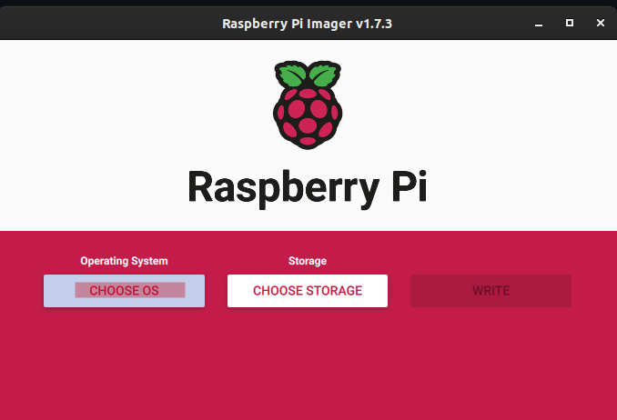

For this course, we will use the Raspberry Pi OS Image released in September 2022, as shown here:

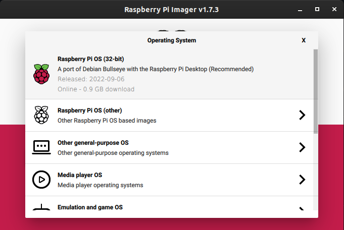

After you make this selection, click on the "cog" icon to configure more advanced settings:

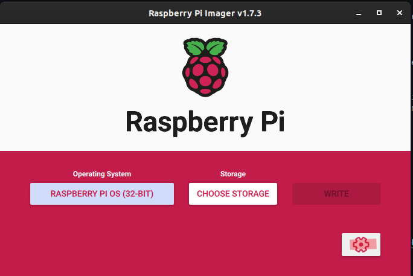

Check the box that says "Set hostname" and name it "raspberrypi" + the number of your Pi, e.g. 

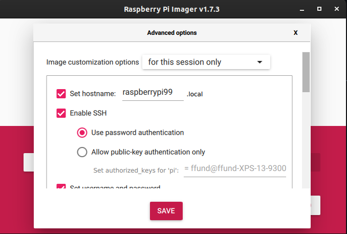

Check the box that says "Enable SSH" and choose "password authentication":

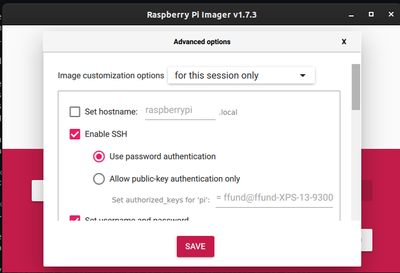

Set the username to `pi` and the password to `raspberry`:

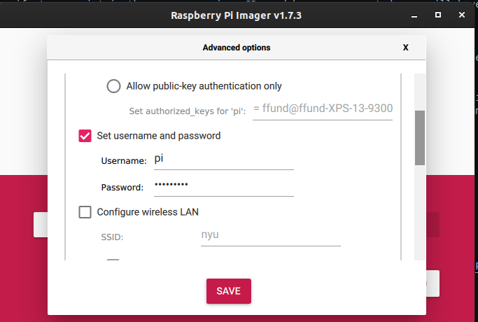

Check the box that says "Configure Wireless LAN" and set the SSID and password as follows:

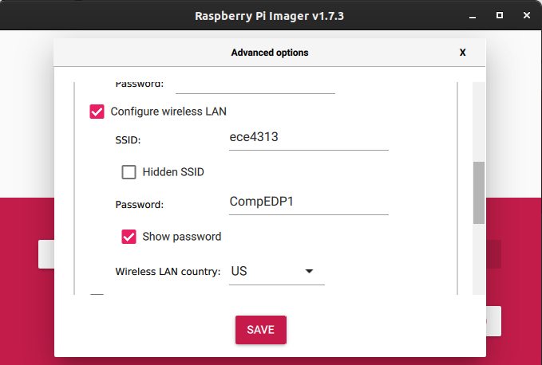

You can also check the box that says "Set locale settings" and configure as follows:

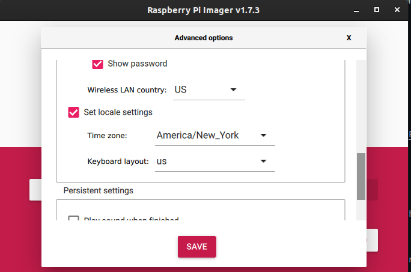

Then click "Save" to save your settings:

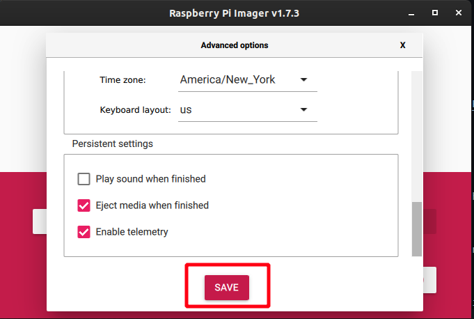

Next, click on "Choose Storage":

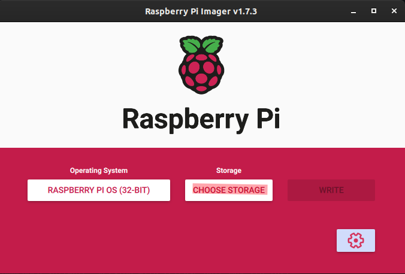

Select the SD card writer.

Finally, click "Write":

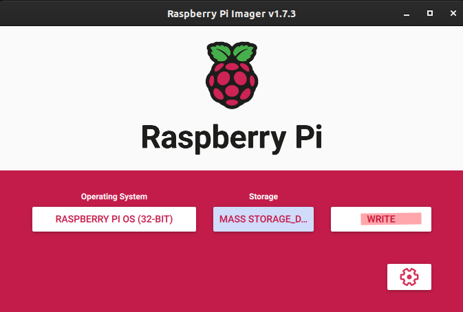

Click "Yes" to agree to overwrite the current SD card:

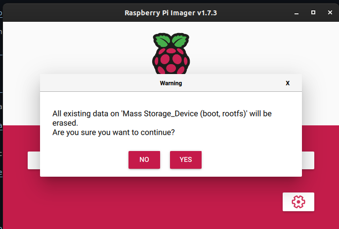

Once the image is written, you can remove the micro SD card from the USB adapter, and use it with your Pi. 