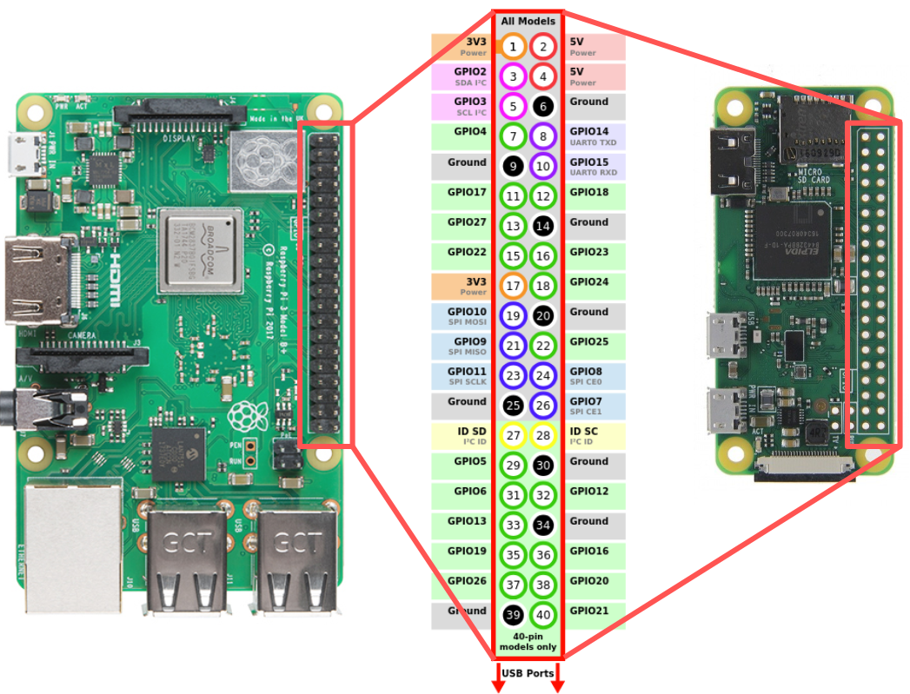

# Input and output

In this lab, we'll learn how to connect external parts to our Raspberry Pi using its pins, specifically:

* Using GPIO for digital output 
* Using GPIO for digital input

## Notes

* In this lab, you will create some breadboard circuits with exposed pins and wires. Please be especially careful not to accidentally create connections that shouldn't be connected (e.g. short circuits). Also, check your work carefully before connecting any breadboard circuit to a board, to avoid damaging the board.
* Read each subsection of this lab manual in its entirety before you start following the instructions in it. Some instructions are modified by explanations that come afterwards.
* Although you may work with a partner, this collaboration is limited to discussion. Your partner is not allowed to construct or modify your circuit, log in to your Pi, or run commands or write code on your Pi. Similarly, you are not allowed to do these things for your partner. (You *are* encouraged to collaborate by screen-sharing or showing video of your circuit to debug and discuss problems together.)
* For your lab report, you must submit data, code, and screenshots from your own experiment. You are not allowed to use your lab partner's data, code, or screenshots.
* For any question in the lab report that is marked "Individual work", you should *not* collaborate with your lab partner or anyone else (even via discussion). You can use your notes, the lab manual, or the lecture slides and video to help you answer these questions.


\newpage

## Parts

This section contains some brief notes about the parts used in this lab. 

Find these parts in your kit, and set them aside until you need them:

* Digital multimeter. You can install the batteries if they're not already installed.
* Pi, SD card, and power supply. You can insert the SD card, connect the power supply, and log in to your Pi over SSH.
* Breadboard and jumper cables
* Assorted resistors (in a plastic bag)
* 5mm LED with 3.0V forward voltage. You have a variety of LEDs in your kit; make sure to use the 5mm LED (you should have one of them) and not one of the small 3mm LEDs (you have 10 of those).
* Four-terminal push button switch. You have several of these in your kit, including some with colored covers. For this lab, you can use the one that has no colored cover, just a small round white button.

Note that you'll need these parts again, including small parts like cables and resistors, so carefully return everything to their bags when you're finished.

### LED

A diode has two pins:

* the anode, or positive pin. (On an LED, this is the longer pin.)
* the cathode, or negative pin. (On an LED, this is the shorter pin.)

When a positive voltage greater than a minimum *forward voltage* is applied across its pins, then current is conducted through the diode, from the anode to the cathode. Otherwise, no current is conducted.

A light-emitting diode (LED) emits light when it is conducting current. 

The voltage drop across the LED will be equal to its *forward voltage*
(listed in the datasheet). Typically, the voltage drop increases with the frequency of the 
light, so that a red LED usually has a voltage drop around 1.8-2.2V, but a blue or violet LED 
is likely to have a voltage drop around 3.0-3.4V.

### Push button

A push button is a kind of switch, with terminals that are either connected or not connected 
depending on whether the button is pressed. A *momentary* push button switch, like the one we'll use today,
does not maintain its state; it is *actuated* only while you are actively pressing it. 

The buttons we will use today are normally open buttons, with four pins. The four pins are arranged as shown below:

{ width=20%}

Pin 1 is always connected to pin 2, and pin 3 is always connected to pin 4. The switch is open and there is no current flow between the first pair of pins (1-2) and the second pair of pins (3-4), _unless_ the button is being pressed. When the button is pressed, all of the pins are electrically connected and current can flow freely between them.


\newpage

## Pinout diagrams

This page is provided here for reference. For an interactive pinout diagram, see [https://pinout.xyz](https://pinout.xyz).




\newpage

## Install software

For this lab, you'll need to install some software libraries and applications on your Pi. Use SSH to connect to your Pi, and run these commands in the terminal on your Pi.

This section requires Internet access on your Pi; if you don't have a way to connect to your Pi so that it has Internet access, ask for further guidance.

First, we'll make sure we have the latest versions of some software packages that are available through the Raspberry Pi OS package repositories. Start by making sure the package manager has an updated cache, so that it knows which package versions are available:

```
sudo apt update
```

Then, install or upgrade packages with

```
sudo apt -y install i2c-tools build-essential python-dev python3-dev \
	python-pip python3-pip python-rpi.gpio python3-rpi.gpio python-pil python3-pil \
	python-smbus python3-smbus minicom git python-setuptools python3-setuptools 
```

These may already be installed on your Pi, but if not, or if they're not up to date, the latest versions will be installed now.

Next, we'll install Flask. You used Flask in a previous lab assignment to create a browser-based 
UI for a "virtual" circuit connected to a "virtual" Pi. In this lab, you'll use Flask to host a 
UI for a *real* circuit on your Pi.

Install Flask on your Pi with:

```
sudo pip2 install flask
```

and

```
sudo pip3 install flask
```

This will install Flask for both Python 2 and Python 3. (If it was already installed, that's fine!)

To make sure that Flask is ready to use, try to import it in Python - run

```
python2 -c 'import flask'
```

and


```
python3 -c 'import flask'
```

If Flask is installed, you shouldn't see any output from these commands.  If you see an error message instead, ask for further guidance.


Next, we'll install **piscope**. Piscope is a software application that shows the state (HIGH or LOW)
of each of the Pi's GPIO pins, in real time. We'll install piscope now for use in this and future lab exercises.

Install the `pigpio` package, which is used by piscope. In a terminal, run:

```
wget https://github.com/joan2937/pigpio/archive/master.zip
unzip master.zip
cd pigpio-master
make
sudo make install
```

This will download an archive containing the source code, extract the archive, 
change your current directory to the one you just extracted, 
compile the source code, and then install the compiled code on your system.
It will take some time to compile, since the Pi Zero is not very powerful.

To make sure that the installation was successful, run


```
pigpiod -v
```

This command should print the `pigpio` version number and then exit. If you see any error message instead, ask for further guidance.

Then, use

```
cd
```

to return to your home directory, and install the `piscope` software:

```
wget http://abyz.me.uk/rpi/pigpio/piscope.tar
tar xvf piscope.tar
cd PISCOPE
make hf
make install
```

Then, use

```
cd
```

to return to your home directory.

## Prepare a directory

On your Pi, create a new directory in which you'll save all the code you use in this lab:

```
mkdir ~/lab-gpio
```

## Check default input/output configuration

On your Pi, run

```
gpio readall
```

and check the output. It should show the pinout of the Pi, with Broadcom numbering, physical pin numbering,  WiringPi numbering, and the current mode of each pin.

Take a screenshot showing the full `gpio readall` output - this shows the default configuration of the pins on boot.

---

**Lab report**: Show the `gpio readall` output in your lab report, and answer the questions about it.

---


\newpage

## Using GPIO for digital input


### Preparing your circuit 


You will need:

* One breadboard 
* One push button switch
* One 470 Ω resistor 
* One 10k Ω resistor 
* Jumper cables

You will prepare your circuit on a breadboard before you connect your Pi to it. The schematic for this circuit is as shown below:


We connect a "normally open" push button to our GPIO input pin using two resistors, as shown here:

{ width=30% }

The 10kΩ resistor with one end connected to GND serves as a pull-down resistor. Without this connection to GND, the GPIO input pin would see a "floating" input when the push button is not pressed, with indeterminate results.


{ width=30% }

With the connection to GND through the 10kΩ resistor, the GPIO input sees a LOW voltage when the push button is not pressed. When the button is pressed (and the switch is closed), the input is HIGH.

The 10kΩ value is large, to avoid pulling too much current when the switch is closed, but is small enough so that we can be sure it will actually pull the input down, even if there is a small leakage current.

The 470Ω resistor between the GPIO pin and the rest of the circuit serves as a current-limiting resistor in case of user error. Suppose we were to accidentally configure the GPIO pin as output, with a LOW value, and press the button (closing the switch). This would create a short circuit between 3.3V and GND. The current-limiting resistor protects the GPIO pin from sinking too much current in this case (the current will be limited to 3.3V/470Ω = 7mA). 

Prepare the resistors and the push button on a breadboard, as in the following diagram. (Note that you only need the two pins of the push button that are on the left side; it's OK if the other two pins are in the ravine, not actually plugged into the breadboard.)


Before you connect your Pi to this circuit, there is one more important step: you must make sure the push button is configured so that that two pins on the left side are *not* connected internally unless the push button is pressed. To verify this, you will use the continuity mode on your multimeter:

* Put the black multimeter probe into the COM port, and the red multimeter probe into the appropriate port for continuity testing. 
* Set the dial on the multimeter to the continuity testing setting. The icon for continuity testing mode usually looks like a soundwave.
* The dial setting for continuity testing is used for several multimeter modes. Use the mode select button (yellow button on the multimeter in our lab kit) to switch between modes until the continuity testing icon appears on the display. 
* Then, connect the probes across two push button terminals, as shown in the figures on the following page. When there is continuity across the probes, the multimeter will beep. 

If necessary, rotate the push button and test again until you get the continuity results indicated in the figures. 

\newpage


{ width=50% }


{ width=50% }


{ width=50% }

\newpage

---

**Lab report**: Upload a photo of your breadboard, with the push button and resistors in place. Annotate the photo to indicate which pairs of pins on the push button are connected, and which are not. Also annotate the photo to indicate where you will connect the 3.3V pin from the Pi, where you will connect the GND pin from the Pi, and where you will connect the GPIO input pin from the Pi.


**Lab report** (Individual work): Draw a schematic of the same circuit, but with a pull-up resistor instead of a pull-down resistor. Also answer the following questions about the circuit with the pull-up resistor:

* What is the reading at the input pin when the switch is open? What is the reading at the input pin when the switch is closed?
* The current-limiting resistor is intended to protect the board in case of a short circuit. Under what configuration could a short circuit occur? (Switch open or closed? GPIO pin in input mode, output HIGH, or output LOW?)

---


### Connect your Raspberry Pi

Now, you're ready to connect your Pi to your breadboard circuit.


Connect your Pi to your circuit as in the diagram:

* Connect any **GND** pin on the Pi, to the pull-down resistor. (By convention, it's preferable to use a black or brown wire exclusively for connections to GND; this will make your circuit easier to debug.)
* Connect the **3.3V** power rail to the push button. (By convention, it's preferable to use a red wire exclusively for connections to the supply voltage; this will make your circuit easier to debug.)
* Connect the **BCM 17** pin on the Pi, to the current-limiting resistor. 

\newpage

### Use `gpio` to read input

In a terminal on your Pi, run

```
gpio -g mode 17 in
```

to set this pin to input mode using the `gpio` utility. Then, you can read the pin value with

```
gpio -g read 17
```

Try pressing the button while your repeat this command. 

You can also see when the status of the pin changes using the `wfi` (**w**ait **f**or **i**nterrupt) command. Run

```
gpio -g wfi 17 rising
```

and observe how this command returns only when the pin changes from a LOW to HIGH value. Run

```
gpio -g wfi 17 falling
```

and observe how this command returns only when pin changes from a HIGH to LOW value. Run

```
gpio -g wfi 17 both
```

and observe how this command returns when the pin changes status in either direction. 


### Use Python to read input

We can also use the `RPi.GPIO` library in Python to read the value of the input pin.

First, on your Pi, navigate to the directory you created earlier:

```
cd ~/lab-gpio
```

Then, create a new file and open it for editing:

```
nano gpio-input-1.py
```

Put the following code into this file, then save it and close `nano`:

```python
import RPi.GPIO as GPIO
import time
import sys

GPIO.setmode(GPIO.BCM)
pin = 17 # BCM17
GPIO.setup(pin, GPIO.IN)

try:
  while True:
    i = GPIO.input(pin)
    print(i)
    time.sleep(1)

except KeyboardInterrupt:
  GPIO.cleanup()
  sys.exit()
```

\newpage

Run the Python script with

```
python3 gpio-input-1.py
```

This script will read the value of the input pin every second, in an infinite loop, until you press \keys{Ctrl+C}. Try pressing the button while this script is running, and observe the output. Then, stop the script with \keys{Ctrl+C}.

This script uses *polling* - it keeps on checking the value of the pin. If we just want to be notified when the button is pressed, it's more effecient to use an *interrupt* approach instead. This will notify us when the button is pressed, but won't keep using the CPU to check the value of the pin.


To try the interrupt approach, create a new file and open it for editing:

```
nano gpio-input-2.py
```

Put the following code into this file, then save it and close `nano`:

```python
import RPi.GPIO as GPIO
import time
import sys

GPIO.setmode(GPIO.BCM)
pin = 17 # BCM17
GPIO.setup(pin, GPIO.IN)

try:
  GPIO.wait_for_edge(pin, GPIO.RISING)
  print("Button is pressed")
  sys.exit()

except KeyboardInterrupt:
  GPIO.cleanup()
  sys.exit()
```

Run the Python script with

```
python3 gpio-input-2.py
```

and test it by pressing the button.

This script will *block* execution of the program until the button is pressed. In other words, the line following the call to `wait_for_edge()` will only run after the button is pressed (and a rising edge is detected).


Finally, we'll try one more approach: when you want to use an *interrupt* to detect a change in state, but you also want your script to continue doing other things while waiting for the button press. 

In other words, you want to detect the button press in a *non-blocking* way.

To try this third approach, create a new file and open it for editing:

```
nano gpio-input-3.py
```

Put the following code into this file, then save it and close `nano`:

\newpage

```python
import RPi.GPIO as GPIO
import time
import sys

GPIO.setmode(GPIO.BCM) 
pin = 17 # BCM17
GPIO.setup(pin, GPIO.IN)
 
def callback_fn(input_pin): 
  print("Button press on pin", input_pin)

GPIO.add_event_detect(pin, 
  GPIO.RISING,  
  callback=callback_fn)

try:
  while True:
    print("Hello!")
    time.sleep(1)

except KeyboardInterrupt:
  GPIO.cleanup()
  sys.exit()
```


Run the Python script with

```
python3 gpio-input-3.py
```

and test it by pressing the button. Notice that in this case, the script can do other work (it prints "Hello!" every second), while still detecting the button press event whenever it occurs.

---

**Lab report**: Modify the `gpio-input-3.py` script to count the number of times a rising edge is detected (i.e. the number of button presses), and print this number each time the button is pressed. Test your modified script. Upload your modified code and a screenshot showing the output when your run this code in the terminal (and press the button a few times).

Hint: In Python, if you want to modify a global variable inside a function, declare the variable as `global` inside the function before you use it.

---


### Observe button press events with Piscope

Next, we're going to use Piscope to observe the button press events. Piscope is a GUI application, so you'll need to open a VNC connection to your Pi. Then, from the application menu on the Pi (within VNC), open a terminal.


To run `piscope` you need to have the `pigpiod` _daemon_ (process that runs continuously 
in the background) running. In the terminal, run

```
sudo pigpiod
```

to start the background process. You'll need this to be running any time you 
want to run `piscope`, so if you restart the Pi you'll have to start `pigpiod` again.


**Note**: if you accidentally run `sudo pigpiod` when the daemon is _already_ running, 
you'll see a message:

```
2020-10-04 22:31:26 initInitialise: Can't lock /var/run/pigpio.pid
Can't initialise pigpio library
```

This means that `pigpiod` is already running.


Once `pigpiod` is running, run

```
piscope
```

(you can ignore non-fatal errors that appear in your terminal). A new window should open up. Move your mouse over the icons in the menu bar, to see the mouse-over text indicating their functionality. Use the menu to view real-time GPIO status and to pause and restart the view. 


In your SSH terminal, run 


```
python3 gpio-input-3.py
```


again, and press the button a few times. Use the buttons in the Piscope menu to find your button press event, and zoom in so that you can clearly see the rising and falling edge on the line.

Then, carefully disconnect the Pi from the breadboard circuit.

---

**Lab report**: Include a screenshot of the button press event in `piscope`. Annotate the screenshot by drawing a circle or a box around the part where the button is pressed.

---


\newpage

## Using GPIO for digital output

### Preparing your circuit

You will need:

* One breadboard
* One 5mm LED with 3.0V forward voltage
* One 470 Ω resistor (current-limiting resistor)
* Jumper cables


Place your LED and resistor on a breadboard:

* the (-) short end of the LED in on row,
* the (+) long end of the LED and one end of the 470Ω resistor in another row, 
* the second end of the 470Ω resistor in another row.


### Connect your Raspberry Pi


Now, you're ready to connect your Pi to your breadboard circuit.


Connect your Raspberry Pi or Pi Zero to your circuit:

* Use a M-F jumper cable to connect any **GND** pin on the Pi, to the short end of the LED. (By convention, use black or brown for GND.)
* Use a M-F jumper cable to connect the **BCM 17** pin on the Pi, to the resistor.

### Use `gpio` for output


Open a terminal on your Pi and run

```
gpio -g mode 17 out
```

to set this pin to output mode using the `gpio` utility.

Set the pin to HIGH:

```
gpio -g write 17 1
```

and observe the LED turn on. Then set the pin to LOW:

```
gpio -g write 17 0
```

and observe the LED turn off.

To set the pin back to input mode (its default state), run


```
gpio -g mode 17 input
```

### Use Python for output


We will also practice using Python to blink the LED. 

Open a new file called `gpio-out.py` for editing:

```
nano gpio-out.py
```

Put the following Python code in this file:

```python
import RPi.GPIO as GPIO
import time
import sys

pin   = 17 				  # BCM17
GPIO.setmode(GPIO.BCM)    # Use BCM pin numbering
GPIO.setup(pin, GPIO.OUT) # set pin to work in output mode

try:
	while True:
		GPIO.output(pin, GPIO.HIGH)
		time.sleep(0.5)
		GPIO.output(pin, GPIO.LOW)
		time.sleep(0.5)

except KeyboardInterrupt:
	GPIO.output(pin, GPIO.LOW)
	GPIO.cleanup()  
	sys.exit()

```


This script uses the RPi.GPIO library, sets the pin to output mode, then toggles between HIGH and LOW output every half second. It also includes logic to turn off the LED and exit gracefully in case of a keyboard interrupt (i.e. if \keys{Ctrl+C} is pressed). 

Save the file and quit `nano`, then run

```
python3 gpio-out.py
```

to run your code. Observe as the LED turns on, then off.

Use `piscope` to view GPIO pin status in real time. Observe the line for BCM pin 17; can you see it toggle on and off?

Then, use \keys{Ctrl+C} in the terminal window where your `pi-gpio-out.py` program is running, to stop it. 

---

**Lab report**: Include a screenshot of your `piscope` output, showing BCM pin 17 toggling between HIGH and LOW.

**Lab report** (Individual work): Suppose we would run this experiment with a red LED with a 1.8V forward voltage and a 100Ω current-limiting resistor. How much current would be sourced from the GPIO pin when the output is HIGH? (Show your work.)

**Lab report** (Individual work): Suppose GPIO17 was not available, and we had to use another pin for the `gpio-out.py` program. Refer to the Pi pinout diagram and identify an alternative pin that would be suitabe for this application. Give its BCM, WiringPi, and physical pin number.

---


### Flask UI for LED circuit

Finally, we'll set up a browser-based UI for the LED circuit using Flask.

Create a new directory called `flask-gpio` in your `lab-gpio` directory, then navigate to it:

```
mkdir ~/lab-gpio/flask-gpio
cd ~/lab-gpio/flask-gpio
```

We'll use the `virtualhat` library again - download and install it (for Python 2 and Python 3) with

```
git clone https://github.com/ffund/virtualhat
cd virtualhat
sudo python2 setup.py install
sudo python3 setup.py install
cd ~/lab-gpio/flask-gpio
```

\newpage


Create an `index.html` file with the following contents:

```
<!DOCTYPE html>
   <head>
    <title>Hello Flask!</title>
    <link rel="stylesheet" href="https://stackpath.bootstrapcdn.com/bootstrap/4.3.1/css/bootstrap.min.css">
   </head>
   <body>
   <div class="container">
    <h1>Hello Flask</h1>
      <a href="/led/0" class="btn btn-primary" role="button">LED off</a>
      <a href="/led/1" class="btn btn-primary" role="button">LED on</a>
   </div>
   </body>
</html>
```
Then, create a file `flask-led.py` with the following contents:

```
from flask import Flask, redirect
import virtualhat

app = Flask(__name__, static_folder='')

@app.route("/")
def hello():
    return app.send_static_file('index.html')

@app.route('/led/<int:action>')
def blink_led(action):
    if action==0:
        virtualhat.led_off()
    if action==1:
        virtualhat.led_on()
    return redirect("/")

if __name__ == "__main__":
    virtualhat.setup()
    app.run(host='0.0.0.0', port=80, debug=True, threaded=True)
```

Run your Flask app with

```
sudo python3 flask-led.py
```

Now, you should be able to view the Flask page in your browser. Open a browser on any device on the same network as your Pi, and in the address bar, type either the Pi's IP address, or the hostname you use to access the Pi over SSH. Once you have verified that you can access this page, you can stop the Flask app with \keys{Ctrl+C}.

The Flask app calls functions from the `virtualhat` library to turn the "virtual" LED on and off. Your task is to *modify* the `virtualhat` library so that your Flask app will *actually* turn the LED on and off. (You won't modify the HTML or Python source code of the Flask app.)

Navigate to the directory where the source code of the `virtualhat` library is located:

```
cd ~/lab-gpio/flask-gpio/virtualhat
```

and then open the `virtualhat.py` file for editing. 

```
nano virtualhat.py
```

All of the library functions are in this file.


You will need to modify this file so that:

* When the `setup()` function is called (and *only* when this function is called), GPIO 17 will be configured in output mode.
* When the `led_on()` function is called, the LED connected to GPIO 17 will turn on if it is not already on.
* When the `led_off()` function is called, the LED connected to GPIO 17 will turn off if it is not already off.

To test your modifications, install the modified library with

```
sudo python2 setup.py install
sudo python3 setup.py install
```

Set the GPIO pin to input mode, so that you can make sure your `setup()` function works:

```
gpio -g mode 17 input
```

Then, go back to your Flask app directory and run your Flask app again:

```
cd ~/lab-gpio/flask-gpio
sudo python3 flask-led.py
```

Open the page in your browser again. Click on the buttons and make sure your LED turns on and off as expected.


---

**Lab report**: Upload your modified `virtualhat.py`.

---


## Graceful shutdown

Finally, disconnect the Pi from the breadboard, and shut it down with

```
sudo shutdown now
```

Wait until the disk activity LED stops flashing completely before you disconnect the Pi from the power supply.