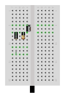
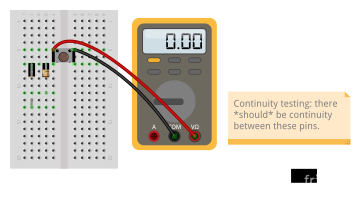

In this lab exercise, we'll learn how to connect external parts to our Raspberry Pi using its pins, specifically:

* Using GPIO for digital output 
* Using GPIO for digital input

A major advantage of prototyping using single board computers is that we can take advantage of existing libraries to easily build attractive, user-friendly interfaces to our circuits. In this exercise, we'll see an example of that.

Finally, we'll also practice using three measurement instruments - a digital multimeter, the Analog Disovery 2, and the `piscope` software logic analyzer - to understand the circuits we are building around the Raspberry Pi.

\newpage

## Notes

* In this lab, you will create some breadboard circuits with exposed pins and wires. Please be especially careful not to accidentally create connections that shouldn't be connected (e.g. short circuits). Also, check your work carefully before connecting any breadboard circuit to a board, to avoid damaging the board.
* You will submit your lab work in Gradescope. You will upload screenshots/photos and answer some questions as described in the Gradescope assignment. You do not have to write anything else (e.g. no description of procedure, etc.) 
* Read each subsection of this lab manual in its entirety before you start following the instructions in it. Some instructions are modified by explanations that come afterwards.
* Although you may work with a partner, this collaboration is limited to discussion and comparison. Your partner is not allowed to construct or modify your circuit, log in to your Pi, or run commands or write code on your Pi. Similarly, you are not allowed to do these things for your partner. 
* For your lab report, you must submit data, code, screenshots, and photos from your own experiment. You are not allowed to use your lab partner's data, code, screenshots, or photos.
* For any question in the lab report that is marked "Individual work", you should *not* collaborate with your lab partner or anyone else (even via discussion). You can use your notes, the lab manual, or the lecture slides and video to help you answer these questions.


## Parts

This section contains some brief notes about the parts used in this lab. 

Find these parts, and set them aside until you need them:

* Digital multimeter. You can install the batteries if they're not already installed
* Analog Discovery 2 with USB cable and 2x15 ribbon cable
* Pi, SD card, and power supply. You can insert the SD card, connect the power supply, and log in to your Pi over SSH
* Breadboard and jumper cables
* One 470 Ω resistor and one 10k Ω resistor 
* 5mm LED with 2.5-3.0V forward voltage
* Four-terminal push button switch


### LED

A diode has two pins:

* the anode, or positive pin. (On an LED, this is the longer pin.)
* the cathode, or negative pin. (On an LED, this is the shorter pin.)

When a positive voltage greater than a minimum *forward voltage* is applied across its pins, then current is conducted through the diode, from the anode to the cathode. Otherwise, no current is conducted.

A light-emitting diode (LED) emits light when it is conducting current. 

The voltage drop across the LED will be equal to its *forward voltage*
(listed in the datasheet). Typically, the voltage drop increases with the frequency of the 
light, so that a red LED usually has a voltage drop around 1.8-2.2V, but a blue or violet LED 
is likely to have a voltage drop around 3.0-3.4V.

The LED datasheet describes the maximum *continuous forward current* that the LED can tolerate. A current limiting resistor should be used in series, to limit the current so that it does not exceed this value.

### Push button

A push button is a kind of switch, with terminals that are either connected or not connected 
depending on whether the button is pressed. A *momentary* push button switch, like the one we'll use today,
does not maintain its state; it is *actuated* only while you are actively pressing it. 

The buttons we will use today are normally open buttons, with four pins. The four pins are arranged as shown below:

{ width=200px}

Pin 1 is always connected to pin 2, and pin 3 is always connected to pin 4. The switch is open and there is no current flow between the first pair of pins (1-2) and the second pair of pins (3-4), _unless_ the button is being pressed. When the button is pressed, all of the pins are electrically connected and current can flow freely between them.

When the pins on the switch are not marked, we can use a handheld multimeter with a continuity setting to identify which pins are internally connected, and which are only connected while the switch is actuated.

### Measurement instruments

In this lab, we'll practice using three measurement instruments -

* The **handheld multimeter** is a multi-purpose device that includes a voltmeter (for measuring voltage), ammeter (for measuring current), continuity meter (for measuring whether two points in a circuit are directly connected), and more. This is its major benefit - the other measurement instruments we'll use are only capable of measuring voltage! The multimeter can be used to probe points anywhere in your circuit, but it only shows an instantaneous measurement - it doesn't show you how a measurement varies in time. It only measures *one* point in your circuit at a time.
* The **Analog Discovery 2** is also a multi-purpose device - it includes a voltmeter (for measuring instantaneous voltage), an oscilloscope (for observing a voltage that varies in time), a logic analyzer (for observing a digital voltage that varies in time between a HIGH and LOW level), a protocol analyzer (for decoding certain digital communication protocols), and more. Like the multimeter, this device can be used to probe points anywhere in your circuit, but it *only* measures voltage. This device can simultaneously measure two analog inputs or up to 16 digital inputs.
* **piscope** is a software application that runs on the Pi, and that works as a software logic analyzer (for observing a digital voltage that varies in time between a HIGH and LOW level). Unlike the other tools, it *only* measures the voltage at the Pi's GPIO pins - you won't use this for measuring other points in your circuit. Furthermore, it only tells you whether the voltage at a pin is considered HIGH or LOW by the Pi, rather than telling you the exact voltage level! However, it is very useful because it doesn't require any extra tools or wiring, only the Pi itself. It is also convenient for watching *all* of the Pi's GPIO pins at the same time.


For more material about these measurement instruments:

* [MS8217 Digital Multimeter User Manual](http://www.mastech-group.com/download_s.php?id=75)
* [Analog Discovery 2 Reference Manual](https://digilent.com/reference/test-and-measurement/analog-discovery-2/reference-manual) and [Quick Start Video Playlist](https://www.youtube.com/watch?v=HUAy0J3XqaU&list=PLSTiCUiN_BoLtf_bWtNzhb3VUP-KDvv91&_ga=2.242067714.1044512044.1633657015-1499685186.1633657015)
* [piscope documentation](https://github.com/joan2937/piscope/blob/master/README.md)

\newpage

---

**Lab report**: (**Individual work**) Which measurement instrument(s) could you use:

* to measure the current through the base and collector in a transistor circuit?
* to monitor whether voltage at a Pi input pin is HIGH or LOW over a period of about 30 seconds?
* to identify which is the "common" pin in a 5-way switch, and is connected to other pins when the switch is actuated?
* to observe the capacitor charging curve in an RC circuit?
* to watch input and output pins used to connect to a 4x4 membrane keypad?

---


## Pinout diagrams

This page is provided here for reference. For an interactive pinout diagram, see [https://pinout.xyz](https://pinout.xyz).


\newpage

## Pre-work

### Install software on your laptop

For this lab, you'll use the Digilent Analog Discovery 2 measurement instrument, which requires that some software be installed on your laptop.

You can download and install Digilent Waveforms from [the Digilent website](https://mautic.digilentinc.com/waveforms-download), if you don't mind sharing your information with them and letting them send you email. Or if you prefer, I have prepared some direct download links for you instead:

* [Windows 64 bit installer](https://digilent.s3-us-west-2.amazonaws.com/Software/Waveforms2015/3.16.3/digilent.waveforms_v3.16.3_64bit.exe) and [video of install process](https://www.youtube.com/watch?v=Sz0nDa8TVYw&list=PLSTiCUiN_BoLtf_bWtNzhb3VUP-KDvv91&index=3&ab_channel=Digilent%2CInc.)
* [Mac installer](https://digilent.s3-us-west-2.amazonaws.com/Software/Waveforms2015/3.16.3/digilent.waveforms_v3.16.3_64bit.exe) and [video of install process](https://www.youtube.com/watch?v=4-O6-vTMIHg&list=PLSTiCUiN_BoLtf_bWtNzhb3VUP-KDvv91&index=4&ab_channel=Digilent%2CInc.)


### Install software on Pi

You'll also need to install some software libraries and applications on your Pi. Use SSH to connect to your Pi, and run these commands in the terminal on your Pi.

This section requires Internet access on your Pi, and will download some software to your Pi. You may prefer to do this over a network connection that is not metered (e.g. you may not want to use your phone hotspot for this, if your cellular data is limited).

First, we'll make sure we have the latest versions of some software packages that are available through the Raspberry Pi OS package repositories. Start by making sure the package manager has an updated cache, so that it knows which package versions are available:

```
sudo apt update
```

Then, install or upgrade packages with

```
sudo apt -y install i2c-tools build-essential python3-dev \
  python3-pip python3-rpi.gpio python3-pil \
  python3-smbus python3-setuptools minicom git  
```

These may already be installed on your Pi, but if not, or if they're not up to date, the latest versions will be installed now.

Next, we'll install Flask. In this lab, you'll use Flask to host a browser-based user interface for a circuit connected to your Pi.

Install Flask on your Pi with:

```
sudo pip3 install flask
```

(If it was already installed, that's fine!)

To make sure that Flask is ready to use, try to import it in Python - run

```
python3 -c 'import flask'
```

If Flask is installed, you shouldn't see any output from these commands.  If you see an error message instead, ask for further guidance.


Next, we'll install **piscope**. Piscope is a software logic analyzer that shows the state (HIGH or LOW)
of each of the Pi's GPIO pins, in real time. We'll install piscope now for use in this and future lab exercises.

Install the `pigpio` package, which is used by piscope. In a terminal, run:

```
wget https://github.com/joan2937/pigpio/archive/master.zip
unzip master.zip
cd pigpio-master
make
sudo make install
```

This will download an archive containing the source code, extract the archive, 
change your current directory to the one you just extracted, 
compile the source code, and then install the compiled code on your system.
It will take some time to compile, since the Pi Zero is not very powerful.

To make sure that the installation was successful, run


```
pigpiod -v
```

This command should print the `pigpio` version number and then exit. If you see any error message instead, ask for further guidance.

Then, use

```
cd
```

to return to your home directory, and install the `piscope` software:

```
wget http://abyz.me.uk/rpi/pigpio/piscope.tar
tar xvf piscope.tar
cd PISCOPE
make hf
make install
```

Then, return to your home directory again:

```
cd
```


### Prepare a directory

On your Pi, create a new directory in which you'll save all the code you use in this lab:

```
mkdir ~/lab-gpio
```

### Check default input/output configuration

On your Pi, run

```
gpio readall
```

This should show the pinout of the Pi, with Broadcom numbering, physical pin numbering,  WiringPi numbering, and the current mode of each pin.

Take a screenshot showing the full `gpio readall` output - this shows the default configuration of the pins on boot.

Also try the 

```
pinout
```

command. This is a useful reference that shows you a color-coded graphical representation of the Pi, with its pinout.


\newpage

## Using GPIO for digital input


### Preparing your circuit 


You will need:

* One breadboard 
* One push button switch
* One 470 Ω resistor 
* One 10k Ω resistor 
* Jumper cables


_Don't connect your Pi to your circuit yet - you'll do that in the next section, **Connect your Raspberry Pi**._

In the *next* section, you will construct a circuit as shown below, with a "normally open" push button connected to a GPIO input pin using two resistors:

{ width=150px }

The 10kΩ resistor with one end connected to GND serves as a pull-down resistor. Without this connection to GND, the GPIO input pin would see a "floating" input when the push button is not pressed, with indeterminate results.


{ width=150px }

With the connection to GND through the 10kΩ resistor, the GPIO input sees a LOW voltage when the push button is not pressed. When the button is pressed (and the switch is closed), the input is HIGH.

The 10kΩ value is large, to avoid pulling too much current when the switch is closed, but is small enough so that we can be sure it will actually pull the input down, even if there is a small leakage current.

The 470Ω resistor between the GPIO pin and the rest of the circuit serves as a current-limiting resistor in case of user error. Suppose we were to accidentally configure the GPIO pin as output, with a LOW value, and press the button (closing the switch). This would create a short circuit between 3.3V and GND. The current-limiting resistor protects the GPIO pin from sinking too much current in this case (the current will be limited to 3.3V/470Ω = 7mA). 

Prepare the resistors and the push button on a breadboard, as in the following diagram. (Note that you only need the two pins of the push button that are on the left side; it's OK if the other two pins are in the ravine, not actually plugged into the breadboard.)




Before you connect your Pi to this circuit, there is one more important step: you must make sure the push button is configured so that that two pins on the left side are *not* connected internally unless the push button is pressed. You'll use the continuity mode on your multimeter to verify this.

<div style="max-width:1280px text-align: center;"><div style="position:relative;padding-bottom:56.25%"><iframe id="kaltura_player" src="https://cdnapisec.kaltura.com/p/1674401/sp/167440100/embedIframeJs/uiconf_id/23435151/partner_id/1674401?iframeembed=true&playerId=kaltura_player&entry_id=1_zh0xc5mj&flashvars[streamerType]=auto&amp;flashvars[localizationCode]=en&amp;flashvars[leadWithHTML5]=true&amp;flashvars[sideBarContainer.plugin]=true&amp;flashvars[sideBarContainer.position]=left&amp;flashvars[sideBarContainer.clickToClose]=true&amp;flashvars[chapters.plugin]=true&amp;flashvars[chapters.layout]=vertical&amp;flashvars[chapters.thumbnailRotator]=false&amp;flashvars[streamSelector.plugin]=true&amp;flashvars[EmbedPlayer.SpinnerTarget]=videoHolder&amp;flashvars[dualScreen.plugin]=true&amp;flashvars[LeadWithHLSOnFlash]=true&amp;flashvars[Kaltura.addCrossoriginToIframe]=true&amp;&wid=1_4ipgkpyh" width="1280" height="720" allowfullscreen webkitallowfullscreen mozAllowFullScreen allow="autoplay *; fullscreen *; encrypted-media *" sandbox="allow-forms allow-same-origin allow-scripts allow-top-navigation allow-pointer-lock allow-popups allow-modals allow-orientation-lock allow-popups-to-escape-sandbox allow-presentation allow-top-navigation-by-user-activation" frameborder="0" title="Kaltura Player" style="position:absolute;top:0;left:0;width:100%;height:100%"></iframe></div></div>


Follow along with [the demo video](https://stream.nyu.edu/media/Measuring+continuity+with+a+multimeter/1_zh0xc5mj) as you:

* Put the black multimeter probe into the COM port, and the red multimeter probe into the appropriate port for continuity testing. 
* Set the dial on the multimeter to the continuity testing setting. The icon for continuity testing mode usually looks like a soundwave.
* The dial setting for continuity testing is used for several multimeter modes. Use the mode select button (yellow button on the multimeter in our lab kit) to switch between modes until the continuity testing icon appears on the display. 
* Then, connect the probes across two push button terminals, as shown in the figures on the following page. When there is continuity across the probes, the multimeter will beep. 

If necessary, rotate the push button and test again until you get the continuity results indicated in the figures below. 


\newpage


{ width=310px }


{ width=310px }


{ width=310px }

\newpage

---

**Lab report**: Upload a photo of your breadboard, with the push button and resistors in place. Annotate the photo to indicate which pairs of pins on the push button are always connected internally, and which are only connected when the push button is pressed. (*Make sure that the colored sticker with your number on it is visible in the photo.*)


**Lab report** (**Individual work**): Draw a schematic of a circuit for the push button switch, but with a pull-up resistor instead of a pull-down resistor. Also answer the following questions about the circuit with the pull-up resistor:

* What will be the reading at the input pin when the switch is open? What will be the reading at the input pin when the switch is closed?
* The current-limiting resistor is intended to protect the board in case of a short circuit. Under what configuration could a short circuit occur? (Switch open or closed? GPIO pin in input mode, output HIGH, or output LOW?)

---


### Connect your Raspberry Pi

Now, you're ready to connect your Pi to your breadboard circuit.

{ width=300px }

Connect your Pi to your circuit as in the diagram:

* Connect any **GND** pin on the Pi, to the pull-down resistor. (By convention, it's preferable to use a black or brown wire for connections to GND; this will make your circuit easier to debug.)
* Connect the **3.3V** power rail to the push button. (By convention, it's preferable to use a red or orange wire for connections to the supply voltage; this will make your circuit easier to debug.)
* Connect the **BCM 17** pin on the Pi, to the current-limiting resistor. 

\newpage


### Observe button press events with Piscope

We're going to use Piscope to observe button press events as they appear on the input pin. You can follow along with [this demo video](https://stream.nyu.edu/media/Using+the+piscope+logic+analyzer/1_x3v7mxs6) as you work on this section.

<div style="max-width:1280px"><div style="position:relative;padding-bottom:56.25%"><iframe id="kaltura_player" src="https://cdnapisec.kaltura.com/p/1674401/sp/167440100/embedIframeJs/uiconf_id/23435151/partner_id/1674401?iframeembed=true&playerId=kaltura_player&entry_id=1_x3v7mxs6&flashvars[streamerType]=auto&amp;flashvars[localizationCode]=en&amp;flashvars[leadWithHTML5]=true&amp;flashvars[sideBarContainer.plugin]=true&amp;flashvars[sideBarContainer.position]=left&amp;flashvars[sideBarContainer.clickToClose]=true&amp;flashvars[chapters.plugin]=true&amp;flashvars[chapters.layout]=vertical&amp;flashvars[chapters.thumbnailRotator]=false&amp;flashvars[streamSelector.plugin]=true&amp;flashvars[EmbedPlayer.SpinnerTarget]=videoHolder&amp;flashvars[dualScreen.plugin]=true&amp;flashvars[LeadWithHLSOnFlash]=true&amp;flashvars[Kaltura.addCrossoriginToIframe]=true&amp;&wid=1_a0oeu9ak" width="1280" height="720" allowfullscreen webkitallowfullscreen mozAllowFullScreen allow="autoplay *; fullscreen *; encrypted-media *" sandbox="allow-forms allow-same-origin allow-scripts allow-top-navigation allow-pointer-lock allow-popups allow-modals allow-orientation-lock allow-popups-to-escape-sandbox allow-presentation allow-top-navigation-by-user-activation" frameborder="0" title="Kaltura Player" style="position:absolute;top:0;left:0;width:100%;height:100%"></iframe></div></div>

Piscope is a GUI application, so you'll need to open a VNC connection to your Pi. Then, from the application menu on the Pi (within VNC), open a terminal.


To run `piscope` you need to have the `pigpiod` _daemon_ (process that runs continuously 
in the background) running. In the terminal, run

```
sudo pigpiod
```

to start the background process. You'll need this to be running any time you 
want to run `piscope`, so if you restart the Pi you'll have to start `pigpiod` again.


**Note**: if you accidentally run `sudo pigpiod` when the daemon is _already_ running, 
you'll see a message:

```
2020-10-04 22:31:26 initInitialise: Can't lock /var/run/pigpio.pid
Can't initialise pigpio library
```

This means that `pigpiod` is already running.


Once `pigpiod` is running, run

```
piscope
```

(you can ignore non-fatal errors that appear in your terminal). A new window should open up. Move your mouse over the icons in the menu bar, to see the mouse-over text indicating their functionality. Use the menu to view real-time GPIO status and to pause and restart the view. 


{ width=90% }

Press the button a few times. Use the buttons in the Piscope menu to find your button press event, and zoom in so that you can clearly see the rising and falling edge on the line.


---

**Lab report**: Take a screenshot of the `piscope` window showing one button press + release, and **annotate** it to clearly mark:

* The pin number that the button press was observed on (on the "pin number axis")
* The rising edge in a button press event
* The falling edge in the same button press event
* The duration (in time) for which the button is pressed
* The setting you would use to start and stop measuring
* The setting you would use to adjust the horizontal (time axis) zoom
* The setting you would use to move the display *back* on the time axis
* The setting you would use to move the display *forward* on the time axis

---


### Observe button press events with the Analog Discovery 2

You can follow along with [this video](https://stream.nyu.edu/media/Using+the+Analog+Discovery+2+scope/1_s6ea7u42) as you work on this section.

<div style="max-width:1280px"><div style="position:relative;padding-bottom:56.25%"><iframe id="kaltura_player" src="https://cdnapisec.kaltura.com/p/1674401/sp/167440100/embedIframeJs/uiconf_id/23435151/partner_id/1674401?iframeembed=true&playerId=kaltura_player&entry_id=1_s6ea7u42&flashvars[streamerType]=auto&amp;flashvars[localizationCode]=en&amp;flashvars[leadWithHTML5]=true&amp;flashvars[sideBarContainer.plugin]=true&amp;flashvars[sideBarContainer.position]=left&amp;flashvars[sideBarContainer.clickToClose]=true&amp;flashvars[chapters.plugin]=true&amp;flashvars[chapters.layout]=vertical&amp;flashvars[chapters.thumbnailRotator]=false&amp;flashvars[streamSelector.plugin]=true&amp;flashvars[EmbedPlayer.SpinnerTarget]=videoHolder&amp;flashvars[dualScreen.plugin]=true&amp;flashvars[LeadWithHLSOnFlash]=true&amp;flashvars[Kaltura.addCrossoriginToIframe]=true&amp;&wid=1_u851l0uc" width="1280" height="720" allowfullscreen webkitallowfullscreen mozAllowFullScreen allow="autoplay *; fullscreen *; encrypted-media *" sandbox="allow-forms allow-same-origin allow-scripts allow-top-navigation allow-pointer-lock allow-popups allow-modals allow-orientation-lock allow-popups-to-escape-sandbox allow-presentation allow-top-navigation-by-user-activation" frameborder="0" title="Kaltura Player" style="position:absolute;top:0;left:0;width:100%;height:100%"></iframe></div></div>

Connect your Analog Discovery 2 to your circuit as follows:

* Put any GND pin on the Analog Discovery 2 (marked with a down arrow) into the breadboard row that is connected to GND on the Pi. (You'll always connect the GND pin on the Discovery 2 to the GND in the external circuit you want to measure, so that they have a **common ground**.)
* Identify the analog Channel 1 pins on the Analog Discovery 2. Connect the 1+ pin to the breadboard row that is connected to the Pi's GPIO input pin. Connect the 1- pin to the breadboard row that is at GND.
* Open the Waveforms application on your laptop. From the Welcome screen, click on the Scope button.
* Set the Mode setting to Shift or Screen.
* Press the Run button to start measuring the voltage. 
* Adjust the horizontal and vertical zoom settings so that you can see button press events as you actuate the switch.
* Press the Stop button to stop measuring.


---

**Lab report**: Take a screenshot of the Scope window showing one button press + release, and **annotate** it to clearly mark:

* The rising edge in a button press event
* The falling edge in the same button press event
* The duration (in time) for which the button is pressed
* The voltage level when the button is not pressed
* The voltage level when the button is pressed
* The setting you would use to start and stop measuring
* The setting you would use to adjust the horizontal (time axis) zoom
* The setting you would use to adjust the vertical (voltage axis) zoom

---

\newpage

### Use `gpio` to read input

In a terminal on your Pi, run

```
gpio -g mode 17 in
```

to set this pin to input mode using the `gpio` utility. Then, you can read the pin value with

```
gpio -g read 17
```

Try pressing the button while your repeat this command. 

You can also see when the status of the pin changes using the `wfi` (**w**ait **f**or **i**nterrupt) command. Run

```
gpio -g wfi 17 rising
```

and observe how this command returns only when the pin changes from a LOW to HIGH value. Run

```
gpio -g wfi 17 falling
```

and observe how this command returns only when pin changes from a HIGH to LOW value. Run

```
gpio -g wfi 17 both
```

and observe how this command returns when the pin changes status in either direction. 


### Use Python to read input

We can also use the `RPi.GPIO` library in Python to read the value of the input pin.

First, on your Pi, navigate to the directory you created earlier:

```
cd ~/lab-gpio
```

Then, create a new file and open it for editing:

```
nano gpio-input-1.py
```

Put the following code into this file, then save it and close `nano`:

```python
import RPi.GPIO as GPIO
import time
import sys

GPIO.setmode(GPIO.BCM)
pin = 17 # BCM17
GPIO.setup(pin, GPIO.IN)

try:
  while True:
    i = GPIO.input(pin)
    print(i)
    time.sleep(1)

except KeyboardInterrupt:
  GPIO.cleanup()
  sys.exit()
```

\newpage

Run the Python script with

```
python3 gpio-input-1.py
```

This script will read the value of the input pin every second, in an infinite loop, until you press `Ctrl`+`C`. Try pressing the button while this script is running, and observe the output. Then, stop the script with `Ctrl`+`C`.

This script uses *polling* - it keeps on checking the value of the pin. If we just want to be notified when the button is pressed, it's more effecient to use an *interrupt* approach instead. This will notify us when the button is pressed, but won't keep using the CPU to check the value of the pin.


To try the interrupt approach, create a new file and open it for editing:

```
nano gpio-input-2.py
```

Put the following code into this file, then save it and close `nano`:

```python
import RPi.GPIO as GPIO
import time
import sys

GPIO.setmode(GPIO.BCM)
pin = 17 # BCM17
GPIO.setup(pin, GPIO.IN)

try:
  GPIO.wait_for_edge(pin, GPIO.RISING)
  print("Button is pressed")
  sys.exit()

except KeyboardInterrupt:
  GPIO.cleanup()
  sys.exit()
```

Run the Python script with

```
python3 gpio-input-2.py
```

and test it by pressing the button.

This script will *block* execution of the program until the button is pressed. In other words, the line following the call to `wait_for_edge()` will only run after the button is pressed (and a rising edge is detected).


Finally, we'll try one more approach: when you want to use an *interrupt* to detect a change in state, but you also want your script to continue doing other things while waiting for the button press. 

In other words, you want to detect the button press in a *non-blocking* way.

To try this third approach, create a new file and open it for editing:

```
nano gpio-input-3.py
```

Put the following code into this file, then save it and close `nano`:

\newpage

```python
import RPi.GPIO as GPIO
import time
import sys

GPIO.setmode(GPIO.BCM) 
pin = 17 # BCM17
GPIO.setup(pin, GPIO.IN)
 
def callback_fn(input_pin): 
  print("Button press on pin", input_pin)

GPIO.add_event_detect(pin, 
  GPIO.RISING,  
  callback=callback_fn)

try:
  while True:
    print("Hello!")
    time.sleep(1)

except KeyboardInterrupt:
  GPIO.cleanup()
  sys.exit()
```


Run the Python script with

```
python3 gpio-input-3.py
```

and test it by pressing the button. Notice that in this case, the script can do other work (it prints "Hello!" every second), while still detecting the button press event whenever it occurs.

---

**Lab report**: Modify the `gpio-input-3.py` script to count the number of times a rising edge is detected (i.e. the number of button presses), and print this number each time the button is pressed. Test your modified script. Upload

* your modified code and 
* a screenshot showing the output when your run this code in the terminal (and press the button a few times).

Hint: In Python, if you want to modify a global variable inside a function, declare the variable as `global` inside the function before you use it.

Note: your code should be "clean" and well-organized, in addition to being *correct*.

---


### Disconnect your circuit

Carefully disconnect your Pi from the push button circuit.

\newpage

## Using GPIO for digital output

### Preparing your circuit

You will need:

* One breadboard
* One 5mm LED with approximately 2.5-3.0V forward voltage
* One 470 Ω resistor (current-limiting resistor)
* Jumper cables


Place your LED and resistor on a breadboard:

* the (-) short end of the LED in on row,
* the (+) long end of the LED and one end of the 470Ω resistor in another row, 
* the second end of the 470Ω resistor in another row.

{ width=300px }

### Measuring current and voltage with a multimeter

Before we connect this circuit to a GPIO pin on the Pi, let's first measure the voltage drop across the LED and the current through it, using a multimeter.

You can follow along with [this video](https://stream.nyu.edu/media/Measuring+current+and+voltage+with+a+multimeter/1_9zkk3yrb) while you work on this section.

<div style="max-width:1280px"><div style="position:relative;padding-bottom:56.25%"><iframe id="kaltura_player" src="https://cdnapisec.kaltura.com/p/1674401/sp/167440100/embedIframeJs/uiconf_id/23435151/partner_id/1674401?iframeembed=true&playerId=kaltura_player&entry_id=1_9zkk3yrb&flashvars[streamerType]=auto&amp;flashvars[localizationCode]=en&amp;flashvars[leadWithHTML5]=true&amp;flashvars[sideBarContainer.plugin]=true&amp;flashvars[sideBarContainer.position]=left&amp;flashvars[sideBarContainer.clickToClose]=true&amp;flashvars[chapters.plugin]=true&amp;flashvars[chapters.layout]=vertical&amp;flashvars[chapters.thumbnailRotator]=false&amp;flashvars[streamSelector.plugin]=true&amp;flashvars[EmbedPlayer.SpinnerTarget]=videoHolder&amp;flashvars[dualScreen.plugin]=true&amp;flashvars[LeadWithHLSOnFlash]=true&amp;flashvars[Kaltura.addCrossoriginToIframe]=true&amp;&wid=1_w8mj3uio" width="1280" height="720" allowfullscreen webkitallowfullscreen mozAllowFullScreen allow="autoplay *; fullscreen *; encrypted-media *" sandbox="allow-forms allow-same-origin allow-scripts allow-top-navigation allow-pointer-lock allow-popups allow-modals allow-orientation-lock allow-popups-to-escape-sandbox allow-presentation allow-top-navigation-by-user-activation" frameborder="0" title="Kaltura Player" style="position:absolute;top:0;left:0;width:100%;height:100%"></iframe></div></div>

Connect the Pi to the breadboard circuit so that the LED is *always on*:


* Use a M-F jumper cable to connect any **GND** pin on the Pi, to the short end of the LED. (By convention, use black or brown for GND.)
* Use a M-F jumper cable to connect any **3.3V** pin on the Pi, to the "free" end of the current-limiting resistor.

You should see the LED turn on, and stay on.

First, measure the voltage drop across the LED:

* Put the black multimeter probe into the COM port, and the red multimeter probe into the appropriate port for measuring *voltage*. 
* Set the dial on the multimeter to the setting for measuring *voltage*.
* Touch the black multimeter probe to the negative leg of the LED, and touch the red multimeter probe to the positive leg of the LED.
* Observe the measurement on the display.

Then, remove the probes and turn the multimeter dial back to the **off** setting.

Next, measure the current through the LED:

* Put the black multimeter probe into the COM port, and the red multimeter probe into the appropriate port for measuring *current*. 
* Set the dial on the multimeter to the setting for measuring *current*.
* Break your circuit - for example, you can disconnect one leg of the current limiting resistor.
* Insert your multimeter probes into the part of the circuit that you disconnected, completing the circuit with the multimeter in series.
* Observe the measurement on the display.

Then, remove the probes and turn the multimeter dial back to the **off** setting. Re-connect the LED circuit (without the multimeter) so that the LED is **on**.

---

**Lab report**: What was the voltage drop across the LED when the LED was on? What was the current through the LED in this circuit? Show how you would compute the *expected* current range based on the nominal LED FV (2.5-3.0V) - is your measured current similar?

---


### Measuring voltage with the Analog Discovery 2

The Analog Discovery 2 can also be used to measure voltage at any point in the circuit, using its voltmeter tool.

You can follow along with [this video](https://stream.nyu.edu/media/Using+the+voltmeter+on+the+Analog+Discovery+2/1_sn7wyb91) as you work on this section.

<div style="max-width:1280px"><div style="position:relative;padding-bottom:56.25%"><iframe id="kaltura_player" src="https://cdnapisec.kaltura.com/p/1674401/sp/167440100/embedIframeJs/uiconf_id/23435151/partner_id/1674401?iframeembed=true&playerId=kaltura_player&entry_id=1_sn7wyb91&flashvars[streamerType]=auto&amp;flashvars[localizationCode]=en&amp;flashvars[leadWithHTML5]=true&amp;flashvars[sideBarContainer.plugin]=true&amp;flashvars[sideBarContainer.position]=left&amp;flashvars[sideBarContainer.clickToClose]=true&amp;flashvars[chapters.plugin]=true&amp;flashvars[chapters.layout]=vertical&amp;flashvars[chapters.thumbnailRotator]=false&amp;flashvars[streamSelector.plugin]=true&amp;flashvars[EmbedPlayer.SpinnerTarget]=videoHolder&amp;flashvars[dualScreen.plugin]=true&amp;flashvars[LeadWithHLSOnFlash]=true&amp;flashvars[Kaltura.addCrossoriginToIframe]=true&amp;&wid=1_xu8h97gf" width="1280" height="720" allowfullscreen webkitallowfullscreen mozAllowFullScreen allow="autoplay *; fullscreen *; encrypted-media *" sandbox="allow-forms allow-same-origin allow-scripts allow-top-navigation allow-pointer-lock allow-popups allow-modals allow-orientation-lock allow-popups-to-escape-sandbox allow-presentation allow-top-navigation-by-user-activation" frameborder="0" title="Kaltura Player" style="position:absolute;top:0;left:0;width:100%;height:100%"></iframe></div></div>

Connect your Analog Discovery 2 to your circuit as follows:

* Put any GND pin on the Analog Discovery 2 (marked with a down arrow) into the breadboard row that is connected to GND on the Pi. (You'll always connect the GND pin on the Discovery 2 to the GND in the external circuit you want to measure, so that they have a **common ground**.)
* Identify the analog Channel 1 pins on the Analog Discovery 2. Connect the 1+ pin to the breadboard row with the positive leg of the LED, and connect the 1- pin to the breadboard row with the negative leg of the LED.
* Open the Waveforms application on your laptop. From the Welcome screen, click on Voltmeter.
* Press the Run button to start measuring the voltage. (If you press the same button, now labeled Stop, again, it will stop measuring. There is also a "Single" button that will acquire a single measurement and then stop.)
* Observe the DC voltage measurement on Channel 1. (Three values are calculated automatically: DC, True RMS, AC RMS. We are measuring a DC voltage, so we will ignore the other values.)

---

**Lab report**: Take a screenshot showing the Analog Discovery 2 Voltmeter display while measuring the voltage drop across the LED. Circle the value that shows the measured voltage drop. Also:

* show which control you would use to start and stop measuring
* show where you would find the measured value for Channel 2 inputs, if you were using Channel 2

---

### Connect your Raspberry Pi


Now, you're ready to connect your Pi's GPIO pin to your breadboard circuit.

First, disconnect the cable that previously connected the "free" end of the current-limiting resistor to the **3.3V** pin on the Pi. 

{ width=300px }


Connect your Raspberry Pi or Pi Zero to your circuit:

* Use a M-F jumper cable to connect any **GND** pin on the Pi, to the short end of the LED. (By convention, use black or brown for GND.)
* Use a M-F jumper cable to connect the "free" end of the current-limiting resistor to the **BCM 17** pin on the Pi.

### Use `gpio` for output


Open a terminal on your Pi and run

```
gpio -g mode 17 out
```

to set this pin to output mode using the `gpio` utility.

Set the pin to HIGH:

```
gpio -g write 17 1
```

and observe the LED turn on. Then set the pin to LOW:

```
gpio -g write 17 0
```

and observe the LED turn off.

To set the pin back to input mode (its default state), run


```
gpio -g mode 17 input
```

### Use Python for output


We will also practice using Python to blink the LED. 

Open a new file called `gpio-out.py` for editing:

```
nano gpio-out.py
```

Put the following Python code in this file:

```python
import RPi.GPIO as GPIO
import time
import sys

pin   = 17          # BCM17
GPIO.setmode(GPIO.BCM)    # Use BCM pin numbering
GPIO.setup(pin, GPIO.OUT) # set pin to work in output mode

try:
  while True:
    GPIO.output(pin, GPIO.HIGH)
    time.sleep(0.5)
    GPIO.output(pin, GPIO.LOW)
    time.sleep(0.5)

except KeyboardInterrupt:
  GPIO.output(pin, GPIO.LOW)
  GPIO.cleanup()  
  sys.exit()

```


This script uses the RPi.GPIO library, sets the pin to output mode, then toggles between HIGH and LOW output every half second. It also includes logic to turn off the LED and exit gracefully in case of a keyboard interrupt (i.e. if `Ctrl`+`C` is pressed). 

Save the file and quit `nano`, then run

```
python3 gpio-out.py
```

to run your code. Observe as the LED turns on, then off.

Use `piscope` to view GPIO pin status in real time. Observe the line for BCM pin 17; can you see it toggle on and off?

Then, use `Ctrl`+`C` in the terminal window where your `pi-gpio-out.py` program is running, to stop it. 

---

**Lab report**: Include a screenshot of your `piscope` output, showing BCM pin 17 toggling between HIGH and LOW. Annotate it to show

* The pin number that the output signal is observed on (on the "pin number axis")
* The duration (in time) for which the LED is on, for one instance of the LED turning on
* The duration (in time) for which the LED is off, for one instance of the LED being off
* The setting you would use to start and stop measuring
* The setting you would use to adjust the horizontal (time axis) zoom
* The setting you would use to move the display *back* on the time axis
* The setting you would use to move the display *forward* on the time axis

---


### Flask UI for LED circuit

One of the major advantages of using a single board computer is that it runs a full operating system, with existing libraries and software. In this section, you will learn how to use that to create a browser-based interface through which users can interact with a Pi-based product. 

Create a new directory called `flask-gpio` in your `lab-gpio` directory, then navigate to it:

```
mkdir ~/lab-gpio/flask-gpio
cd ~/lab-gpio/flask-gpio
```

We'll use a `virtualhat` library as "scaffolding". The VirtualHat library includes the following "dummy" functions:

* `setup()` initializes all of the peripherals and sensors in the VirtualHat
* `led_on()` turns on a virtual LED
* `led_off()` turns off a virtual LED
* `read_light_level()` reads the current light level from a virtual sensor

In the current implementation, these functions don't actually do anything - you'll have to actually implement the interactions with the hardware.

Download and install the library with

```
git clone https://github.com/ffund/virtualhat
cd virtualhat
sudo python3 setup.py install
cd ~/lab-gpio/flask-gpio
```

Read and then try running the `demo.py` file included with the library to see how these are used. To run the `demo.py` file, use

```
python3 demo.py
```

The `virtualhat` library is responsible for the low-level interactions with the hardware. Now, we'll create a couple of files that will be responsible for the visual user interface:

* The HTML file is responsible for the layout and appearance of the interface
* The Python file is responsible for the behavior of the interface

Create an `index.html` file with the following contents:

```
<!DOCTYPE html>
   <head>
    <title>Hello Flask!</title>
    <link rel="stylesheet" href="https://stackpath.bootstrapcdn.com/bootstrap/4.3.1/css/bootstrap.min.css">
   </head>
   <body>
   <div class="container">
    <h1>Hello Flask</h1>
      <a href="/led/0" class="btn btn-primary" role="button">LED off</a>
      <a href="/led/1" class="btn btn-primary" role="button">LED on</a>
   </div>
   </body>
</html>
```

Then, create a file `flask-led.py` with the following contents:


```
from flask import Flask

app = Flask(__name__, static_folder='')

@app.route("/")
def hello():
    return app.send_static_file('index.html')

if __name__ == "__main__":
    app.run(host='0.0.0.0', port=80, debug=True, threaded=True)

```

In this code, we did some basic "Flask" housekeeping:

* imported the `Flask` class from the `flask` library
* created an instance of the `Flask` class, calling it `app`
* set up a "route" that will be triggered when the user visits `/`, which is the root of the app; this is the route that is triggered when the user visits the home page of a site. We will run the function `hello()` when the route is triggered; this function just sends the static web page called "index.html" to the user. 
* set up the Flask app to run when this file is called as a Python script (not when it is imported as a library). 

Now, modify this file to integrate the LED functionality:

```
from flask import Flask, redirect
import virtualhat

app = Flask(__name__, static_folder='')

@app.route("/")
def hello():
    return app.send_static_file('index.html')

@app.route('/led/<int:action>')
def blink_led(action):
    if action==0:
        virtualhat.led_off()
    if action==1:
        virtualhat.led_on()
    return redirect("/")

if __name__ == "__main__":
    virtualhat.setup()
    app.run(host='0.0.0.0', port=80, debug=True, threaded=True)
```


In this update,

* we imported our `virtualhat` library, and made sure that its `setup()` function will run before we interact with the virtual LED or light sensor. 
* we added another route which will be triggered any time the user clicks on the buttons we added above, which will navigate to `/led/0` or `/led/1`. This route calls a `function blink_led()`, which, depending on whether `/led/0` or `/led/1` was visited, will call the `virtualhat` library function to turn the LED on or off. 
* finally, we use a `redirect()` (which we imported from the `flask` library) to redirect the user back to the home page at `/` after turning the LED on or off.

Run your Flask app with

```
sudo python3 flask-led.py
```


You should see some output similar to the following;

```
 * Serving Flask app "flask-led-app" (lazy loading)
 * Environment: production
   WARNING: This is a development server. Do not use it in a production deployment.
   Use a production WSGI server instead.
 * Debug mode: on
 * Running on http://0.0.0.0:80/ (Press CTRL+C to quit)
 * Restarting with stat
 * Debugger is active!
 * Debugger PIN: 237-595-907
```

Copy and paste the Pi's address into the address bar of a browser, then hit Enter to load the site. You should see the following page:


Now, you should be able to view the Flask page in your browser. Open a browser on any device on the same network as your Pi, and in the address bar, type either the Pi's IP address, or the hostname you use to access the Pi over SSH. then hit Enter to load the site. When the page loads, you can press `Ctrl` + `C` in your Pi terminal to stop Flask.

The Flask app calls functions from the `virtualhat` library to turn the "virtual" LED on and off. Your task is to *modify* the `virtualhat` library so that your Flask app will *actually* turn the LED on and off. (You won't modify the HTML or Python source code of the Flask app.)

Navigate to the directory where the source code of the `virtualhat` library is located:

```
cd ~/lab-gpio/flask-gpio/virtualhat
```

and then open the `virtualhat.py` file for editing. 

```
nano virtualhat.py
```

All of the library functions are in this file.


You will need to modify this file so that:

* When the `setup()` function is called (and *only* when this function is called), GPIO 17 will be configured in output mode.
* When the `led_on()` function is called, the LED connected to GPIO 17 will turn on if it is not already on.
* When the `led_off()` function is called, the LED connected to GPIO 17 will turn off if it is not already off.

To test your modifications, install the modified library with

```
sudo python3 setup.py install
```

Set the GPIO pin to input mode, so that you can make sure your `setup()` function works:

```
gpio -g mode 17 input
```

Then, go back to your Flask app directory and run your Flask app again:

```
cd ~/lab-gpio/flask-gpio
sudo python3 flask-led.py
```

Open the page in your browser again. Click on the buttons and make sure your LED turns on and off as expected.


---

**Lab report**: Upload your modified `virtualhat.py`. Note: your code should be "clean" and organized, in addition to being correct.

---


## Graceful shutdown

Finally, disconnect the Pi from the breadboard, and shut it down with

```
sudo shutdown now
```

Wait until the disk activity LED stops flashing completely before you disconnect the Pi from the power supply.