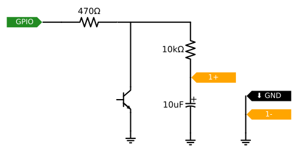

In this lab exercise, we'll practice reading input values from sensors that can be represented as a pulse width, using an RC circuit.


\newpage 

## Notes

* In this lab, you will create some breadboard circuits with exposed pins and wires. Please be especially careful not to accidentally create connections that shouldn't be connected (e.g. short circuits). Also, check your work carefully before connecting any breadboard circuit to a board, to avoid damaging the board.
* You will submit your lab work in Gradescope. You will upload screenshots/photos and answer some questions as described in the Gradescope assignment. You do not have to write anything else (e.g. no description of procedure, etc.) 
* Read each subsection of this lab manual in its entirety before you start following the instructions in it. Some instructions are modified by explanations that come afterwards.
* Although you may work with a partner, this collaboration is limited to discussion and comparison. Your partner is not allowed to construct or modify your circuit, log in to your Pi, or run commands or write code on your Pi. Similarly, you are not allowed to do these things for your partner. 
* For your lab report, you must submit data, code, screenshots, and photos from your own experiment. You are not allowed to use your lab partner's data, code, screenshots, or photos.
* For any question in the lab report that is marked "Individual work", you should *not* collaborate with your lab partner or anyone else (even via discussion). You can use your notes, the lab manual, or the lecture slides and video to help you answer these questions.


## Parts


Find these parts, and set them aside until you need them:

* Pi, SD card, and power supply. You can insert the SD card, connect the power supply, and log in to your Pi over SSH.
* Breadboard and jumper cables
* Analog Discovery 2
* Photoresistor
* Phototransistor
* One 0.1uF capacitor (small, orange) and one 10uF capacitor (larger)
* Two 470Ω resistors, two 1kΩ resistors, and two 10kΩ resistors

For part of this lab, you will briefly use a multimeter. You don't need to get one right now - borrow a multimeter when you get up to that part, and then return it to the front desk right afterwards.


### Photoresistor

A photoresistor, or light-dependent resistor, has variable resistance depending on how much light it is exposed to. The more light it is exposed to, the lower its resistance.

The datasheet for a photoresistor will typically include the following key details about its behavior:

* Peak spectral response - what is the frequency (color of light) to which it is most responsive? It may also include a curve of sensitivity vs. wavelength, showing how sensitive the photoresistor is to different colors of light.
* Light resistance - what is the resistance across the terminals when the photoresistor is exposed to light?
* Dark resistance - what is the resistance across the terminals when the photoresistor is not exposed to light?
* A formula or a curve that shows how the resistance varies as the light level (measured in lux) changes.
* Lag time or response time - how much time elapses between exposure to light and change in resistance?

Photoresistors are not typically used in consumer products, because they are made from Cadmium Sulfide (CdS). Since 2006, CdS is not permitted in many types of electronic and electrical equipment in the EU because of the Restriction of Hazardous Substances (RoHS) directive, which seeks to reduce the volume of toxic electronic waste. A RoHS-compliant alternative is the *phototransistor*, which we'll discuss next1

### Phototransistor

A phototransistor is used in a way that is very similar to the photoresistor! But while the photoresistor varies its resistance depending on how much light is incident on it, the phototransistor varies the *current* from collector to emitter depending on how much light is incident on it.

The phototransistor we'll use in today's lab is a BJT NPN type transistor. Unlike a conventional resistor of this type, only the collector and emitter pins, but no base pin, are drawn out of the package. That's because the collector-emitter current depends on the light incident on the base, not on the voltage at the base!

The longer "leg" of the phototransistor is the collector pin. The shorter "leg"", which is also on the side of the phototransistor that is slightly flattened, is the emitter pin.


\newpage

## Preparation

### Prepare a directory

On your Pi, create a new directory in which you'll save all the code you use in this lab:

```
mkdir ~/lab-pulse-in
```

## Prepare your Analog Discovery 2

Connect your Analog Discovery 2 to your computer. We will use this measurement instrument to monitor the analog voltage across the capacitor while the experiment is ongoing. Open the Waveforms app.


## Reading resistive sensor using RC timing circuit 

In this experiment, we will use the discharge time of a capacitor to read values from a resistive sensor as a *digital* pulse width. 

You will need:

* One capacitor in the range 1-10μF
* One capacitor in the range 10-100nF
* Two 470Ω resistors, two 1kΩ resistors, and two 10kΩ resistors
* One photoresistor

### Get to know your resistive sensor

When working with a resistive sensor, a good starting point is to use a multimeter to understand the range of resistance values you are likely to see.

Configure your multimeter in ohmmeter mode:

* Put the black probe in the common port
* Put the red probe in the port with the Ω symbol
* Turn the dial to the setting with the Ω symbol

Then, touch the probes of the multimeter to each end of your photoresistor. It may take a moment for the value to settle; make a note of the resistance. This is the resistance under your current ambient light conditions.

Repeat this procedure, but:

* measure "light mode" resistance - shine a light (e.g. your phone flashlight) on the photoresistor while measuring its resistance
* measure "dark mode" resistance - cover the photoresistor with your hand while measuring its resistance

You won't need the multimeter again for this assignment - you can return it now.

---

**Lab report**: Report the resistance of your photoresistor (make sure to include units!):

* In your current ambient light settings
* In "light mode"
* In "dark mode"

---

### Prepare your circuit and connect your Pi


Prepare your circuit using the small orange ceramic 0.1uF capacitor and 1kΩ fixed resistors for both the charge and discharge resistors, following this schematic:


{ width=300px }

You can use any two available GPIO pins on your Pi *except* GPIO2 or GPIO3 - these have permanent built-in pull-up resistors that cannot be turned off, so they are not suitable for this circuit.


### Connect the Analog Discovery 2

Connect the Analog Discovery 2 to your breadboard circuit as follows:

* GND on the Discovery 2 (black wire) to GND on your circuit
* Analog Channel 1 on the Discovery 2 across the capacitor: 1- (orange and white striped wire) to the GND side of the capacitor, and 1+ (solid orange striped wire) to the positive side of the capacitor
* DIO 0 (pink wire labeled 0) to the GPIO charge pin.

{ width=300px }

Then, open the Waveforms application on your computer and click on Scope to open the scope tool. Configure it to monitor these signals:

* First, click on Digital in the Scope window toolbar. The Digital window will open at the bottom of the display.
* Click the + button on the Digital window to add a digital channel. Choose Signal, then DIO 0 and click Add.

You will see the analog signal across the capacitor at the top of the display, and the digital signal from the GPIO pin used to charge the capacitor at the bottom of the display.

### Procedure for reading light levels using pulse width

To read the ambient light levels from the photoresistor, we will use the following approach:

1. First, discharge capacitor through the discharge resistor. Set GPIO\_A as INPUT, which effectively disconnects R\_CHARGE and R\_VAR from the circuit. Then, set GPIO\_B as OUTPUT and LOW.
2. Next, charge capacitor through the photoresistor. Set GPIO\_B as input, which effectively disconnects R\_DISCHARGE. Then, set GPIO\_A as OUTPUT and HIGH. Start a timer, and when GPIO\_B reads HIGH (indicating that the voltage across the capacitor is sufficiently high to be read as logic HIGH by the Pi), stop the timer.

Since the time for the capacitor to charge depends on τ=(R1+RVAR)C, we can use this circuit to detect changes in RVAR - when the resistance is high, it will take longer to see a HIGH input on GPIO\_B.

Connect the circuit using the larger capacitor (1-10μF) and the 10kΩ fixed resistors.

Open a new file `resistor-pulse-width.py` inside your `lab-pulse-in` directory:

```
cd ~/lab-pulse-in
nano resistor-pulse-width.py
```

and place the following code inside this file:

```python
import RPi.GPIO as GPIO
import time
import sys

# Use BCM pin numbering
GPIO.setmode(GPIO.BCM)

# Set these values yourself
GPIO_A =       # pin number for charging capacitor
GPIO_B =       # pin number for discharging capacitor
TIMEOUT =      # timeout (ms) after which to return, if no rising edge

try:
  while True:
    # let capacitor discharge
    GPIO.setup(GPIO_A,GPIO.IN)
    GPIO.setup(GPIO_B,GPIO.OUT)
    GPIO.output(GPIO_B, GPIO.LOW)
    time.sleep(TIMEOUT/1000.0) # let it discharge, time in seconds

    # charge through variable resistor
    GPIO.setup(GPIO_B,GPIO.IN)
    GPIO.setup(GPIO_A, GPIO.OUT)
    start = time.time()
    GPIO.output(GPIO_A, GPIO.HIGH)
    GPIO.wait_for_edge(GPIO_B, GPIO.RISING, timeout=TIMEOUT)
    end = time.time()
    print("%f seconds, %f us" % (end-start, 1000000*(end-start)))

except KeyboardInterrupt:
  GPIO.cleanup()
  sys.exit()
```

Add values for the `GPIO_A`, `GPIO_B`, and `TIMEOUT` variables. For the initial `TIMEOUT` value, you can use 4xRC of the discharge circuit, but you may experiment with this value as you run your code and visualize the results in the scope. (The ceramic capacitor has a small number printed on it; you can look this up online to find out its capacitance.)

Then, run your script with

```
python3 resistor-pulse-width.py
```

Observe how the time measurement printed in the terminal changes as you change the ambient lighting conditions (cover the photoresistor, shine a light on the photoresistor, etc).

In the Scope window, zoom in so that your display shows one charge and discharge cycle. Take a screenshot for your lab report.

Repeat this procedure, but with different fixed resistors (try 470Ω and then 10kΩ) and with the larger electrolytic capacitor (be careful about polarity - this capacitor has a positive and negative side)! Record your observations in each case. (You may have to adjust the timeout value in your code, in order for the charge and discharge cycles to complete.) You will eventually have six total combinations (three resistor options, two capacitor options), and a screenshot of a complete charge and discharge cycle for each one.


---

**Lab report**: Show one screenshot of the Scope display (for the circuit with 1kΩ resistors and orange ceramic capacitor) under ambient light conditions, bright light conditions, and dark conditions. Annotate each screenshot to mark:

* the time when you start to charge the capacitor
* the time when the voltage across the capacitor is enough for the GPIO input pin to read it as HIGH
* the time when you start to dischange the capacitor

Make sure each screenshot is clearly labeled!

**Lab report** Show screenshots of the light level reading (in the Python terminal) and the pulse width (in the Scope display) under dark and light conditions, for the circuits with different capacitor and resistor combinations. Explain the advantages and disadvantages of a large capacitor/large fixed resistor vs. a small capacitor/small fixed resistor.

Make sure each screenshot is clearly labeled!


---

## Reading current varying sensor using RC timing circuit.


In this experiment, we will use the discharge time of a capacitor to read values from a resistive sensor as a *digital* pulse width. 

You will need:

* One capacitor in the range 10-100nF
* One 470Ω resistor
* One 10kΩ resistor
* One phototransistor

### Prepare your circuit and connect your Pi and Analog Discovery 2


Prepare this circuit with the phototransistor, resistors, and capacitors, and connect the Pi:


{ width=300px }

You can use any available GPIO pin on your Pi *except* GPIO2 or GPIO3 - these have permanent built-in pull-up resistors that cannot be turned off, so they are not suitable for this circuit.

Connect the Analog Discovery 2 to your breadboard circuit as follows:

* GND on the Discovery 2 (black wire) to GND on your circuit
* Analog Channel 1 on the Discovery 2 across the capacitor: 1- (orange and white striped wire) to the GND side of the capacitor, and 1+ (solid orange striped wire) to the positive side of the capacitor

### Procedure for reading light levels using pulse width


To read the ambient light levels from the photoresistor, we will use the following approach:

1. First, charge the capacitor by setting the GPIO as OUTPUT HIGH. (Some current from the GPIO output will flow through the phototransistor which is in parallel with the capacitor, but that's OK.) 
2. Then, we will "remove" the GPIO pin from driving the circuit by setting it as INPUT, and start a timer. Now the capacitor can discharge through the loop which includes the phototransistor. The phototransistor limits the rate at which current can flow in the loop, effectively limiting the discharge rate of the capacitor.
3. Stop the timer when the GPIO reads LOW (indicating that the voltage across the capacitor is sufficiently small to be read as logic LOW by the Pi).

Since the time for the capacitor to discharge depends on the variable current flow through the phototransistor, we can use this circuit to detect changes in light level. When there is more light incident on the phototransistor, more current will flow. When the phototransistor is covered so that it is dark, less current will flow.

Open a new file `transistor-pulse-width.py` inside your `lab-pulse-in` directory:

```
cd ~/lab-pulse-in
nano transistor-pulse-width.py
```

and place the following code inside this file:

```python
import RPi.GPIO as GPIO
import time
import sys

pin   =  # fill this in!
chrg_time = 1 # you can change this
GPIO.setmode(GPIO.BCM)    # Use BCM pin numbering

while True:
    GPIO.setup(pin, GPIO.OUT, initial=GPIO.HIGH) # set pin to work in output mode
    time.sleep(chrg_time) #
    start = time.time()
    GPIO.setup(pin, GPIO.IN)
    while GPIO.input(pin) == GPIO.HIGH:
        pass
    print(time.time() - start)

```

--- 

**Lab report**: Take a screenshot from your scope, showing one complete charge and discharge cycle. Annotate the screenshot to show: when the GPIO pin goes HIGH, when the GPIO pin goes to INPUT, and when the input reads LOW. Also indicate the pulse width (in units of time) that would be measured in this case.

---


## Flask UI for light sensor circuit

Finally, we'll set up a browser-based UI for a light sensor circuit using Flask.

Create a new directory called `flask-photo` in your `lab-pulse-in` directory, then navigate to it:

```
mkdir ~/lab-pulse-in/flask-photo
cd ~/lab-pulse-in/flask-photo
```

We'll use the `virtualhat` library again - download and install it with

```
git clone https://github.com/ffund/virtualhat
cd virtualhat
sudo python3 setup.py install
cd ~/lab-pulse-in/flask-photo
```


Create an `index.html` file with the following contents:

```
<!DOCTYPE html>
   <head>
    <title>Hello Flask!</title>
    <link rel="stylesheet" href="https://stackpath.bootstrapcdn.com/bootstrap/4.3.1/css/bootstrap.min.css">
   </head>
   <body>
   <div class="container">
    <h1>Hello Flask</h1>
      <a href="/light" class="btn btn-primary" role="button">Light level</a>
   </div>
   </body>
</html>
```

We'll create a new HTML page that will load when the user presses the "Light level" button. This file will be a *template*, which means that it contains a variable whose value will be filled in by the Flask app. 

By default, Flask looks for templates in a `templates` subdirectory (relative to where the Flask app is), so let's make that now:

```
mkdir ~/lab-pulse-in/flask-photo/templates
```

And inside the templates directory, create `light.html`:


```
cd templates
nano light.html
```

with the following contents:

```
<!DOCTYPE html>
   <head>
    <title>Hello Flask!</title>
    <link rel="stylesheet" href="https://stackpath.bootstrapcdn.com/bootstrap/4.3.1/css/bootstrap.min.css">
   </head>
   <body>
   <div class="container">
    <h1>Light level</h1>
  <p>Light level is: {{ level }}!</p>
      <a href="/" class="btn btn-primary" role="button">Home</a>
   </div>
   </body>
</html>
```


Then, navigate back to the `flask-photo` directory:

```
cd ~/lab-pulse-in/flask-photo
```

and create a file `flask-light.py` with the following contents:


```
from flask import Flask, redirect, render_template
import virtualhat

virtualhat.setup()

app = Flask(__name__, static_folder='')

@app.route("/")
def hello():
    return app.send_static_file('index.html')

@app.route("/light")
def light_level():
    light_level=virtualhat.read_light_level()
    return render_template('light.html', level=light_level)

if __name__ == "__main__":
    app.run(host='0.0.0.0', port=80, debug=True, threaded=True)
```

Run your Flask app with

```
sudo python3 flask-light.py
```

Now, you should be able to view the Flask page in your browser. Open a browser on any device on the same network as your Pi, and in the address bar, type either the Pi's IP address, or the hostname you use to access the Pi over SSH. Once you have verified that you can access this page, you can stop the Flask app with `Ctrl`+`C`.


The Flask app calls functions from the `virtualhat` library to check the "virtual" sensor level. Your task is to *modify* the `virtualhat` library so that your Flask app will *actually* read the sensor value. (You won't modify the HTML or Python source code of the Flask app.)

Navigate to the directory where the source code of the `virtualhat` library is located:

```
cd ~/lab-pulse-in/flask-photo/virtualhat
```

and then open the `virtualhat.py` file for editing. 

```
nano virtualhat.py
```

All of the library functions are in this file.


You will need to modify this file so that:

* When the `setup()` function is called, your GPIO pins will be configured.
* When the `read_light_level()` function is called, you will read the light level from the sensor by measuring the pulse width. Then, you'll discharge the capacitor again. Calibrate your readings to that the `read_light_level()` function returns a value close to 0 when the sensor is covered, and a value close to 100 when you shine a light on it.

You can use either circuit - the photoresistor or phototransistor - in your code. But, add a comment in this function indicating which one you chose to use.

To test your modifications, install the modified library with

```
sudo python3 setup.py install
```


Then, go back to your Flask app directory and run your Flask app again:

```
cd ~/lab-pulse-in/flask-photo
sudo python3 flask-light.py
```

Open the page in your browser again. Read the sensor value several times - try to cover and uncover the light and make sure the readings (on a scale of 0 to 100) are consistent with the actual ambient light levels.


---

**Lab report**: Upload your modified `virtualhat.py`. Also show a screenshot of your browser window with the sensor covered and with the sensor exposed to bright light.


---


## Graceful shutdown

Finally, disconnect the Pi from the breadboard, and shut it down with

```
sudo shutdown now
```

Wait until the disk activity LED stops flashing completely before you disconnect the Pi from the power supply.
