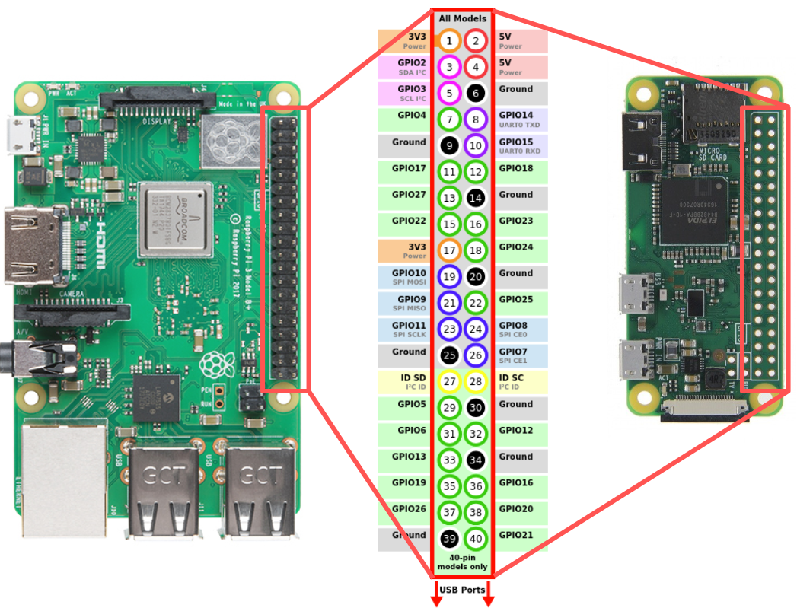

# Pulse width

In this lab, we'll practice using pulse width:

* in an output signal, to control the average output voltage
* in an input signal, to read a resistive sensor using an RC circuit 

## Notes

* In this lab, you will create some breadboard circuits with exposed pins and wires. Please be especially careful not to accidentally create connections that shouldn't be connected (e.g. short circuits). Also, check your work carefully before connecting any breadboard circuit to a board, to avoid damaging the board.
* Read each subsection of this lab manual in its entirety before you start following the instructions in it. Some instructions are modified by explanations that come afterwards.
* Although you may work with a partner, this collaboration is limited to discussion. Your partner is not allowed to construct or modify your circuit, log in to your Pi, or run commands or write code on your Pi. Similarly, you are not allowed to do these things for your partner. (You *are* encouraged to collaborate by screen-sharing or showing video of your circuit to debug and discuss problems together.)
* For your lab report, you must submit data, code, and screenshots from your own experiment. You are not allowed to use your lab partner's data, code, or screenshots.
* For any question in the lab report that is marked "Individual work", you should *not* collaborate with your lab partner or anyone else (even via discussion). You can use your notes, the lab manual, or the lecture slides and video to help you answer these questions.

\newpage

## Parts


Find these parts in your kit, and set them aside until you need them:

* Digital multimeter.
* Pi, SD card, and power supply. You can insert the SD card, connect the power supply, and log in to your Pi over SSH.
* Breadboard and jumper cables
* Assorted resistors (in a plastic bag)
* 10mm RGB LED
* Two push button switches, with red, green, or blue colored covers. You have four of these switches with colored covers in your kit - choose two that are red, green, or blue.
* Micro servo motor
* Photoresistor

Note that you'll need these parts again, including small parts like cables and resistors, so carefully return everything to their bags when you're finished.


### RGB LED

An RGB LED has three small LEDs inside it: a red one, a green one, and a blue one. The bulb may be "diffused", or frosted, so that when more than one of the LEDs is on, the colors will appear to blend together. If the bulb is clear, it is easier to distinguish the individual LEDs.

It comes in two main variations:

* Common cathode: one cathode and three anodes, one for each color. (The RGB LED in our kit is common cathode.)
* Common anode: one anode and three cathodes, one for each color. 

We can create a "mixed" color by applying a pulse width modulation (PWM) 
signal to the three color pins; the color of the LED will depend on the duty cycle
of each signal. For example, we can create an aqua color by applying a high duty cycle
PWM signal to the green and blue pins, and a low duty cycle PWM signal to the red pin.

### Servo motor

Servo motors are used for angular positioning. A standard servo is supposed to turn 90° in either direction, for 180° of range; in practice, many servo motors won't get the full range. You might use a servo motor to move a robot arm, or to control a camera angle.

Inside the case, a servo motor has:

* a small DC motor. When a voltage is applied, this motor can spin fast, but has very low torque (ability to move things).
* several stages of gears (plastic or metal). These are fitted to the motor shaft, so that at the output, the speed is reduced but the torque is increased.
* a potentiometer.
* a control circuit.

When the motor moves, it turns the potentiometer wiper, so that the output of the potentiometer varies according to the motor position. The control circuit compares the position according to the potentiometer output and your desired position according to the control signal, and moves the motor until they match.

Most servo motors use the same standard control signal: a PWM signal with a 20ms period, and the pulse width varies between 1-2ms to determine the angle.


### Photoresistor

A photoresistor, or light-dependent resistor, has variable resistance depending on how much light it is exposed to. The more light it is exposed to, the lower its resistance.

The datasheet for a photoresistor will typically include the following key details about its behavior:

* Peak spectral response - what is the frequency (color of light) to which it is most responsive? It may also include a curve of sensitivity vs. wavelength, showing how sensitive the photoresistor is to different colors of light.
* Light resistance - what is the resistance across the terminals when the photoresistor is exposed to light?
* Dark resistance - what is the resistance across the terminals when the photoresistor is not exposed to light?
* A formula or a curve that shows how the resistance varies as the light level (measured in lux) changes.
* Lag time or response time - how much time elapses between exposure to light and change in resistance?


\newpage


## Prepare a directory

On your Pi, create a new directory in which you'll save all the code you use in this lab:

```
mkdir ~/lab-pulse-width
```


## Pinout diagrams

This page is provided here for reference. For an interactive pinout diagram, see [https://pinout.xyz](https://pinout.xyz).




\newpage


## Using PWM output

### Preparing your circuit - RGB LED

You willl need:

* One breadboard (any size)
* One RGB LED
* Three 470Ω resistors (you may change the resistor values later, but use these to start)
* Jumper cables

The RGB LED in your kit is a common cathode 10mm LED with a diffused bulb, and forward voltage of around 2.0V on the red pin and 3.0V on the blue and green pins.

Use the following diagram to identify the pins on your RGB LED. The longest pin is the common cathode, and from there, you can identify the other pins:

{ width=35% }


Configure the LED and current-limiting resistors in the breadboard, as shown in the diagram.


\newpage

### Connect your Raspberry Pi - RGB LED

Next, connect your Raspberry Pi to the RGB LED:


* Connect **GND** to the common cathode pin. Use a brown or black wire for the GND connection (if you have one), to make it easier to "read" your breadboard circuit.
* Connect the red pin to **BCM 18** (PWM0) (through the series resistor). Use a red wire for this connection (if you have one), to make it easier to "read" your breadboard circuit.
* Connect the green pin to **BCM 12** (PWM0) (through the series resistor). Use a green wire for this connection (if you have one), to make it easier to "read" your breadboard circuit.
* Connect the blue pin to **BCM 13** (PWM1) (through the series resistor). Use a blue wire for this connection (if you have one), to make it easier to "read" your breadboard circuit.

(Note: you will soon add more parts to this circuit. You may find it convenient to keep the RGB LED near the top of your breadboard, so that you have plenty of space to add things later.)

Test your circuit by configuring the three GPIO pins to output mode. Then, write HIGH or LOW values to turn the RGB LED red, then green, then blue.


### Use `gpio` utility to configure PWM for RGB LED

First, we'll practice using the `gpio` utility to configure PWM. In this exercise, we'll only use the red part of the RGB LED.

Open a terminal, and set BCM 13 to PWM mode:

```
gpio -g mode 13 pwm
```

(Using the `-g` flag allows us to use BCM pin numbering instead of WiringPi numbering.)

Run `gpio readall` and inspect the output. Verify that the pin used for PWM is now in an "alternate" mode. Take a screenshot for your lab report.

Next, we will set up the PWM units. The frequency of the PWM output will be: 19.2MHz/(PWM Clock)/(PWM Range). To set the frequency to 50Hz (PWM cycle is 20ms), we will run:

```
gpio pwm-ms   
gpio pwmc 1920  # Set the PWM clock to 1920
gpio pwmr 200   # Set the "range" to 200 
```

Finally, we can set the duty cycle. We set the duty cycle by indicating how many units of time (out of `pwmr` units) the output should be set to HIGH.

To set PWM1 (on BCM pin 13) to 50% duty cycle, we can run:

```
gpio -g pwm 13 100
```

Run `piscope` to see the PWM output:

* Open a VNC conenction to your Pi
* In the terminal in the VNC session, run `sudo pigpiod`
* In the terminal in the VNC session, run `piscope`

Try setting a 10% duty cycle and a 90% duty cycle. Zoom in on the `piscope` output so that you can accurately measure the timing on each pin, and take a screenshot for your lab report. 

Also try increasing the frequency (decreasing the period) of the PWM signal.  Zoom in on the `piscope` output so that you can accurately measure the timing on each pin, and take a screenshot for your lab report. Make a note of the PWM parameters: PWM clock, PWM range, and PWM duty cycle.

When you are finished, reset the PWM pin to input mode, and verify with `gpio readall`:

```
gpio -g mode 13 input
```


---


**Lab report**: Include the `gpio readall` output in your lab report. Annotate the screenshot; circle the pins in "alternate" mode.

**Lab report**: Show a screenshot of the `piscope` output with the PWM output set to a 10% duty cycle. Annotate the diagram to show: 

* a complete PWM cycle on the pin. How long does it last (in units of time)?
* the duration for which the pin is set to HIGH
* the duration for which the pin is set to LOW

**Lab report**: Show a screenshot of the `piscope` output with a higher frequency (smaller period) PWM signal. Annotate the diagram to show a complete PWM cycle, the duration for which the pin is set to HIGH, and the duration for which the pin is set to LOW.

Also show the commands you ran to configure this signal, and explain how to compute the PWM period and duty cycle using the PWM clock and range that you selected. 

---

\newpage

### Use Python with software PWM

Next, we'll practice using software PWM. With software PWM, we configure the pin as a regular GPIO output, but toggle it high and low to create a PWM signal.


Create a new file inside the `lab-pulse-width` directory:

```
cd ~/lab-pulse-width
nano pwm-soft.py
```

Put the following code in this file:

```
import RPi.GPIO as GPIO
import time
import sys

GPIO.setmode(GPIO.BCM)

GPIO.setup(18, GPIO.OUT)
pwm_red = GPIO.PWM(18, 50)
pwm_red.start(50)

GPIO.setup(12, GPIO.OUT)
pwm_green = GPIO.PWM(12, 50)
pwm_green.start(50)

GPIO.setup(13, GPIO.OUT)
pwm_blue = GPIO.PWM(13, 50)
pwm_blue.start(50)

try:
  while True:
    time.sleep(10)

except KeyboardInterrupt:
  pwm_red.stop()
  pwm_green.stop()
  pwm_blue.stop()
  GPIO.cleanup()
  sys.exit()

```

Run it with

```
python3 pwm-soft.py
```

and observe the output in `piscope`. Change the duty cycle on each pin, and observe the difference in the LED color. You may want to adjust the resistor values so that the color is close to white when all three LEDs have the same duty cycle - just make sure the resistance is at least 220Ω on each anode.

The RPi.GPIO library uses **software PWM** - i.e. rapidly toggling GPIO outputs on and off to create a PWM-like signal. While this enables us to use any GPIO pin for PWM output, it also uses a lot of CPU. Run

```
top
```

to see a list of the processes using CPU, and look for the Python process. How much CPU (expressed as a percent) is it using? (Use \keys{q} to quit the `top` process.) You may also notice visible flickering with the software PWM, since the signal is not very "clean" - observe the PWM signal in `piscope` to verify.

Modify the Python script to increase the PWM frequency. What do you observe (in terms of CPU usage as measured by `top` and the PWM signal as seen in `piscope`) as you increase the PWM frequency?

---

**Lab report**: As you increase the frequency of a software PWM signal, its performance starts to degrade. Use screenshots of `top` output and `piscope` to demonstrate this effect (make sure to indicate on each screenshot what PWM frequency it is from).

Describe your observations (with specific reference to the screenshots), and explain.


---

### Use Python with hardware PWM

Alternatively, we can use the `pigpio` library in Python to configure hardware PWM on the Pi.

However, we only have two hardware PWM pins.

Create a new file:

```
cd ~/lab-pulse-width
nano pwm-hard.py

```

with the following contents: 

```
import pigpio
import time
import sys
pi = pigpio.pi()
# first arg is pin number,
# second arg is frequency in Hz,
# third arg is number of ON units out of 1000000
pi.hardware_PWM(13, 50, 500000) # blue
pi.hardware_PWM(12, 50, 500000) # green
pi.hardware_PWM(18, 50, 500000) # red
```


To use the `pigpio` library, you must have `pigpiod` running. You may have started it already for `piscope`, but if not, run

```
sudo pigpiod
```

Then, run your Python script with

```
python3 pwm-hard.py
```


**Note**: If your `pigpio` program doesn't work as expected, you can try restarting `pigpiod`:

```
sudo killall pigpiod
sudo pigpiod
```

Try to change the duty cycle on the PWM pins. Are you able to set three *different* duty cycles on the three PWM pins?

Change the frequency of the PWM signal, to the same values you tested in the previous section. Run `piscope` again, and observe the output on the PWM lines. 

Also use `top` to check the CPU usage. However, since the `pigpio` library, also uses the `pigpiod` daemon, to check CPU usage with hardware PWM you should:

* stop `piscope`, since it also uses `pigpiod`
* look at the CPU usage of both `python` and `pigpiod` while your Python script is running.

---

**Lab report**: Are you able to set three *different* duty cycles on the three PWM pins with hardware PWM - for example, set an 80% duty cycle on the blue pin, a 40% duty cycle on the red pin, and a 10% duty cycle on the green pin at the same time? Show the `piscope` output when you try to configure this, and explain.

**Lab report**: Compare the performance of hardware PWM and software PWM as you increase the PWM frequency. Use output of `piscope` and `top` to support your answer. (Make sure you capture `top` output when `piscope` is *not* running!) Explain your observations.

---

### Use push buttons to set LED color

In a previous lab, you learned how to read in the state of a push button switch. Now, you'll build on that knowledge. You are going to construct a circuit in which you change the color of the LED using two push button switches.

First, add the two colored push button switches to your breadboard (but don't connect them to your Pi yet!). As in the previous lab,

* use the connectivity mode on your multimeter to identify which pins on the switch are always connected internally, so that you can place the switch correctly in your circuit.
* use a 10kΩ pull-down or a pull-up resistor to make sure that the input is not floating when the button is not pressed.
* use a 470Ω or 1kΩ current-limiting resistor to protect your Pi from a short circuit, in case the GPIO pin is configured in output mode.

If you're not sure about your circuit, you can ask for help and an instructor or TA will help you check it. Make sure everything is correct *before* you connect the push-button switches to the supply voltage or to the Pi's GPIO pins.

Then, carefully connect the push-button switches to your Pi.

On your RGB LED, you will use only the two colors that match your buttons (red and green, red and blue, or green and blue). Disconnect the other color. Make sure your two colors are connected to two *independent* hardware PWM outputs.


Next, create a new Python script inside the `~/lab-pulse-width` directory:

```
cd ~/lab-pulse-width
nano led-button.py
```

Use the code you have seen in this lab and the code you have seen in the previous lab to write a Python script that will:

* Noticeably increase the intensity of the LED color each time you press the push button with the matching color.
* Minimize CPU usage (and make the LED color smoother and the button more responsive) by using an interrupt-drive callback function to read the button press, and by using the hardware PWM on the Pi to set the LED color.
* Keep your code organized, by using variables to set pin numbers, and defining all of these variables in one place near the top of your script.
* Do something reasonable when you press the button after the PWM duty cycle is already at 100%.

Test your Python script with

```
python3 led-button.py
``` 

When you are finished, *carefully* disconnect your Pi from your RGB LED circuit.

---

**Lab report**: Show your `led-button.py` script.

Explain your script. How did you decide how much to increase the duty cycle when the button is pressed? What does your code do when the button is pressed, but the duty cycle for that color is already at 100%? What decisions did you make to keep the code "clean" and to improve performance?

---

### Control a servo motor

Finally, we'll practice using PWM to control the position of a servo motor.

First, make sure that pin 13 is turned "off", by setting it to input mode:

```
gpio -g mode 13 input
```

Your servo will have come in a small bag with a variety of plastic attachments, called "horns", that can fit on top. Attach one of the horns with two long ends (not the X-shaped horn) to the top of the servo, so that you can see how its position changes according to the control signal that you send to the servo.

Then, connect your servo to your Pi. You can connect it directly using jumper cables from the servo to the Pi, without a breadboard. But, be very carefully when connecting or disconnecting these cables so that you do not accidentally create a short circuit! Always disconnect the end that's plugged in to your Pi *first*; only then disconnect the end that's plugged in to the servo.

* The brown wire on your servo should be connected to GND on you Pi.
* The red (supply voltage) wire on your servo should be connected to 5V on your Pi. (The servo may move a little when you first connect it.)
* The orange (control signal) wire on your servo should be connected to BCM 13 (PWM 1) on your Pi. 

Note that even though the servo runs on 5V, the 3.3V signal from your Pi will be sufficient to configure its position.


Then, configure pin 13 in PWM mode, with a 20ms period and 1.5ms pulse width:


```
gpio -g mode 13 pwm 

# frequency of the PWM output will be: 
# 19.2MHz/(PWM Clock)/(PWM Range)
# For 50 Hz (20 ms period)
gpio pwm-ms
gpio pwmc 1920 # Set the PWM clock to 1920
gpio pwmr 200  # Set the "range" to 200

# set duty cycle - how many units HIGH 
# (out of pwmr, which is 200)
gpio -g pwm 13 15 # 1.5ms out of 20ms
```

Open `piscope`, and adjust the zoom so that you can see a complete PWM cycle. Use the cursors to measure the pulse width (the top right corner of the `piscope` window should show the position of each cursor, and the distance between them.)

Then, vary the PWM duty cycle so that the pulse width varies from 1ms to 2ms. Observe the position of the servo "horn" as you change the pulse width. 

**Note**: if your servo is buzzing or clicking when you set a pulse width close to either extreme (1 or 2ms), it's struggling to get to a position that it can't quite reach. Don't let it run like this for too long, or you could damage it; set the pulse width to a more moderate value.

Take screenshots of the PWM signal and photographs of the position of the horn for several different pulse widths between 1 and 2ms.

---

**Lab report** (individual work): You are designing a password-protected box. You have the following parts available to you:

* Pi 
* Assorted resistors and wires (same resistor values as in your kit)
* 4x4 membrane keypad (just like the one in the lecture slides on "Digital input and output using pins". Note: the resistors shown on these slides are not built in to the keypad, they are added as part of the external circuit that connects the keypad to the GPIO pins.)
* Micro servo motor (just like the one in this lab)

Users will open the box by entering a code into a 4x4 membrane keypad. Entering the correct code should trigger the servo motor to move to a position that allows the box to be opened. Otherwise, the servo should be in a position that does not allow the box to be opened.

Draw a schematic showing how you would connect the membrane keypad and the servo motor to your Pi. Use resistors where required for safe operation, and specify appropriate resistor values. Make sure to label each pin on the keypad, each pin on the servo motor, and each pin that you use on the Pi.

Also draw a diagram showing how you would use the servo motor to control whether the box can be opened. Where would you attach the servo? How would it manipulate the box? Show the position of all parts when the box can be opened, and when the box is locked.

Draw the control signal that you would send to the servo in order to keep the box locked, and draw the control signal that you would send to the servo in order to allow the box to be opened.

Show a photograph of the servo horn from your experiment along with the corresponding signal (`piscope` screenshot) you would send when the box is locked. Annotate the `piscope` screenshot to indicate the pulse width.

Show a photograph of the servo horn from your experiment along with the corresponding signal (`piscope` screenshot) you would send when the box is unlocked. Annotate the `piscope` screenshot to indicate the pulse width.

---

\newpage

## Reading resistive sensor using RC timing circuit 

In this experiment, we will use the discharge time of a capacitor to read values from an analog sensor as a digital pulse width. 

You will need:

* Pi
* One capacitor in the range 1-10μF
* One capacitor in the range 10-100nF
* Two 1kΩ resistors and two 10kΩ resistors
* One photoresistor


Use the resistance mode on your multimeter to measure the resistance of the photoresistor in three scenarios:

* When you cover the resistor (dark mode)
* When you shine a light on the resistor, e.g. your phone flashlight (light mode)
* when you do neither (ambient light)

---

**Lab report**: Report the resistance of your photoresistor:

* When you cover the resistor (dark mode)
* When you shine a light on the resistor, e.g. your phone flashlight (light mode)
* when you do neither (ambient light)

---

### Prepare your circuit and connect your Pi


Prepare your circuit using 10kΩ resistors as fixed resistors and the capacitor in the range 1-10μF. You can use any two available GPIO pins on your Pi, just modify the pin number in the code to reflect the GPIO pins you choose.

{ width=40% }


\newpage

### Read light levels using pulse width

To read the ambient light levels from the photoresistor, we will use the following approach:

1. First, discharge capacitor through the discharge resistor. Set GPIO\_A as INPUT, which effectively disconnects R\_CHARGE and R\_VAR from the circuit. Then, set GPIO\_B as OUTPUT and LOW.
2. Next, charge capacitor through the photoresistor. Set GPIO\_B as input, which effectively disconnects R\_DISCHARGE. Then, set GPIO\_A as OUTPUT and HIGH. Start a timer, and when GPIO\_B reads HIGH (indicating that the voltage across the capacitor is sufficiently high to be read as logic HIGH by the Pi), stop the timer.

Since the time for the capacitor to charge depends on τ=(R1+RVAR)C, we can use this circuit to detect changes in RVAR - when the resistance is high, it will take longer to see a HIGH input on GPIO\_B.

Connect the circuit using the larger capacitor (1-10μF) and the 10kΩ fixed resistors.

Open a new file `input-pulse-width.py` inside your `lab-pulse-width` directory:

```
cd ~/lab-pulse-width
nano input-pulse-width.py
```

and place the following code inside this file:

```
import RPi.GPIO as GPIO
import time
import sys

# Use BCM pin numbering
GPIO.setmode(GPIO.BCM)
GPIO_A = 27
GPIO_B = 22

try:
  while True:
    # let capacitor discharge
    GPIO.setup(GPIO_A,GPIO.IN)
    GPIO.setup(GPIO_B,GPIO.OUT)
    GPIO.output(GPIO_B, GPIO.LOW)
    time.sleep(1) # let it discharge allll the way

    # charge through variable resistor
    GPIO.setup(GPIO_B,GPIO.IN)
    GPIO.setup(GPIO_A, GPIO.OUT)
    start = time.time()
    GPIO.output(GPIO_A, GPIO.HIGH)
    GPIO.wait_for_edge(GPIO_B, GPIO.RISING, timeout=2000)
    end = time.time()
    print("%f seconds, %f us" % (end-start, 1000000*(end-start)))

except KeyboardInterrupt:
  GPIO.cleanup()
  sys.exit()
```

Then, run it with

```
python3 input-pulse-width.py
```

and observe how the time measurement changes as you change the ambient lighting conditions (cover the photoresistor, shine a light on the photoresistor, etc).

Use `piscope` to capture the signal on the GPIO\_A and GPIO\_B lines as you run this script, and zoom in so that your display shows one measurement. Use the cursors (gold and blue vertical lines) in `piscope` to measure the time interval from when GPIO\_A goes HIGH, until GPIO\_B reads HIGH. To measure time using the cursors, click on the part of the signal where you  want to start measuring, then move your mouse to the part where you want to stop. Check the top right corner of the `piscope` GUI to see the time difference between the two points.


For your lab report: 

* Take screenshots of `piscope` with the cursor measurement for the maximum and minimum readings you can get. (Make sure to label your screenshots so that you know what the light conditions were for each!)
* Test your circuit with 1kΩ fixed resistors for the charge and discharge resistors, and then with 10kΩ fixed resistors.
* Change the capacitor from one in the range of 1-10μF, to one in the range 10-100nF, and test your circuit again, with both fixed resistor values.

\newpage

---

**Lab report**: Show one screenshot of the `piscope` output, with the cursors measuring the time interval when GPIO\_A goes HIGH, until GPIO\_B reads HIGH. Annotate the screenshot to mark:

* the time when you start to charge the capacitor
* the time when the voltage across the capacitor is high enough that the GPIO input pin registers it as HIGH
* the time when you start to dischange the capacitor

**Lab report**: Show screenshots of the light level reading (in the Python terminal) and the pulse width (in `piscope`) under dark and light conditions. (Make sure to clearly label which screenshot is which.) Explain how you can use the pulse width to measure the light level.

**Lab report** Show screenshots of the light level reading (in the Python terminal) and the pulse width (in `piscope`) under ambient light conditions, for four different circuits:

* Small capacitor and 1kΩ fixed resistors
* Small capacitor and 10kΩ fixed resistors
* Large capacitor and 1kΩ fixed resistors
* Large capacitor and 10kΩ fixed resistors

Explain the advantages and disadvantages of a large capacitor/large fixed resistor vs. a small capacitor/small fixed resistor.

---


### Flask UI for photoresistor circuit

Finally, we'll set up a browser-based UI for the photoresistor circuit using Flask.

Create a new directory called `flask-photo` in your `lab-pulse-width` directory, then navigate to it:

```
mkdir ~/lab-pulse-width/flask-photo
cd ~/lab-pulse-width/flask-photo
```

We'll use the `virtualhat` library again - download and install it (for Python 2 and Python 3) with

```
git clone https://github.com/ffund/virtualhat
cd virtualhat
sudo python2 setup.py install
sudo python3 setup.py install
cd ~/lab-pulse-width/flask-photo
```


Create an `index.html` file with the following contents:

```
<!DOCTYPE html>
   <head>
    <title>Hello Flask!</title>
    <link rel="stylesheet" href="https://stackpath.bootstrapcdn.com/bootstrap/4.3.1/css/bootstrap.min.css">
   </head>
   <body>
   <div class="container">
    <h1>Hello Flask</h1>
      <a href="/light" class="btn btn-primary" role="button">Light level</a>
   </div>
   </body>
</html>
```

We'll create a new HTML page that will load when the user presses the "Light level" button. This file will be a template, which means that it contains a variable whose value will be filled in by the Flask app. Create a new directory called templates

```
mkdir ~/lab-pulse-width/flask-photo/templates
```

And inside the templates directory, create `light.html`:


```
cd templates
nano light.html
```

with the following contents:

```
<!DOCTYPE html>
   <head>
    <title>Hello Flask!</title>
    <link rel="stylesheet" href="https://stackpath.bootstrapcdn.com/bootstrap/4.3.1/css/bootstrap.min.css">
   </head>
   <body>
   <div class="container">
    <h1>Light level</h1>
  <p>Light level is: {{ level }}!</p>
      <a href="/" class="btn btn-primary" role="button">Home</a>
   </div>
   </body>
</html>
```


Then, navigate back to the `flask-photo` directory:

```
cd ~/lab-pulse-width/flask-photo
```

and create a file `flask-light.py` with the following contents:


```
from flask import Flask, redirect, render_template
import virtualhat

virtualhat.setup()

app = Flask(__name__, static_folder='')

@app.route("/")
def hello():
    return app.send_static_file('index.html')

@app.route("/light")
def light_level():
    light_level=virtualhat.read_light_level()
    return render_template('light.html', level=light_level)

if __name__ == "__main__":
    app.run(host='0.0.0.0', port=80, debug=True, threaded=True)
```

Run your Flask app with

```
sudo python3 flask-light.py
```

Now, you should be able to view the Flask page in your browser. Open a browser on any device on the same network as your Pi, and in the address bar, type either the Pi's IP address, or the hostname you use to access the Pi over SSH. Once you have verified that you can access this page, you can stop the Flask app with \keys{Ctrl+C}.


The Flask app calls functions from the `virtualhat` library to check the "virtual" sensor level. Your task is to *modify* the `virtualhat` library so that your Flask app will *actually* read the sensor value. (You won't modify the HTML or Python source code of the Flask app.)

Navigate to the directory where the source code of the `virtualhat` library is located:

```
cd ~/lab-pulse-width/flask-photo/virtualhat
```

and then open the `virtualhat.py` file for editing. 

```
nano virtualhat.py
```

All of the library functions are in this file.


You will need to modify this file so that:

* When the `setup()` function is called, your GPIO pins will be configured so as to discharge the capacitor.
* When the `read_light_level()` function is called, you will read the light level from the sensor by measuring the pulse width. Then, you'll discharge the capacitor again. Calibrate your readings to that the `read_light_level()` function returns a value close to 0 when the sensor is covered, and a value close to 100 when you shine a light on it.

To test your modifications, install the modified library with

```
sudo python2 setup.py install
sudo python3 setup.py install
```


Then, go back to your Flask app directory and run your Flask app again:

```
cd ~/lab-pulse-width/flask-photo
sudo python3 flask-light.py
```

Open the page in your browser again. Click on the buttons and make sure your LED turns on and off as expected.


---

**Lab report**: Upload your modified `virtualhat.py`. Also show a screenshot of your browser window with the photoresistor covered and with the photoresistor exposed to bright light.


**Lab report**: What capacitor and fixed resistor values did you use? Explain the advantages and disadvantages of a large capacitor/large fixed resistor vs. a small capacitor/small fixed resistor, *for this specific application*.

---


## Graceful shutdown

Finally, disconnect the Pi from the breadboard, and shut it down with

```
sudo shutdown now
```

Wait until the disk activity LED stops flashing completely before you disconnect the Pi from the power supply.