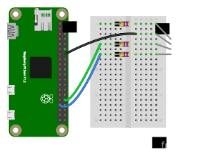

In this lab exercise, we'll practice using pulse width:

* in an output signal, to control the average output voltage
* in an input signal, to read a resistive sensor using an RC circuit 

and we will also practice debugging circuits that use pulse width.


## Notes

* In this lab, you will create some breadboard circuits with exposed pins and wires. Please be especially careful not to accidentally create connections that shouldn't be connected (e.g. short circuits). Also, check your work carefully before connecting any breadboard circuit to a board, to avoid damaging the board.
* You will submit your lab work in Gradescope. You will upload screenshots/photos and answer some questions as described in the Gradescope assignment. You do not have to write anything else (e.g. no description of procedure, etc.) 
* Read each subsection of this lab manual in its entirety before you start following the instructions in it. Some instructions are modified by explanations that come afterwards.
* Although you may work with a partner, this collaboration is limited to discussion and comparison. Your partner is not allowed to construct or modify your circuit, log in to your Pi, or run commands or write code on your Pi. Similarly, you are not allowed to do these things for your partner. 
* For your lab report, you must submit data, code, screenshots, and photos from your own experiment. You are not allowed to use your lab partner's data, code, screenshots, or photos.
* For any question in the lab report that is marked "Individual work", you should *not* collaborate with your lab partner or anyone else (even via discussion). You can use your notes, the lab manual, or the lecture slides and video to help you answer these questions.

\newpage

## Parts


Find these parts, and set them aside until you need them:

* Pi, SD card, and power supply. You can insert the SD card, connect the power supply, and log in to your Pi over SSH.
* Breadboard and jumper cables
* Digital multimeter
* Analog Discovery 2
* 10mm RGB LED
* Three 470Ω resistors and three 220Ω resistors
* Micro servo motor
* Photoresistor
* One capacitor in the range 1-10μF
* One capacitor in the range 10-100nF
* Two 1kΩ resistors and two 10kΩ resistors


### RGB LED

An RGB LED has three small LEDs inside it: a red one, a green one, and a blue one. The bulb may be "diffused", or frosted, so that when more than one of the LEDs is on, the colors will appear to blend together. If the bulb is clear, it is easier to distinguish the individual LEDs.

It comes in two main variations:

* Common cathode: one cathode and three anodes, one for each color. (The RGB LED in our kit is common cathode.)
* Common anode: one anode and three cathodes, one for each color. 

We can create a "mixed" color by applying a pulse width modulation (PWM) 
signal to the three color pins; the color of the LED will depend on the duty cycle
of each signal. For example, we can create an aqua color by applying a high duty cycle
PWM signal to the green and blue pins, and a low duty cycle PWM signal to the red pin.

### Servo motor

Servo motors are used for angular positioning. A standard servo is supposed to turn 90° in either direction, for 180° of range; in practice, many servo motors won't get the full range. You might use a servo motor to move a robot arm, or to control a camera angle.

Inside the case, a servo motor has:

* a small DC motor. When a voltage is applied, this motor can spin fast, but has very low torque (ability to move things).
* several stages of gears (plastic or metal). These are fitted to the motor shaft, so that at the output, the speed is reduced but the torque is increased.
* a potentiometer.
* a control circuit.

When the motor moves, it turns the potentiometer wiper, so that the output of the potentiometer varies according to the motor position. The control circuit compares the position according to the potentiometer output and your desired position according to the control signal, and moves the motor until they match.

Most servo motors use the same standard control signal: a PWM signal with a 20ms period, and the pulse width varies between 1-2ms to determine the angle.


### Photoresistor

A photoresistor, or light-dependent resistor, has variable resistance depending on how much light it is exposed to. The more light it is exposed to, the lower its resistance.

The datasheet for a photoresistor will typically include the following key details about its behavior:

* Peak spectral response - what is the frequency (color of light) to which it is most responsive? It may also include a curve of sensitivity vs. wavelength, showing how sensitive the photoresistor is to different colors of light.
* Light resistance - what is the resistance across the terminals when the photoresistor is exposed to light?
* Dark resistance - what is the resistance across the terminals when the photoresistor is not exposed to light?
* A formula or a curve that shows how the resistance varies as the light level (measured in lux) changes.
* Lag time or response time - how much time elapses between exposure to light and change in resistance?


\newpage

## Preparation

### Prepare a directory

On your Pi, create a new directory in which you'll save all the code you use in this lab:

```
mkdir ~/lab-pulse-width
```

## Using PWM output

### Preparing your circuit - RGB LED

You willl need:

* One breadboard (any size)
* One RGB LED
* Three 470Ω resistors (you may change the resistor values later, but use these to start)
* Jumper cables


### Use `gpio` utility to configure PWM 

First, we'll practice using the `gpio` utility to configure hardware PWM. 

Open a terminal, and set BCM 13 to hardware PWM mode:

```
gpio -g mode 13 pwm
```

(Using the `-g` flag specifies BCM pin numbering.)

When you configure a pin to be in hardware PWM mode, the `gpio readall` output will reflect that it is neither in input mode, nor output mode - it will be in "alternate" functionality mode. This is a good way to check your current pin settings! 

Run `gpio readall` and verify that the pin used for PWM is now in an "alternate" mode. Take a screenshot for your lab report.

---

**Lab report**: Show the `gpio readall` output when BCM pin 13 is configured in PWM mode. Annotate your screenshot - circle the part that indicates the mode of BCM pin 13.


<!---

   +-----+-----+---------+------+---+-Pi ZeroW-+---+------+---------+-----+-----+
 | BCM | wPi |   Name  | Mode | V | Physical | V | Mode | Name    | wPi | BCM |
 +-----+-----+---------+------+---+----++----+---+------+---------+-----+-----+
 |     |     |    3.3v |      |   |  1 || 2  |   |      | 5v      |     |     |
 |   2 |   8 |   SDA.1 |   IN | 1 |  3 || 4  |   |      | 5v      |     |     |
 |   3 |   9 |   SCL.1 |   IN | 1 |  5 || 6  |   |      | 0v      |     |     |
 |   4 |   7 | GPIO. 7 |   IN | 1 |  7 || 8  | 0 | IN   | TxD     | 15  | 14  |
 |     |     |      0v |      |   |  9 || 10 | 1 | IN   | RxD     | 16  | 15  |
 |  17 |   0 | GPIO. 0 |   IN | 0 | 11 || 12 | 0 | IN   | GPIO. 1 | 1   | 18  |
 |  27 |   2 | GPIO. 2 |   IN | 0 | 13 || 14 |   |      | 0v      |     |     |
 |  22 |   3 | GPIO. 3 |   IN | 0 | 15 || 16 | 0 | IN   | GPIO. 4 | 4   | 23  |
 |     |     |    3.3v |      |   | 17 || 18 | 0 | IN   | GPIO. 5 | 5   | 24  |
 |  10 |  12 |    MOSI |   IN | 0 | 19 || 20 |   |      | 0v      |     |     |
 |   9 |  13 |    MISO |   IN | 0 | 21 || 22 | 0 | IN   | GPIO. 6 | 6   | 25  |
 |  11 |  14 |    SCLK |   IN | 0 | 23 || 24 | 1 | IN   | CE0     | 10  | 8   |
 |     |     |      0v |      |   | 25 || 26 | 1 | IN   | CE1     | 11  | 7   |
 |   0 |  30 |   SDA.0 |   IN | 1 | 27 || 28 | 1 | IN   | SCL.0   | 31  | 1   |
 |   5 |  21 | GPIO.21 |   IN | 1 | 29 || 30 |   |      | 0v      |     |     |
 |   6 |  22 | GPIO.22 |   IN | 1 | 31 || 32 | 0 | IN   | GPIO.26 | 26  | 12  |
 |  13 |  23 | GPIO.23 | ALT0 | 0 | 33 || 34 |   |      | 0v      |     |     |
 |  19 |  24 | GPIO.24 |   IN | 0 | 35 || 36 | 0 | IN   | GPIO.27 | 27  | 16  |
 |  26 |  25 | GPIO.25 |   IN | 0 | 37 || 38 | 0 | IN   | GPIO.28 | 28  | 20  |
 |     |     |      0v |      |   | 39 || 40 | 0 | IN   | GPIO.29 | 29  | 21  |
 +-----+-----+---------+------+---+----++----+---+------+---------+-----+-----+
 | BCM | wPi |   Name  | Mode | V | Physical | V | Mode | Name    | wPi | BCM |
 +-----+-----+---------+------+---+-Pi ZeroW-+---+------+---------+-----+-----+

---> 

---

### Configure PWM and observe PWM signal in `piscope`

Next, we will set up the PWM clock. The frequency of the PWM output will be: 19.2MHz/(PWM Clock)/(PWM Range). (The range of allowed values for PWM clock is 0-4096.)

To set the PWM frequency to 50Hz (PWM cycle is 20ms), run:

```
gpio pwm-ms   
gpio pwmc 1920  # Set the PWM clock to 1920
gpio pwmr 200   # Set the "range" to 200 
```

Finally, we can set the duty cycle and start the PWM signal. We set the duty cycle by indicating how many units of time (out of `pwmr` units) the output should be set to HIGH.

To set PWM1 (on BCM pin 13) to 50% duty cycle (100 out of 200), we can run:

```
gpio -g pwm 13 100
```


The best way to debug PWM signals is to look at them, so let's do that now! Run `piscope` to see the PWM output:

* Open a VNC connection to your Pi
* In the terminal in the VNC session, run `sudo pigpiod`
* In the terminal in the VNC session, run `piscope`
* Find the PWM line on BCM pin 13


Zoom in on the `piscope` output so that you can accurately measure the timing on each pin, and take a screenshot for your lab report. Annotate the screenshot to show how you would measure the PWM parameters: period, duty cycle, and pulse width.

Also, try setting

* a 10% duty cycle with 20ms period 
* a 90% duty cycle with 20ms period
* a 50% duty cycle with 2ms period

and for each, take a `piscope` screenshot. Annotate each screenshot to show the period, duty cycle, and pulse width.


When you are finished with this section, exit `piscope` using the X in the top right corner, and *then* close your VNC session. (In a later section, when we measure CPU usage, we want `piscope` to *not* be running so that we can more accurately measure the CPU usage of other processes.)

---

**Lab report**: Show a screenshot of the `piscope` display, annotated to show how you measure the period, duty cycle, and pulse width, in each case:

* 50% duty cycle with 20ms period
* 10% duty cycle with 20ms period 
* 90% duty cycle with 20ms period
* 50% duty cycle with 2ms period

<!--


50% duty cycle with 20ms period:

gpio -g mode 13 pwm
gpio pwm-ms   
gpio pwmc 1920  
gpio pwmr 200   
gpio -g pwm 13 100

10% duty cycle with 20ms period:

gpio -g pwm 13 20

90% duty cycle with 20ms period:

gpio -g pwm 13 180


50% duty cycle with 2ms period:

gpio -g mode 13 pwm
gpio pwm-ms   
gpio pwmc 1920  
gpio pwmr 20   
gpio -g pwm 13 10


--> 

---

### Set pin mode back to input

When we are finished with the hardware PWM, we can set the pin mode back to input (its default state):

```
gpio -g mode 13 in
```


### Use Software PWM in Python

Next, we

Next, we'll practice using PWM in Python. We'll try two "types" of PWM:

* Software PWM, which uses the pin in output mode and requires the CPU to toggle it on and off at the desired times
* Hardware PWM, which uses the PWM peripheral built in to the Raspberry Pi (but only on supported pins)


With software PWM, we configure the pin as a regular GPIO output, but toggle it high and low to create a PWM signal.


Create a new file inside the `lab-pulse-width` directory:

```
cd ~/lab-pulse-width
nano pwm-soft.py
```

Put the following code in this file. This code will start a software PWM signal on BCM pin 13, with a 50 Hz frequency and a 50% duty cycle:

```
import RPi.GPIO as GPIO
import time

GPIO.setmode(GPIO.BCM)

GPIO.setup(13, GPIO.OUT)
# first arg is pin number, second is frequency in Hz
pwm_out = GPIO.PWM(13, 50)
# argument is duty cycle, out of 100 parts
pwm_out.start(50)

# observe output for 60 seconds
time.sleep(60)
```

Run it with

```
python3 pwm-soft.py
```

While your `pwm-soft.py` script is running, open a second terminal window on the Pi and run

```
gpio readall
```

and note the state of BCM pin 13 - it should now be in output mode, rather than alternate functionality mode.

The RPi.GPIO library used **software PWM** - i.e. rapidly toggling GPIO outputs on and off to create a PWM signal. While this enables us to use *any* GPIO pin for PWM output, it also uses a lot of CPU. Run

```
htop
```

to see the overall CPU usage (in a bar graph near the top) and a list of the processes using CPU - look for the Python process and the `pigpiod` processes, in particular. How much CPU (expressed as a percent) is used overall, and how much by the Python process? Take a screenshot for your lab report. (Make sure the screenshot reflects a "typical" value and not an extreme but transient value.) Use `q` to quit the `htop` process when you are finished.


Modify the Python script to increase the PWM frequency to 500Hz, then to 5KHz. What do you observe (in terms of CPU usage as measured by `htop`) as you increase the frequency? Take a screenshot for your lab report.  

Now, open `piscope` again. Repeat the procedure above with increasing PWM frequency, and in each case, take a screenshot of the `piscope` display showing about ten cycles of PWM pulses. Do you notice that the high-frequency signal is less "clean"?


When you are finished with this section, exit `piscope` using the X in the top right corner, and *then* close your VNC session. (In a later section, when we measure CPU usage, we want `piscope` to *not* be running so that we can more accurately measure the CPU usage of other processes.)


---

**Lab report**: As you increase the frequency of a software PWM signal, the CPU usage increases. Use screenshots of `htop` output to demonstrate this effect (make sure to indicate on each screenshot what PWM frequency it is from). Describe your observations (with specific reference to the screenshots), and explain.

**Lab report**: As you increase the frequency of a software PWM signal, the CPU is no longer able to satisfy the specific timing requests as precisely, and so the PWM output becomes more "messy". Use screenshots of the `piscope` window to demonstrate this effect (make sure to indicate on each screenshot what PWM frequency it is from). Describe your observations (with specific reference to the screenshots), and explain.

**Lab report**: Show the `gpio readall` output while the software PWM script is running. What mode is BCM pin 13 in?

**Lab report**: For the software PWM script: is the PWM signal still generated on the output line when the script finishes running?

---

### Use Hardware PWM in Python

Alternatively, we can use the `pigpio` library in Python to configure hardware PWM on the Pi.

Create a new file:

```
cd ~/lab-pulse-width
nano pwm-hard.py
```

with the following contents: 

```
import pigpio
import time

pi = pigpio.pi()
# first arg is pin number,
# second arg is frequency in Hz,
# third arg is number of ON units out of 1000000
pi.hardware_PWM(13, 50, 500000) 

time.sleep(60)
```


To use the `pigpio` library, you must have `pigpiod` running. You may have started it already for `piscope`, but if not, run

```
sudo pigpiod
```

Then, run your Python script with

```
python3 pwm-hard.py
```


**Note**: If your `pigpio` program doesn't work as expected, you can try restarting `pigpiod`:

```
sudo killall pigpiod
sudo pigpiod
```

While your `pwm-hard.py` script is running, open a second terminal window on the Pi and run

```
gpio readall
```

and note the state of BCM pin 13 - it should now be in alternate functionality mode.


Change the frequency of the PWM signal, to the same values you tested in the previous section: 500Hz, then 5kHZ.  Use `htop` again to check the CPU usage for each frequency. However, since the `pigpio` library also uses the `pigpiod` daemon, to check CPU usage with hardware PWM you should look at the CPU usage of both `python` and `pigpiod` while your Python script is running.


Now, open `piscope` again. For each frequency you considered, take a screenshot of the `piscope` display showing about ten cycles of PWM pulses. Is the high-frequency signal also less "clean" in the hardware PWM case?

---

**Lab report**: As you increase the frequency of a hardware PWM signal, the CPU usage is not affected. Use screenshots of `htop` output to demonstrate this (make sure to indicate on each screenshot what PWM frequency it is from). Describe your observations (with specific reference to the screenshots), and explain.

**Lab report**: As you increase the frequency of a hardware PWM signal, the PWM peripheral is still able to produce a "clean" output signal despite the tighter time constraints. Use screenshots of the `piscope` window to demonstrate this (make sure to indicate on each screenshot what PWM frequency it is from). Describe your observations (with specific reference to the screenshots), and explain.

**Lab report**: Show the `gpio readall` output while the hardware PWM script is running. What mode is BCM pin 13 in?

**Lab report**: For the hardware PWM script: is the PWM signal still generated on the output line when the script finishes running?

---


### PWM signal to control RGB LED


Set the pin mode back to input (its default state):


```
gpio -g mode 13 in
```


Now that we understand how to configure a PWM output, we can use it to set the color of an RGB LED.


The RGB LED is a common cathode 10mm LED with a diffused bulb, and forward voltage of around 2.0V on the red pin and 3.0V on the blue and green pins.

Use the following diagram to carefully identify the pins on your RGB LED. The longest pin is the common cathode (negative LED terminal for all three colors), and from there, you can identify the other pins (one positive LED terminal for each color):

{ width=400px }


Configure the LED and current-limiting resistors in the breadboard, as shown in the diagram.

{ width=550px }


Next, connect your Raspberry Pi to the RGB LED:

{ width=550px }

* Connect **GND** to the common cathode pin. Use a brown or black wire for the GND connection (if you have one), to make it easier to "read" your breadboard circuit.
* Connect the red pin to **BCM 18** (through the series resistor). Use a red wire for this connection (if you have one), to make it easier to "read" your breadboard circuit.
* Connect the green pin to **BCM 12** (through the series resistor). Use a green wire for this connection (if you have one), to make it easier to "read" your breadboard circuit.
* Connect the blue pin to **BCM 13** (through the series resistor). Use a blue wire for this connection (if you have one), to make it easier to "read" your breadboard circuit.

Test your circuit by configuring the three GPIO pins to output mode. Then, write HIGH or LOW values to turn the RGB LED red, then green, then blue in turn.


Create a new file:

```
cd ~/lab-pulse-width
nano pwm-rgb.py
```

and in this file, write Python code to make the RGB LED gradually change its color from red, to purple, to blue, to purple, and back to red. Make sure the transition appears smooth!


---

**Lab report**: Show your `pwm-rgb.py` script. Also upload a short (less than 30 seconds) video of your LED while the script is running.

---

### PWM signal to control servo motor

Some components use a very specific PWM signal as a control signal. For example, a servo motor is typically controlled by sending a PWM signal with 20ms period, and pulse width between 1-2ms to set the position of the servo. A standard servo can rotate from 0 to 180 degrees (i.e. 90 degrees in each direction). 

First, make sure that pin 13 is turned "off", by setting it to input mode:

```
gpio -g mode 13 input
```

Your servo will have come in a small bag with a variety of plastic attachments, called "horns", that can fit on top. Attach one of the horns with two long ends (not the X-shaped horn) to the top of the servo, so that you can see how its position changes according to the control signal that you send to the servo.

Then, connect your servo to your Pi. You can connect it directly using jumper cables from the servo to the Pi, without a breadboard. But, be very carefully when connecting or disconnecting these cables so that you do not accidentally create a short circuit! Always disconnect the end that's plugged in to your Pi *first*; only then disconnect the end that's plugged in to the servo.

* The brown wire on your servo should be connected to GND on your Pi.
* The red (supply voltage) wire on your servo should be connected to 5V on your Pi. (The servo may move a little when you first connect it.)
* The orange (control signal) wire on your servo should be connected to BCM 13 (PWM 1) on your Pi. 

Note that even though the servo runs on 5V power, the 3.3V signal from your Pi should be sufficient for the control signal.


Next, configure pin 13 in PWM mode, with a 20ms period and 1.5ms pulse width:


```
gpio -g mode 13 pwm 

# frequency of the PWM output will be: 
# 19.2MHz/(PWM Clock)/(PWM Range)
# For 50 Hz (20 ms period)
gpio pwm-ms
gpio pwmc 1920 # Set the PWM clock to 1920
gpio pwmr 200  # Set the "range" to 200

# set duty cycle - how many units HIGH 
# (out of pwmr, which is 200)
gpio -g pwm 13 15 # 1.5ms out of 20ms
```

Then, vary the PWM duty cycle so that the pulse width varies from 1ms to 2ms. Observe the position of the servo "horn" as you change the pulse width. 

**Note**: if your servo is buzzing or clicking when you set a pulse width close to either extreme (1 or 2ms), it's struggling to get to a position that it can't quite reach. Don't let it run like this for too long, or you could damage it; set the pulse width to a more moderate value.


\newpage

## Reading resistive sensor using RC timing circuit 

In this experiment, we will use the discharge time of a capacitor to read values from an *analog* sensor as a *digital* pulse width. 

You will need:

* Pi
* One capacitor in the range 1-10μF
* One capacitor in the range 10-100nF
* Two 470Ω resistors, two 1kΩ resistors, and two 10kΩ resistors
* One photoresistor


### Get to know your resistive sensor

When working with a resistive sensor, a good starting point is to use a multimeter to understand the range of resistance values you are likely to see.

Configure your multimeter in ohmmeter mode:

* Put the black probe in the common port
* Put the red probe in the port with the Ω symbol
* Turn the dial to the setting with the Ω symbol

Then, touch the probes of the multimeter to each end of your photoresistor. It may take a moment for the value to settle; make a note of the resistance. This is the resistance under your current ambient light conditions.

Repeat this procedure, but:

* measure "light mode" resistance - shine a light (e.g. your phone flashlight) on the photoresistor while measuring its resistance
* measure "dark mode" resistance - cover the photoresistor with your hand while measuring its resistance


---

**Lab report**: Report the resistance of your photoresistor (make sure to include units!):

* In your current ambient light settings
* In "light mode"
* In "dark mode"

---


### Prepare your circuit and connect your Pi


Prepare your circuit using the small orange ceramic capacitor (which has capacitance in the range 10-100nF) and 1kΩ fixed resistors, following this schematic:


{ width=500px }

You can use any two available GPIO pins on your Pi *except* GPIO2 or GPIO3 - these have permanent built-in pull-up resistors that cannot be turned off, so they are not suitable for this circuit.


### Prepare your Analog Discovery 2 scope view

Connect your Analog Discovery 2 to your computer. We will use this measurement instrument to simultaneously monitor two signals: the analog voltage across the capacitor, and the digital signal at the GPIO pin used to charge the capacitor.


Connect the Analog Discovery 2 to your breadboard circuit as follows:

* GND on the Discovery 2 (black wire) to GND on your circuit
* Analog Channel 1 on the Discovery 2 across the capacitor: 1- (orange and white striped wire) to the GND side of the capacitor, and 1+ (solid orange striped wire) to the positive side of the capacitor
* DIO 0 (pink wire labeled 0) to the GPIO charge pin.

Then, open the Waveforms application on your computer and click on Scope to open the scope tool. Configure it to monitor these signals:

* First, click on Digital in the Scope window toolbar. The Digital window will open at the bottom of the display.
* Click the + button on the Digital window to add a digital channel. Choose Signal, then DIO 0 and click Add.

### Procedure for reading light levels using pulse width

To read the ambient light levels from the photoresistor, we will use the following approach:

1. First, discharge capacitor through the discharge resistor. Set GPIO\_A as INPUT, which effectively disconnects R\_CHARGE and R\_VAR from the circuit. Then, set GPIO\_B as OUTPUT and LOW.
2. Next, charge capacitor through the photoresistor. Set GPIO\_B as input, which effectively disconnects R\_DISCHARGE. Then, set GPIO\_A as OUTPUT and HIGH. Start a timer, and when GPIO\_B reads HIGH (indicating that the voltage across the capacitor is sufficiently high to be read as logic HIGH by the Pi), stop the timer.

Since the time for the capacitor to charge depends on τ=(R1+RVAR)C, we can use this circuit to detect changes in RVAR - when the resistance is high, it will take longer to see a HIGH input on GPIO\_B.

Connect the circuit using the larger capacitor (1-10μF) and the 10kΩ fixed resistors.

Open a new file `input-pulse-width.py` inside your `lab-pulse-width` directory:

```
cd ~/lab-pulse-width
nano input-pulse-width.py
```

and place the following code inside this file:

```
import RPi.GPIO as GPIO
import time
import sys

# Use BCM pin numbering
GPIO.setmode(GPIO.BCM)

# Set these values yourself
GPIO_A =       # pin number for charging pin
GPIO_B =       # pin number for discharging pin
TIMEOUT =      # timeout after which to return, if no rising edge is seen (ms)

try:
  while True:
    # let capacitor discharge
    GPIO.setup(GPIO_A,GPIO.IN)
    GPIO.setup(GPIO_B,GPIO.OUT)
    GPIO.output(GPIO_B, GPIO.LOW)
    time.sleep(1) # let it discharge allll the way

    # charge through variable resistor
    GPIO.setup(GPIO_B,GPIO.IN)
    GPIO.setup(GPIO_A, GPIO.OUT)
    start = time.time()
    GPIO.output(GPIO_A, GPIO.HIGH)
    GPIO.wait_for_edge(GPIO_B, GPIO.RISING, timeout=TIMEOUT)
    end = time.time()
    print("%f seconds, %f us" % (end-start, 1000000*(end-start)))

except KeyboardInterrupt:
  GPIO.cleanup()
  sys.exit()
```

Then, run it with

```
python3 input-pulse-width.py
```

and observe how the time measurement changes as you change the ambient lighting conditions (cover the photoresistor, shine a light on the photoresistor, etc).

Use `piscope` to capture the signal on the GPIO\_A and GPIO\_B lines as you run this script, and zoom in so that your display shows one measurement. Use the cursors (gold and blue vertical lines) in `piscope` to measure the time interval from when GPIO\_A goes HIGH, until GPIO\_B reads HIGH. To measure time using the cursors, click on the part of the signal where you  want to start measuring, then move your mouse to the part where you want to stop. Check the top right corner of the `piscope` GUI to see the time difference between the two points.

TODO: 

When you change the RC constant, you may also need to change the timeout value!

Why is the timeout value important? What would be an appropriate timeout value for each combination:

* small capacitor and 1k resistors
* small capacitor and 10k resistors
* large capacitor and 1k resistors
* large capacitor and 10k resistors


For your lab report: 

* Take screenshots of `piscope` with the cursor measurement for the maximum and minimum readings you can get. (Make sure to label your screenshots so that you know what the light conditions were for each!)
* Test your circuit with 1kΩ fixed resistors for the charge and discharge resistors, and then with 10kΩ fixed resistors.
* Change the capacitor from one in the range of 1-10μF, to one in the range 10-100nF, and test your circuit again, with both fixed resistor values.

\newpage

---

**Lab report**: Show one screenshot of the `piscope` output, with the cursors measuring the time interval when GPIO\_A goes HIGH, until GPIO\_B reads HIGH. Annotate the screenshot to mark:

* the time when you start to charge the capacitor
* the time when the voltage across the capacitor is high enough that the GPIO input pin registers it as HIGH
* the time when you start to dischange the capacitor

**Lab report**: Show screenshots of the light level reading (in the Python terminal) and the pulse width (in `piscope`) under dark and light conditions. (Make sure to clearly label which screenshot is which.) Explain how you can use the pulse width to measure the light level.

**Lab report** Show screenshots of the light level reading (in the Python terminal) and the pulse width (in `piscope`) under ambient light conditions, for four different circuits:

* Small capacitor and 1kΩ fixed resistors
* Small capacitor and 10kΩ fixed resistors
* Large capacitor and 1kΩ fixed resistors
* Large capacitor and 10kΩ fixed resistors

Explain the advantages and disadvantages of a large capacitor/large fixed resistor vs. a small capacitor/small fixed resistor.

---


### Flask UI for photoresistor circuit

Finally, we'll set up a browser-based UI for the photoresistor circuit using Flask.

Create a new directory called `flask-photo` in your `lab-pulse-width` directory, then navigate to it:

```
mkdir ~/lab-pulse-width/flask-photo
cd ~/lab-pulse-width/flask-photo
```

We'll use the `virtualhat` library again - download and install it with

```
git clone https://github.com/ffund/virtualhat
cd virtualhat
sudo python3 setup.py install
cd ~/lab-pulse-width/flask-photo
```


Create an `index.html` file with the following contents:

```
<!DOCTYPE html>
   <head>
    <title>Hello Flask!</title>
    <link rel="stylesheet" href="https://stackpath.bootstrapcdn.com/bootstrap/4.3.1/css/bootstrap.min.css">
   </head>
   <body>
   <div class="container">
    <h1>Hello Flask</h1>
      <a href="/light" class="btn btn-primary" role="button">Light level</a>
   </div>
   </body>
</html>
```

We'll create a new HTML page that will load when the user presses the "Light level" button. This file will be a *template*, which means that it contains a variable whose value will be filled in by the Flask app. 

By default, Flask looks for templates in a `templates` subdirectory (relative to where the Flask app is), so let's make that now:

```
mkdir ~/lab-pulse-width/flask-photo/templates
```

And inside the templates directory, create `light.html`:


```
cd templates
nano light.html
```

with the following contents:

```
<!DOCTYPE html>
   <head>
    <title>Hello Flask!</title>
    <link rel="stylesheet" href="https://stackpath.bootstrapcdn.com/bootstrap/4.3.1/css/bootstrap.min.css">
   </head>
   <body>
   <div class="container">
    <h1>Light level</h1>
  <p>Light level is: {{ level }}!</p>
      <a href="/" class="btn btn-primary" role="button">Home</a>
   </div>
   </body>
</html>
```


Then, navigate back to the `flask-photo` directory:

```
cd ~/lab-pulse-width/flask-photo
```

and create a file `flask-light.py` with the following contents:


```
from flask import Flask, redirect, render_template
import virtualhat

virtualhat.setup()

app = Flask(__name__, static_folder='')

@app.route("/")
def hello():
    return app.send_static_file('index.html')

@app.route("/light")
def light_level():
    light_level=virtualhat.read_light_level()
    return render_template('light.html', level=light_level)

if __name__ == "__main__":
    app.run(host='0.0.0.0', port=80, debug=True, threaded=True)
```

Run your Flask app with

```
sudo python3 flask-light.py
```

Now, you should be able to view the Flask page in your browser. Open a browser on any device on the same network as your Pi, and in the address bar, type either the Pi's IP address, or the hostname you use to access the Pi over SSH. Once you have verified that you can access this page, you can stop the Flask app with `Ctrl`+`C`.


The Flask app calls functions from the `virtualhat` library to check the "virtual" sensor level. Your task is to *modify* the `virtualhat` library so that your Flask app will *actually* read the sensor value. (You won't modify the HTML or Python source code of the Flask app.)

Navigate to the directory where the source code of the `virtualhat` library is located:

```
cd ~/lab-pulse-width/flask-photo/virtualhat
```

and then open the `virtualhat.py` file for editing. 

```
nano virtualhat.py
```

All of the library functions are in this file.


You will need to modify this file so that:

* When the `setup()` function is called, your GPIO pins will be configured so as to discharge the capacitor.
* When the `read_light_level()` function is called, you will read the light level from the sensor by measuring the pulse width. Then, you'll discharge the capacitor again. Calibrate your readings to that the `read_light_level()` function returns a value close to 0 when the sensor is covered, and a value close to 100 when you shine a light on it.

To test your modifications, install the modified library with

```
sudo python3 setup.py install
```


Then, go back to your Flask app directory and run your Flask app again:

```
cd ~/lab-pulse-width/flask-photo
sudo python3 flask-light.py
```

Open the page in your browser again. Read the sensor value several times - try to cover and uncover the light and make sure the readings (on a scale of 0 to 100) are consistent with the actual ambient light levels.


---

**Lab report**: Upload your modified `virtualhat.py`. Also show a screenshot of your browser window with the photoresistor covered and with the photoresistor exposed to bright light.


**Lab report**: What capacitor and fixed resistor values did you use? Explain the advantages and disadvantages of a large capacitor/large fixed resistor vs. a small capacitor/small fixed resistor, *for this specific application*.

---


## Graceful shutdown

Finally, disconnect the Pi from the breadboard, and shut it down with

```
sudo shutdown now
```

Wait until the disk activity LED stops flashing completely before you disconnect the Pi from the power supply.