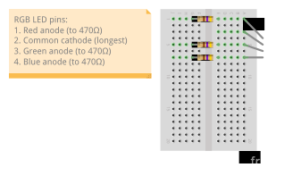

In this lab exercise, we'll practice using pulse width modulation (PWM), to control the average output voltage of a GPIO output pin and to work with other parts that require a PWM signal, like servo motors and piezo buzzers. We will also practice debugging circuits that use pulse width.


\newpage 

## Notes

* In this lab, you will create some breadboard circuits with exposed pins and wires. Please be especially careful not to accidentally create connections that shouldn't be connected (e.g. short circuits). Also, check your work carefully before connecting any breadboard circuit to a board, to avoid damaging the board.
* You will submit your lab work in Gradescope. You will upload screenshots/photos and answer some questions as described in the Gradescope assignment. You do not have to write anything else (e.g. no description of procedure, etc.) 
* Read each subsection of this lab manual in its entirety before you start following the instructions in it. Some instructions are modified by explanations that come afterwards.
* Although you may work with a partner, this collaboration is limited to discussion and comparison. Your partner is not allowed to construct or modify your circuit, log in to your Pi, or run commands or write code on your Pi. Similarly, you are not allowed to do these things for your partner. 
* For your lab report, you must submit data, code, screenshots, and photos from your own experiment. You are not allowed to use your lab partner's data, code, screenshots, or photos.
* For any question in the lab report that is marked "Individual work", you should *not* collaborate with your lab partner or anyone else (even via discussion). You can use your notes, the lab manual, or the lecture slides and video to help you answer these questions.


## Parts


Find these parts, and set them aside until you need them:

* Pi, SD card, and power supply. You can insert the SD card, connect the power supply, and log in to your Pi over SSH.
* Breadboard and jumper cables
* Analog Discovery 2
* 10mm RGB LED
* Three 470Ω resistors and three 220Ω resistors
* Micro servo motor

(You kit has a piezo buzzer and some other assorted resistors, but we won't use them today.)


### RGB LED

An RGB LED has three small LEDs inside it: a red one, a green one, and a blue one. The bulb may be "diffused", or frosted, so that when more than one of the LEDs is on, the colors will appear to blend together. If the bulb is clear, it is easier to distinguish the individual LEDs.

It comes in two main variations:

* Common cathode: one cathode and three anodes, one for each color. (The RGB LED in our kit is common cathode.)
* Common anode: one anode and three cathodes, one for each color. 

We can create a "mixed" color by applying a pulse width modulation (PWM) 
signal to the three color pins; the color of the LED will depend on the duty cycle
of each signal. For example, we can create an aqua color by applying a high duty cycle
PWM signal to the green and blue pins, and a low duty cycle PWM signal to the red pin.

### Servo motor

Servo motors are used for angular positioning. A standard servo is supposed to turn 90° in either direction, for 180° of range; in practice, many servo motors won't get the full range. You might use a servo motor to move a robot arm, or to control a camera angle.

Inside the case, a servo motor has:

* a small DC motor. When a voltage is applied, this motor can spin fast, but has very low torque (ability to move things).
* several stages of gears (plastic or metal). These are fitted to the motor shaft, so that at the output, the speed is reduced but the torque is increased.
* a potentiometer.
* a control circuit.

When the motor moves, it turns the potentiometer wiper, so that the output of the potentiometer varies according to the motor position. The control circuit compares the position according to the potentiometer output and your desired position according to the control signal, and moves the motor until they match.

Most servo motors use the same standard control signal: a PWM signal with a 20ms period, and the pulse width varies between 1-2ms to determine the angle.


### Piezo buzzer

A piezo is a component made of piezoelectric material, which generates a voltage when the material is deformed. It also works the other way - the material deforms when a voltage is applied to it. This property can be used to generate audible sound from a piezo element, by applying a time-varying voltage so that the material moves and creates sound waves.

A piezo buzzer is known as a *passive buzzer*. Another kind of buzzer, called an *active buzzer*, includes all the circuitry necessary to "drive" the buzzer on the component, so it only needs a DC voltage to turn on. However, with an active buzzer we cannot control the pitch of the sound. A passive buzzer (like the one used in this lab) requires a time-varying signal to generate a tone, but we can control the pitch of the sound by changing the frequency of the drive signal.

Since the piezo itself generates a voltage, it's important to be careful when working with it in a circuit. Resistors and diodes in various configurations can be used to prevent any voltage generated by the piezo from creating an overvoltage condition at a GPIO pin, for example. We will not use any diodes in our circuit today, so it's important to take other steps to protect your GPIO pins. While the piezo is connected to your circuit:

* do not press or hit the piezo
* do not drop the piezo
* avoid large vibrations (i.e. don't bang the table that the piezo is on)

## Preparation

### Prepare a directory

On your Pi, create a new directory in which you'll save all the code you use in this lab:

```
mkdir ~/lab-pwm
```


## RGB LED

### Preparing your circuit - RGB LED

You willl need:

* One breadboard (any size)
* One RGB LED
* Three 470Ω resistors (you may change the resistor values later, but use these to start)
* Jumper cables


### Use Software PWM in Python

Next, we'll practice using PWM in Python. We'll try two "types" of PWM:

* Software PWM, which uses the pin in output mode and requires the CPU to toggle it on and off at the desired times
* Hardware PWM, which uses the PWM peripheral built in to the Raspberry Pi (but only on supported pins)


With software PWM, we configure the pin as a regular GPIO output, then toggle it high and low to create a PWM signal. We can generate a software PWM signal on any pin.


Create a new file inside the `lab-pwm` directory:

```
cd ~/lab-pwm
nano pwm-soft.py
```

Put the following code in this file. This code will start a software PWM signal on BCM pin 13, with a 50 Hz frequency and a 50% duty cycle:

```python
import RPi.GPIO as GPIO
import time

pwm_pin = 13

GPIO.setmode(GPIO.BCM)

GPIO.setup(pwm_pin, GPIO.OUT)
# first arg is pin number, second is frequency in Hz
pwm_out = GPIO.PWM(pwm_pin, 50)
# argument is duty cycle, out of 100 parts
pwm_out.start(50)

# observe output for 60 seconds
time.sleep(120)

GPIO.cleanup()
```

Run it with

```
python3 pwm-soft.py
```

While your `pwm-soft.py` script is running, open a second terminal window on the Pi and run

```
gpio-readall
```

and note the state of BCM pin 13 - it should be in output mode.

The RPi.GPIO library used **software PWM** - i.e. rapidly toggling GPIO outputs on and off to create a PWM signal. While this enables us to use *any* GPIO pin for PWM output, it also uses a lot of CPU. Run

```
htop
```

to see the overall CPU usage (in a bar graph near the top) and a list of the processes using CPU - look for the Python process and the `pigpiod` processes, in particular. How much CPU (expressed as a percent) is used overall, and how much by the Python process? Take a screenshot for your lab report. (Make sure the screenshot reflects a "typical" value and not an extreme but transient value.) Use `q` to quit the `htop` process when you are finished.


Modify the Python script to increase the PWM frequency to 500Hz, then to 5KHz. What do you observe (in terms of CPU usage as measured by `htop`) as you increase the frequency? Take a screenshot for your lab report. (Make sure to give it a moment to "settle" after opening `htop`!)

---

**Lab report**: As you increase the frequency of a software PWM signal, the CPU usage increases. Use screenshots of `htop` output to demonstrate this effect (make sure to indicate on each screenshot what PWM frequency it is from). Describe your observations (with specific reference to the screenshots), and explain.


**Lab report**: Show the `gpio readall` output while the software PWM script is running. What mode is BCM pin 13 in?

---

### Observe PWM signal in `piscope`

The best way to debug PWM signals is visually, so let's do that now! In `pwm-soft.py`, set the frequency of the signal back to 50Hz. Then run `piscope` to see the PWM output:

* Open a VNC connection to your Pi
* In the terminal in the VNC session, run `sudo pigpiod`
* In the terminal in the VNC session, run `piscope`
* Find the PWM line on BCM pin 13


While the `pwm-soft.py` script is running, zoom in on the `piscope` output so that you can accurately measure the timing on each pin, and take a screenshot for your lab report. Annotate the screenshot to show how you would measure the PWM parameters: period, duty cycle, and pulse width.

Also, try setting

* a 10% duty cycle with 20ms period 
* a 90% duty cycle with 20ms period
* a 50% duty cycle with 2ms period

and for each, take a `piscope` screenshot. Annotate each screenshot to show the period, duty cycle, and pulse width.

Then, try setting it back to 50% duty cycle and gradually increase the frequency of the signal until it becomes noticeably "messy". (You can try the 500Hz, then 5KHz frequencies, as you did earlier; but you can also try other frequencies if you like.) Take screenshots for your lab report.

When you are finished with this section, exit `piscope` using the X in the top right corner, and *then* close your VNC session. 

---

**Lab report**: Show a screenshot of the `piscope` display, annotated to show how you measure the period, duty cycle, and pulse width, for each of the following cases:

* 50% duty cycle with 20ms period
* 10% duty cycle with 20ms period 
* 90% duty cycle with 20ms period
* 50% duty cycle with 2ms period

**Lab report**: As you increase the frequency of a software PWM signal, the CPU is no longer able to satisfy the specific timing requests as precisely, and so the PWM output becomes more "messy". Use screenshots of the `piscope` window to demonstrate this effect (make sure to indicate on each screenshot what PWM frequency it is from). Describe your observations (with specific reference to the screenshots), and explain.

---


### Use Hardware PWM in Python

Alternatively, we can use the `pigpio` library in Python to configure hardware PWM on the Pi.

Create a new file:

```
cd ~/lab-pwm
nano pwm-hard.py
```

with the following contents: 

```python
import pigpio
import time

pwm_pin = 13
pi = pigpio.pi()
# first arg is pin number,
# second arg is frequency in Hz,
# third arg is number of ON units out of 1000000
pi.hardware_PWM(pwm_pin, 50, 500000) 

time.sleep(120)
```


To use the `pigpio` library, you must have `pigpiod` running. You may have started it already for `piscope`, but if not, run

```
sudo pigpiod
```

Then, run your Python script with

```
python3 pwm-hard.py
```


**Note**: If your `pigpio` program doesn't work as expected, you can try restarting `pigpiod`:

```
sudo killall pigpiod
sudo pigpiod
```

While your `pwm-hard.py` script is running, open a second terminal window on the Pi and run

```
gpio-readall
```

and note the state of BCM pin 13 - it should now be in alternate functionality mode (in contrast to the software PWM example, where it was in output mode).


Change the frequency of the PWM signal, to the same values you tested in the previous section: 500Hz, then 5kHZ.  Use `htop` again to check the CPU usage for each frequency (make sure to give it a moment to "settle" after opening `htop`!). However, since the `pigpio` library also uses the `pigpiod` daemon, to check CPU usage with hardware PWM you should look at the CPU usage of both `python` and `pigpiod` while your Python script is running.


Now, open `piscope` again. For each frequency you considered, take a screenshot of the `piscope` display showing about 10-20 cycles of PWM pulses. Is the high-frequency signal also less "clean" in the hardware PWM case?

---

**Lab report**: As you increase the frequency of a hardware PWM signal, the CPU usage is not affected. Use screenshots of `htop` output to demonstrate this (make sure to indicate on each screenshot what PWM frequency it is from). Describe your observations (with specific reference to the screenshots), and explain.

**Lab report**: As you increase the frequency of a hardware PWM signal, the PWM peripheral is still able to produce a "clean" output signal despite the tighter time constraints. Use screenshots of the `piscope` window to demonstrate this (make sure to indicate on each screenshot what PWM frequency it is from). Describe your observations (with specific reference to the screenshots), and explain.

**Lab report**: Show the `gpio-readall` output while the hardware PWM script is running. What mode is BCM pin 13 in? Annotate your screenshot to highlight this value.

**Lab report**: Compare the behavior of the software PWM and hardware PWM script: is the PWM signal still generated on the output line when the script finishes running after 120 seconds?

---

\newpage


### PWM signal to control RGB LED


Now that we understand how to configure a PWM output, we can use it to set the color of an RGB LED.


The RGB LED is a common cathode 10mm LED with a diffused bulb, and forward voltage of around 2.0V on the red pin and 3.0V on the blue and green pins.

Use the following diagram to carefully identify the pins on your RGB LED. The longest pin is the common cathode (negative LED terminal for all three colors), and from there, you can identify the other pins (one positive LED terminal for each color):

{ width=250px }


Configure the LED and current-limiting resistors in the breadboard, as shown in the diagram.

{ width=450px }


Next, connect your Raspberry Pi to the RGB LED:

{ width=450px }

* Connect **GND** to the common cathode pin. Use a brown or black wire for the GND connection (if you have one), to make it easier to "read" your breadboard circuit.
* Connect the red pin to **BCM 18** (through the series resistor). Use a red wire for this connection (if you have one), to make it easier to "read" your breadboard circuit.
* Connect the green pin to **BCM 12** (through the series resistor). Use a green wire for this connection (if you have one), to make it easier to "read" your breadboard circuit.
* Connect the blue pin to **BCM 13** (through the series resistor). Use a blue wire for this connection (if you have one), to make it easier to "read" your breadboard circuit.

Test your circuit by configuring the three GPIO pins to output mode. Then, write HIGH or LOW values to turn the RGB LED red, then green, then blue in turn.


Create a new file:

```
cd ~/lab-pwm
nano pwm-rgb.py
```

and in this file, write Python code to make the RGB LED gradually change its color from red, to purple, to blue, to purple, and back to red. Make sure the transition appears smooth!


---

**Lab report**: Show your `pwm-rgb.py` script. Also upload a short (less than 30 seconds) video of your LED while the script is running.

---


## Servo motor

Some components use a very specific PWM signal as a control signal. For example, a servo motor is typically controlled by sending a PWM signal with 20ms period, and pulse width between 1-2ms to set the position of the servo. A standard servo can rotate from 0 to 180 degrees (i.e. 90 degrees in each direction). 

First, make sure that pin 13 is turned "off", by setting it to input mode. Open an interactive Python terminal with

```
python3
```

then run

```python
import RPi.GPIO as GPIO
GPIO.setmode(GPIO.BCM)
GPIO.setup(13, GPIO.IN)
```

Your servo will have come in a small bag with a variety of plastic attachments, called "horns", that can fit on top. Attach one of the horns with two long ends (not the X-shaped horn) to the top of the servo, so that you can see how its position changes according to the control signal that you send to the servo.

Then, connect your servo to your Pi. You can connect it directly using jumper cables from the servo to the Pi, without a breadboard. But, be very carefully when connecting or disconnecting these cables so that you do not accidentally create a short circuit! Always disconnect the end that's plugged in to your Pi *first*; only then disconnect the end that's plugged in to the servo.

* The brown wire on your servo should be connected to GND on your Pi.
* The red (supply voltage) wire on your servo should be connected to 5V on your Pi. (The servo may move a little when you first connect it.)
* The orange (control signal) wire on your servo should be connected to BCM 13 (PWM 1) on your Pi. 

Note that even though the servo runs on 5V power, the 3.3V signal from your Pi should be sufficient for the control signal.


Next, configure pin 13 in PWM mode, with a 20ms period and 1.5ms pulse width. You can re-use your `pwm-hard.py` script for this.


Then, vary the PWM duty cycle so that the pulse width varies from 1ms to 2ms. Observe the position of the servo "horn" as you change the pulse width. 

**Note**: if your servo is buzzing or clicking when you set a pulse width close to either extreme (1 or 2ms), it's struggling to get to a position that it can't quite reach. Don't let it run like this for too long, or you could damage it; set the pulse width to a more moderate value.

Now, you are going to write a function that can be used to move the servo to the desired position. Create a new file

```
cd ~/lab-pwm
nano pwm-servo.py
```

and place the following code inside:

```python
import pigpio
import time

pwm_pin = 13
pi = pigpio.pi()

def position_servo(angle):
    pass

position_servo(90)
time.sleep(5)
position_servo(45)
time.sleep(5)
position_servo(25)
time.sleep(5)
position_servo(125)
time.sleep(5)
position_servo(90)
```

Then, fill in the `position_servo` function so that the servo motor moves to the indicated position when the function is called.

---

**Lab report**: Upload your `pwm-servo.py` with the `position_servo` function implemented. For full credit, your code should be neat, well documented, and follow best practices for readability and maintainability.

---