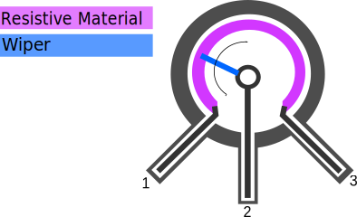
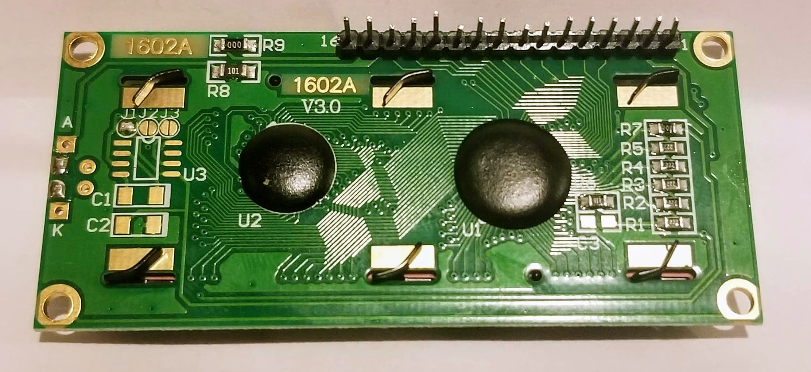
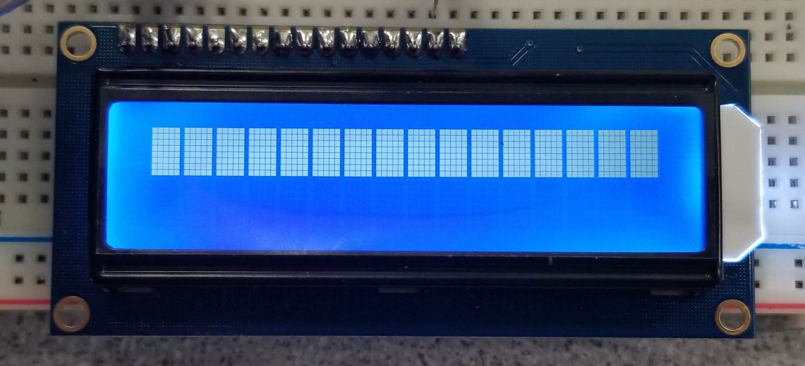
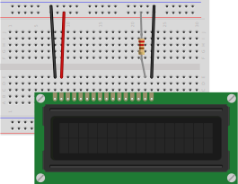
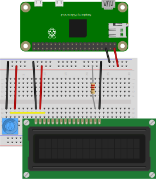
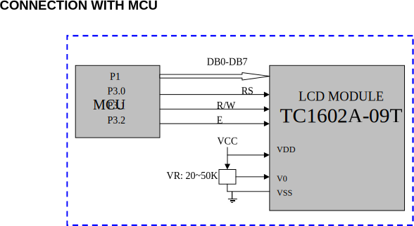
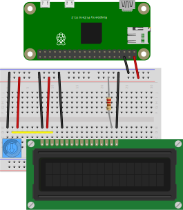
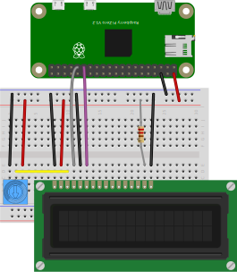
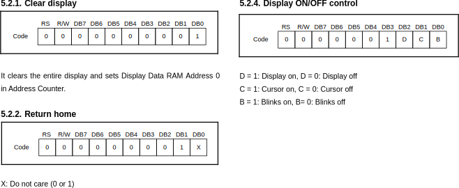

# Parallel communication

In this lab, we'll learn how to connect external parts to a single board computer using a digital communication bus, specifically: using parallel communication. At the end of this lab, you should be able to:

* Connect a peripheral device or sensor to a Raspberry Pi for parallel communication.
* Use a datasheet to identify the registers, and values to write to those registers, to configure and use a peripheral device or sensor.
* Inspect the digital waveform transmitted over a bus, and identify important features (most and least significant bits, start condition, address, clock, etc.)


## Notes

* In this lab, you will create some breadboard circuits with exposed pins and wires. Please be especially careful not to accidentally create connections that shouldn't be connected (e.g. short circuits). Also, check your work carefully before connecting any breadboard circuit to a board, to avoid damaging the board.
* Read each subsection of this lab manual in its entirety before you start following the instructions in it. Some instructions are modified by explanations that come afterwards.
* Although you may work with a partner, this collaboration is limited to discussion. Your partner is not allowed to construct or modify your circuit, log in to your Pi, or run commands or write code on your Pi. Similarly, you are not allowed to do these things for your partner. (You *are* encouraged to collaborate by screen-sharing or showing video of your circuit to debug and discuss problems together.)
* For your lab report, you must submit data, code, and screenshots from your own experiment. You are not allowed to use your lab partner's data, code, or screenshots.
* For any question in the lab report that is marked "Individual work", you should *not* collaborate with your lab partner or anyone else (even via discussion). You can use your notes, the lab manual, or the lecture slides and video to help you answer these questions.

\newpage

## Parts


Find these parts in your kit, and set them aside until you need them:

* Pi, SD card, and power supply. You can insert the SD card, connect the power supply, and log in to your Pi over SSH.
* Breadboard and jumper cables
* Assorted resistors (in a plastic bag)
* Trimmer potentiometer (with blue plastic knob)
* 16x2 character LCD

Note that you'll need these parts again, including small parts like cables and resistors, so carefully return everything to their bags when you're finished.


### Trimmer potentiometer

A trimpot or trimmer potentiometer is a potentiometer that is used to make adjustments in a circuit. For example, you might use a trimpot to tune the sensitivity of a passive infrared sensor, or to adjust the volume in an audio circuit.

{ width=30% }

The potentiometer has a strip of resistive material connected across the two outer terminals. The total resistance of this material is fixed. 

The middle terminal is connected to a "wiper", that divides the resistive material into two parts. When you turn the knob, you adjust the position of the wiper, and in turn, how much of the total resistance is between the first pin and middle pin vs. how much is between the middle pin and outer pin.

---

**Key potentiometer properties**:

* The resistance across the two outer pins, pin 1 and pin 3, is fixed.
* The sum of the resistance between pin 1 and pin 2, and between pin 2 and pin 3, is equal to the resistance across pin 1 and pin 3.
* When you connect a voltage across pin 1 and pin 3 (the two outer pins), you can create a variable output voltage output at pin 2 by turning the knob. In this configuration, the potentiometer works as a voltage divider.

---


The resistance marked on the trimpot is the total resistance across the two outer terminals. The resistance is not marked using color codes. Instead, the trimpot is labeled with a three-digit number. (Surface-mount resistors are also labeled this way). The first two digits indicate the resistance, and the last digit indicates the power of ten by which to multiply to get the resistor value.

Your trimpot should have a "103" marking, indicating a 10kΩ resistance across the two outer terminals. (It may also be marked with a model number, and a "T" designation indicating that it has a knob attached.)


### 16x2 character LCD

The 16x2 character LCD is a small display that can show two lines of text or other symbols, with 16 characters on each line.

This module actually includes multiple parts on a single PCB. Here's a block diagram that shows how it all works together:

)](images/lcd-16x2-block.pdf){ width=70% }

We'll review each of these parts in turn.

First, the LCD panel and LED backlight. The following figure shows a disassembled LCD panel and backlight. A metal frame (A) is positioned over the LCD "glass" (B). Between the LCD and the PCB (G) is a reflector (F), lightguide (E) and LEDs mounted to small PCD (D), and a diffuser (C). These layers work together to "spread" the light across the back of the LCD panel.


)](images/lcd1602.jpg){ width=80% }

The backlight is powered by providing power across the positive and negative pins of the LED, which are connected to pins 15 and 16 on the header. 

On some boards, a series resistor may be connected between pin 15 and the positive terminal of the backlight LED, to limit current to the LED. For example, in the following image, you can see that there is a PCB trace connecting pin 15 in the header to the resistor labeled R8 (and with a 101 marking on it, indicating 100Ω resistance), and a trace connecting the other end of the resistor to the pin marked "A" - the anode of the backlight LED.


{ width=80% }

However, not all LCD modules include that current limiting resistor between the LED supply voltage pins and the LED. To be safe, we will use an external resistor to limit current to the backlight.

In the LCD glass itself, there are a series of electrodes arranged in horizontal and vertical lines. At the intersection of lines, the electric field from the voltage applied to the electrodes affects the polarization of light through the liquid crystal material contained in the glass, making it appear either dark or transparent.

For the 16x2 character LCD, each character is created from a 5x8 matrix - i.e. 8 rows of electrodes and 5 columns. In the following photograph, you can see the 5x8 matrix for each position in the top line.

{ width=80% }

\newpage 

With a 5x8 matrix for each character, and 16x2 characters, it takes a lot of connections to control the LCD! That's the main function of the IC labeled "Driving IC" in the block diagram. The "control IC", which is the main "brain" of the module, doesn't have enough pins to control all of the electrodes. The "driving IC" expands the number of outputs available, so that we can control each electrode.

The two ICs are located underneath the black epoxy "blobs" that you can see on the back of the module. 

We mentioned that the "brain" of the module is the control IC. A popular control IC for these modules is the HD44780. You may also see LCD modules as being "HD44780-compatible", which means that they use the same command set as the HD44780 IC, and the same parallel communication interface. We'll discuss the HD44780 IC in more detail in the rest of this document.


---

**Variations on the 16x2 character LCD**: There are a couple of widely available LCD modules that are very similar to the one used in this lab:

* 20x4 character LCD. This also has 16 pins, but has a larger display area. The 20x4 character LCD can be used as a drop-in replacement for the 16x2 character LCD, although code written for the 16x2 LCD may not make full use of the display area.
* A 16x2 character LCD with an RGB backlight, with 18 pins.  These have a common anode RGB LED for the backlight, where the positive voltage is applied to one anode, and the color of the light can be controlled by applying LOW voltage signal to one or more of the cathodes. You can use an RGB-backlit as a drop-in replacement for a regular 16x2 character LCD; just don't use pin 17 and pin 18.


---

\newpage

## Parallel communication with 16x2 character LCD


In this exercise, we will practice using a parallel communication interface with the 16x2 character LCD.


### Pinout of 16x2 character LCD

The standard 16x2 character LCD has 16 pins. Page 5 of the LCD module datasheet has the following table, which lists the pins and their functions:

{width=88%}

On some modules, every pin is labeled. On other modules, only pin 1 and pin 16 are labeled. Find the pin labels on your LCD module, and make sure you can identify each pin.


### Power to LCD module

Our first step in working with any peripheral device will be to figure out how to power it! From the pin functions table above, we know that pins 1 and 2 are used to power the module, pin 3 is used to adjust power to the LCD glass, and pins 15 and 16 are used to power the LED backlight. However, we still need to find out what level of supply voltage is required.


For most parts, the datasheet will have a "DC Electrical Characteristics" or similar section with important information on how to power the part. Here's the relevant table from page 5 of the LCD module datasheet:

{width=88%}

\newpage


According to the datasheet, the LCD expects a 5V supply voltage, so we'll use the 5V supply rail on the Pi. (The 5V power supply rail should also be able to supply the required current for the ICs, which is on the order of 10s of mA as per the datasheet.)

The LED backlight is powered separately from the rest of the connection. Here is the "LED Backlight Characteristics" table, from page 5 of the LCD module datasheet:

{width=88%}

The LED backlight has a forward voltage of approximately 3.2V, and the current through the LED should not exceed 30mA. We'll use a 220Ω resistor in series with the 5V supply voltage to limit the LED backlight current to (5-3.2)V/220Ω. 

(Your LCD module may already have a small current-limiting resistor on the PCB, but we'll add our own just to be safe. Adding resistance will reduce the current, making the backlight dimmer, but the backlight should be more than bright enough for our purposes anyway

Now that we know how to power the LCD and its backlight, let's connect it to the Pi. For convenience, we can use the power rails on the side of the breadboard. The power rails are connected as columns, rather than as rows, and are a helpful way to connect circuits where several connections to the supply voltage and GND are required. We will use the red power rail (running along the red stripe) as the 5V rail, and the blue/black power rail (running along the blue/black strip) for GND.

Connect your LCD display to the supply voltage and GND rails on the breadboard, as shown below:

{width=50%}

* Pin 1 (VSS) and pin 16 (BL- or K) are connected to the ground rail.
* Pin 2 (VDD) is connected to the 5V power rail. 
* Pin 16 (BL+/A) is connected to the 5V power rail through a 220Ω series resistor.

Then, you can connect a GND pin from your Pi to the GND rail, and a 5V pin from your Pi to the 5V power rail. Be careful to avoid accidental short circuits!

\newpage


### Contrast adjust 

Next, we'll add the contrast adjust circuit. This circuit is used to control the voltage level to the LCD glass, which determines the contrast between the liquid crystal and the transparent surroundings.

Page 6 in the LCD module datasheet shows how to connect a variable resistor (a potentiometer) in order to adjust the contrast of the LCD display. (Although the image shows a 20-50kΩ potentiometer, our 10kΩ potentiometer will also work - it will just draw a little more current. Add your potentiometer to the breadboard circuit as shown in the diagram.)

{width=84%}

The diagram shows the potentiometer connected to the VDD and VSS pins on the LCD module, but it doesn't have to be directly connected - it just has to be connected to the same supply voltage and GND reference as the LCD module. Turn the knob on the potentiometer to a middle position, to start. Connect the outside pins of the potentiometer to the ground rail and 5V power rail, respectively. (It doesn't matter which of the two outside pins is at GND and which is at 5V - the trimpot is symmetric.) The middle pin of the potentiometer is connected to LCD pin 3 (V0). 


{width=40%}


Carefully turn the knob on the trimpot until you see a row of white squares appear on your LCD display, as illustrated. You can further adjust the contrast later, after you write some text to the display.

{width=45%}


### Parallel communication interface

Now, we are ready to connect the Pi to the parallel communication interface on the LCD. We'll use the Pi as the "controller", to send commands and data over the parallel communication interface.

Page 6 of the datasheet shows how the LCD is meant to be connected to the controller ("MCU" is an abbreviation of "microcontroller unit").  Although it shows the remaining pins connected to the controller, we're not going to connect it like this just yet!

{width=70%}

We know that the pins on the Pi are not 5V tolerant - we can't connect a 5V signal to the GPIO pins. The LCD module is powered at 5V, and any output from the module will also be 5V. To safely connect the Pi, we need to either:

* add some additional circuitry to "translate" between the Pi's 3.3V GPIO pins and the LCD module's control and data pins, or
* make sure that the Pi only *writes* to the LCD module's control and data pins and never *reads* from them. (The Pi can write 3.3V signals to the LCD if a 3.3V signal is enough to register as HIGH at the LCD module, which it usually is.)

Since we only need to *write* to the LCD for our application, not *read* from it, we'll use the second approach. To make sure that the LCD module only receives from the Pi, we'll tie the R/W control pin on the LCD module to GND. According to the "Pin functions" table shown earlier, this will keep the LCD module in "write" mode, i.e. the controller outputs to the LCD module but never the reverse.

{width=40%}

On your breadboard circuit, connect the R/W pin to the GND rail. Now, we can safely connect the rest of the parallel communication interface. The remaining control pins, RS and E, should be connected to GPIO pins on the Pi. We'll use pin 6 and pin 5, respectively. 

{width=40%}

\newpage

From the "Pin functions" table shown earlier, we know what each of the control pins do:

* **RS** is used to select whether we are writing data to be displayed on the LCD (HIGH), or a command/instruction to the control IC (LOW).  We will connect this to **GPIO6** on the Pi, and then we'll configure it as a GPIO output pin so that we can toggle between data and command mode.
* **RW** is used to select whether to read from the device (HIGH), or write to it (LOW). Since we only want to write to the device - we can't read from the device on the Pi or BBB GPIO pins, because its 5V signal would damage the GPIO and the SBC - we will permanently connect this pin to 
**GND** on our breadboard.
* **E** is an enable signal used whenever we read or write data. We will connect this to **GPIO5** on the Pi, and then we'll configure it as a GPIO output pin.

The timing diagram for write operations, on page 7 of the LCD module datasheet, further clarifies the role of these control pins:

{width=80%}

We can see that **E** acts as a clock signal, pulsing each time a new bit is transmitted on the data lines.

Finally, we need to set up the data pins. The module supports two modes of operation:


* 8-bit mode, where 8 of the data lines are used. Each byte (8 bits) is sent in parallel, one bit on each of the 8 lines.
* 4-bit mode, where only 4 of the data lines are used. Each byte (8 bits) is sent as 2 sequential groups of 4 bits each (but this takes twice as long).

as explained at the bottom of page 6 in the LCD module datasheet:

{width=88%}

\newpage

This further clarifies that for 4-bit mode, we use the four data pins labeled **DB4**, **DB5**, **DB6**, **DB7**. We'll connect these as follows:

* **DB4** to **GPIO25** 
* **DB5** to **GPIO24** 
* **DB6** to **GPIO23** 
* **DB7** to **GPIO22** 

Data lines **DB0**, **DB1**, **DB2**, and **DB3** should be left unconnected. Now our Pi should be connected to the LCD module as shown in the diagram.


\newpage


### Prepare source code directories on your Pi

Open an SSH session on your Pi, and create a directory for the source code you'll use in this lab:

```
mkdir ~/lab-parallel
cd ~/lab-parallel
```

### Write commands and characters to the display

To use the LCD module, we'll need to send commands and characters to the display:

* Commands affect the operation of the display - for example, should the display be enabled or disabled, should there be a visible cursor or not, where should the next characters be written.
* Characters will appear on the display module.

To learn about the commands available, we'll refer to the datasheet heavily. I will use the SPLC780 datasheet - it's a HD44780-compatible IC, and has a much more readable datasheet. 

Refer to page 6 of this datasheet, where it starts to define some of the commands. Here are a few examples:



* The first example, which shows how to clear the display, is fairly straightforward - we write the bit array `00000001` to the display. When writing any command, including this one, the R/W control pin should be set LOW (ours is permanently tied to GND), and the RS control pin should be LOW.
* The second example shows how to return the cursor to the "home" position - the first character on the first line. This example shows a "don't care" bit. To send this command, we could send the bit array `00000011` *or* the bit array `00000010` - the least significant bit doesn't matter.
* The third example shows how in some commands, we select the value of the bits in the bit array according to our desired configuration. For example, to set the display ON with cursor ON and blinking, we would send `00001111`, but to have the display ON with no cursor, we would send `00001100`.


Before we can write text to the LCD display, we need to initialize the display by sending commands to configure its operation. The datasheet for the control IC shows a "typical" procedure used to initialize the display in various modes. For example, the SPLC780 datasheet shows the following procedure for initializing the display in 4-bit mode:


We'll follow a similar procedure to initialize our display into 4-bit mode. While keeping the RS line LOW (for command mode), we send the 4-bit code `0011` three times. Then, we send the 4-bit code `0010`. This is equivalent to sending:

* the bit array `00110011` 
* followed by the bit array `00110010`. 


After the display is in 4-bit mode, we will send some other commands to the display:

* `00001100` to turn the display on, with no cursor.
* `00000110` to set the entry mode (see 5.3.2 in datasheet). We will configure the entry mode so that the cursor moves from left to right, and the display itself does not shift.
* `00000001` to clear the display before we write any characters to it.


### Source code for `send-to-lcd.py`

Now that we have some idea of how we will initialize our display, let's write some code.

Open a new file:

```
nano ~/lab-parallel/send-to-lcd.py
```

At the top, add import statements, and configure the RPi.GPIO library:

```
import RPi.GPIO as GPIO
import time
import sys

GPIO.setwarnings(False)
GPIO.setmode(GPIO.BCM)       # Use BCM GPIO numbers
```

Then, define some constants:

```
# GPIO pin to LCD pin mapping
LCD_RS = 6
LCD_E  = 5
LCD_D4 = 25
LCD_D5 = 24
LCD_D6 = 23
LCD_D7 = 22

# Define state of RS pin in character and command mode
LCD_CHR = GPIO.HIGH   # High in data (character) mode
LCD_CMD = GPIO.LOW    # Low in instruction (command) mode

# Important commands
LCD_CLEAR = [0,0,0,0,0,0,0,1]
LCD_D_OFF = [0,0,0,0,1,0,0,0]
LCD_4BIT1 = [0,0,1,1,0,0,1,1]
LCD_4BIT2 = [0,0,1,1,0,0,1,0]
LCD_ON_NC = [0,0,0,0,1,1,0,0]
LCD_ENTRY = [0,0,0,0,0,1,1,0]

# Timing constants
E_PULSE = 0.0005
E_DELAY = 0.0005
```


Then, add the `char_to_arr` function and `write_arr_4bit` function, which are on NYU Classes.

Finally, write your own functions:

* `setup_lcd` should configure all of the pins in output mode. (Use the constants defined at the top of your script instead of hard-coding pin numbers inside your function). Then, it should initialize the LCD by sending the commands described above. Use the `write_arr_4bit` function and the constants you defined at the top of your script.
* `string_to_lcd` should take a string as input, and write the string to the LCD display.


After you write these funtions, place the following code at the end of your script to test your code:

```
try:
    setup_lcd()
    time.sleep(0.005)
    string_to_lcd('Hello CompE DP1')
    time.sleep(600)
except KeyboardInterrupt:
    pass
finally:
    write_arr_4bit(LCD_CLEAR, LCD_CMD) # clear display
    write_arr_4bit(LCD_D_OFF, LCD_CMD) # 0000 1000 Display off - 5.2.4 in datasheet
    GPIO.cleanup()
```

Modify this code to show your net ID on the display, instead of the "Hello" message. Take a photo for your lap report.

---

**Lab report**: Upload your `send-to-lcd.py` script.

**Lab report**: Show a photo of the LCD display, with your net ID on it.


---


### Inspect communication signal in piscope

Run 

```
sudo pigpiod
```

if it is not already running, and open PiScope:

```
piscope
```

Leave PiScope open to monitor GPIO lines. Then, run your script to write a message to the LCD module.

Watch what happens on each line as we initialize and write data to the display. (You'll use the zoom buttons and arrow buttons in the menu bar to more closely examine the signal each time we send something to the display.) Verify that the message appears on the display, and check the output in `piscope`. Take a screenshot of the initialization process in `piscope` for your lab report. 

---

**Lab report** (individual work): Annotate the screenshot of the initialization process from `piscope`. Label the **RS** line, and show what its value should be during the initialization process. Label the **E** line, and explain its function. Then, draw a square around each complete _byte_ of instruction sent to the display, write the byte as an 8-bit binary number, and explain what it does.

---


### Browser-based UI to send text to the display

Finally, we'll see how to use a browser-based UI to send text to the display.

Create a new directory called `flask-app` in your `lab-parallel` directory, then navigate to it:

```
mkdir ~/lab-parallel/flask-app
cd ~/lab-parallel/flask-app
```

We'll use the `virtualhat` library again - download and install it (for Python 2 and Python 3) with

```
git clone https://github.com/ffund/virtualhat
cd virtualhat
sudo python2 setup.py install
sudo python3 setup.py install
cd ~/lab-parallel/flask-app
```


Create a `templates` directory, and inside it, create an `index.html` file:

```
mkdir ~/lab-parallel/flask-app/templates
nano ~/lab-parallel/flask-app/templates/index.html
```

Put the following HTML inside this file:

```
<!DOCTYPE html>
   <head>
    <title>Hello Flask! (LCD)</title>
    <link rel="stylesheet" href="https://stackpath.bootstrapcdn.com/bootstrap/4.3.1/css/bootstrap.min.css">
   </head>
   <body>
     <div class="container">
       <h1>Input text to display on LCD</h1>
      <form method="POST">
        <div class="form-group">
          <input class="form-control" name="text">
        </div>
        <button type="submit" class="btn btn-primary">Submit</button>
      </form>
     </div>
   </body>
</html>
```

This form has a text input field. When you type some text into this field and click the Submit button, the text will be processed inside your Flask app.

\newpage

Finally, create your Flask app:

```
nano ~/lab-parallel/flask-app/flask-lcd.py
```

with the following contents:

```
from flask import Flask, request, render_template
import virtualhat

app = Flask(__name__)

@app.route('/')
def show_form():
    return render_template('index.html')

@app.route('/', methods=['POST'])
def process_text():
    text = request.form['text']
    print(text)
    # do something here!
    return render_template('index.html')

if __name__ == "__main__":
    virtualhat.setup()
    app.run(host='0.0.0.0', port=80, debug=True, threaded=True)
```

You can run your flask app with

```
cd ~/lab-parallel/flask-app/
sudo python3 flask-lcd.py
```

Now, you should be able to view the Flask page in your browser. Open a browser on any device on the same network as your Pi, and in the address bar, type either the Pi's IP address, or the hostname you use to access the Pi over SSH. Once you have verified that you can access this page, you can stop the Flask app with \keys{Ctrl+C}.


Your task is to *modify* the `virtualhat` library so that:

* When you call the `setup()` function, it will initialize your LCD display,
* When you receive a text input from the form, you'll send it to the LCD display. Add a new function `str_to_lcd` in the `virtualhat` library, and then edit your `flask-lcd.py` so that instead of printing the text input, you call:

```
virtualhat.str_to_lcd(text)
```

To modify the `virtualhat` library, navigate to the directory where the source code of the `virtualhat` library is located:

```
cd ~/lab-parallel/flask-app/virtualhat
```

and then open the `virtualhat.py` file for editing. 

```
nano virtualhat.py
```

After editing, you will have to re-install the library:


```
cd ~/lab-parallel/flask-app/virtualhat
sudo python2 setup.py install
sudo python3 setup.py install
```

to test your changes.


In your design, think about how you would handle various scenarios. 

* What happens if someone writes a very long string to the form, that doesn't fit on one line, or even on the entire display? You may have to use some additional command instructions to handle this case - you might want to use the command definitions

```
LCD_LINE_1 = [1,0,0,0,0,0,0,0] 
LCD_LINE_2 = [1,1,0,0,0,0,0,0] 
```

* What happens if someone submits a long string, then submits a short string - will the display be cleared in between? 

You can add comments in the source code to explain your design decisions.

---

**Lab report** Upload your modified `virtualhat.py` file.  (Note: you shouldn't have any changes in `flask-lcd.py`, except for adding one line of code to call `virtualhat.str_to_lcd(text)`.)

**Lab report**: Show a photograph of your LCD display after you enter the following message in the web form (substitute your own net ID):

```
Welcome to CompE DP1 (net ID)
```

Also show a photograph of your LCD display after you enter the following message in the web form:


```
The quick brown fox jumps over the lazy dog
```

Explain your design decisions - what did you decide the LCD should do with text that doesn't fit on the display? Why?

---