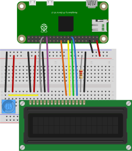

In this lab exercise, we'll learn how to connect external parts using a parallel communication vus. At the end of this lab, you should be able to:

* Connect a peripheral device or sensor to a Raspberry Pi using a parallel communication bus.
* Use a datasheet to identify the registers, and values to write to those registers, to configure and use a peripheral device or sensor.
* Inspect the digital waveform transmitted over a bus, and identify important features (most and least significant bits, start condition, address, clock, etc.)

\newpage

## Notes

* In this lab, you will create some breadboard circuits with exposed pins and wires. Please be especially careful not to accidentally create connections that shouldn't be connected (e.g. short circuits). Also, check your work carefully before connecting any breadboard circuit to a board, to avoid damaging the board.
* You will submit your lab work in Gradescope. You will upload screenshots/photos and answer some questions as described in the Gradescope assignment. You do not have to write anything else (e.g. no description of procedure, etc.) 
* Read each subsection of this lab manual in its entirety before you start following the instructions in it. Some instructions are modified by explanations that come afterwards.
* Although you may work with a partner, this collaboration is limited to discussion and comparison. Your partner is not allowed to construct or modify your circuit, log in to your Pi, or run commands or write code on your Pi. Similarly, you are not allowed to do these things for your partner. 
* For your lab report, you must submit data, code, screenshots, and photos from your own experiment. You are not allowed to use your lab partner's data, code, screenshots, or photos.
* For any question in the lab report that is marked "Individual work", you should *not* collaborate with your lab partner or anyone else (even via discussion). You can use your notes, the lab manual, or the lecture slides and video to help you answer these questions.

## Parts


Find these parts in your kit, and set them aside until you need them:

* Pi, SD card, and power supply. You can insert the SD card, connect the power supply, and log in to your Pi over SSH.
* Breadboard and jumper cables
* 220Ω resistor
* Trimmer potentiometer (with blue plastic knob)
* 16x2 character LCD


### Trimmer potentiometer

A trimpot or trimmer potentiometer is a potentiometer that is often used to make adjustments in a circuit. For example, you might use a trimpot to tune the sensitivity of a passive infrared sensor, or to adjust the volume in an audio circuit. Today, we'll use it to adjust the contrast of an LCD display.

{ width=150px }

The potentiometer has a strip of resistive material connected across the two outer terminals. The total resistance of this material is fixed. 

The middle terminal is connected to a "wiper", that divides the resistive material into two parts. When you turn the knob, you adjust the position of the wiper, and in turn, how much of the total resistance is between the first pin and middle pin vs. how much is between the middle pin and outer pin.

---

**Key potentiometer properties**:

* The resistance across the two outer pins, pin 1 and pin 3, is fixed.
* The sum of the resistance between pin 1 and pin 2, and between pin 2 and pin 3, is equal to the resistance across pin 1 and pin 3.
* When you connect a voltage across pin 1 and pin 3 (the two outer pins), you can create a variable output voltage output at pin 2 by turning the knob. In this configuration, the potentiometer works as a voltage divider.

---


The resistance marked on the trimpot is the total resistance across the two outer terminals. The resistance is not marked using color codes. Instead, the trimpot is labeled with a three-digit number. (Surface-mount resistors are also labeled this way). The first two digits indicate the resistance, and the last digit indicates the power of ten by which to multiply to get the resistor value.

Your trimpot should have a "103" marking, indicating a 10kΩ resistance across the two outer terminals. (It may also be marked with a model number, and a "T" designation indicating that it has a knob attached.)


### 16x2 character LCD

The 16x2 character LCD is a small display that can show two lines of text or other symbols, with 16 characters on each line.

This module actually includes multiple parts on a single PCB. Here's a block diagram that shows how it all works together:

)](images/lcd-16x2-block.pdf){ width=70% }

We'll review each of these parts in turn.

First, the LCD panel and LED backlight. The following figure shows a disassembled LCD panel and backlight. A metal frame (A) is positioned over the LCD "glass" (B). Between the LCD and the PCB (G) is a reflector (F), lightguide (E) and LEDs mounted to small PCD (D), and a diffuser (C). These layers work together to "spread" the light across the back of the LCD panel.


)](images/lcd1602.jpg){ width=80% }

The backlight is powered across the positive and negative pins of the LED, which are connected to pins 15 and 16 on the header. 

On some boards, a series resistor may be connected between pin 15 and the positive terminal of the backlight LED, to limit current to the LED. For example, in the following image, you can see that there is a PCB trace connecting pin 15 in the header to the resistor labeled R8 (and with a 101 marking on it, indicating 100Ω resistance), and a trace connecting the other end of the resistor to the pin marked "A" - the anode of the backlight LED.


{ width=80% }

However, not all LCD modules include that current limiting resistor between the LED supply voltage pins and the LED. To be safe, we will use an external resistor to limit current to the backlight.

In the LCD glass itself, there are a series of electrodes arranged in horizontal and vertical lines. At the intersection of lines, the electric field from the voltage applied to the electrodes affects the polarization of light through the liquid crystal material contained in the glass, making it appear either dark or transparent.

\newpage

For the 16x2 character LCD, each character is created from a 5x8 matrix - i.e. 8 rows of electrodes and 5 columns. In the following photograph, you can see the 5x8 matrix for each position in the top line.

{ width=80% }


With a 5x8 matrix for each character, and 16x2 characters, it takes a lot of connections to control the LCD! That's the main function of the IC labeled "Driving IC" in the block diagram. The "control IC", which is the main "brain" of the module, doesn't have enough pins to control all of the electrodes. The "driving IC" expands the number of outputs available, so that we can control each electrode.

The two ICs are located underneath the black epoxy "blobs" that you can see on the back of the module. 

We mentioned that the "brain" of the module is the control IC. A popular control IC for these modules is the HD44780. You may also see LCD modules as being "HD44780-compatible", which means that they use the same command set as the HD44780 IC, and the same parallel communication interface. We'll discuss the HD44780 IC in more detail in the rest of this document.


---

**Variations on the 16x2 character LCD**: There are a couple of widely available LCD modules that are very similar to the one we just described:

* 20x4 character LCD. This also has 16 pins, but has a larger display area. The 20x4 character LCD can be used as a drop-in replacement for the 16x2 character LCD, although code written for the 16x2 LCD may not make full use of the display area.
* A 16x2 character LCD with an RGB backlight, with 18 pins.  These have a common anode RGB LED for the backlight, where the positive voltage is applied to one anode, and the color of the light can be controlled by applying LOW voltage signal to one or more of the cathodes. You can use an RGB-backlit as a drop-in replacement for a regular 16x2 character LCD; just don't use pins 17-18.


---

\newpage

## Parallel communication with 16x2 character LCD


In this exercise, we will practice using a parallel communication interface with the 16x2 character LCD.

You will need to follow along with two datasheets: 

* Overall LCD module datasheet([LCD-SPLC780D1.pdf](resources/LCD-SPLC780D1.pdf))
* SPLC780 driver IC datasheet ([SPLC780.pdf](resources/SPLC780.pdf))

The most common driver IC for these character LCDs is the HD44780, however, there are many HD44780-compatible ICs that use the same parallel communication bus and have the same instruction set. The SPLC780 driver IC has a much more readable datasheet, so we'll use that as our reference. 


### Pinout of 16x2 character LCD

The standard 16x2 character LCD has 16 pins. Page 5 of the LCD module datasheet has the following table, which lists the pins and their functions:

{width=88%}

On some modules, every pin is labeled. On other modules, only pin 1 and pin 16 are labeled. Find the pin labels on your LCD module, and make sure you can identify each pin.


\newpage

### Power to LCD module

Our first step in working with any peripheral device will be to figure out how to power it! From the pin functions table above, we know that pins 1 and 2 are used to power the module, pin 3 is used to adjust power to the LCD glass, and pins 15 and 16 are used to power the LED backlight. However, we still need to find out what level of supply voltage is required.


For most parts, the datasheet will have a "DC Electrical Characteristics" or similar section with important information on how to power the part. Here's the relevant table from page 5 of the LCD module datasheet:

{width=88%}


According to the datasheet, the LCD expects a 5V supply voltage, so we'll use the 5V supply rail on the Pi. (The 5V power supply rail should also be able to supply the required current for the ICs, which is on the order of 10s of mA as per the datasheet.)

The LED backlight is powered separately from the rest of the connection. Here is the "LED Backlight Characteristics" table, from page 5 of the LCD module datasheet:

{width=88%}

The LED backlight has a forward voltage of approximately 3.2V, and the current through the LED should not exceed 30mA. We'll use a 220Ω resistor in series with the 5V supply voltage to limit the LED backlight current to (5-3.2)V/220Ω. 

(Your LCD module may already have a small current-limiting resistor on the PCB, but we'll add our own just to be safe. Adding resistance will reduce the current, making the backlight dimmer, but the backlight should be more than bright enough for our purposes anyway

\newpage

Now that we know how to power the LCD and its backlight, let's connect it to the Pi. For convenience, we can use the power rails on the side of the breadboard. The power rails are connected as columns, rather than as rows, and are a helpful way to connect circuits where several connections to the supply voltage and GND are required. We will use the red power rail (running along the red stripe) as the 5V rail, and the blue/black power rail (running along the blue/black strip) for GND.

Connect your LCD display to the supply voltage and GND rails on the breadboard, as shown below:

{width=50%}

* Pin 1 (VSS) and pin 16 (BL- or K) are connected to the ground rail.
* Pin 2 (VDD) is connected to the 5V power rail. 
* Pin 16 (BL+ or A) is connected to the 5V power rail through a 220Ω series resistor.

Then, you can connect a GND pin from your Pi to the GND rail, and a 5V pin from your Pi to the 5V power rail. Be careful to avoid accidental short circuits!

\newpage


### Contrast adjust 

Next, we'll add the contrast adjust circuit. This circuit is used to control the voltage level to the LCD glass, which determines the contrast between the liquid crystal and the transparent surroundings.

Page 6 in the LCD module datasheet shows how to connect a variable resistor (a potentiometer) in order to adjust the contrast of the LCD display. (Although the image shows a 20-50kΩ potentiometer, our 10kΩ potentiometer will also work.) Add your potentiometer to the breadboard circuit as shown in the diagram.)

{width=84%}

The diagram shows the potentiometer's outer pins connected to the same VDD and VSS reference as the LCD display, i.e. the same supply voltage and GND reference. (It doesn't matter which of the two outside pins is at GND and which is at 5V - the trimpot is symmetric.) 
 The middle pin of the potentiometer is connected to LCD pin 3 (V0). 


{width=40%}

\newpage

Carefully turn the knob on the trimpot until you see *one* row of white squares appear on your LCD display, as illustrated. You can further adjust the contrast later, after you write some text to the display. 

{width=90%}


### Parallel communication interface

Now, we are ready to connect the Pi to the parallel communication interface on the LCD. We'll use the Pi as the "controller", to send commands and data over the parallel communication interface.

Page 6 of the datasheet shows how the LCD is meant to be connected to the controller ("MCU" is an abbreviation of "microcontroller unit").  Although it shows the remaining pins connected to the controller, we're not going to connect it like this just yet!

{width=60%}

We know that the pins on the Pi are not 5V tolerant - we can't connect a 5V signal to the GPIO pins. The LCD module is powered at 5V, and any output from the module will also be 5V. To safely connect the Pi, we need to either:

* add some additional circuitry to "translate" between the Pi's 3.3V GPIO pins and the LCD module's control and data pins, or
* make sure that the Pi only *writes* to the LCD module's control and data pins and never *reads* from them. (The Pi can write 3.3V signals to the LCD if a 3.3V signal is enough to register as HIGH at the LCD module, which it usually is.)

Since we only need to *write* to the LCD for our application, not *read* from it, we'll use the second approach. To make sure that the LCD module only receives from the Pi, we'll tie the R/W control pin on the LCD module to GND. According to the "Pin functions" table shown earlier, this will keep the LCD module in "write" mode, i.e. the controller outputs to the LCD module but never the reverse.

<!-- {width=40%} -->

On your breadboard circuit, connect the R/W pin to the GND rail. Now, we can safely connect the rest of the parallel communication interface. The remaining control pins, RS and E, should be connected to GPIO pins on the Pi. We'll use pin 6 and pin 5, respectively. 

{width=40%}

\newpage

From the "Pin functions" table shown earlier, we know what each of the control pins do:

* **RS** is used to select whether we are writing data to be displayed on the LCD (HIGH), or a command/instruction to the control IC (LOW).  We will connect this to **GPIO6** on the Pi, and then we'll configure it as a GPIO output pin so that we can toggle between data and command mode.
* **RW** is used to select whether to read from the device (HIGH), or write to it (LOW). Since we only want to write to the device - we can't read from the device on the Pi or BBB GPIO pins, because its 5V signal would damage the Pi - we will permanently connect this pin to 
**GND** on our breadboard.
* **E** is an enable signal used whenever we read or write data. We will connect this to **GPIO5** on the Pi, and then we'll configure it as a GPIO output pin.

Finally, we need to set up the data pins. The module supports two modes of operation:


* 8-bit mode, where 8 of the data lines are used. Each byte (8 bits) is sent in parallel, one bit on each of the 8 lines.
* 4-bit mode, where only 4 of the data lines are used. Each byte (8 bits) is sent as 2 sequential groups of 4 bits each (but this takes twice as long).

as explained at the bottom of page 6 in the LCD module datasheet:

{width=80%}


This further clarifies that for 4-bit mode, we use the four data pins labeled **DB4**, **DB5**, **DB6**, **DB7**. 

\newpage

We'll connect these as follows:

* **DB4** to **GPIO25** 
* **DB5** to **GPIO24** 
* **DB6** to **GPIO23** 
* **DB7** to **GPIO22** 

Data lines **DB0**, **DB1**, **DB2**, and **DB3** should be left unconnected. Now our Pi should be connected to the LCD module as shown in the diagram.

{ width=40%}


### Prepare source code directories on your Pi

Open an SSH session on your Pi, and create a directory for the source code you'll use in this lab:

```
mkdir ~/lab-parallel
cd ~/lab-parallel
```

\newpage


### Write code to send a byte over the bus

Now, we're going to write a basic Python script that sends data to the display.

Create a new file named `lcd-send.py` and open it for editing:

```
nano lcd-send.py
```

We'll build up this script together. First, import some libraries:

```python
import RPi.GPIO as GPIO
import time, sys
```

Then set up your GPIO pin to LCD pin mapping. It's conventional to define these as constant variables (with all-caps names) near the top of the file.

```python
# GPIO pin to LCD pin mapping
LCD_RS = 6
LCD_E  = 5
LCD_D4 = 22
LCD_D5 = 23
LCD_D6 = 24
LCD_D7 = 25
```

You may be wondering why we used the `LCD_` prefix for each variable name - isn't it obvious what `RS` is, even without the `LCD_` prefix? However, in most projects we will have more than one peripheral connected to the Pi, so it's helpful to prefix all of the constants and functions related to a particular peripheral, with that peripheral's name.

We'll add more constant variables to this section later. For now, though, we'll define a few functions. To make it easier to debug, we'll define them as "dummy" functions (empty functions that don't do anything), so that we can immediately use them and test their integration in the overall program - then we'll fill them in gradually.

Add three "dummy" function definitions and set up the `main` function:

```python
# Function for sending one byte of data to the display, 
# in either LCD_CMD (command) or LCD_CHR (data character) mode.
# Takes care of setting the RS line (HIGH for data, LOW for instructions), 
# pulsing the E line, and sending the data one parallel 'nibble' at a time. 
def lcd_byte(bits, mode):
    pass

# Function for initializing the display when it is 
# first powered on
def lcd_init():
    pass

# Function for sending a single ASCII character to the display
def lcd_char(c):
    pass

# This function is executed when the script runs
def main():
    lcd_init()
    lcd_char('A')

if __name__ == '__main__':

  try:
    main()
  except KeyboardInterrupt:
    GPIO.cleanup()
    sys.exit()
```

Test your "dummy" functions by running the script:

```python
python3 lcd-send.py
```

It won't do anything, but at least it should run without raising any errors! Now, we can gradually build it up, running it again to test it after each change.

### Write the `lcd_byte` function

Let's fill in the `lcd_byte` function, which we worked on together in class.

Add some constant variables near the top, just after your GPIO pin-to-LCD pin mapping. These make it easier to write code about the state of the RS line, and to time the write operation:

```python
# Define state of RS pin in character and command mode
LCD_CHR = GPIO.HIGH   # High in data (character) mode
LCD_CMD = GPIO.LOW    # Low in instruction (command) mode

# Timing constants
LCD_E_HI = 0.0005
LCD_E_LO = 0.0005

```

The datasheet for the SPLC80 driver clarifies how to send data in 4 bit mode - we send the higher "nibble" first, then the lower "nibble":

{ width=50% }


The timing diagram for write operations, on page 25 of the SPLC780 driver datasheet, further clarifies exactly what happens on the bus during each write operation. We can see that **E** acts as a clock signal, pulsing each time a new bit is transmitted on the data lines. The datasheet also specifies the minimum time that each data and control line must be "held" at its desired value before, during, and after the pulse. (We'll be extra conservative, and hold the line longer.) With that in mind, let's fill in the `lcd_byte` function.


\newpage

{width=80%}


```python
# Function for sending one byte of data to the display, 
# in either LCD_CMD (command) or LCD_CHR (data character) mode.
# Takes care of setting the RS line (HIGH for data, LOW for instructions), 
# pulsing the E line, and sending the data one parallel 'nibble' at a time. 
def lcd_byte(bits, mode):

  # Set RS line to whatever we passed in "mode"
  GPIO.output(LCD_RS, mode)

  print("Sending %s in mode %d" % ('{:08b}'.format(bits), mode))

  # Send high (leftmost) bits
  GPIO.output(LCD_D7, (bits >> 7) & 1)
  GPIO.output(LCD_D6, (bits >> 6) & 1)
  GPIO.output(LCD_D5, (bits >> 5) & 1)
  GPIO.output(LCD_D4, (bits >> 4) & 1)

  # Pulse "E" line
  GPIO.output(LCD_E, GPIO.LOW)
  time.sleep(LCD_E_LO)
  GPIO.output(LCD_E, GPIO.HIGH)
  time.sleep(LCD_E_HI)
  GPIO.output(LCD_E, GPIO.LOW)
  time.sleep(LCD_E_LO)

  # Send low (rightmost) bits
  GPIO.output(LCD_D7, (bits >> 3) & 1)
  GPIO.output(LCD_D6, (bits >> 2) & 1)
  GPIO.output(LCD_D5, (bits >> 1) & 1)
  GPIO.output(LCD_D4, (bits >> 0) & 1)

  # Pulse "E" line
  GPIO.output(LCD_E, GPIO.LOW)
  time.sleep(LCD_E_LO)
  GPIO.output(LCD_E, GPIO.HIGH)
  time.sleep(LCD_E_HI)
  GPIO.output(LCD_E, GPIO.LOW)
  time.sleep(LCD_E_LO)

```


To test it, let's temporarily add an `lcd_byte` call to our `main` function. Send an easily recognizable pattern so that we can see how the bus works (this is the letter `N`, send to the data register on the display):

```
lcd_byte(0b01001110, LCD_CHR)
```

Let's inspect this signal in piscope. In a VNC session, run 

```
sudo pigpiod
```

if it is not already running, and open piscope:

```
piscope
```

Watch the LCD control lines (GPIO 5, 6) and data lines (GPIO 22, 23, 24, 25) and run `lcd-send.py` again. You should see the following signal appear on the bus when you run your script:

{ width=300px }


However, nothing will appear on the display (yet) because we haven't initialized it properly. We'll do that in the next section!

\newpage

---

**Lab report**: Change call to the `send_byte` function - send the first character of your net ID (in lowercase), instead of the capital `N`. Take a screenshot of your `piscope` display showing the byte. Annotate this display as follows:

* Label each line: E, RS, DB7 (MSB), DB6, DB5, DB4 (LSB)
* Each time E is high, indicate the four-bit nibble that is sent (as e.g. `0100` and `1110`) 
* Also, across the two-nibble sequence, indicate the ASCII character
* On the RS line - indicate whether it is HIGH or LOW while E is high, and whether this signifies a command or a data write.

---


When watching a digital communication bus in `piscope`, it's up to you to identify what's happening on the bus! With the Analog Discovery 2, however, you can use the Logic Analyzer application and it will "decode" the bus for you.

I'm not going to ask you to do that yourself this week, but please watch [this video](https://stream.nyu.edu/media/16x2+LCD+Display+Logic+Analyzer/1_r00rm6wr) which shows what it looks like and how it works.

<div style="max-width:1280px"><div style="position:relative;padding-bottom:56.25%"><iframe id="kaltura_player" src="https://cdnapisec.kaltura.com/p/1674401/sp/167440100/embedIframeJs/uiconf_id/23435151/partner_id/1674401?iframeembed=true&playerId=kaltura_player&entry_id=1_r00rm6wr&flashvars[streamerType]=auto&amp;flashvars[localizationCode]=en&amp;flashvars[leadWithHTML5]=true&amp;flashvars[sideBarContainer.plugin]=true&amp;flashvars[sideBarContainer.position]=left&amp;flashvars[sideBarContainer.clickToClose]=true&amp;flashvars[chapters.plugin]=true&amp;flashvars[chapters.layout]=vertical&amp;flashvars[chapters.thumbnailRotator]=false&amp;flashvars[streamSelector.plugin]=true&amp;flashvars[EmbedPlayer.SpinnerTarget]=videoHolder&amp;flashvars[dualScreen.plugin]=true&amp;flashvars[LeadWithHLSOnFlash]=true&amp;flashvars[Kaltura.addCrossoriginToIframe]=true&amp;&wid=1_om5s0hgr" width="1280" height="720" allowfullscreen webkitallowfullscreen mozAllowFullScreen allow="autoplay *; fullscreen *; encrypted-media *" sandbox="allow-forms allow-same-origin allow-scripts allow-top-navigation allow-pointer-lock allow-popups allow-modals allow-orientation-lock allow-popups-to-escape-sandbox allow-presentation allow-top-navigation-by-user-activation" frameborder="0" title="Kaltura Player" style="position:absolute;top:0;left:0;width:100%;height:100%"></iframe></div></div>


\newpage

### Write the `lcd_init` function


Before we can send text to appear on the LCD display, we need to initialize the display by sending commands to configure its operation. The datasheet for the control IC shows a "typical" procedure used to initialize the display in various modes. For example, the SPLC780 datasheet shows the following procedure for initializing the display in 4-bit mode:


We'll follow this procedure in the `lcd_init` function to set up our display.

First, note that in the initialization procedure, we send several sequences of bytes to the LCD display's instruction register (note the value shown on the RS line!) To learn about the instructions available, we'll refer to the SPLC780 datasheet. Refer to page 6 of this datasheet, where it starts to define some of the commands. Here are a few examples:


* The first example, which shows how to clear the display, is fairly straightforward - we write the bit array `00000001` to the display. When writing any command, including this one, the R/W control pin should be set LOW (ours is permanently tied to GND), and the RS control pin should be LOW.
* The second example shows how to return the cursor to the "home" position - the first character on the first line. This example shows a "don't care" bit. To send this command, we could send the bit array `00000011` *or* the bit array `00000010` - the least significant bit doesn't matter.
* The third example shows how in some commands, we select the value of the bits in the bit array according to our desired configuration. For example, to set the display ON with cursor ON and blinking, we would send `00001111`, but to have the display ON with no cursor, we would send `00001100`.

In your `lcd-send.py` script, fill in some important commands at the end of your constant variable section:


```python
# Values for important instructions
LCD_CMD_CLEAR  = 0b00000001 # clear display
LCD_CMD_DSPON  = 0b00001110 # display on, with cursor, no blinking
LCD_CMD_DSPOFF = 0b00001000 # display off
LCD_CMD_ENTRY  = 0b00000110 # entry mode set
LCD_CMD_FNSET  = 0b00101000 # function set, 4 bit operation, 2 lines, 5x8 font
LCD_CMD_4BIT   = 0b00110010 # change to 4 bit mode
LCD_CMD_RESET  = 0b00110000 # reset (as described in "Reset function")
```


Then, fill in the `lcd_init` function - we'll have it configure each of the control and data pins as outputs, then configure the display in 4 bit mode, send the intialization sequence, and turn the display on:


```python
# Function for initializing the display when it is 
# first powered on
def lcd_init():

    GPIO.setmode(GPIO.BCM)

    # Configure pins as outputs
    GPIO.setup(LCD_RS, GPIO.OUT)
    GPIO.setup(LCD_E, GPIO.OUT)
    GPIO.setup(LCD_D4, GPIO.OUT)
    GPIO.setup(LCD_D5, GPIO.OUT)
    GPIO.setup(LCD_D6, GPIO.OUT)
    GPIO.setup(LCD_D7, GPIO.OUT)

    # Put display in 4-bit mode
    lcd_byte(LCD_CMD_RESET,  LCD_CMD) 
    lcd_byte(LCD_CMD_RESET,  LCD_CMD)
    lcd_byte(LCD_CMD_4BIT,   LCD_CMD) 
    
    # Run the rest of the initialization sequence
    lcd_byte(LCD_CMD_FNSET,  LCD_CMD)
    lcd_byte(LCD_CMD_DSPOFF, LCD_CMD)
    lcd_byte(LCD_CMD_CLEAR,  LCD_CMD)
    lcd_byte(LCD_CMD_ENTRY,  LCD_CMD)

    # Turn the display on
    lcd_byte(LCD_CMD_DSPON,  LCD_CMD)
```

Then, run `lcd-send.py` again. This time, you should see the character appear on the display!

### Write the `lcd_char` function

While we can now send a binary number to the display, we have to look up each character manually in the ASCII conversion chart to identify the number to send. Let's fill in the `lcd_char` function to do this for us.

To fill in the `lcd_char` function, note that the `ord` function in Python accepts a character as an argument, and returns an integer representing the code point of the character. Use this to implement the `lcd_char` function, which accepts a character as an argument and returns the representative integer.

---

**Lab report**: Modify the `main` function in your `lcd-send.py` so that it:

* calls `lcd_init` to initialize the display
* makes several calls to `lcd_char` to send your net ID (e.g. xx123) to the display

Take a photo of the display while your net ID appears on it. (Make sure the numbered sticker on your breadboard appears in the photo.) Upload this screenshot, and your final `lcd-send.py`.


---


\newpage


## Flask UI for the LCD display

Finally, we'll develop a browser-based UI to send text and commands to the display. You can follow along with [this video](https://stream.nyu.edu/media/16x2+LCD+Display+Flask+app+task+description/1_7p71bmfv) as we set up the task.

<div style="max-width:1280px"><div style="position:relative;padding-bottom:56.25%"><iframe id="kaltura_player" src="https://cdnapisec.kaltura.com/p/1674401/sp/167440100/embedIframeJs/uiconf_id/23435151/partner_id/1674401?iframeembed=true&playerId=kaltura_player&entry_id=1_7p71bmfv&flashvars[streamerType]=auto&amp;flashvars[localizationCode]=en&amp;flashvars[leadWithHTML5]=true&amp;flashvars[sideBarContainer.plugin]=true&amp;flashvars[sideBarContainer.position]=left&amp;flashvars[sideBarContainer.clickToClose]=true&amp;flashvars[chapters.plugin]=true&amp;flashvars[chapters.layout]=vertical&amp;flashvars[chapters.thumbnailRotator]=false&amp;flashvars[streamSelector.plugin]=true&amp;flashvars[EmbedPlayer.SpinnerTarget]=videoHolder&amp;flashvars[dualScreen.plugin]=true&amp;flashvars[LeadWithHLSOnFlash]=true&amp;flashvars[Kaltura.addCrossoriginToIframe]=true&amp;&wid=1_gj4t9azh" width="1280" height="720" allowfullscreen webkitallowfullscreen mozAllowFullScreen allow="autoplay *; fullscreen *; encrypted-media *" sandbox="allow-forms allow-same-origin allow-scripts allow-top-navigation allow-pointer-lock allow-popups allow-modals allow-orientation-lock allow-popups-to-escape-sandbox allow-presentation allow-top-navigation-by-user-activation" frameborder="0" title="Kaltura Player" style="position:absolute;top:0;left:0;width:100%;height:100%"></iframe></div></div>


Create a new directory called `flask-app` in your `lab-parallel` directory, then navigate to it:

```
mkdir ~/lab-parallel/flask-app
cd ~/lab-parallel/flask-app
```

It's good practice to separate the functions that deal with the low-level hardware calls, from the code that runs the UI logic. As we have done previously, 

* we'll implement all of the code that deals with the low-level hardware calls inside the `virtualhat` library, 
* then call `virtualhat` library functions inside a Python Flask script that controls the UI logic. 

We'll start with the second item - the Flask UI, which includes an HTML file and a Python script.

In the `flask-app` directory, create an `index.html` file:

```
nano ~/lab-parallel/flask-app/index.html
```

and put the following HTML inside this file:

```
<!DOCTYPE html>
   <head>
    <title>Hello Flask! (LCD)</title>
    <link rel="stylesheet" href="https://stackpath.bootstrapcdn.com/bootstrap/4.3.1/css/bootstrap.min.css">
   </head>
   <body>
     <div class="container">
        <div class="row align-items-center">
	   <div class="col-9">
       	     <h1>Input text to display on LCD</h1>
             <form method="POST">
             <div class="form-group">
                <input class="form-control" maxlength="32" name="text">
             </div>
             <button type="submit" class="btn btn-primary">Submit</button>
             </form>
           </div>
           <div class="col-3">
             <div class="btn-group-vertical">
               <a href="/cmd/0" class="btn btn-warning" role="button">Clear display</a>
               <a href="/cmd/1" class="btn btn-danger" role="button">Display off</a>
               <a href="/cmd/2" class="btn btn-success" role="button">Display on</a>
             </div>
           </div>
        </div>
     </div>
   </body>
</html>
```

This page has a form with a text input field. When you type some text into this field (up to 32 characters, since the LCD is 16x2!) and click the Submit button, the text will be processed inside your Flask app.

It also has several buttons on the side, which will be used to send commands to the display.

The overall UI will look like this:

{ width=80% }

Then, create the Python script that controls the behavior of the UI:

```
nano ~/lab-parallel/flask-app/flask-lcd.py
```

with the following contents:

```
from flask import Flask, request, redirect
import virtualhat

app = Flask(__name__, static_folder='')

@app.route('/')
def show_form():
    return app.send_static_file('index.html')

@app.route('/', methods=['POST'])
def process_text():
    text = request.form['text']
    # do something here!
    virtualhat.lcd_msg(text)
    return redirect("/")

@app.route('/cmd/<int:action>')
def process_cmd(action):
    # do something here!
    virtualhat.lcd_cmd(action)
    return redirect("/")

if __name__ == "__main__":
    virtualhat.setup()
    app.run(host='0.0.0.0', port=80, debug=True, threaded=True)
```


Notice that this Flask app includes several calls to `virtualhat` library functions:

* When the script runs, it calls `virtualhat.setup()`.
* If someone visits the main page of the UI (`/`), they'll get that HTML page we created earlier. (The `show_form` function will run.)
* If someone types some text in the form input field, then clicks submit, the `process_text` function will run, and it will get the text that was entered in the form in a variable called `text`. We then call `virtualhat.lcd_msg(text)` to process that text and send it to the display.
* If someone presses one of the buttons in the sidebar on the right side of the UI, it will call the `process_cmd` function, and pass it the integer value (0, 1, or 2) associated with the button that was pressed. (You can find the integer value-to-button mapping in the `index.html` file, where the buttons are defined.) We then call `virtualhat.lcd_cmd(action)` to process that integer value and send the corresponding command (clear display, display off, or display on) to the display.

Now, let's download the `virtualhat` library and edit it:

```
git clone https://github.com/ffund/virtualhat
cd virtualhat
nano virtualhat.py
```

Add three functions associated with the LCD display to this library. These will become `virtualhat` library functions:

```
def lcd_init():
    # Set up GPIO pins connected to the display
    # send the initialization sequence to the display
    pass

def lcd_msg(text):
    # Send the message to the data register on display
    # if longer than 16 characters, wrap around to second line
    pass

def lcd_cmd(action):
    # Look up the action index  
    # send the associated command to the instruction register on the display
    pass
```

Also modify the existing `setup()` function to call `lcd_init()`:

```
def setup():
    lcd_init()
    print("All peripherals and sensors have been set up successfully!")
    return True
```

Save the modified `virtualhat` library file, then install it with

```
sudo python3 setup.py install
```

Then, return to the `flask-app` directory:

```
cd ~/lab-parallel/flask-app
```


You can now run your flask app with

```
sudo python3 flask-lcd.py
```

and you should be able to view the Flask page in your browser. Open a browser on any device on the same network as your Pi, and in the address bar, type the Pi's IP address. 

Although you can access and view the Flask UI, it's not actually functional, since you haven't yet implemented `lcd_init`, `lcd_msg`, and `lcd_cmd`! Once you have verified that you can access the page, stop the Flask app with `Ctrl`+`C`.

\newpage

Your task is to *modify* the `virtualhat` library as follows:


* Add important constant variables for using the display - pin mappings, important LCD instructions, etc. - at the top.
* Add any important utility functions you might need in order to use the LCD display.
* Implement the `lcd_init()` function, which is called from the `setup()` function, so that your LCD display is initialized when someone calls

```
virtualhat.setup()
```

* Implement `lcd_msg`. This function accepts one argument - a string up to 32 characters long - and sends it to the display. Your `lcd_msg` function should clear the current contents of the LCD display, then send the message to the display, one character at a time. If the message is more than 16 characters long, the `lcd_msg` function should wrap the text onto the second line of the display, so that the entire message is displayed.
* Implement `lcd_cmd`, which accepts one argument - the index of a command to run - and then sends the appropriate instruction to the display.


To modify the `virtualhat` library, navigate to the directory where the source code of this version of the `virtualhat` library is located:

```
cd ~/lab-parallel/flask-app/virtualhat
```

and then open the `virtualhat.py` file for editing. 

```
nano virtualhat.py
```

After editing, you will have to re-install the library:


```
sudo python3 setup.py install
```

to test your changes. Then, you'll have to re-run the Flask app:


```
cd ~/lab-parallel/flask-app/
sudo python3 flask-lcd.py
```

You can refer to the [demo video](https://stream.nyu.edu/media/16x2+LCD+Display+Flask+app+demo/1_4bda7efn) to see how a correct solution would work.

<div style="max-width:1280px"><div style="position:relative;padding-bottom:56.25%"><iframe id="kaltura_player" src="https://cdnapisec.kaltura.com/p/1674401/sp/167440100/embedIframeJs/uiconf_id/23435151/partner_id/1674401?iframeembed=true&playerId=kaltura_player&entry_id=1_4bda7efn&flashvars[streamerType]=auto&amp;flashvars[localizationCode]=en&amp;flashvars[leadWithHTML5]=true&amp;flashvars[sideBarContainer.plugin]=true&amp;flashvars[sideBarContainer.position]=left&amp;flashvars[sideBarContainer.clickToClose]=true&amp;flashvars[chapters.plugin]=true&amp;flashvars[chapters.layout]=vertical&amp;flashvars[chapters.thumbnailRotator]=false&amp;flashvars[streamSelector.plugin]=true&amp;flashvars[EmbedPlayer.SpinnerTarget]=videoHolder&amp;flashvars[dualScreen.plugin]=true&amp;flashvars[LeadWithHLSOnFlash]=true&amp;flashvars[Kaltura.addCrossoriginToIframe]=true&amp;&wid=1_pzwlybd2" width="1280" height="720" allowfullscreen webkitallowfullscreen mozAllowFullScreen allow="autoplay *; fullscreen *; encrypted-media *" sandbox="allow-forms allow-same-origin allow-scripts allow-top-navigation allow-pointer-lock allow-popups allow-modals allow-orientation-lock allow-popups-to-escape-sandbox allow-presentation allow-top-navigation-by-user-activation" frameborder="0" title="Kaltura Player" style="position:absolute;top:0;left:0;width:100%;height:100%"></iframe></div></div>

---

**Lab report** Upload your modified `virtualhat.py` file.  (Note: you shouldn't have any changes in `flask-lcd.py`! Use exactly the `flask-lcd.py` I provided here.)

**Lab report**: Show a photograph of your LCD display after you enter the following message in the web form (substitute your own net ID):

```
Welcome DP Corp employee (net ID)
```

Also show a photograph of your LCD display after you enter the following message in the web form:


```
The quick brown fox jumps over the lazy dog
```

---
