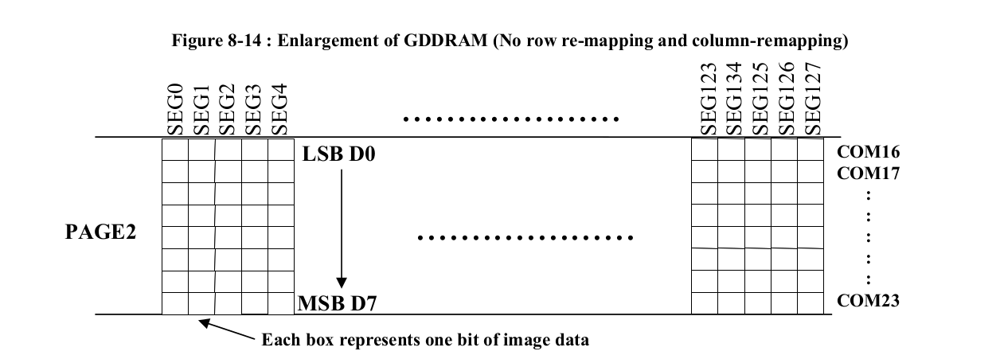

In this lab, we'll learn how to connect external parts to a single board computer using a digital communication bus, specifically: using an I2C communication bus. At the end of this lab, you should be able to:

* Connect a peripheral device or sensor to the I2C bus on the Raspberry Pi.
* Use a datasheet to identify the registers, and values to write to those registers, to configure and use a peripheral device or sensor.
* Inspect the digital waveform transmitted over the I2C bus, and identify important features (most and least significant bits, start condition, address, clock, etc.)

\newpage


## Notes

* In this lab, you will create some breadboard circuits with exposed pins and wires. Please be especially careful not to accidentally create connections that shouldn't be connected (e.g. short circuits). Also, check your work carefully before connecting any breadboard circuit to a board, to avoid damaging the board.
* You will submit your lab work in Gradescope. You will upload screenshots/photos and answer some questions as described in the Gradescope assignment. You do not have to write anything else (e.g. no description of procedure, etc.) 
* Read each subsection of this lab manual in its entirety before you start following the instructions in it. Some instructions are modified by explanations that come afterwards.
* Although you may work with a partner, this collaboration is limited to discussion and comparison. Your partner is not allowed to construct or modify your circuit, log in to your Pi, or run commands or write code on your Pi. Similarly, you are not allowed to do these things for your partner. 
* For your lab report, you must submit data, code, screenshots, and photos from your own experiment. You are not allowed to use your lab partner's data, code, screenshots, or photos.
* For any question in the lab report that is marked "Individual work", you should *not* collaborate with your lab partner or anyone else (even via discussion). You can use your notes, the lab manual, or the lecture slides and video to help you answer these questions.


## Parts


In this lab, we'll use the following parts:

* Pi, SD card, and power supply. We will insert the SD card, connect the power supply, and log in to the Pi over SSH.
* Breadboard and jumper cables
* OLED module with SSD1306 driver IC

### SSD1306 OLED module


The OLED module we are using in this lab is a graphical display with either 128x64 pixels or 128x32 pixels (different students may receive different versions!) The OLED pixels are controlled by the SSD1306 IC. This IC includes a parallel interface, an SPI interface, or an I2C interface. However, in our case, only the I2C interface is "broken out".

When working with an I2C module, the first thing we need to find in the datasheet is the 7-bit peripheral address! In the datasheet, **Section 8.1.5 MCU I2C Interface** describes the operation of the I2C bus, including the peripheral address. There, it says:

> The device will respond to the slave address following by the slave address bit ("SA0" bit) and the read/write select bit ("R/W#"" bit) with the following byte format:

```
b7 b6 b5 b4 b3 b2 b1  b0
0  1  1  1  1  0  SA0 R/W#
```

In other words, the 7-bit address (not including the R/W bit) may be either `0b0111100` (`0x3c`) or `0b0111101` (`0x3d`), depending on whether the pin `SA0` is pulled LOW or HIGH. Since this pin is not "broken out" on the module, and we do not know what its current setting is, we should expect to see the module at either `0x3c` or `0x3d` - we'll find out which by trial and error. 

On some modules, there may be an I2C address selection "solder jumper" or pads on the back that allow you to re-configure the SA0 bit, so that you can have multiple OLED modules on the same bus. For modules that don't have a user-selecteable address, you would have to use a separate I2C multiplexing IC if you wanted to connect multiple modules to the same I2C bus.

\newpage

Now that we understand how to reach the module over the I2C bus, we need to know how to operate it. There are two "parts" to the SSD1306 interface:

* **Commands** - we can send commands to the display to turn it on and off, configure contrast, etc. 
* **Display data** - the IC has a Graphics Display RAM - GDDRAM - which has 1 bit for every pixel on the display. To make a pixel light up (or turn off) on the display, we just need to write to the corresponding location in the GDDRAM.

{width=600px}

The datasheet (in **Section 8.1.5.1 I2C-bus Write data**) further clarifies that to distinguish between writing a command and writing to the display data, when we send on the I2C bus, we send a "command byte" immediately after the peripheral address byte. In the "command byte", the lower six bits are always 0. The upper two bits are CO and DC respectively, and these bits are set to indicate whether the following data byte is command or GDDRAM data, and whether additional bytes are expected to follow:

* Command byte `0b10000000` = `0x80` indicates multiple commands
* Command byte `0b00000000` = `0x00` indicates one command
* Command byte `0b11000000` = `0xC0` indicates multiple GDDRAM data bytes
* Command byte `0b01000000` = `0x40` indicates one GDDRAM data byte

The *commands* that are available to configure the display are described in **Section 9 Command Table** and **Section 10 Command Descriptions**.


{width=600px}


Let's also take a moment to clarify how the GDDRAM works. This memory is organized into 8 "pages" (64 pixel-high display) or 4 "pages" (32 pixel-high display) that are each 128 bits wide and 8 bits tall.


 Each byte that is written to the GDDRAM controls 8 pixels in a *column* (i.e. in the vertical direction) on the display. For example, if you write `0b00001111` to the first location in the DDRAM, then in the first "column" of the display, the top four pixels will be OFF and the next four pixels will be ON.

{width=600px}


## Procedure

### Enable I2C on Raspberry Pi OS

The I2C driver is disabled by default on Raspberry Pi OS. To enable it, run

```
sudo raspi-config
```

and choose Interfacing Options > I2C, select "Yes", then "OK", then "Finish".

Verify that it is enabled by running

```
lsmod | grep i2c
```

This lists all currently loaded kernel modules (including communication bus drivers) and then filters the output to show only those with `i2c` in the name. You should see an entry for `i2c_dev` and `i2c_bcm2835`.

Also, you should see in the output of 

```
gpio readall
```

that the two I2C pins are now in ALT mode.


### Install software

We will use some software tools and libraries to work with I2C.  Install these (and a graphics library that will make it easier to draw to the display!)  with


```
sudo apt update
sudo apt install i2c-tools python3-smbus python3-pil
```

These may already be installed (i.e. it will tell you it is already the newest version), which is also OK!

We will use the Adafruit library for the SSD1306 device. To install it, run

```
sudo pip3 install adafruit-circuitpython-ssd1306
```


### Connect the SSD1306 OLED screen

Connect the OLED screen to your Pi:

* **GND** to **GND**
* **VCC/VDD** to **3.3V**
* **SCL/SCK** to **GPIO3** (I2C1 SCL) on the Pi 
* **SDA** to **GPIO2** (I2C1 SDA) on the Pi

Carefully read the labels printed next to the pins on your OLED to identify each pin - there are a few different versions of this part in use, and so different students might have the pins in a different order. 

If you connect the supply voltage incorrectly, the OLED may burn up - if you feel it getting hot, quickly disconnect the GND and voltage supply lines from your circuit. (Disconnect the wires rather than trying to pull out the OLED from the circuit while it's hot, as you may burn yourself if you touch the OLED.)


**Note**: An I2C bus requires pull up resistors on the SDA and SCL lines. However, the Raspberry Pi already has pull-ups on its I2C lines, so we won't need external pull-up resistors. 


### Scan the I2C bus and find OLED screen address

When connecting a new I2C device, the first challenge is to make sure we can address it. We can use a utility called `i2cdetect` to scan the entire I2C address space, and look for a response from each address, to identify the address of every device connected to the bus.

Run

```
i2cdetect -y 1
```

Your output should look like this:

```
     0  1  2  3  4  5  6  7  8  9  a  b  c  d  e  f
00:          -- -- -- -- -- -- -- -- -- -- -- -- -- 
10: -- -- -- -- -- -- -- -- -- -- -- -- -- -- -- -- 
20: -- -- -- -- -- -- -- -- -- -- -- -- -- -- -- -- 
30: -- -- -- -- -- -- -- -- -- -- -- -- 3c -- -- -- 
40: -- -- -- -- -- -- -- -- -- -- -- -- -- -- -- -- 
50: -- -- -- -- -- -- -- -- -- -- -- -- -- -- -- -- 
60: -- -- -- -- -- -- -- -- -- -- -- -- -- -- -- -- 
70: -- -- -- -- -- -- -- --                         
```

We should see that a device with I2C address `3c` (the OLED screen) is connected to the bus. No other devices are connected.

---

**Lab report** (Individual work): Suppose you needed *two* OLED screens for a project. How would you connect the two OLED displays to your Pi? What steps would you take to make sure they are individually addressable?

--- 


### Prepare a directory

On your Pi, create a new directory and `cd` to it:

```
mkdir ~/lab-i2c
cd ~/lab-i2c
```


### Use Python library to draw on the display

<!-- https://learn.adafruit.com/monochrome-oled-breakouts/python-usage-2 -->

Writing to this display is a bit more complicated than the character LCD we used previously! Instead of writing our own library for this display, we'll practice using an existing library (created by Adafruit) to draw on the display.


In the `lab-i2c` directory, open a new file for editing:

```
nano oled-draw.py
```

Put the following code inside:

\newpage


```python
import board
import busio
from PIL import Image, ImageDraw, ImageFont
import adafruit_ssd1306

OLED_WIDTH = 128
OLED_HEIGHT = 64
OLED_ADDRESS = 0x3c

# Initialize I2C library busio
i2c = busio.I2C(board.SCL, board.SDA)
oled = adafruit_ssd1306.SSD1306_I2C(OLED_WIDTH, OLED_HEIGHT, 
     i2c, addr=OLED_ADDRESS)


# Graphics stuff - create a canvas to draw/write on
image = Image.new("1", (oled.width, oled.height))
draw = ImageDraw.Draw(image)
font = ImageFont.load_default()

# Draw a rectangle with no fill, ten pixels thick
draw.rectangle((0, 0, oled.width-1, oled.height-1), 
     outline=10, fill=0)
# Draw some text
text = "Hello world"
(font_width, font_height) = font.getsize(text)
draw.text( # position text in center
     (oled.width // 2 - font_width // 2, oled.height // 2 - font_height // 2),  
    text,
    font=font,
    fill=255,
)

# Display image
oled.image(image)
oled.show()
```

Before you save the file, make the following changes:

* Some students will have a 128x64 pixel display; some students will have a 128x32 pixel display. Change the `HEIGHT` value in the code to match your display.
* Also change the text "Hello world" to include your net ID, e.g. "Hello ff524".

Save the file, then run it with

```
python3 oled-draw.py
```

and verify that the message (and rectangular border) appears on the display.

---


**Lab report**: Take a photo of your breadboard with the OLED module attached, showing your message "Hello [net ID]" on the display. (Make sure the colored sticker on your breadboard is visible in the photo!)

---

\newpage


### Monitoring I2C traffic with the Analog Discovery 2

The Analog Discovery 2 includes some helpful utilities for monitoring traffic on an I2C bus. We'll learn how to use these now.

Connect your Discovery 2 to your circuit as follows:

* GND (any black wire) on the Discovery 2 to GND on your circuit
* DIO 0 (solid pink wire) on the Discovery 2 to SCL on your circuit
* DIO 1 (solid green wire) on the Discovery 2 to SDA on your circuit. 

Then, open the Waveforms application.

First, open Settings > Device Manager, choose the profile that allocates more buffer space for the Logic Analyzer tool, and click Select.

{width=500px}

Then, click on Logic Analyzer to open the Logic Analyzer tool.

Click on the + icon to add a communication bus, and select the I2C option. Make sure the bus is configured correctly given your connections, then click Add.

{width=500px}

Next, change the "Mode" to "Record", so that we can capture data into a buffer and then analyze it offline. 

We will also need to set up a trigger - a particular pattern that tells the Logic Analyzer tool when to start capturing data! Near the top of the display, you'll see the word "Trigger" followed by a drop down menu and buttons that say Simple, Pulse, and Protocol. Select Protocol and choose I2C, then verify that it will trigger on the I2C start bit. Press OK to confirm.

{ width=500px}


\newpage

Now, press Record in the Logic Analyzer window, then run your Python script again:


```
python3 oled-draw.py
```


You should see data appear in the Logic Analyzer window. You will probably have to zoom and pan to see it more clearly.

At the beginning of the signal, you'll see that the OLED library sends just the device address, with no register address or data! This is probably to confirm that there is a device on the specified address. Take a screenshot of this I2C transaction for your lab report.

{ width=600px}


Then you may see a sequence of commands (send to "register address" `0x80`, i.e. the "command byte" indicates that several instructions will be sent to configure the device). The *commands* that are available to configure the display are described in **Section 9 Command Table** and **Section 10 Command Descriptions** in the datasheet. Take a screenshot of one such I2C transaction for your lab report.


{ width=600px}

\newpage


Finally, you'll see that a stream of data bytes is sent to register address `0x40` - to the GDDRAM:

{ width=600px}

In addition to the Logic Analyzer tool, the Protocol tool is also helpful for monitoring I2C traffic. From the Welcome tab in the Waveforms application, click on Protocol.  Then select the I2C tab and confirm the settings.


{ width=600px}


Click Receive, then run your Python script again:


```
python3 oled-draw.py
```

Then click Stop in the Protocol tool. You should see data appear in the window, like this:

\newpage

{ width=600px}


As with the Logic Analyzer tool, this tool shows you key values for each I2C "transaction":

* the start bit
* address byte (both as an 8-bit value, and as a 7-bit value followed by a RW bit)
* any register addresses and/or data bytes 
* and the stop bit

but without the graphical display of the waveform. Scroll through this display until you find the part where data is sent to the GDDRAM. Take a screenshot of this I2C transaction for your lab report.

\newpage

---

**Lab report**: Find the screenshot of the I2C "transaction" where just the peripheral address is sent over the bus. Annotate this screenshot to clearly and specifically indicate the following:

* the start condition (note: this involves both data and clock line)
* the seven peripheral address bits - label them as b6, b5, b4, b3, b2, b1, b0 (MSB to LSB)
* the RW bit - label it and indicate whether it shows a READ or WRITE operation in your screenshot
* the ACK/NACK bit - label it and indicate whether it shows an ACK or NACK in your screenshot
* the stop condition (note: this involves both data and clock line)

Also answer the following question: Suppose the OLED module was not connected to the circuit. Describe *exactly* how this I2C transaction would be different - what would it look like?

**Lab report**: Find the screenshot showing a configuration instruction sent to the OLED module. Annote this screenshot to clearly and specifically indicate the following:

* start condition
* seven bit peripheral address 
* R/W bit
* "register address" (in this case, the "command byte" described in the module datasheet, which specifies whether the following byte should be interepreted as an instruction or as data for the GDDRAM)
* "data byte" (the value that is sent to the specified register, whether it is "instruction data" or "GDDRAM data")
* stop condition


Then, look up the configuration instruction shown in this I2C transaction in the datasheet. Include a screenshot showing the description of this instruction in the datasheet. If the instruction is "parameterized" (i.e. some bits are set HIGH or LOW depending on the desired configuration), specify the parameters shown in your screenshot.


**Lab report**: Show the screenshot of the Protocol tool on the Discovery 2, specifically the part where you captured data sent to the GDDRAM. Annotate this screenshot to clearly and specifically indicate the following for this I2C transaction:

* start condition
* seven bit peripheral address 
* R/W bit
* "register address" (in this case, the "command byte" described in the module datasheet, which specifies whether the following byte should be interepreted as an instruction or as data for the GDDRAM)
* data bytes sent to the display
* stop condition

---

\newpage

### Use `smbus` Python library

In our lesson on I2C, we described the use of the `smbus` Python library can be used to send commands to an I2C device.

Let's try it now - for example, from the "Command table" on page 28 of the datasheet, we find that we can set the display on or off:

* 0xAE or 0b10101110 to set the display off
* 0xAF or 0b10101111 to set the display on

*While the display is still initialized and showing your message from the previous section*, let us try and use this library to send the commands to turn the display on and off. Put the following code in a Python script `oled-toggle.py` 

```
import smbus, time
bus = smbus.SMBus(1)    # I2C device 1 - on GPIO2 and GPIO3

OLED_ADDRESS = 0x3c     #7 bit address (not including R/W bit)
OLED_REGADDR = 0x00
OLED_DISPOFF = 0xAE
OLED_DISPON  = 0xAF


while True:
     # turn display off
     time.sleep(5)
     # turn display on
```

Then, modify this code to actually turn the display off and on where indicated by the comments. (You can use the example in the lecture slides as a reference!) Run your `oled-toggle.py` script to test it:

```
python3 oled-toggle.py
```

---

**Lab report**: What is the line of code you added to turn the display off? What is the line of code you added to turn the display back on?

---

\newpage

### Use terminal-based utilities

We can also interact with I2C devices directly from the terminal. 
Make sure your OLED display is ON and currently showing the message from the previous sections. Then, run

```
i2cset -y 1 0x3C 0x00 0xAE
```

You should see your OLED display go off.

The `i2cset` utility accepts four arguments:

* an integer identifying the I2C bus - we'll always use `1`
* the address of the I2C peripheral device to write to - here, `0x3C`
* the register address to write to - here `0x00`
* the data to write - here, `0xAE`

To turn your display back on, run

```
i2cset -y 1 0x3C 0x00 0xAF
```


and the image in the display memory should re-appear.
