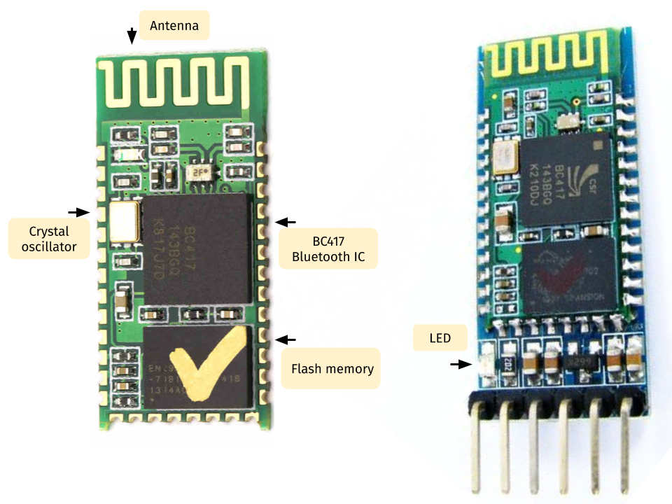
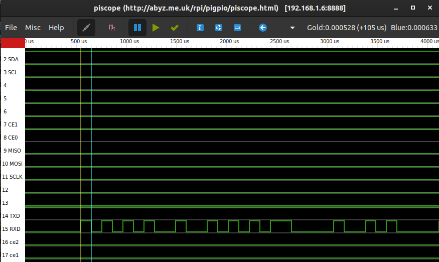
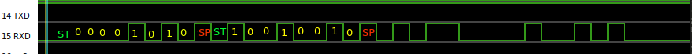

# Serial communication with UART

In this lab, we'll learn how to connect external parts to a single board computer using a digital communication bus, specifically: using a UART communication bus. At the end of this lab, you should be able to:

* Connect a peripheral device or sensor to a Raspberry Pi for serial communication.
* Use a datasheet to identify the registers, and values to write to those registers, to configure and use a peripheral device or sensor.
* Inspect the digital waveform transmitted over a bus, and identify important features (most and least significant bits, start condition, address, clock, etc.)


## Notes

* In this lab, you will create some breadboard circuits with exposed pins and wires. Please be especially careful not to accidentally create connections that shouldn't be connected (e.g. short circuits). Also, check your work carefully before connecting any breadboard circuit to a board, to avoid damaging the board.
* Read each subsection of this lab manual in its entirety before you start following the instructions in it. Some instructions are modified by explanations that come afterwards.
* Although you may work with a partner, this collaboration is limited to discussion. Your partner is not allowed to construct or modify your circuit, log in to your Pi, or run commands or write code on your Pi. Similarly, you are not allowed to do these things for your partner. (You *are* encouraged to collaborate by screen-sharing or showing video of your circuit to debug and discuss problems together.)
* For your lab report, you must submit data, code, and screenshots from your own experiment. You are not allowed to use your lab partner's data, code, or screenshots.
* For any question in the lab report that is marked "Individual work", you should *not* collaborate with your lab partner or anyone else (even via discussion). You can use your notes, the lab manual, or the lecture slides and video to help you answer these questions.

\newpage


## Parts


In this demo, we'll use the following parts:

* Pi, SD card, and power supply. We will insert the SD card, connect the power supply, and log in to the Pi over SSH.
* Breadboard and jumper cables
* HC-05 bluetooth module (this is not in your kit)

### HC-05 Bluetooth module

The HC-05 module is a Bluetooth device with a UART interface. The photograph below shows an HC-05 module, with key components indicated.

{ width=70% }

The HC-05 is often sold on a board (shown on the right in the photograph above), with important pins broken out and with an LED that shows Bluetooth status. Bluetooth devices go through several stages to set up a connection, and the LED tells us what stage the device is in:

* **Discovery**: When a Bluetooth device is "discoverable," other Bluetooth devices can detect it. (The LED on the HC-05 blinks fast in this stage.)
* **Pairing**: The process of creating a persistent link between two Bluetooth devices. This may involve authentication, which typically involves entering a passkey (default passkey is 1234 on the HC-05 module).  This stage only occurs once; future connections between the devices are typically authenticated automatically. (The LED on the HC-05 blinks slowly when it is paired, but not connected.)
* **Connection**: The devices may send and receive data to one another. (The LED on the HC-05 double-blinks slowly when it is connected.)

We'll learn more about the HC-05 in the rest of this demo.

\newpage

## Serial communication with HC-05

### Enable serial interface on the Pi

By default, the hardware UART peripheral on the Pi is connected to a "login console", for convenient debugging. With the serial login console, you can connect your Pi to your computer over USB with a [USB to TTL serial cable](https://www.adafruit.com/product/954), and use it to get a terminal session on your Pi over USB.

However, we want to use the hardware UART peripheral on the Pi to connect to an external peripheral, so we will disable the serial login console. In a terminal session on the Pi, run


```
sudo raspi-config
``` 

Choose \menu{Interfacing Options > Serial}. When asked "Would you like a login shell to be available over serial", choose \menu{No}. Then, when asked "Would you like the serial port hardware to be enabled", choose \menu{Yes}. 

### Connect HC-05 to the Pi

Connect the HC-05 board to the Pi as shown in the following breadboard diagram.

{width=90%}

* The VCC module on the HC-05 is connected to the 3.3V pin on the Pi. (Some HC-05 modules require 5V to operate, some only accept 3.3V, but the one we're using will work at either voltage level. We'll use 3.3V because the Pi's GPIO pins are not 5V tolerant. However, the module's communication range may be better when operating at 5V.)
* The GND pin on the HC-05 is connected to the GND pin on the Pi.
* The TX pin on the HC-05 is connected to GPIO15 (UART RX) on the Pi.
* The RX pin on the HC-05 is connected to GPIO14 (UART TX) on the Pi.
* The STATE pin on the HC-05 is connected to GPIO23 on the Pi.
* The KEY pin on the HC-05 is connected to GPIO24 on the Pi.

### Use "command mode" on the HC-05

The bluetooth module can be configured by opening a serial console in "command mode" and entering configuration commands in this console. To use command mode, the KEY pin should be HIGH *before* the HC-05 module is powered on. 

We have connected the KEY pin to a GPIO pin on the Pi, and now we will use an interactive Python terminal to set that pin as OUTPUT and HIGH. Run


```
python3
```

Import some libraries:

```
import serial
import RPi.GPIO as GPIO
GPIO.setmode(GPIO.BCM)
```

and define the pin mapping for the two GPIO pins, STATE and KEY:

```
HC05_ST = 23
HC05_KE = 24
```

To use the "command" mode on the HC-05, we'll set the KEY pin to HIGH. Configure this pin in OUTPUT mode, and then write a HIGH value to it:

```
GPIO.setup(HC05_KE, GPIO.OUT)
GPIO.output(HC05_KE, GPIO.HIGH)
```

To use command mode, the HC-05 should have the KEY pin set HIGH *before* it turns on. So now we'll need to power cycle the module, by removing the 3.3V pin connecting the Pi to the breadboard and then putting it back.

When the HC-05 powers on in command mode, the LED on board will blink slowly, every second.


We'll use the Python serial interface library to work with the UART. To open a connection to a UART device, we need to specify the location in the filesystem that it is mapped to, and the connection parameters. The UART is mapped to `/dev/ttyS0` on the Pi, and by default, the HC-05 uses a 38400 baud rate in command mode. So we can open the serial interface with:

```
ser = serial.Serial('/dev/ttyS0', baudrate=38400)
```

Now, we can test the connection with the "test" command described in the HC-05 datasheet:

```
ser.write(b"AT\r\n")
ser.readline()
```

The `write` command will return the number of bytes written to the serial link - 4 bytes in this case. The `readline` command will read a message terminating in `\r\n` from the serial link. The response from the HC-05 should be `OK`:


```
>>> ser.write(b"AT\r\n")
4
>>> ser.readline()
b'OK\r\n'
```

We can use AT commands to query the device and find out about its configuration. For example, let's find out the device's address:

```
ser.write(b"AT+ADDR?\r\n")
ser.readline()
ser.readline()
```

the name by which it will appear to other devices:

```
ser.write(b"AT+NAME?\r\n")
ser.readline()
ser.readline()
```

the PIN code used to authenticate when pairing:

```
ser.write(b"AT+ PSWD?\r\n")
ser.readline()
ser.readline()
```

and the UART settings (when not in command mode):

```
ser.write(b"AT+ UART?\r\n")
ser.readline()
ser.readline()
```

We can also use AT commands to set configuration values. For example:

```
ser.write(b"AT+NAME=HC-05\r\n")
ser.readline()

ser.write(b"AT+NAME?\r\n")
ser.readline()
ser.readline()
```

To leave command mode, let's set the KEY line LOW:

```
GPIO.output(HC05_KE, GPIO.LOW)
```

then reset the HC-05:

```
ser.write(b"AT+RESET\r\n")
```

### Pair your Pi with the HC-05

We will use the Pi Zero W, which has Bluetooth built in, to test the Bluetooth wireless link. You will need several open terminals on the Pi (over SSH), and we'll also monitor the serial interface using piscope over a VNC session.

Make sure the red LED on the HC-05 is blinking fast. This indicates it is in discoverable state, and not already paired to another device. You won't be able to pair with the HC-05 if it is already paired to another device.

In a terminal on your Pi, run

```
hcitool scan
```

to find out the MAC address of your HC-05 device. You should see output similar to the following:

```
Scanning ...
  10:14:06:30:00:72 HC-05
```

Note your HC-05's MAC address (in this example, `10:14:06:30:00:72`, but every individual module has a different address.) 

Now that we have discovered the HC-05, the next step is pairing. On your Raspberry Pi, run

```
bluetoothctl
```

At the `[bluetooth]#` prompt, type

```
discoverable on
pairable on
agent on
default-agent
```

Scan for the HC-05 module:

```
scan on
```

Wait until you see at least one line of output with your HC-05 module's MAC address in it.  Then, pair your Pi with the module:

```
pair 10:14:06:30:00:72
```

You should see some output like:

```
Attempting to pair with 10:14:06:30:00:72
[CHG] Device 10:14:06:30:00:72 Connected: yes
Request PIN code
[agent] Enter PIN code: 
```

Enter pin 1234 when requested, and hit Enter. Once it is paired, the LED on the HC-05 will blink slowly, indicating that it is in "paired" mode.

**Note**: If you have previously paired with the HC-05, you will see a message "Failed to pair: org.bluez.Error.AlreadyExists" when you try to pair. You can remove the previous entry with

```
remove 10:14:06:30:00:72
```

in the `bluetoothctl` terminal, then try to `pair` again.

### Bluetooth communication

Your HC-05 is "paired" but still not "connected". You can verify this by checking the value of the STATE line. In your Python terminal, configure the STATE pin as INPUT and read its value:

```
GPIO.setup(HC05_ST, GPIO.IN)
GPIO.input(HC05_ST)
```

Once the Pi's built-in Bluetooth is paired with the HC-05, you are ready to connect. Open a second terminal on the Pi, and in this one, run

```
sudo rfcomm connect 0 10:14:06:30:00:72
```

You should see a message like

```
Connected /dev/rfcomm0 to 10:14:06:30:00:72 on channel 1
Press CTRL-C for hangup
```

and in the `bluetoothcl` terminal, you may notice a line like

```
Device 10:14:06:30:00:72 Connected: yes
```

The LED on the device will change from a slow blink to a slow double-blink, and the STATE line will go HIGH:

```
GPIO.input(HC05_ST)
```

### Send data between Pi built-in Bluetooth and HC-05

The Pi's built-in Bluetooth device is now connected to the HC-05, and we can exchange data between them. 

In your Python session, close the previous serial session with


```
ser.close()
```
and open a new one with a 9600 baud rate, for "normal" operation:

```
ser = serial.Serial('/dev/ttyS0', baudrate=9600)
```

Leave this running. 

Open another Python terminal on the Pi:


```
python3
```

and in this terminal, open the serial console for the built-in Bluetooth device:


```
import serial
ser = serial.Serial('/dev/rfcomm0', baudrate=9600)
```

Now, we can send messages over the Bluetooth link. Try


```
ser.write(b"PI\r\n")
```

in the built-in Bluetooth terminal, and


```
ser.readline()
```

in the HC-05 terminal.

\newpage

### Inspect signals in piscope

The message `PI` is mapped using ASCII to the following bit arrays: `01010000 01001001`.

We can observe the message, the start bit, and the stop bit in the piscope window.

Since we sent this message from the built-in Bluetooth to the HC-05, and the HC-05 is connected to the UART lines on GPIO14 and GPIO15, we expect to see the signal on GPIO15 (the RX line).

First, note that each bit is held for 1/9600 seconds:



Also, we can identify each bit, as well as the start and stop bit. The start bit is LOW, the stop bit is HIGH, and we are using one stop bit per byte (8N1 mode is the default in the serial library).

By convention, the byte is sent LSB first.



\newpage

### Close the connection

To close the serial connections, run


```
ser.close()
```

in each Python terminal, then

```
quit()
```

to exit Python.

You can stop the `rfcomm` process with \keys{Ctrl+C}.

In the `bluetoothctl` terminal, use


```
exit
```

to quit.


### Lab report questions


**Lab report** (individual work): As part of the demo, I will send a secret message from my phone to the HC-05 module. Take a screenshot of the Piscope display showing the waveform that carries this message. Annotate it, as shown in Figure 4 above, and also indicate the text of the message in ASCII characters.

**Lab report** (individual work): Suppose that instead of using

```
ser = serial.Serial('/dev/ttyS0', baudrate=9600)
```

to open the serial interface to the HC-05, I accidentally use

```
ser = serial.Serial('/dev/ttyS0', baudrate=38400)
```

Re-annotate the Piscope screenshot from the previous question (the one with the secret message) to show the bits I would read from the serial interface. You can assume that the UART samples the bit exactly in middle of what it thinks is the bit time. Mark each point where the serial device will sample the RX line. What byte(s) and what ASCII character(s) would I read from the serial interface, if I accidentally used the wrong baud rate?


**Lab report**: One way to explore the UART interface on the Pi is with a loopback test, where you connect the serial interface to itself. (Very carefully!!!) connect the UART RX pin on the Pi to the UART TX pin on the same Pi - but make sure not to connect the GND pin accidentally!

Write a Python script to send "Hello [your name]" (substitute your own name) over this serial loopback interface, using the `serial` library in Python. Then, read and print the line that was sent over the serial interface. Run the script, and take a screenshot of the output. Also capture this exchange in Piscope, and take a screenshot.