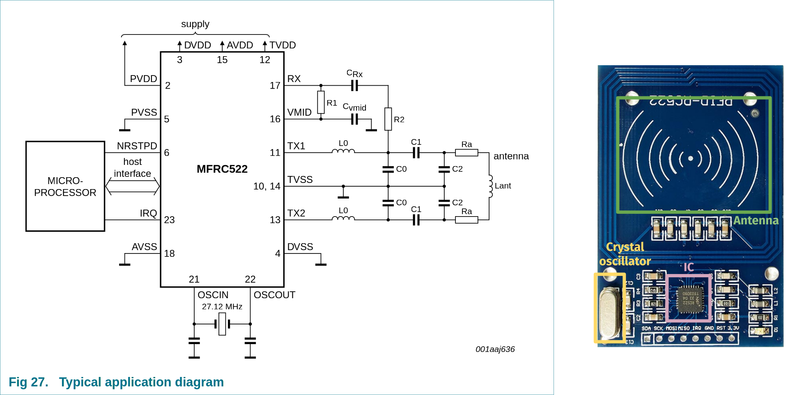
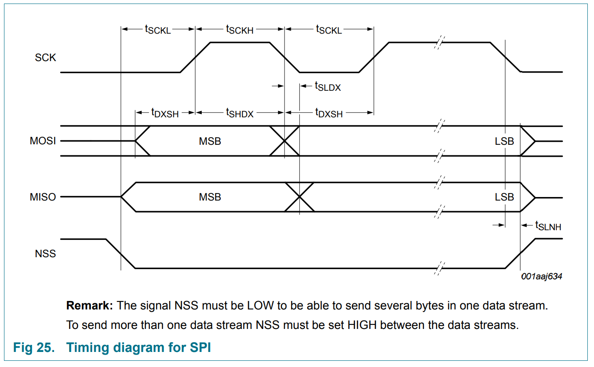
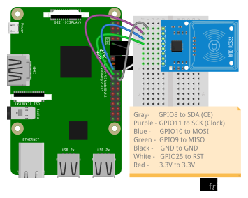
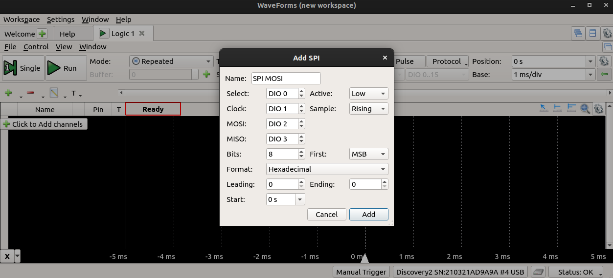
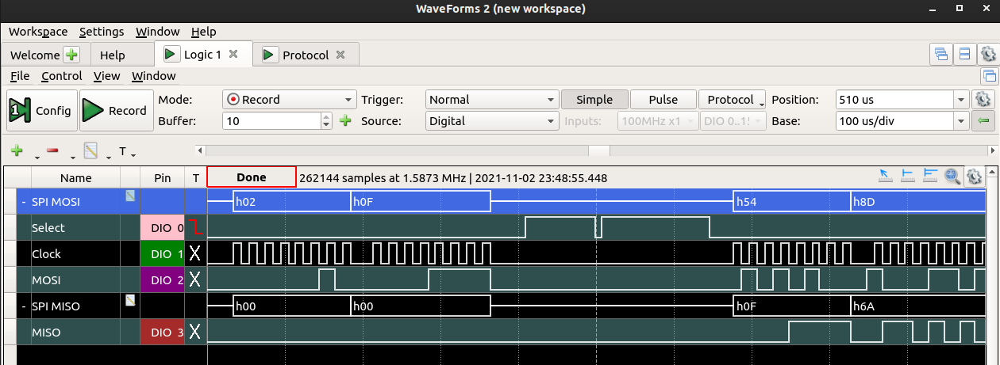
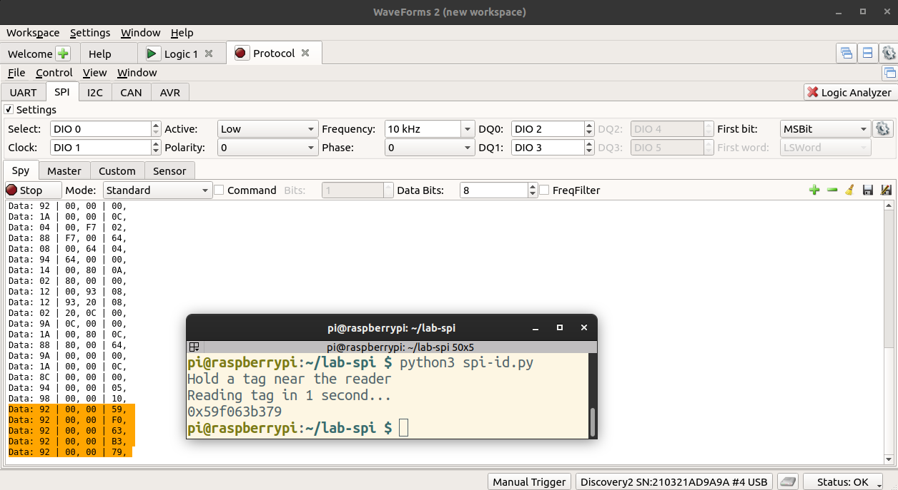
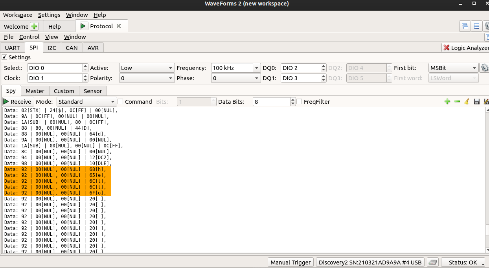

In this lab, we'll learn how to connect external parts to a single board computer using a digital communication bus, specifically: using an SPI communication bus. At the end of this lab, you should be able to:

* Connect a peripheral device or sensor to the SPI bus on the Raspberry Pi.
* Use a datasheet to identify the registers, and values to write to those registers, to configure and use a peripheral device or sensor.
* Inspect the digital waveform transmitted over the SPI bus, and identify important features (most and least significant bits, start condition, address, clock, etc.)


## Notes

* In this lab, you will create some breadboard circuits with exposed pins and wires. Please be especially careful not to accidentally create connections that shouldn't be connected (e.g. short circuits). Also, check your work carefully before connecting any breadboard circuit to a board, to avoid damaging the board.
* You will submit your lab work in Gradescope. You will upload screenshots/photos and answer some questions as described in the Gradescope assignment. You do not have to write anything else (e.g. no description of procedure, etc.) 
* Read each subsection of this lab manual in its entirety before you start following the instructions in it. Some instructions are modified by explanations that come afterwards.
* Although you may work with a partner, this collaboration is limited to discussion and comparison. Your partner is not allowed to construct or modify your circuit, log in to your Pi, or run commands or write code on your Pi. Similarly, you are not allowed to do these things for your partner. 
* For your lab report, you must submit data, code, screenshots, and photos from your own experiment. You are not allowed to use your lab partner's data, code, screenshots, or photos.
* For any question in the lab report that is marked "Individual work", you should *not* collaborate with your lab partner or anyone else (even via discussion). You can use your notes, the lab manual, or the lecture slides and video to help you answer these questions.

\newpage


## Parts


In this lab, we'll use the following parts:

* Pi, SD card, and power supply. We will insert the SD card, connect the power supply, and log in to the Pi over SSH.
* Breadboard and jumper cables
* MFRC522 module and tags (one tag is a white card; the other is a blue plastic tag on a keychain.)

### MFRC522 contactless communication module

The MFRC522 is a writer/reader for reading and writing to passive "tags" via contactless communication. 

Figur 27 in the MFRC522 datasheet shows how the IC is typically used, in combination with an oscillator and antenna. The photograph of the MFRC522 module in your kit is annotated to show the location of these key components on the board:



Contactless communication systems (such as MIFARE, RFID and NFC systems) use two devices, and transceiver (reader) and a transponder (tag). In our case, the tag is *passive* - it does not have any battery or other power source. 

How does it work without its own power source? The reader generates a high frequency electromagnetic field. When the tag moves within close proximity of this field, electrons move through the tag's antenna, powering a small chip inside the tag which then modulates the electromagnetic field with data stored in the chip. The reader can detect the resulting change in the electromagnetic field, "reading" the data stored in the tag.
 

What about the tags themselves? The tags in our kits of have 1KB of memory, organized in 16 *sectors*. The sectors are numbered from 0 to 15. Each sector is divided into *blocks*, numbered from 0 to 3, which can store 16 bytes of data each, numbered from 0 to 15. However, the last block of each sector is reserved for access control, so only blocks 0, 1, and 2 of each sector are available for data. Furthermore, the first block of the first sector is used to store information about the IC manufacturer and a unique ID for the tag, and is also not available for data.

\newpage


## SPI interface with MFRC522

The MFRC522 module that we are using has an SPI interface (as well as some other serial communication busses, but on our breakout boards, the chip is hard-wired to use SPI mode). Figure 25 in the datasheet shows the SPI timing diagram:



---

**Lab report** (individual work): When you connect the MFRC522 to the SPI interface on the Pi, which device is the "controller" and which is the "peripheral"? 

**Lab report** (individual work): Does the MFRC522 expect the clock signal to be LOW or HIGH when idle? Which edge of the clock signal - rising or falling edge - is the "leading" vs "trailing" edge? Does the MFRC522 expect data to change on the leading edge and be stable on the trailing edge, or change on the trailing edge and be stable on the leading edge? What clock phase does the SPI interface on the MFRC522 expect? What clock polarity?

---

\newpage


## Procedure


### Enable SPI on Raspberry Pi OS

The SPI driver is disabled by default on Raspberry Pi  OS. To enable it, run

```
sudo raspi-config
```

and choose Interfacing Options > SPI, select "Yes", then "OK", then "Finish".

Verify that it is enabled by running

```
lsmod | grep spi
```

This lists all currently loaded kernel modules (including communication bus drivers) and then filters the output to show only those with `spi` in the name. You should see an entry for `spidev` and `spi_bcm2835`.

Also, you should see in the output of 

```
gpio-readall
```

that the clock, data out, and data in pins of SPI0 are in ALT mode. The two chip select pins of SPI0 will be in OUTPUT mode.

### Install software

We also need some software tools and libraries to work with I2C.  Install these (and a graphics library so we can send images to the display!)  with


```
sudo apt update
sudo apt install python3-spidev
```

This *may* already be installed (i.e. it will tell you it is already the newest version), which is also OK!

We will use an existing open source library for the MFRC522 module.

First, make a new directory:

```
mkdir ~/lab-spi
```

Navigate to this directory, and retrieve and install the MFRC522 library:

```
cd ~/lab-spi
git clone https://github.com/pimylifeup/MFRC522-python 
cd MFRC522-python
sudo python3 setup.py install
```

\newpage

### Connect the MFRC522


Connect the MFRC522 module to the Pi as shown in the diagram.

{ width=500px}

* Gray - GPIO8 (SPI CE0) to SDA on the MFRC522 module 
* Purple - GPIO11 to SCK on the MFRC522 module (SCK a.k.a. clock line)
* Blue - GPIO10 (SPI SDO) to MOSI on the MFRC522 module
* Green - GPIO9 (SPI SDI) to MISO on the MFRC522 module
* Black - GND to GND on the MFRC522 module
* White - GPIO25 to RST on the MFRC522 module
* Red - 3.3V to 3.3V on the MFRC522 module

\newpage

### Get card ID

First, we'll use the module to get the card ID. We will use this as an opportunity to dig into the library and see how it works.

Navigate back to the `lab-spi` directory:

```
cd ~/lab-spi
```

Use `nano` to open a new file called `spi-id.py` inside the `lab-spi` directory, and put the following inside:


```
import RPi.GPIO as GPIO
import sys
import time
from mfrc522 import SimpleMFRC522

reader = SimpleMFRC522()

print("Hold a tag near the reader")
print("Reading tag in 1 second...")
time.sleep(1)
id = reader.read_id_no_block()

if id:
    print(hex(id))
else:
    print("No tag detected")

GPIO.cleanup()
```

Save your script and exit the text editor. Place the tag against the reader. Then, run

```
python3 spi-id.py
```

and note the ID that is returned.

### Change the SPI bus speed

By default, the SPI interface operates too fast for us to reliably see what's going on on the SPI lines. We will tell the SPI interface to run slower so that we can watch it. Open the library file `MFRC522.py`:

```
nano ~/lab-spi/MFRC522-python/mfrc522/MFRC522.py
```

and find the line

```
    def __init__(self, bus=0, device=0, spd=1000000, pin_mode=10, pin_rst=-1, debugLevel='WARNING'):
```

Change it to 

```
    def __init__(self, bus=0, device=0, spd=10000, pin_mode=10, pin_rst=-1, debugLevel='WARNING'):
```

(two fewer zeros!) Then save and close the file. 

\newpage


Reinstall the library with

```
cd ~/lab-spi/MFRC522-python/
sudo python3 setup.py install
cd ~/lab-spi/
```

and verify that you can still run 

```
python3 spi-id.py
```

(you'll have to hold the tag near the reader much longer now!)


### Monitoring SPI traffic with the Analog Discovery 2

The Analog Discovery 2 includes some helpful utilities for monitoring traffic on an SPI bus. We'll learn how to use these now.

Connect your Discovery 2 to your circuit as follows (note: the Discovery 2 comes with some "header" pins that you can push into the breadboard, then connect the Discovery 2 wires to directly without needing any additional M-M jumpers):

* GND (any black wire) on the Discovery 2 to GND on your circuit
* DIO 0 (solid pink wire) on the Discovery 2 to CE on your circuit
* DIO 1 (solid green wire) on the Discovery 2 to SCLK on your circuit
* DIO 2 (solid purple wire) on the Discovery 2 to MOSI/Pi SDO on your circuit
* DIO 3 (solid brown wire) on the Discovery 2 to MISO/Pi SDI on your circuit

Then, open the Waveforms application.

First, open Settings > Device Manager, choose the profile that allocates more buffer space for the Logic Analyzer tool, and click Select.

{width=400px}

\newpage


Then, click on Logic Analyzer to open the Logic Analyzer tool.

Click on the + icon to add a communication bus, and select the **SPI MOSI/MISO** option. 

To configure the SPI logic analyzer, we need to know what SPI mode our device operates in - which clock edge is data sampled on? Figure 25 in the datasheet shows the SPI timing diagram for the MFRC522:

{ width=500px}


We can see that:

* the CS line (NSS in the diagram) is active LOW (this is typically the case)
* the data is send MSB first
* the data is sampled on the rising clock edge, and changed on the falling clock edge


Now we can confirm that the Discovery 2 Logic Analyzer is configured correctly with the same settings shown in the timing diagram in the datasheet! Then click Add:


{ width=500px}

\newpage


Next, change the "Mode" to "Record", so that we can capture data into a buffer and then analyze it offline. 

We will also need to set up a trigger - a particular pattern that tells the Logic Analyzer tool when to start capturing data! Click on the X in the "T" column next to the "Select" line, and choose "Fall" - this will configure the Discovery 2 to start capturing when it sees a falling edge on the CS line.

Now we are ready to capture data!  Press Record in the Logic Analyzer window, then run your Python script again:

```
python3 spi-id.py
```

You should see a sequence of commands used to initialize the device appear on the SDO line, like this:


{ width=500px}

Section 8.1.2.2 and 8.1.2.3 of the datasheet describes how to write data to command registers on the module. Each transaction is two bytes: first, the controller sends the address of the register to write to, then it sends the command to write.

Look at the SPI transactions used to initialize the module. See if you can identify each step of the initialization process. 


* Send 0x0F to register 0x01 (CommandReg)
* Send 0x8D to register 0x2A (TModeReg)
* Send 0x3E to register 0x2B (TPrescalerReg)
* Send 0x1E to register 0x2D (TReloadReg low bits)
* Send 0x00 to register 0x2C (TReloadReg high bits)
* Send 0x40 to register 0x15 (TxASKReg)
* Send 0x3D to register 0x11 (ModeReg)

Note: as per section **8.1.2.3 SPI address byte** in the datasheet, the MSB of the address byte is a R/W bit (1 for read, 0 for write) and the LSB of the address byte is always 0. The middle 6 bits of the address byte are the register address. However, since the Discovery 2 interprets these as an 8-bit value, it will show each register address as a left-shifted value! So it will interpret register 0x01 (`0b00000010`) as 0x02, and so on.

\newpage

In addition to the Logic Analyzer tool, the Protocol tool is also helpful for monitoring SPI traffic. From the Welcome tab in the Waveforms application, click on Protocol.  Then select the SPI tab and confirm the settings.

Click receive, then run your Python script again:

```
python3 spi-id.py
```


You should see the initialization procedure again, and you'll also see the procedure as the Pi is reading the UID from the RFID module! Section 8.1.2.1 and 8.1.2.3 in the datasheet describe how to read data from the module. At the end of the SPI transaction, you should find the same UID that is printed in the terminal output.


{width=500px}


Note that for each "read", the Pi first sends the address of the FIFODataReg (0x09), then reads a byte from the peripheral. This address byte appears as 92 in the Protocol tool, because only the middle 6 bits are address bits; the first bit is 1 (indicating a read operation) and the last bit is always 0.

---

**Lab report**: Take a screenshot of the Logic Analyzer display showing at least 2 of the module initialization commands, as described above. Annotate the screenshot - for each initialization command, label the register byte (in hex) and command byte. Then, show a screenshot of the section of the datasheet that describes this command.

Note the status of the CE0 line on the Pi during the transactions above. What is the purpose of the CE line?


**Lab report**: Take a screenshot from the Protocol tool, showing the tag ID being sent over the SPI bus. In the same screenshot, show the terminal output with the identical tag ID printed in the terminal. (As in my example!)

In the screenshot from the Protocol tool, circle each byte that is sent *from the Pi to the RFID module* in one color, and circle each byte that is sent *from the RFID module to the Pi* in a different color.

---


\newpage

### Write to and read from a tag

Sometimes, we may want to read and write more than just the tag ID - we may want to store data on the tag. 

Edit the MFRC522 library again to restore the original SPI bus speed, and install the library again.

Open a new file called `spi-mfrc522.py` inside the `lab-spi` directory, and put the following inside:


```
import RPi.GPIO as GPIO
import sys
import time
from mfrc522 import SimpleMFRC522

reader = SimpleMFRC522()

print("Hold a tag near the reader")

try:
    print("First, writing to the tag...")
    text = input('Enter new data to write to tag, then hit Enter: ')
    print("Place your tag next to the antenna to write")
    reader.write(text)
    print("Done writing! Remove your tag.")

    print("Wait 5 seconds...")
    time.sleep(5)

    print("Now, reading tag - place it next to the antenna...")
    id, text = reader.read()
    print(text)

finally:
    GPIO.cleanup()
```

Save your script and exit the text editor. Then, run

```
python3 spi-mfrc522.py
```

When prompted, enter *your net ID* to write to the tag. Then, hold the tag near the antenna. Keep it there until you have received confirmation that the new text was written.

After 5 seconds, the script will switch to "read" mode. Hold the tag near the reader, and wait until the tag ID and text is printed to the screen.

Try to capture this SPI transaction in the Protocol tool on the Discovery 2. Can you find the text on the SDI line? (To view the data in ASCII format instead of hex, click on the "cog" icon in the settings area, and choose ASCII.)

\newpage


{width=600px}


Note that for each "read", the Pi first sends the address of the FIFODataReg (0x09), then reads a byte from the peripheral. This address byte appears as 92 in the Protocol tool, because only the middle 6 bits are address bits; the first bit is 1 (indicating a read operation) and the last bit is always 0.

---

**Lab report**: Take a screenshot from the Protocol tool, showing the text from the tag (your net ID!) being sent over the SPI bus. In the same screenshot, show the terminal output with the identical tag ID printed in the terminal.

In the screenshot from the Protocol tool, circle each byte that is sent *from the Pi to the RFID module* in one color, and circle each byte that is sent *from the RFID module to the Pi* in a different color.

---
