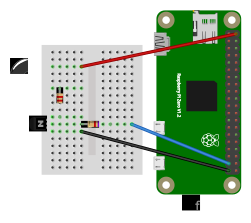

In this lab, we'll practice using a GPIO pin to switch a load on and off with a BJT transistor circuit. 

## Notes

* In this lab, you will create some breadboard circuits with exposed pins and wires. Please be especially careful not to accidentally create connections that shouldn't be connected (e.g. short circuits). Also, check your work carefully before connecting any breadboard circuit to a board, to avoid damaging the board.
* You will submit your lab work in Gradescope. You will upload screenshots/photos and answer some questions as described in the Gradescope assignment. You do not have to write anything else (e.g. no description of procedure, etc.) 
* Read each subsection of this lab manual in its entirety before you start following the instructions in it. Some instructions are modified by explanations that come afterwards.
* Although you may work with a partner, this collaboration is limited to discussion and comparison. Your partner is not allowed to construct or modify your circuit, log in to your Pi, or run commands or write code on your Pi. Similarly, you are not allowed to do these things for your partner. 
* For your lab report, you must submit data, code, screenshots, and photos from your own experiment. You are not allowed to use your lab partner's data, code, screenshots, or photos.
* For any question in the lab report that is marked "Individual work", you should *not* collaborate with your lab partner or anyone else (even via discussion). You can use your notes, the lab manual, or the lecture slides and video to help you answer these questions.

\newpage

## Parts

In this experiment, we will use a BJT transistor to switch a digital output on and off with a control signal from a GPIO pin, but with current and supply voltage from the Pi's power rails. You will need:

* A Pi, SD card, and power supply
* Breadboard and jumper cables
* Digital multimeter
* 2N3904 BJT NPN transistor. (The label is printed on the flat side of the transistor; you may have to hold the transistor at an angle in order to read it.)
* 5mm white LED with ~25mA maximum current rating and ~3V forward voltage.
* Active buzzer. This part has the driver circuitry inside , so you don't need a PWM signal to drive it (unlike the passive piezo buzzers we've discussed before, which *do* require a PWM signal). Note that this part is polarized - there is a small **+** marking on the top to indicate the positive side.
* 220Ω, 4.7kΩ, and 47kΩ resistors

## Driving current using a transistor

First, we'll work with a basic LED circuit.

{ width=70% }

Use the diagram from the datasheet (also shown here) to identify the base, collector, and emitter pins on your transistor. Then, place it in your breadboard and add resistors and an LED as follows:

* 220Ω resistor in series with the collector pin
* 4.7kΩ resistor in series with the base pin
* Negative side (short leg) of LED in series with the 220Ω resistor 

Finally, connect it to your Pi as pictured - 

* GND to the emitter pin of the transistor
* 5V supply to the positive side (long leg) of LED. 
* Any available GPIO pin to the 4.7kΩ resistor

Configure the GPIO pin as output HIGH (you can use the `gpio` utility), and watch the LED turn on.  Then configure the GPIO pin as output LOW and watch the LED turn off.

\newpage

### Voltage and current measurement

Use your digital multimeter to measure the voltage:

* across the LED
* across the base and emitter pins of the transistor
* across the base and collector pins of the transistor
* across the base resistor
* across the collector resistor

while the LED is switched on. Save these values for your lab report.

To measure current using a digital multimeter, you must:

* break the circuit
* set the dial on the multimeter to current mode, and move the red probe to the current terminal
* put the multimeter in series with your circuit

Be very careful *not* to put the multimeter in parallel with any part of your circuit when it is in current mode - this will create a short circuit, and can break your multimeter and/or your Pi.

Use your multimeter to measure current 

* between the 5V supply pin and the positive side of the LED
* between the GPIO pin and the base resistor

while the LED is switched on. Save these values for your lab report.

Replace the 4.7kΩ between the GPIO pin and the transistor base with a 47kΩ resistor. Repeat this procedure and save your measurements.

---

**Lab report**: Draw a diagram of the circuit, similar to the schematic shown above. On the diagram, indicate the **measured** voltage drop across each component: $V_{LED}$, $V_{BE}$, $V_{CE}$, $V_{R_B}$, $V_{R_C}$. Also indicate the **measured** current in each branch, $I_B$ and $I_C$.

<!-- VBE = 0.67, VCE = 0.11, IC = 11.39, IB  = 0.5-->

**Lab report**: Compute $\frac{I_C}{I_B}$. Is this value greater than or less than the value for $h_{FE}$ in the transistor datasheet? What does this tell you about the mode of operation of the transistor?

**Lab report**: Take a screenshot of the part of the datasheet that describes the expected $V_{BE}$, $V_{CE}$, $h_{FE}$ for this transistor. Annotate the screenshot to circle the most appropriate values for your experiment (since these vary with the current in the circuit.) Are your measured values within the expected range?

**Lab report** (individual work): Which resistor is primarily responsible for limiting the current flowing through the LED? Which resistor is primarily responsible for limiting the current from the GPIO pin? 

**Lab report** (individual work): What is the benefit of this circuit with the transistor, compared to the circuit in Lab 2 where the LED and a current-limiting resistor were connected directly to a GPIO pin? 

**Lab report**: Draw a diagram of the circuit with the 47kΩ resistor. On the diagram, indicate the **measured** voltage drop across each component: $V_{LED}$, $V_{BE}$, $V_{CE}$, $V_{R_B}$, $V_{R_C}$. Also indicate the **measured** current in each branch, $I_B$ and $I_C$.

**Lab report** (individual work): Explain what changes when you replace the 4.7kΩ resistor with a 47kΩ resistor. Show how you would analyze the circuit. Is it still operating in the same mode? Can you determine the current through the LED just by analyzing the circuit and referring to datasheet parameters (without measurement)?

<!-- with 50k: VBE = 0.743, VCE = 0.629, IC = 8.91, IB  = 0.04-->

---

\newpage

### Buzzer circuit

Put the 4.7kΩ resistor back in place of the 47kΩ. Replace the LED in your schematic with the 5V buzzer. (Make sure to note the polarity of the buzzer!)

Verify that you can turn the buzzer on and off by writing HIGH or LOW to the GPIO output.

Then, remove the wire that connects the 5V supply pin to the positive leg of the buzzer. Instead, connect the 3.3V supply pin to the positive leg of the buzzer. Try to turn the buzzer on and off by writing HIGH or LOW to the GPIO output.

---

**Lab report** (individual work): The 5V buzzer requires a 5V signal to turn on. But with this transistor circuit, we can use a 3.3V GPIO pin to switch it on and off. How? Explain.

---

