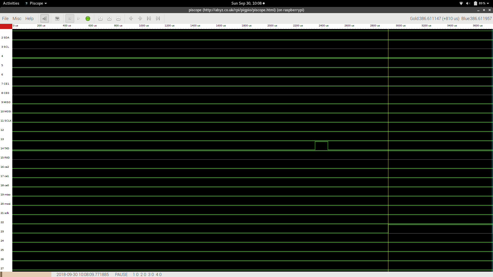

# Logic level translation

In this lab, we'll practice connecting devices that operate at different voltage levels to the Pi. 

## Notes

* In this lab, you will create some breadboard circuits with exposed pins and wires. Please be especially careful not to accidentally create connections that shouldn't be connected (e.g. short circuits). Also, check your work carefully before connecting any breadboard circuit to a board, to avoid damaging the board.
* Read each subsection of this lab manual in its entirety before you start following the instructions in it. Some instructions are modified by explanations that come afterwards.
* Although you may work with a partner, this collaboration is limited to discussion. Your partner is not allowed to construct or modify your circuit, log in to your Pi, or run commands or write code on your Pi. Similarly, you are not allowed to do these things for your partner. (You *are* encouraged to collaborate by screen-sharing or showing video of your circuit to debug and discuss problems together.)
* For your lab report, you must submit data, code, and screenshots from your own experiment. You are not allowed to use your lab partner's data, code, or screenshots.
* For any question in the lab report that is marked "Individual work", you should *not* collaborate with your lab partner or anyone else (even via discussion). You can use your notes, the lab manual, or the lecture slides and video to help you answer these questions.


\newpage


## Logic level translation using a voltage divider

In this experiment, we will use a voltage divider circuit to connect an HC-SR04 ultrasonic distance sensor to a Raspberry Pi. 

The HC-SR04 has a Trigger pin and an Echo pin. When it receives a HIGH pulse of at least 10µs on the Trigger pin, the sensor emits a series of ultrasonic pulses. These travel outwards until they encounter an object, at which time they are reflected back to the sensor. The sensor measures the time between the outgoing pulses and the first incoming pulse. It will then produce a HIGH pulse on its ECHO line, whose duration will reflect the time between the outgoing and incoming pulses. (This is illustrated in the [HC-SR04 User Manual](https://www.mpja.com/download/hc-sr04_ultrasonic_module_user_guidejohn.pdf), page 4: Module Timing).


The speed of sound through the air at sea level is typically around 343m/s, or 34300cm/s. To estimate the distance between the ultrasonic sensor and the nearest object in cm, we simply multiply the pulse duration in seconds by 34300/2 (since the ultrasonic pulse makes a 2-way trip!), or 17150. 

The HC-SR04 is a popular and inexpensive sensor, however it operates at 5V and our Pi uses 3.3V logic levels.  We can use the Pi's 5V supply pin to power the HC-SR04. Furthermore, a 3.3V signal is sufficient to register as HIGH on the ultrasonic sensor's trigger input, so we can use GPIO pins in output mode to "trigger" the sensor. However, if we connect the ECHO line on the HC-SR04 to a GPIO pin in input mode, we could damage the Pi, since the HC-SR04 produces a 5V signal on that line.

To prevent damage, we will use a voltage divider to translate the 5V output signal to 3.3V. (Since we only need logic level translation from 5V to 3.3V, high voltage to lower voltage, a voltage divider circuit is sufficient.)

\newpage


Choose resistors to form a voltage divider that will translate 5V to 3.0-3.3V (you may use multiple resistors in series to get the right resistance). To keep current draw low, the sum of all the resistors in your voltage divider should be at least 5kΩ.


**Before you connect the HC-SR04**, set up your voltage divider circuit on a breadboard, and test the circuit with a multimeter -

* Connect the 5V pin on the Pi to the top of the voltage divider
* Connect the GND pin on the Pi to the bottom of the voltage divider
* Use the multimeter to measure the voltage between GND and the middle of the voltage divider (where the 5V supply voltage should be translated to 3.0-3.3V)

Verify that the voltage is safe (not more than 3.3V) before connecting the rest of the circuit.

Take a photo showing the voltage for your lab report.

---

**Lab report**: Show the photo of the voltage divider, and annotate it to show (1) the value of each resistor, and (2) the measured voltage across the bottom half of the voltage divider.

---

Once you have tested your voltage divider, connect your HC-SR04 as follows:

* Connect GND on Pi to GND on the HC-SR04, and to the bottom leg of the voltage divider
* Move the 5V supply from the Pi from the top of the voltage divider (where it was placed for testing) and connect it to VCC on the HC-SR04
* Connect the Echo pin on the HC-SR04 to the top of voltage divider
* Connect GPIO23 on the Pi to the middle of the voltage divider (where you measured a voltage not more than 3.3V)
* Connect GPIO14 on the Pi to the Trigger pin on the HC-SR04


On the Pi, you may use the `hc-sr04.py` script to measure distance (also available on NYU Classes):


```
import RPi.GPIO as GPIO
import time
import sys

# Use BCM pin numbering
GPIO.setmode(GPIO.BCM)

# Define pin numbers
TRIG = 14
ECHO = 23

# Set up GPIO pins
GPIO.setup(TRIG,GPIO.OUT)
GPIO.setup(ECHO,GPIO.IN)

print("Start with LOW output on trigger (pin %d)" % TRIG)
GPIO.output(TRIG, False)
time.sleep(2)

print("Sending 10us pulse on trigger (pin %d)" % TRIG)
GPIO.output(TRIG, True)
time.sleep(0.00001)
GPIO.output(TRIG, False)


while GPIO.input(ECHO)==0:
  pulse_start = time.time()

while GPIO.input(ECHO)==1:
  pulse_end = time.time()

pulse_duration = pulse_end - pulse_start
pulse_duration_ms = pulse_duration*1000.0

distance = pulse_duration * 17150

print("Measured pulse of width %f ms" % pulse_duration_ms)
print("Estimated distance: %f cm" % distance)

# Keep line low to make it easier to see in piscope
GPIO.output(TRIG, False)


try:
  time.sleep(1000)
except KeyboardInterrupt:
  GPIO.cleanup()
  sys.exit()
```


Run

```
sudo pigpiod
```

Then start `piscope` in a VNC session, and then run the Python script with

```
python3 hc-sr04.py
```

\newpage


In `piscope`, zoom in on your signal and pause the display. Use the cursors to measure the duration of the ECHO pulse (as illustrated in the screenshot) - click on the screen to set the position of one cursor (blue or gold), then move your mouse to the second position and the interface will show you the time elapsed between the two.




Collect measurements with an object 5, 10, and 15 cm away. (The sensor works best with a smooth, flat object at close range.) In each case, save the output of the Python script and also take a screenshot from `piscope` showing the cursor measurement of the Echo pulse duration.

---

**Lab report**: Show the `piscope` screenshots with measurements for objects 5, 10, and 15 cm away. Explain how the distance is computed in each case using the pulse width.

---

\newpage

## Logic level translation using N-Channel MOSFET circuit

In this experiment, we will use an N-Channel MOSFET (2N7000) bidirectional logic level translation circuit.


You will need:

* A Pi, SD card, and power supply
* Breadboard and jumper cables
* Digital multimeter
* 10kΩ resistor
* 2N7000 N-channel MOSFET (read the print on the MOSFET carefully. Make sure it is a 2N7000 and not another similar-looking part!)

Start to construct the logic-level translation circuit -refer to the 2N7000 datasheet when connecting your circuit to help you identify the source, gate (middle pin), and drain of your MOSFET. 

{width=60%}

* The gate should be connected to the 3.3V power rail
* The source should be "pulled up" to the 3.3V power rail, with a 10kΩ resistor
* The drain should be "pulled up" to the 5V power rail, with a 10kΩ resistor

Connect the 5V line on the Pi to the 5V power rail, and the 3.3V line on the Pi to the 3.3V power rail. Make sure nothing in the circuit gets hot or otherwise indicates a possible problem.

Then, test five scenarios with a multimeter:

1. **3.3V I/O line drives circuit HIGH, 5V I/O line is INPUT**: Use a M-M jumper cable to connect the 3.3V-I/O line (source pin of the transistor) to the 3.3V power rail (i.e. set it HIGH). Then, use a multimeter to measure the voltage between the 5V-I/O line (drain pin of the transistor) and GND. Remove the M-M jumper from the circuit before you go to the next step.
2. **3.3V I/O line drives circuit LOW, 5V I/O line is INPUT**: Use a M-M jumper cable to connect the 3.3V-I/O line (source pin of the transistor) to GND (i.e. set it LOW). Then, use a multimeter to measure the voltage between the 5V-I/O line (drain pin of the transistor) and GND. Remove the M-M jumper from the circuit before you go to the next step.
3. **5V logic line drives circuit HIGH, 3.3V I/O line is INPUT**: Use a M-M jumper cable to connect the 5V-I/O line (drain pin of the transistor) to the 5V power rail (i.e. set it HIGH). Then, use a multimeter to measure the voltage between the 3.3V-I/O line (source pin of the transistor) and GND. Remove the M-M jumper from the circuit before you go to the next step.
4. **5V I/O line drives circuit LOW, 3.3V I/O line is INPUT**: Use a M-M jumper cable to connect the 5V-I/O line (drain pin of the transistor) to GND (i.e. set it LOW). Then, use a multimeter to measure the voltage between the 3.3V-I/O line (source pin of the transistor) and GND. Finally, remove the jumper from the circuit. 
5. **No I/O line drives circuit, both I/O lines are INPUT**: Use a multimeter to measure the voltage between the 3.3V-I/O line (source pin of the transistor) and GND. Then, use a multimeter to measure the voltage between the 5V-I/O line (drain pin of the transistor) and GND. 

\newpage

---

**Lab report**: Report on the results of each of the tests. Explain what state the MOSFET is in in each scenario (conducting or not conducting), and if it is conducting, explain why (channel or body diode). 

**Lab report** (individual work): Use information from the datasheet - specifically, the gate threshold voltage and body diode forward voltage - to explain the conditions under which current flows through the transistor.

---
