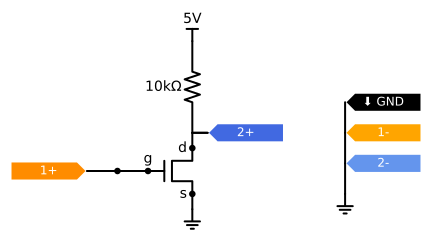

\newpage

In this lab, we'll practice using circuits for connecting devices that operate at different voltage levels.


## Notes

* In this lab, you will create some breadboard circuits with exposed pins and wires. Please be especially careful not to accidentally create connections that shouldn't be connected (e.g. short circuits). Also, check your work carefully before connecting any breadboard circuit to a board, to avoid damaging the board.
* You will submit your lab work in Gradescope. You will upload screenshots/photos and answer some questions as described in the Gradescope assignment. You do not have to write anything else (e.g. no description of procedure, etc.) 
* Read each subsection of this lab manual in its entirety before you start following the instructions in it. Some instructions are modified by explanations that come afterwards.
* Although you may work with a partner, this collaboration is limited to discussion and comparison. Your partner is not allowed to construct or modify your circuit, log in to your Pi, or run commands or write code on your Pi. Similarly, you are not allowed to do these things for your partner. 
* For your lab report, you must submit data, code, screenshots, and photos from your own experiment. You are not allowed to use your lab partner's data, code, screenshots, or photos.
* For any question in the lab report that is marked "Individual work", you should *not* collaborate with your lab partner or anyone else (even via discussion). You can use your notes, the lab manual, or the lecture slides and video to help you answer these questions.


## Parts

In this experiment, we will use a BJT transistor to switch a digital output on and off with a control signal from a GPIO pin, but with current and supply voltage from the Pi's power rails. You will need:

* A Pi, SD card, and power supply
* Breadboard and jumper cables
* Analog Discovery 2
* 2N3904 BJT NPN transistor. (The label is printed on the flat side of the transistor; you may have to hold the transistor at an angle in order to read it.)
* 2N700 MOSFET transistor. (The label is printed on the flat side of the transistor; you may have to hold the transistor at an angle in order to read it.)
* 1x220Ω, 2x1kΩ, 2x10kΩ, 1x4.7kΩ resistors
* HC-SR04 Ultrasonic Sensor

\newpage

## Procedure

### Set up the Analog Discovery 2 scope

Throughout this assignment, we will use the Analog Discovery 2 to visualize and compare the signal from a low-voltage device and a high-voltage device.

Connect your Analog Discovery 2 to your computer, and open the Waveforms app. Open the Scope tool. Configure the Scope tool so that:

* both Channel 1 and Channel 2 are enabled
* the vertical range is set up so you can see 0V, 3.3V, and 5V signal levels in the view

{ width=500px }

Then, connect a GND signal from your Pi to a common GND row on a breadboard, and add:

* any GND wire (black) on the Analog Discovery 2 to GND
* the 1- wire (orange and white striped) on the Analog Discovery 2 to GND
* the 2- wire (blue and white striped) on the Analog Discovery 2 to GND

You will leave these three GND pins connected for the *entire experiment*.

For the rest of this assignment, we will view the low-voltage signal on Channel 1 (orange) and the high-voltage signal on Channel 2 (blue).

\newpage

### Set up the two "signals"

The logic level translation circuits we are using will translate any type of signal: a single on-off signal (digital input or output), a PWM signal, a clock signal for a communication bus, or a data signal for a communication bus. For convenience, we'll set up two PWM signals - one at a high voltage level, one at a low voltage leve - to use throughout. A PWM signal is useful for logic level translation because we can verify that both the HIGH and LOW logic levels are transferred successfully to the new voltage.

First, on your Pi, set up the low-voltage signal. We will use a PWM signal on GPIO12 with a 100ms period and a 60% duty cycle:

```
gpio -g mode 12 pwm  
gpio pwm-ms     # For 10 Hz (100 ms period)
gpio pwmc 1920  # Set the PWM clock to 1920
gpio pwmr 1000  # Set the "range" to 1000
gpio -g pwm 12 600   # 60ms out of 100ms
```

Connect the 1+ (orange) pin on the Discovery 2 to GPIO12, run the scope, and verify that the PWM signal you see on CH1 matches the expected parameters. Take a screenshot for your lab report, then disconnect the 1+ pin from your Pi.

Then, on the Discovery 2, set up the high-voltage signal. We will use a PWM signal on W1 with a 100ms period and a 20% duty cycle:

* Click on the Wavegen tool from the Welcome screen
* Make sure that Channel 1 is selected
* Change the Type to Square
* Change the Frequency to 10 Hz (this will automatically change the Period to 100 ms)
* Change the Amplitude to 2.5V and the Offset to 2.5V
* Change the Symmetry (duty cycle) to 20%

{ width=500px }

Make sure that the signal that appears in the display has the expected parameters (20ms on time, 100ms period, minimum voltage level 0V, maximum voltage level 5V). Then click Run. You will leave this waveform running for the entire experiment. 

Connect the 2+ (blue) pin on the Discovery 2 to the W1 (yellow) pin on the Discovery 2. Run the scope, and verify that the PWM signal you see on CH2 matches the expected parameters. Take a screenshot for your lab report, then disconnect the 2+ pin from the W1 pin.


---

**Lab report**: Show the scope view with just the low-voltage signal on CH1. 

**Lab report**: Show the scope view with just the high-voltage signal on CH2.

---

### Low to high logic level translation using BJT 

First, we will look at the low-to-high logic level translation circuit using a BJT transistor (2N3904). Be careful about the orientation of this part - for your convenience, here is a pinout diagram:

{ width=300px }


You already have part of this circuit set up on your breadboard from last week, but switch out the buzzer and small resistor for a 10kΩ resistor. Then, connect the 1+ (orange) and 2+ (blue) pins on the Discovery 2 to realize the following schematic:

{width=400px}

Run the scope and check the display. The CH1 input will be floating (nothing is connected on the low-voltage signal side, so the input will pick up any stray noise in the circuit). The CH2 input will be pulled to 5V as long as the transistor is switched off. Verify that everything looks OK before you continue.

\newpage

Then, you will connect PWM signal on GPIO12 at the point where the low-voltage signal would appear in the circuit. (Recall that we are using this same PWM signal as the low-voltage signal throughout the experiment.)

{width=400px}

Run the scope tool, and verify that the low-level signal appears on CH1 and a level-shifted version of the same signal appears on CH2. Take a screenshot for your lab report, and a photo of your breadboard (make sure the numbered sticker on the breadboard is visible!)


When you are finished with this circuit, disconnect the parts from your breadboard (except for the GND row including Pi GND, 1-, and 2- wires from the Discovery 2 - leave that connected always.) Put the BJT and the 4.7kΩ resistor back in last week's kit.


---

**Lab report**: Annotate the breadboard photo of the circuit. Label the base, emitter, and collector pins of the transistor. Label each resistor. Also indicate the point where the low-voltage output signal is connected, and where the high-voltage input would be read.

**Lab report**: Show the screenshot of the scope display, with the low-voltage signal appearing on CH1 and a level-shifted version of the same signal on CH2. Does this level shifting circuit translate a 3.3V HIGH to 5V HIGH, and 3.3V LOW to 5V LOW? Explain.

**Lab report**: What type of signal is this level translation circuit suitable for?

---

\newpage


### Low to high logic level translation using MOSFET 

Next, we will construct a similar circuit using a MOSFET. We will use the 2N7000 FET. Review the datasheet for this part. The main parameter of relevance to this circuit is V\_GS(th). Check this value in the datasheet - will the 3.3V low-voltage signal at the gate pin be sufficient to switch the transistor on?

We will construct a similar level shifting circuit using the 2N7000. Be careful about the orientation of this part - for your convenience, here is a pinout diagram:

{ width=300px }

Prepare the following circuit on your breadboard:

* Source pin to GND
* Drain pin to 10kΩ series resistor to 5V
* Drain pin to 2+ (blue) scope input
* Gate pin to 1+ (orange) scope input

{width=400px}

Run the scope and check the display. The CH1 input will be floating (nothing is connected on the low-voltage signal side, so the input will pick up any stray noise in the circuit). The CH2 input will be pulled to 5V as long as the transistor is switched off. Verify that everything looks OK before you continue.

\newpage

Then, you will connect PWM signal on GPIO12 at the point where the low-voltage signal would appear in the circuit. (Recall that we are using this same PWM signal as the low-voltage signal throughout the experiment.)

{width=400px}

Run the scope tool, and verify that the low-level signal appears on CH1 and a level-shifted version of the same signal appears on CH2. Take a screenshot for your lab report, and a photo of your breadboard (make sure the numbered sticker on the breadboard is visible!)


When you are finished with this circuit, disconnect the parts from your breadboard (except for the GND row including Pi GND, 1-, and 2- wires from the Discovery 2 - leave that connected always.) 


---

**Lab report**: Show a screenshot of the 2N7000 datasheet, with V\_GS(th) highlighted. Will the 3.3V low-voltage signal at the gate pin be sufficient to switch the transistor on?

**Lab report**: Annotate the breadboard photo of the circuit. Label the gate, source, and drain pins of the transistor. Also indicate the point where the low-voltage output signal is connected, and where the high-voltage input would be read.

**Lab report**: Show the screenshot of the scope display, with the low-voltage signal appearing on CH1 and a level-shifted version of the same signal on CH2. Does this level shifting circuit translate a 3.3V HIGH to 5V HIGH, and 3.3V LOW to 5V LOW? Explain.

**Lab report**: What type of signal is this level translation circuit suitable for?

---

\newpage

### Bidirectional logic level translation using MOSFET 


The next circuit also uses the 2N7000 MOSFET, but in a bidirectional level shifting configuration. In this configuration,

* The gate pin should be connected to the 3.3V power rail
* The source pin should be "pulled up" to the 3.3V power rail, with a 10kΩ resistor
* The drain pin should be "pulled up" to the 5V power rail, with a 10kΩ resistor

Then, we'll add the scope pins:

* 1+ (orange) representing the low-voltage logic at the source pin
* 2+ (blue) representing the high-voltage logic at the drain pin

{width=400px}


Construct this circuit, on your breadboard. Run the scope and check the display. As long as the transistor is switched off, the CH1 input will be pulled to 3.3V and the CH2 input will be pulled to 5V. Verify the voltage levels and that everything looks OK before you continue.

Then, we'll connect the low-voltage signal from the Pi's GPIO12 pin:

{width=400px}

Run the scope tool, and verify that the low-level signal appears on CH1 at 3.3V and a level-shifted version of the same signal appears on CH2 at 5V. Take a screenshot for your lab report.

This circuit is a bidirectional logic level shifting circuit, which means that we can apply an output at the low-voltage side and read it on the high-voltage side (as we just did!), or we can apply an output at the high-voltage side and read it on the low-voltage side. Let's try that second setup now.

Disconnect GPIO12 from the circuit. 

\newpage

Verify in the Wavegen tool that the waveform generator is still running and is not stopped. Then, connect it to the high-voltage side of the circuit:

{width=400px}

Run the scope tool, and verify that the high-level signal appears on CH2 at 5V and a level-shifted version of the same signal appears on CH1 at 3.3V. Take a screenshot for your lab report.

Also take a photo of your breadboard (make sure the numbered sticker on the breadboard is visible!)

When you are finished with this circuit, disconnect the parts from your breadboard (except for the GND row including Pi GND, 1-, and 2- wires from the Discovery 2 - leave that connected always.) 


---

**Lab report**: In the 2N7000 datasheet, find the Drain-Source Diode Forward Voltage, V\_SD, and also find V\_GS(th). (The former is not specified for the 2N7000, but is specified for the 2N7002 which is a similar transistor in a different package type.) Take screenshots of the datasheet with these portions highlighted. Using these values specifically, explain the sequence of events that occurs and the state of the transistor:

* when either side is "driving" the circuit and the output level is HIGH
* when the low voltage logic is "driving" the circuit and the output level is LOW
* when the high voltage logic is "driving" the circuit and the output level is LOW


**Lab report**: Annotate the breadboard photo of the circuit. Label the gate, source, and drain pins of the transistor. Also indicate the point where the low-voltage I/O signal is connected, and the point where the high-voltage I/O signal is connected.

**Lab report**: Show the screenshot of the scope display, with the low-voltage signal appearing on CH1 and a level-shifted version of the same signal on CH2. Does this level shifting circuit translate a 3.3V HIGH to 5V HIGH, and 3.3V LOW to 5V LOW? Explain.

**Lab report**: Show the screenshot of the scope display, with the high-voltage signal appearing on CH2 and a level-shifted version of the same signal on CH1. Does this level shifting circuit translate a 5V HIGH to 3.3V HIGH, and 5V LOW to 3.3V LOW? Explain.


**Lab report**: What type of signal is this level translation circuit suitable for?

---


\newpage


### High to low logic level translation using a voltage divider 

Finally, we'll consider a simple circuit that uses resistors to shift a high-voltage output to a lower voltage level.

Construct the following circuit on your breadboard.


{width=200px}


Run the scope and check the display. Both inputs will be floating at this point, so they'll pick up any noise that happens to appear at the inputs.

In the Wavegen tool, make sure the waveform generator is still running. Then, you will connect PWM signal on W1 at the point where the high-voltage signal would appear in the circuit. (Recall that we are using this same PWM signal from W1 as the high-voltage signal throughout the experiment.)

{width=200px}


Run the scope tool, and verify that the high-level signal appears on CH2 at 5V and a level-shifted version of the same signal appears on CH1 at a 3.3V-compatible logic level. Take a screenshot for your lab report. Also take a photo of your breadboard (make sure the numbered sticker on the breadboard is visible!)

Disconnect the W1 pin from your circuit, but leave the rest of it in place.

\newpage

---

**Lab report**: Annotate the breadboard photo of the circuit. Label each resistor. Also label the point where the low-voltage input signal is connected, and the point where the high-voltage output signal is connected.

**Lab report**: Show the voltage divider equation with the relevant values for this circuit. If 5V is applied at the top of the voltage divider, what is the exact voltage level you would expect at the point where the low-voltage input is connected?

**Lab report**: Show the screenshot of the scope display, with the high-voltage signal appearing on CH2 and a level-shifted version of the same signal on CH1. Does this level shifting circuit translate a 5V HIGH to 3.3V HIGH, and 5V LOW to 3.3V LOW? Explain.


**Lab report**: What type of signal is this level translation circuit suitable for?

---


## Connect an ultrasonic sensor using a voltage divider

Finally, we will use the voltage divider circuit to connect an HC-SR04 ultrasonic distance sensor to a Raspberry Pi. 

The HC-SR04 has a Trigger pin and an Echo pin. When it receives a HIGH pulse of at least 10µs on the Trigger pin, the sensor emits a series of ultrasonic pulses. These travel outwards until they encounter an object, at which time they are reflected back to the sensor. The sensor measures the time between the outgoing pulses and the first incoming pulse. It will then produce a HIGH pulse on its ECHO line, whose duration will reflect the time between the outgoing and incoming pulses. This is illustrated in the HC-SR04 User Manual page 4: Module Timing).

{ width=500px}

The speed of sound through the air at sea level is typically around 343m/s, or 34300cm/s. To estimate the distance between the ultrasonic sensor and the nearest object in cm, we simply multiply the pulse duration in seconds by 34300/2 (since the ultrasonic pulse makes a 2-way trip!), or 17150. 

The HC-SR04 is a popular and inexpensive sensor, however it operates at 5V and our Pi uses 3.3V logic levels.  We can use the Pi's 5V supply pin to power the HC-SR04. 

Furthermore, a 3.3V signal is sufficient to register as HIGH on the ultrasonic sensor's trigger input, so we can use GPIO pins in output mode to "trigger" the sensor. However, if we connect the ECHO line on the HC-SR04 to a GPIO pin in input mode, we could damage the Pi, since the HC-SR04 produces a 5V signal on that line.

To prevent damage, we will use a voltage divider to translate the 5V output signal to 3.3V. (Since we only need logic level translation from 5V to 3.3V, high voltage to lower voltage, a voltage divider circuit is sufficient.)

Connect your HC-SR04 as follows:

* Connect GND on the HC-SR04 to the GND row on your breadboard
* Connect VCC on the HC-SR04 to 5V
* Connect the ECHO pin on the HC-SR04 to the top of voltage divider
* Connect GPIO23 on the Pi to the middle of the voltage divider 
* Connect GPIO14 on the Pi to the TRIG pin on the HC-SR04


The overall configuration (excluding the VCC and GND connections on the HC-SR04) should look like this:

{ width=350px }


\newpage

The output fro the HC-SR04 TRIG pin will be a pulse width. 


On the Pi, create a new file `hc-sr04.py` script to measure distance:


```
import RPi.GPIO as GPIO
import time
import sys

# Use BCM pin numbering
GPIO.setmode(GPIO.BCM)

# Define pin numbers
TRIG = 14
ECHO = 23

# Set up GPIO pins
GPIO.setup(TRIG,GPIO.OUT)
GPIO.setup(ECHO,GPIO.IN)

print("Start with LOW output on trigger (pin %d)" % TRIG)
GPIO.output(TRIG, False)
time.sleep(2)

print("Sending 10us pulse on trigger (pin %d)" % TRIG)
GPIO.output(TRIG, True)
time.sleep(0.00001)
GPIO.output(TRIG, False)


while GPIO.input(ECHO)==0:
  pulse_start = time.time()

while GPIO.input(ECHO)==1:
  pulse_end = time.time()

pulse_duration = pulse_end - pulse_start
pulse_duration_ms = pulse_duration*1000.0

distance = pulse_duration * 17150

print("Measured pulse of width %f ms" % pulse_duration_ms)
print("Estimated distance: %f cm" % distance)

# Keep line low to make it easier to see in scope
GPIO.output(TRIG, False)


try:
  time.sleep(1000)
except KeyboardInterrupt:
  GPIO.cleanup()
  sys.exit()
```


\newpage

Run the Python script with

```
python3 hc-sr04.py
```

Start the scope tool, and observe the signal in the scope and the terminal output from the Python script as you place objects near or far from the sensor. Take a screenshot of the scope window and verify that the 5V logic from the TRIG pin is shifted down to a 3.3V compatible signal at the low-voltage level point in the circuit.

For the last set of measurements, you will need to observe the signals on GPIO14 and GPIO23 simultaneously. You can use `piscope` OR the scope tool on the Discovery 2 - if you use the latter, move the 1+ pin from GPIO23 to GPIO14.

You will place an object approximately 5, 10, and 15 cm away from the sensor. (The sensor works best with a smooth, flat object at close range.)  You will capture two screenshots in each case. You'll need:

* a screenshot of the Python script terminal output for the given distance
* a screenshot of the scope display (either `piscope` or Discovery 2) showing the complete TRIG signal, and the time between the falling edge on TRIG and the rising edge on ECHO. This time is proportional to the distance. Use the cursor tool to measure this duration.  


---

**Lab report**: Show the scope screenshot with the 5V logic from the TRIG pin at CH2 and the level-shifted version on CH1. 

**Lab report**: Show the Python script output and the `piscope` or Discovery 2 scope screenshots with cursor measurements for objects 5, 10, and 15 cm away. Explain how the distance is computed in each case using the pulse width.

---
