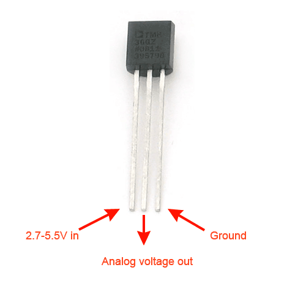

# Analog to digital converter

In this lab, we'll practice using an ADC (MCP300X) to read an analog input. 

## Notes

* In this lab, you will create some breadboard circuits with exposed pins and wires. Please be especially careful not to accidentally create connections that shouldn't be connected (e.g. short circuits). Also, check your work carefully before connecting any breadboard circuit to a board, to avoid damaging the board.
* Read each subsection of this lab manual in its entirety before you start following the instructions in it. Some instructions are modified by explanations that come afterwards.
* Although you may work with a partner, this collaboration is limited to discussion. Your partner is not allowed to construct or modify your circuit, log in to your Pi, or run commands or write code on your Pi. Similarly, you are not allowed to do these things for your partner. (You *are* encouraged to collaborate by screen-sharing or showing video of your circuit to debug and discuss problems together.)
* For your lab report, you must submit data, code, and screenshots from your own experiment. You are not allowed to use your lab partner's data, code, or screenshots.
* For any question in the lab report that is marked "Individual work", you should *not* collaborate with your lab partner or anyone else (even via discussion). You can use your notes, the lab manual, or the lecture slides and video to help you answer these questions.


## Parts

In this experiment, you will use an external ADC with an SPI interface to read from an analog sensor on the Pi. You will need:

* A Pi, SD card, and power supply
* Breadboard and jumper cables
* Digital multimeter
* MCP3004 ADC
* TMP36 temperature sensor. This part looks like a transistor. Read the label carefully to make sure you identify the correct part!
* Photoresistor
* 10kΩ resistor

\newpage

## Analog to digital conversion using an ADC


Place the MCP3004 into a breadboard with a "ravine" in the middle, so that the pins on either side are not connected. Use the datasheet to identify each pin (note the notch at the top of the IC to help you with orientation!)

Connect the AGND and DGND pins to a GND pin on your Pi, and connect the V\_DD and V\_REF pins to the 3.3V power supply on your Pi. Connect the CLK, D\_OUT, D\_IN, and CS lines to the SPI0 bus on your Pi. (Use CS0 on the Pi.)

### Test the ADC

Make a new directory on your Pi, and navigate to that directory:

```
mkdir ~/lab-adc
cd ~/lab-adc
```

There, save the following script as `adc.py`:

```
import spidev
import time

spi = spidev.SpiDev()
spi.open(0,0)    # SPI Port 0, Chip Select 0

# Run SPI bus at low speed so we can capture everything in piscope
spi.max_speed_hz = 7629 

# Send these bytes on the MOSI line and read the MISO line
readBytes = spi.xfer2([0b00000001, 0b10000000, 0b00000000])

for b in readBytes:
	print(format(b, '#010b'))
```

This script uses the hardware SPI bus on the Pi to connect to the ADC, have it read the analog voltage on Channel 0, and print the output of the ADC. It will print three 8-bit values, the last ten bits of which are bits 9 (MSB) through bit 0 (LSB) of the 10-bit ADC value.


Run

```
sudo pigpiod
```

and open Piscope, and use it to monitor the SPI lines while you read from the ADC. Then, run the script:


```
python3 adc.py
```

In your Piscope output, note the bits sent from the Pi to the ADC, and the bits sent in response from the ADC. Refer to Figure 6-1 in the datasheet, and make sure you can identify each of the configuration bits as well as the data bits. Also refer to Table 5-1 to explain the configuration bits.

Since the CH0 input on the ADC is floating, you'll pick up random noise in the circuit. 


To test the ADC and verify that we've connected it correctly, we'll connect CH0 to some known values and read the value from the ADC.

* Use a jumper cable to connect the CH0 input to GND. Read the value from the ADC.
* Use a jumper cable to connect the CH0 input to 3.3V. Read the value from the ADC.

\newpage 

---

**Lab report**: Modify the `adc.py` script to convert the value returned from the ADC as a base 10 integer, and print this value. (Don't use additional libraries.) Your code should *not* make any assumptions about the value of the "don't care" bits. Show your modified `adc.py`. You may use online resources to help, but *you must cite anything you use*! Explain how your code works.


**Lab report**: Show the output of the script for each test case. What is the digital value you read from the ADC in each case (as a 10-bit binary value, and as a base 10 integer value)? For this digital value, what was the analog input voltage at CH0? Use Section 4 of the MCP3004 datasheet to find this value. Show your work.


---

### Read analog temperature sensor

Now that we have verified that the ADC works, we will use it to read a real analog input voltage.

Connect the TMP36 temperature sensor as follows: first, identify the correct orientation. The image below shows the sensor with the flat side *up*. Then, connect the +VS pin on the sensor to 3.3V, connect the GND pin on the sensor to GND, and connect the VOUT pin on the sensor to CH0 on the ADC. (If it gets hot, you've reversed the orientation - disconnect it immediately!)

{ width=30% }

Run the `adc.py` script again. Save the terminal output and the SPI transaction in Piscope.

Try to change the temperature, by placing something hot or cold on the sensor. Can you make the value returned by the ADC go up/down?

---

**Lab report**: Refer to Figure 6.1 in the datasheet to annotate your Piscope output. Label each of the following bits in the Piscope output: Start, SGL/DIFF, D2, D1, D0, and B9-B0. Refer to Table 5-1 to explain the configuration bits. Also report the three bytes of "MCU Transmitted Data" and the three bytes of "MCU Received Data" from the output of your script.

**Lab report**: Convert the value returned by the ADC to a voltage. Then, convert this voltage to a temperature (in Celsius). Use the formula: Temperature in °C = [(VOUT) - Offset Voltage] / Output Voltage Scaling. Refer to Table 4 in the TMP36 datasheet to get the values for the TMP36, but make sure to use consistent units (V or mV) throughout your computations. (The datasheet gives offset voltage in V and output voltage scaling in mV, so you'll have to convert one or the other.)

**Lab report**: What is the smallest *change* in temperature (in degrees Celsius) that you can measure with this circuit? Explain your work.

---

\newpage

### Flask app for sensor readings

In a previous lab exercise, you used a capacitor timing circuit to read light levels from a photoresistor. Now, make a voltage divider using the photoresistor and a 10kΩ fixed resistor. Connect the middle of the voltage divider to CH1 on the ADC, to read the light level. (Leave the temperature sensor connected on CH0, so that both input channels on the ADC are connected.)


Modify your `adc.py` script to read from *both* channels (sequentially) when you run it. Try covering the photoresistor and shining a light on it, and verify that your ADC readings make sense.

Finally, we'll set up a browser-based UI for ambient environment sensors using Flask.

Create a new directory called `flask-sensors` in your `lab-adc` directory, then navigate to it:

```
mkdir ~/lab-adc/flask-sensors
cd ~/lab-adc/flask-sensors
```

We'll use the `virtualhat` library again - download and install it with

```
git clone https://github.com/ffund/virtualhat
cd virtualhat
sudo python3 setup.py install
cd ~/lab-adc/flask-sensors
```


We'll create a new template HTML page, with variables whose value will be filled in by the Flask app. Create a new directory called `templates`:

```
mkdir ~/lab-adc/flask-sensors/templates
```

And inside the templates directory, create `index.html`:


```
cd templates
nano index.html
```

with the following contents:

```
<!DOCTYPE html>
   <head>
    <title>Hello Flask!</title>
    <link rel="stylesheet" href="https://stackpath.bootstrapcdn.com/bootstrap/4.3.1/css/bootstrap.min.css">
   </head>
   <body>
   <div class="container">
    <h1>Temperature</h1>
  <p>Temperature is: {{ temp }} °C</p>
    <h1>Light level</h1>
  <p>Light level is: {{ light }}</p>
   </div>
   </body>
</html>
```


Then, navigate back to the `flask-photo` directory:

```
cd ~/lab-adc/flask-sensors
```

and create a file `flask-sensors.py` with the following contents:


```
from flask import Flask, redirect, render_template
import virtualhat

virtualhat.setup()

app = Flask(__name__, static_folder='')

@app.route("/")
def sensors_level():
    light_val = virtualhat.read_light_level()
    temp_val  = virtualhat.read_temp()
    return render_template('index.html', light=light_val, temp=temp_val)

if __name__ == "__main__":
    app.run(host='0.0.0.0', port=80, debug=True, threaded=True)
```

Run your Flask app with

```
sudo python3 flask-sensors.py
```
Open a browser on any device on the same network as your Pi, and in the address bar, type either the Pi's IP address, or the hostname you use to access the Pi over SSH. 

When you access this page, you'll see an error message, because you are calling a `read_temp` function in the `virtualhat` library, but this function doesn't exist! You'll need to modify the `virtualhat` library in a few ways:

* Modify the `setup` function to intialize the SPI bus. (You shouldn't create a new `spidev.SpiDev` each time you read the sensor level!)
* Modify the `read_light_level` function to read the value from CH1 on the ADC, and return a light level from 0 (dark) to 100 (high light level)
* Add a `read_temp` function to read the value from CH0 on the ADC, and return a temperature value in degrees Celsius.


To test your modifications, install the modified library with

```
sudo python3 setup.py install
```


Then, go back to your Flask app directory and run your Flask app again:

```
cd ~/lab-adc/flask-sensors
sudo python3 sensors.py
```

Open the page in your browser again, and test your Flask app.

---

**Lab report**: Draw a schematic showing how to connect the TMP36, photoresistor, ADC, and the Pi. Label each pin, including NC (not connected) pins.


**Lab report**: Upload your modified `virtualhat.py`. Also show a screenshot of your browser window with the photoresistor covered and with the photoresistor exposed to bright light.

**Lab report**: What is the benefit of this ADC circuit, compared to the one in the pulse width lab? What is the disadvantage of this ADC circuit, compared to the one in the pulse width lab?

---

