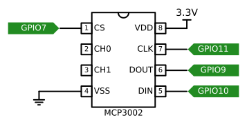
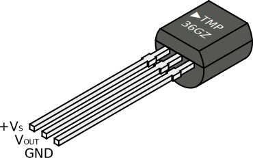
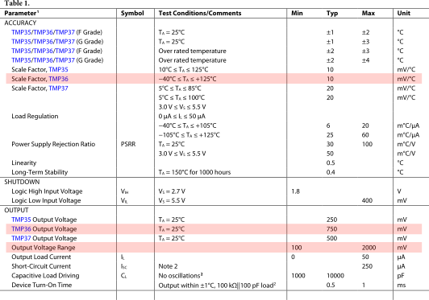
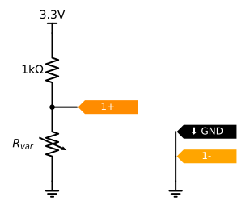
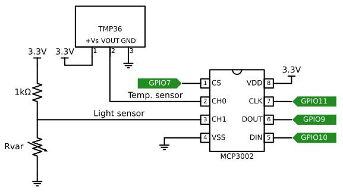

In this lab, we'll learn how to read an analog voltage using an analog to digital converter, which sends data to the Pi over a digital communication bus.

After this lab exercise, you should be prepared to work with not only the MCP3002 IC from this lab, but also other ADC ICs. You should understand how to use the ADC datasheet (and the datasheet of any analog sensors you plan to read), identify how to connect your parts, and write software to read from an ADC and use the values that it returns.


## Notes

* In this lab, you will create some breadboard circuits with exposed pins and wires. Please be especially careful not to accidentally create connections that shouldn't be connected (e.g. short circuits). Also, check your work carefully before connecting any breadboard circuit to a board, to avoid damaging the board.
* You will submit your lab work in Gradescope. You will upload screenshots/photos and answer some questions as described in the Gradescope assignment. You do not have to write anything else (e.g. no description of procedure, etc.) 
* Read each subsection of this lab manual in its entirety before you start following the instructions in it. Some instructions are modified by explanations that come afterwards.
* Although you may work with a partner, this collaboration is limited to discussion and comparison. Your partner is not allowed to construct or modify your circuit, log in to your Pi, or run commands or write code on your Pi. Similarly, you are not allowed to do these things for your partner. 
* For your lab report, you must submit data, code, screenshots, and photos from your own experiment. You are not allowed to use your lab partner's data, code, screenshots, or photos.
* For any question in the lab report that is marked "Individual work", you should *not* collaborate with your lab partner or anyone else (even via discussion). You can use your notes, the lab manual, or the lecture slides and video to help you answer these questions.

\newpage


## Parts

In this experiment, you will use an external ADC with an SPI interface to read from an analog sensor on the Pi. You will need:

* A Pi, SD card, and power supply
* Breadboard and jumper cables
* Analog Discovery 2
* MCP3002 two-channel ADC
* TMP36 temperature sensor. This sensor looks similar to a transistor. Read the label carefully to make sure you have the correct part!
* Photoresistor
* 1kΩ resistor


## Analog to digital conversion using an ADC


### Connect the ADC to your Pi

Place the MCP3002 into a breadboard with a "ravine" in the middle, so that the pins on either side are not connected. Use the datasheet to identify each pin (note the notch at the top of the IC to help you with orientation!)

{width=240px}


Connect the VSS pin to a GND pin on your Pi, and connect the VDD pin (which is also VREF) to the 3.3V power supply on your Pi. 

Connect the CLK, DOUT, DIN, and CS lines to the SPI0 bus on your Pi. Use CE1 on the Pi.


### Reading from the ADC

In this section, we'll see how to develop a Python script for reading from the ADC.

First, we'll need to establish a connection to the ADC over the digital communication bus. The MCP300X family of ADCs uses an SPI interface. As with any SPI peripheral, we need to know a few details before we can set up the bus:

1. which SPI device (SPI0 or SPI1) on the Pi the peripheral is connected to, and which CE line on that SPI device (CE0 or CE1 on SPI0, or CE0, CE1, or CE2 on SPI1). This will determine the arguments to `spi.open`.
2. the SPI mode (clock polarity and clock phase). This will determine how we set `spi.mode`.
3. the speed at which the SPI bus can operate. This will determine how we set `spi.max_speed_hz`

Since we connected the ADC to the pins associated with SPI0 and CE1, we know the answer to the first item! For the second item, the first page of the MCP3002 datasheet clarifies that we can use SPI mode 0,0 or mode 1,1 - we'll use 0,0. Finally, the "Timing Parameters" section of the Electrical Characteristics in the MCP3002 datasheet tells us the maximum bus speed; it says that when the supply voltage is 2.7V, the clock frequency should not exceed 1.2MHz. (For a higher supply voltage, the clock frequency can be faster; we'll use 1.2MHz.)

Now we have some idea how we will set up the bus using `spidev`:

```python
import spidev

spi = spidev.SpiDev()
spi.open(0,1)    # SPI Port 0, Chip Select 1

spi.mode = 0b00
spi.max_speed_hz = 1200000 # 1.2 MHz
```

but we still need to understand what data will be transferred over the bus - how to configure the ADC read, and how to use the value that is returned from the ADC.


In the MCP3002 datasheet, refer to **Section 5.0 Serial Communications** and **Section 6.1 Using the MCP3002 with Microcontroller (MCU) SPI Ports**, which describe the details of the communication protocol. Figure 6-1 in particular is especially helpful:

{width=85%}

This figure clarifies that each "read" from the ADC will involve a two-byte transfer over the SPI bus. (This is unlike the MCP3004/3008 that we discussed in class. That ADC used three bytes for each "read".)

In the first byte, the Pi (controller) sends the following:

* one LOW bit for "padding", in order to make the required bits align nicely on byte boundaries
* a HIGH bit to indicate the START of a read
* a bit that is either HIGH or LOW to indicate whether we want to use single-ended or differential mode. Table 5-1 in the MCP3002 datasheet clarifies that for single-ended mode (which measures the voltage between the input channel and the GND reference), we will send a HIGH bit.
* a bit that is either HIGH or LOW to indicate whether we want to read from CH0 or CH1 (in single-ended mode). Table 5-1 in the MCP3002 datasheet clarifies that for CH0 this bit should be LOW, and for CH1 this bit should be HIGH.
* a bit that is either HIGH or LOW to indicate whether we want the data to be sent from the ADC in MSB first format *only*, or whether the data should *also* be repeated in LSB first format afterwards. (See Figure 5-1 and 5-2!) To get each reading once, in MSB first format, this bit should be HIGH.
* the last three bits in this byte don't matter - we will send LOW values

In the second byte, the values sent from the Pi (controller) don't matter. We will send LOW values.

With this in mind, we can define a couple of "command byte" constant values that we can use to read from CH0 or CH1:

```python
ADC_CH0=0b01101000
ADC_CH1=0b01111000
```

Figure 6-1 also clarifies that the ADC expects the CS line to remain LOW for the entire two-byte transaction. When using `spidev`, we use the `xfer` function to transfer multiple bytes and *not* keep CS LOW between bytes; we use the `xfer2` function to transfer multiple bytes and *keep* CS LOW between bytes. In this case, we must use `xfer2`.

So (for example), to read from CH0, we would use

```python
readBytes = spi.xfer2([ADC_CH0, 0x00])
```

Finally, we need to understand how to use the bytes returned from the ADC over its serial output line! Figure 6-1 clarifies that in the first byte:

* the first five bits are not used, and should be discarded
* the sixth bit will be LOW
* the last two bits will contain the two most significant bits of the ten-bit value

Then, the second byte transferred from the ADC will have the remaining eight least significant bits of the ten-bit value.

To get the ten-bit value from the two bytes, we will therefore:

* mask the first byte with `0b11` and then shift it eight positions (i.e. pad with eight 0s on the right)
* add (logical OR) this with the second byte

like this:

```python
digitalValue = (((readBytes[0] & 0b11) << 8) | readBytes[1])
```

Now that we understand how to read values from this particular ADC, we can put it all together in one Python script.

Make a new directory on your Pi, and navigate to that directory:

```
mkdir ~/lab-adc
cd ~/lab-adc
```

then create a new file and open it for editing:

```python
nano read-mcp3002.py
```

Place the following code inside this file:

\newpage

```python
import spidev

ADC_CH0=0b01101000
ADC_CH1=0b01111000

spi = spidev.SpiDev()
spi.open(0,1)    # SPI Port 0, Chip Select 1
spi.mode = 0b00
spi.max_speed_hz = 1200000 # 1.2 MHz

readBytes = spi.xfer2([ADC_CH0, 0x00])   # Read from CH0
digitalValue = (((readBytes[0] & 0b11) << 8) | readBytes[1])
print("==== CH0 ====")
print(format(readBytes[0], '#010b'), format(readBytes[1], '#010b'))
print(digitalValue)

readBytes = spi.xfer2([ADC_CH1, 0x00])   # Read from CH1
digitalValue = (((readBytes[0] & 0b11) << 8) | readBytes[1])
print("==== CH1 ====")
print(format(readBytes[0], '#010b'), format(readBytes[1], '#010b'))
print(digitalValue)
```

Save it and close the file, then run it with:

```
python3 read-mcp3002.py
```

### Test the ADC

Since the CH0 and CH1 inputs on the ADC are floating, when you run this code, you'll just pick up random noise in the circuit (if there is any).  

To test the ADC and verify that we've connected it correctly, it's a good idea to first read in some "known" analog voltages and make sure we see the expected values. If we do, *then* we'll try reading from some analog sensors. 

First, test channel 0:

* Use a jumper cable to connect the CH0 input to GND. Read the value from the ADC. Then, disconnect the jumper cable to GND.
* Use a jumper cable to connect the CH0 input to 3.3V. Read the value from the ADC. Then, disconnect the jumper cable to 3.3V.

Then, test channel 1:


* Use a jumper cable to connect the CH1 input to GND. Read the value from the ADC. Then, disconnect the jumper cable to GND.
* Use a jumper cable to connect the CH1 input to 3.3V. Read the value from the ADC. Then, disconnect the jumper cable to 3.3V.


---

**Lab report**: Show the output of the script for each test case. What is the digital value you read from the ADC when the input to the ADC is tied to GND (as a 10-bit binary value, and as a base 10 integer value)? What about when the input to the ADC is tied to 3.3V? 

---

\newpage

### Test the temperature sensor

Now, we will prepare a temperature sensor as an analog input to the ADC. Before we connect it to the ADC, though, we'll look at the analog signal output from the temperature sensor directly, using our Discovery 2 scope.

First, make the two GND connections on the Discovery 2:

* GND (black) pin from your Discovery 2 to GND on Pi
* 1- (orange and white striped) pin from your Discovery 2 to GND on Pi


Then, connect the TMP36 temperature sensor. **Note**: be careful about the pinout on the TMP36! The diagram in the datasheet is a bit confusing. If it feels hot after you connect it, it's probably not oriented correctly, and you should disconnect the supply voltage and GND connections to the sensor.

{width=150px}

Connect the sensor as follows:


* Supply voltage pin to 3.3V on Pi
* GND pin to GND on Pi
* OUT pin to 1+ (orange) pin on your Discovery 2 


{width=300px}


Then, use the Scope tool on the Discovery 2 to observe the voltage on the Scope's Channel 1 input.

Refer to Table 1 in the TMP36 datasheet, part of which is reproduced below. 


\newpage


At ambient temperatures of 25°C, the output of the TMP36 should be 750mV. The range is 100mV to 2000mV, and the scaling factor is 10mV/°C for temperatures between -40°C and +125°C. 

This means that at -40°C the output will be 100mV, and for each degree above -40°C, the output voltage increases 10mV, up to 2000mV at +125°C.

{ width=90% }

Adjust the vertical and horizontal "zoom" and offset settings on the Scope. Change the Range to 20mV/div, and change the Offset so that the signal is approximately centered within the Scope window. Take a screenshot for your lab report.

By holding one or two fingers on the sensor, you should be able to raise its temperature a few degrees. Take a screenshot of the Scope view showing this variation in temperature.


---

**Lab report**: Show the screenshot of your Scope window with the temperature sensor measuring ambient conditions. Based on the sensor datasheet, what is the current ambient temperature in your environment, measured in °C? Also show the scope window when the sensor sees a slightly raised temperature - about how much did the temperature increase (in °C)?

**Lab report** (individual work): The TMP36 is rated for temperatures from -40°C to +125°C. If you connect its output pin to the MCP3002 ADC, what is the smallest digital value you expect to read from the ADC (when the ambient temperature is -40°C), and what is the largest digital value you expect to read from the ADC (when the ambient temperature is 125°C)? Use **Section 4.2 Digital Output Code** in the MCP3002 datasheet to answer this question, and show your work.

---

\newpage


### Test the light sensor

Next, we will prepare a second analog input to the ADC: a photoresistor. First, we'll examine the analog signal from this sensor with our Discovery 2 scope.


To measure a resistive sensor using an ADC, we use a voltage divider circuit to turn the variable resistance into a variable voltage. Connect your photoresistor (R\_VAR) and a 1k fixed resistor in a voltage divider, as shown below. 

{ width=200px }


Also connect your Discovery 2 as follows:

* GND (black) pin from your Discovery 2 to GND
* 1- (orange and white striped) pin from your Discovery 2 to GND
* 1+ (orange) pin from your Discovery 2 to the middle of the voltage divider

<!-- it will vary from around 3 to 3.3V - not much at all!   -->

Then, use the Scope tool on the Discovery 2 to observe the voltage on the Scope's Channel 1 input as the light incident on the resistor varies:

* ambient light
* with the sensor covered (dark)
* with a bright light shining on the sensor

Adjust the vertical and horizontal "zoom" and offset settings on the Scope, so that you can clearly see the range across which the voltage across the light sensor varies. (This is the voltage that will be read as input by the ADC.) Take a screenshot for your lab report - try to get a screenshot that shows the complete voltage range you observed, including both dark and bright light settings in the same screenshot.

---

**Lab report**: Annotate the screenshot of the Scope display to indicate when the sensor was in the darkest possible conditions, and when the sensor was in bright light.  What is the range of analog voltage values you measured across the light sensor?

**Lab report** (individual work): Does this voltage divider work well as an input to an ADC - will you be able to reliably detect small changes in light levels? How could you change the value of the fixed resistor to improve the light sensing capabilities of this circuit? (Be specific - what alternate value would you suggest for the fixed resistor?)

---

\newpage

### Use ADC to read sensors

Now that we have verified that the ADC works, and we understand the signals from our two analog sensors, we are ready to use the ADC to read analog votlages.

Connect both sensors to the ADC, as shown in the diagram:

{width=500px}

Run the `read-mcp3002.py` script again. Save the terminal output.

Try to change the temperature, by placing something hot or cold on the sensor. Can you make the value returned by the ADC go up/down? Similarly, try shining a light on the light sensor, and verify that you can change the value returned by the ADC.

---

**Lab report**: For *one* measurement from CH0, show the following:

* the output of the `read-mcp3002.py` script for CH0
* annotate a copy of Figure 6-1 from the MCP3002 datasheet. Label each of the four data lines with the name of the Pi pin it is connected to in your circuit. Then, for each bit on the DIN and DOUT lines, annotate to show the value sent or received (0 or 1) in this example (i.e. for the SPI transfer whose output you just showed).
* For each configuration bit sent by the Pi to the MCP3002, explain its purpose, and why it takes on the value you showed in this example.

**Lab report**: For *one* measurement from CH1, show the following:

* the output of the `read-mcp3002.py` script for CH1
* annotate a copy of Figure 6-1 from the MCP3002 datasheet. Label each of the four data lines with the name of the Pi pin it is connected to in your circuit. Then, for each bit on the DIN and DOUT lines, annotate to show the value sent or received (0 or 1) in this example  (i.e. for the SPI transfer whose output you just showed).
* For each configuration bit sent by the Pi to the MCP3002, explain its purpose, and why it takes on the value you showed in this example.


---

\newpage

### Flask app for sensor readings

In a previous lab exercise, you used a capacitor timing circuit to read light levels from a photoresistor, and you made this sensor reading available over a browser-based user interface. Now, you will make the temperature and light sensor readings available over a similar interface.


Create a new directory called `flask-sensors` in your `lab-adc` directory, then navigate to it:

```
mkdir ~/lab-adc/flask-sensors
cd ~/lab-adc/flask-sensors
```

We'll use the `virtualhat` library again - download and install it with

```
git clone https://github.com/ffund/virtualhat
cd virtualhat
sudo python3 setup.py install
cd ~/lab-adc/flask-sensors
```

We'll create a new template HTML page, with variables whose value will be filled in by the Flask app. Create a new directory called `templates`:

```
mkdir ~/lab-adc/flask-sensors/templates
```

And inside the templates directory, create `index.html`:


```
cd templates
nano index.html
```

with the following contents:


```html
<!DOCTYPE html>
   <head>
    <title>Hello Flask!</title>
    <link rel="stylesheet" href="https://stackpath.bootstrapcdn.com/bootstrap/4.3.1/css/bootstrap.min.css">
   </head>
   <body>
   <div class="container">
    <h1>Temperature</h1>
  <p>Temperature is: {{ temp }} °C</p>
    <h1>Light level</h1>
  <p>Light level is: {{ light }}</p>
   </div>
   </body>
</html>
```


Then, navigate back to the `flask-sensors` directory:

```
cd ~/lab-adc/flask-sensors
```

and create a file `flask-sensors.py` with the following contents:

\newpage


```python
from flask import Flask, redirect, render_template
import virtualhat

virtualhat.setup()

app = Flask(__name__, static_folder='')

@app.route("/")
def sensors_level():
    light_val = virtualhat.read_light_level()
    temp_val  = virtualhat.read_temp()
    return render_template('index.html', light=light_val, temp=temp_val)

if __name__ == "__main__":
    app.run(host='0.0.0.0', port=80, debug=True, threaded=True)
```

Run your Flask app with

```
sudo python3 flask-sensors.py
```

Open a browser on any device on the same network as your Pi, and in the address bar, type either the Pi's IP address, or the hostname you use to access the Pi over SSH. 

This page will return an error message, because you are calling a `read_temp` function in the `virtualhat` library, but this function doesn't exist! You'll need to modify the `virtualhat` library as follows:

* Modify the `setup` function to intialize the SPI bus. (You shouldn't create a new `spidev.SpiDev` each time you read the sensor level!)
* Modify the `read_light_level` function to read the value from CH1 on the ADC, and return a light level from 0 (dark) to 100 (bright light level). (This is similar to what you did in a previous lab assignment, when you mapped a pulse width to a relative light level.)
* Add a `read_temp` function to read the value from CH0 on the ADC, and return a temperature value in degrees Celsius.


To test your modifications, install the modified library with

```
sudo python3 setup.py install
```


Then, go back to your Flask app directory and run your Flask app again:

```
cd ~/lab-adc/flask-sensors
sudo python3 sensors.py
```

Open the page in your browser again, and test your Flask app.

---


**Lab report**: Upload your modified `virtualhat.py`. Also show a screenshot of your browser window with the Flask app values:

* with the photoresistor covered and with the photoresistor exposed to bright light.
* with the temperature sensor measuring your ambient environment, and with a slightly warmer measurement (for example, from holding a finger on the sensor)

**Lab report**: What is a benefit of this ADC circuit, compared to the one in the pulse width lab? What is a disadvantage of this ADC circuit, compared to the one in the pulse width lab?

---

