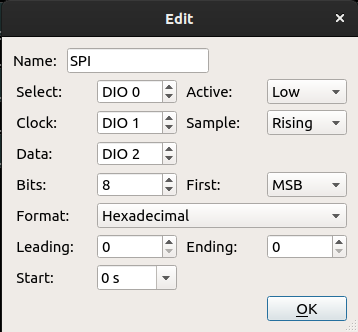

In this lab, we'll practice using a shift register and an I2C multiplexer to multiplex I/O pins over a serial communication bus.


## Notes

* In this lab, you will create some breadboard circuits with exposed pins and wires. Please be especially careful not to accidentally create connections that shouldn't be connected (e.g. short circuits). Also, check your work carefully before connecting any breadboard circuit to a board, to avoid damaging the board.
* You will submit your lab work in Gradescope. You will upload screenshots/photos and answer some questions as described in the Gradescope assignment. You do not have to write anything else (e.g. no description of procedure, etc.) 
* Read each subsection of this lab manual in its entirety before you start following the instructions in it. Some instructions are modified by explanations that come afterwards.
* Although you may work with a partner, this collaboration is limited to discussion and comparison. Your partner is not allowed to construct or modify your circuit, log in to your Pi, or run commands or write code on your Pi. Similarly, you are not allowed to do these things for your partner. 
* For your lab report, you must submit data, code, screenshots, and photos from your own experiment. You are not allowed to use your lab partner's data, code, screenshots, or photos.
* For any question in the lab report that is marked "Individual work", you should *not* collaborate with your lab partner or anyone else (even via discussion). You can use your notes, the lab manual, or the lecture slides and video to help you answer these questions.

\newpage

## Parts

In this experiment, we will use two ICs - a shift register and an I2C multiplexer - to multiplex I/O pins on the Pi. You will need:

* A Pi, SD card, and power supply
* Breadboard and jumper cables
* Analog Discovery 2
* SN74HC595N shift register
* 10 segment LED bar graph
* 8x 220Ω resistor
* MCP23008 I2C pin multiplexer
* 2x push button switches
* 4x small LED with 2.0FV


## Multiplexing outputs with a shift register 


### Connect your shift register and LED bar graph

For this experiment, we will use the SN74HC595N shift register to control an LED "bar graph" output. The LED bar graph has 10 LEDs, but we will just use 8 of them.

Use the datasheet for the LED bar graph to orient the part (one of the corners is slightly flattened, so you can see which side has the LED anodes and LED cathodes). Then place it in a breadboard with a "ravine" in the middle, near the top of the breadboard, and oriented so that the anodes are on the left side of the breadboard and the cathodes are on the right side.

Connect the top 8 cathodes to the GND power rail on your breadboard, and connect this GND rail to the GND line on your Pi.

Then, place your shift register across the "ravine" in the breadboard, underneath the LED bar graph, with the notch (indicating the top of the IC) at the top.

Use the following table from the SN74HC595N datasheet to identify the pins on the shift register:


\newpage


Then, connect your shift register as described below.

First, we will connect the outputs of the shift register to the LED bar graph. For this part, you must be very careful: with many "bare" resistor legs positioned very close to one another, it's easy to accidentally short them. Use your 220Ω resistors to connect the top 8 anodes on the bar graph to outputs QA through QH of the shift register, in order, with QA connected to the *top* bar and QH connected to the *bottom* of the 8 connected bars. Be very careful to make sure no resistor legs or other conductive parts are accidentally touching!

Once you are confident with that part of the circuit, connect the rest of the shift register pins:

* Connect the GND pin of the shift register to GND and the VCC pin to 3.3V.
* The OE (output enable) pin on the shift register, which is active LOW, should be tied to ground to permanently enable the outputs.
* The SRCLR (shift register clear) pin on the shift register, which is also active LOW, is tied to the HIGH voltage level so that it is permanently _not_ active.
* The SI/SER (serial input) pin on the shift register is connected to GPIO10 on the Pi.
* The RCLK pin on the shift register is connected to GPIO8 on the Pi.
* The SRCLK pin on the shift register is connected to GPIO11 on the Pi.


### Understanding the shift register

The basic operation of the shift register is described by "Figure 4. Logic Diagram (Positive Logic)" and "Table 1 - Function Table" on page 12 and 13 of the datasheet. The device is an 8-bit shift register, connected to an 8-bit storage register, which is connected to the 8 output pins.

* When the SRCLK line is pulsed, the bit on the SER line moves into the first stage of the shift register, and every other stage is shifted to the next stage.
* When the RCLK line is pulse, the contents of the shift register are copied to a storage register, which is connected to the output pins. Now, all of the outputs are HIGH or LOW depending on the contents of the register.

\newpage


### Flask app for shift register

To help you understand how the shift register works, I have prepared a Flask UI for the shift register.

Create a new directory, and navigate to it:

```
mkdir ~/lab-multiplex
cd ~/lab-multiplex
```

Inside this directory, create and navigate to a Flask UI directory:

```
mkdir flask-shift
cd flask-shift
```

Inside this directory, create a file `index.html` with the following contents:


```html
<!DOCTYPE html>
   <head>
    <title>Shift register</title>
    <link rel="stylesheet" href="https://stackpath.bootstrapcdn.com/bootstrap/4.3.1/css/bootstrap.min.css">
   </head>
   <body>
   <div class="container">
    <h1>Shift register control</h1>
      <a href="/out/0" class="btn btn-primary" role="button">Send LOW</a>
      <a href="/out/1" class="btn btn-primary" role="button">Send HIGH</a>
      <a href="/clk/0" class="btn btn-primary" role="button">Pulse SRCLK</a>
      <a href="/clk/1" class="btn btn-primary" role="button">Pulse RCLK</a>
   </div>
   </body>
</html>
````

Save and close this file. 

\newpage

Then, create a file `shift-app.py` with the following contents:

```python
from flask import Flask, redirect
import RPi.GPIO as GPIO

import time

SDI   = 10  # BCM10 - physical pin 19
RCLK  = 8   # BCM8 - physical pin 24
SRCLK = 11  # BCM11- physical pin 23

CLK_TIME = 0.05

app = Flask(__name__, static_folder='')

@app.route("/")
def hello():
    return app.send_static_file('index.html')

@app.route('/out/<int:value>')
def send_output(value):
    GPIO.output(SDI,value)
    return redirect("/")

@app.route('/clk/<int:clock>')
def pulse_clk(clock):
    if clock==0:
        clk_pin = SRCLK
    elif clock==1:
        clk_pin = RCLK
    GPIO.output(clk_pin, GPIO.LOW)
    time.sleep(CLK_TIME)
    GPIO.output(clk_pin, GPIO.HIGH)
    time.sleep(CLK_TIME)
    return redirect("/")


if __name__ == "__main__":
    # set up GPIO pins
    GPIO.setwarnings(False)
    GPIO.setmode(GPIO.BCM)   # BCM pin numbering
    GPIO.setup(SDI, GPIO.OUT)
    GPIO.setup(RCLK, GPIO.OUT)
    GPIO.setup(SRCLK, GPIO.OUT)
    GPIO.output(SDI, GPIO.LOW)
    GPIO.output(RCLK, GPIO.LOW)
    GPIO.output(SRCLK, GPIO.LOW)
    app.run(host='0.0.0.0', port=80, debug=True, threaded=True)
```


Run with

```
sudo python3 shift-app.py
```

\newpage

Open a browser on any device on the same network as your Pi, and in the address bar, type the Pi's IP address on this network. This will load a page with four buttons on it, like the following:

{width=40%} 

You will control the state of the SER line with the "Send LOW" and "Send HIGH" buttons, and you can pulse either clock with the "Pulse SRCLK" and "Pulse RCLK" buttons.


Try the following sequence to see how the shift register moves values from one stage to the next:

* Press "Send HIGH". This will send a HIGH value to the SER line on the shift register. Nothing will change on the LED bar graph.
* Press "Pulse SRCLK". This will "clock" the value on the SER line (the HIGH value you just set!) into the shift register. The new HIGH value will be in the first stage, and every stage will be shifted over one step. However, nothing will change on the LED bar graph.
* Press "Pulse RCLK". This will "clock" the value in the shift register to the storage register. The storage register vlaues will appear on the outputs QA (first stage) to QH (last stage), and in turn, on the LED bar graph.

At this point, you should see that the first bar in the LED bar graph (the one connected to QA) is lit!

Now, we'll see how that value "shifts" through the eight-bit shift register.

* Press "Send LOW". This will change the value on the SER line to LOW. (Otherwise, we'd keep loading new HIGH values into the first shift register stage - we don't want to do that!). Nothing will change on the LED bar graph.
* Press "Pulse SRCLK". This will "clock" the value on the SER line (the LOW value you just set!) into the shift register. The new LOW value will be in the first stage, and every stage will be shifted over one step. However, nothing will change on the LED bar graph.
* Press "Pulse RCLK". This will "clock" the value in the shift register to the output register. The new state of the shift register stages will appear on the outputs QA (first stage) to QH (last stage), and in turn, on the LED bar graph.


You should see that the HIGH value you sent previously has "shifted" to the second stage - the LED bar that is connected to QB will be lit.

Repeat this "shift" until the HIGH value has shifted past the last stage (QH) and all of the LED bars are *not* lit.

In the previous example, we updated the storage register (and thereby, the LED outputs) each time we updated the shift register. However, in many cases we'll want to send an 8-bit value to the shift register and only *then* update the storage register, so that only the desired output (and not the intermediate shift register states) appears.

Repeat the steps above, but this time, only pulse RCLK once, at the end of the sequence. Can you make the LED bar graph go straight from "all outputs off" to "only the last output (at QH) is HIGH"?

---

**Lab report** (individual work): Identify the sequence of steps (button presses) to make the ASCII equivalent of the first digit of your net ID appear on the LED bar graph, *without* showing the intermediate steps. (Try it out and make sure it works!) List those steps.

---

\newpage

### Shift register using SPI bus

The sequence of steps used to "send" a byte to the output pins:

* keep RCLK low
* send one bit at a time on SER, and pulse SRCLK with each bit
* pulse RCLK high at the end

looks just like an SPI transaction, with the SRCLK line acting as clock, a serial data out line, and the RCLK line acting as a chip select line that is pulled low before the transaction begins and pulled high at the end of the transaction. 

In fact, we can use the hardware SPI to send a byte to the LED array. 

Since the Flask app we just used reconfigured the SPI pins to work in OUTPUT mode, we first have to set them back to ALT mode to use the hardware SPI device. We'll do this with the `pigs` utility in the `pigpio` library. If `pigpiod` is not already running, then run


```
sudo pigpiod
```

Then, run

```
pigs m 8 w  # pin8 - ce0 - to write mode
pigs m 9 0  # pin9 - miso - to alt0
pigs m 10 0 # pin10 - mosi - to alt0
pigs m 11 0 # pin11 - sclk- to alt0
``` 

to set the pin modes. You can then use `gpio-readall` and verify that the SPI pins are in ALT0 mode.

Finally, send a byte to the LED array using the hardware SPI device. 

Navigate back to your `lab-multiplex` directory:


```
cd ~/lab-multiplex
```

Then create a `shift-register-spi.py` script with the following contents:


```python
import spidev
import time

spi = spidev.SpiDev()
spi.open(0,0)    # SPI Port 0, Chip Select 0
spi.mode = 0b00
spi.max_speed_hz = 7629
spi.xfer([0b01010101])
```

Run this script with 

```
python3 shift-register-spi.py
```

and observe the effect on the LED bar graph.

\newpage

Let us inspect this SPI signal with the Discovery 2. Connect your Discovery 2 to the SPI bus as follows:

* Use the row of header pins that came with the Discovery 2 - stick it in to the breadboard on the right side of the shift register. Then, you'll be able to connect the Discovery 2 wires directly.
* Connect the GND pin on the Discovery 2 to GND.
* Connect the DIO0 (pink) pin on the Discovery 2 to RCLK
* Connect the DIO1 (green) pin on the Discovery 2 to SRCLK
* Connect the DIO2 (purple) pin on the Discovery 2 to SER

Then, open the Logic Analyzer tool on the Discovery 2. Add an "SPI" bus with the following configuration:

{width=40%}

and configure a trigger on the falling edge of DIO0 (Enable).

Watch the SPI transfer in your Discovery 2 Logic Analyzer as you use the `shift-register-spi.py` script to send the ASCII equivalent of the first character in your Net ID to the LED array. Take a screenshot of the Logic Analyzer view for your lab report.

We can use the shift register to easily control a large number of outputs, without using many GPIO pins. (Note that only one pin on the Pi is completely occupied by the shift register - the CS line! The other SPI bus pins can still be used to connect a second SPI peripheral, with the other CS line.)

Modify the `shift-register-spi.py` script so it creates the following effect on the LED bar graph:

* first, all bars are off
* after one second, the top and bottom bars are lit
* after another second, the top 2 and bottom 2 bars are lit
* after another second, the top 3 and bottom 3 bars are lit
* after another second, all 8 bars are lit.

For full credit, your code should be clean, organized, and commented appropriately.

\newpage


---

**Lab report**: Show the Logic Analyzer screenshot from the SPI transfer of the first character of your net ID to the LED bar graph via the shift register. Annotate the screenshot and indicate the exact instant in time at which: 


* Each bit is loaded into the *first* shift register stage.
* The output pins show the byte that you sent.


**Lab report**: Upload your modified `shift-register-spi.py` script. The script should create the following effect on the LED bar graph:

* first, all bars are off
* after one second, the top and bottom bars are lit
* after another second, the top 2 and bottom 2 bars are lit
* after another second, the top 3 and bottom 3 bars are lit
* after another second, all 8 bars are lit.

For full credit, your code should be clean, organized, and commented appropriately.


---


When you are finished with this section, you can remove these parts from your breadboard.

\newpage

## I2C multiplexer

Next, we'll use the MCP23008 I2C pin multiplexer to control multiple inputs and outputs using the (shared) I2C bus. Unlike the shift register, which can only be used to control *output* pins, the MCP23008 can be used to multiplex output *and* input pins.

Place the pin multiplexer (MCP23008) in your breaboard. Refer to the MCP23008 datasheet to identify the pins. Make sure you look at the diagram for the MCP23008, not the other multiplexer varieties also described in the same datasheet.

Then,

* Connect VSS to GND, VDD to 3.3V.
* Connect the SCL and SDA pins to the I2C bus on your Pi. 
* The RESET pin, which is active low, should be tied to 3.3V so that the IC is *not* reset.
* Each of the address pins A2, A1, A0, should be tied to either GND *or* 3.3V, so that the address of the IC is `0x20`. To determine the I2C address given the state of the A2, A1, A0 pins, refer to **Figure 1-2 I2C control byte format** in the datasheet. 

Before you connect any inputs and outputs, test your I2C connection. Use

```
i2cdetect -y 1 0x20 0x27
```

to scan the I2C bus and see if there are any devices connected in the address range 0x20 to 0x27. Make sure your MCP23008 appears on address 0x20.

For this exercise, you will implement a tally counter. It should have:

* two buttons - one button to increment the count, one button to decrement the count.
* four bits of output. Use four 2mm LEDs, with 220Ω current-limiting resistors, to display the current count. 

Connect these inputs and outputs as follows:

* Connect the HIGH side of each LED to GP4, GP5, GP6, and GP7, in order of their position on the breadboard. Then, put the LOW side of each LED in series with a current-limiting resistor to GND.
* For each push button switch, identify which pins are internally connected when the switch is not actuated. Then, connect one pin of each switch to GP0 and GP1, respectively, and the other (independent) pin of each switch to GND using a current-limiting resistor in series. (The purpose of the current-limiting resistor is to protect against accidentally setting the GPIO pin as OUTPUT HIGH). 
 
To use the MCP23008, we'll use the `smbus` library in Python, which allows us to read and write to the I2C bus. We'll mainly use two functions:

* `write_byte_data` accepts three arguments: the address of the I2C peripheral, the address of the register we want to write to, and the byte we want to write to that register.
* `read_byte_data` accepts two arguments: the address of the I2C peripheral, and the address of the register we want to read from.


A demo script that shows you how to read from the MCP23008 input pins and write to the MCP23008 output pins is provided for you. 

\newpage

Carefully study this script, then try to run it:


```python
import time
import sys
import smbus

MCP23008_ADDR  = 0x20  # Address of peripheral on I2C bus
MCP23008_IODIR = 0x00  # IO direction configuration register address
MCP23008_GPPU  = 0x06  # Pull-up configuration register address
MCP23008_GPIO  = 0x09  # GPIO register address

i2c = smbus.SMBus(1)

def setAllInput():
    i2c.write_byte_data(MCP23008_ADDR, MCP23008_IODIR, 0xFF)

def setAllOutput():
    i2c.write_byte_data(MCP23008_ADDR, MCP23008_IODIR, 0x00)

def getAllDir():
    return i2c.read_byte_data(MCP23008_ADDR, MCP23008_IODIR)

def getAllPullup():
    return i2c.read_byte_data(MCP23008_ADDR, MCP23008_GPPU)

def setPinDir(pin, isInput, pullup = False):

    directionReg = i2c.read_byte_data(MCP23008_ADDR, MCP23008_IODIR)

    if isInput:
        directionReg |= (1 << pin)
    else:
        directionReg = directionReg & ~(1<<pin)
    i2c.write_byte_data(MCP23008_ADDR, MCP23008_IODIR, directionReg)

    if isInput:
        puReg = i2c.read_byte_data(MCP23008_ADDR, MCP23008_GPPU)
        if pullup:
            puReg = puReg | (1<<pin)
        else:
            puReg = puReg & ~(1<<pin)
        i2c.write_byte_data(MCP23008_ADDR, MCP23008_GPPU, puReg)

def readAll():
    return i2c.read_byte_data(MCP23008_ADDR, MCP23008_GPIO)

def readPin(pin):
    gpioReg = i2c.read_byte_data(MCP23008_ADDR, MCP23008_GPIO)
    return (gpioReg >> pin) & 0x01

def setPin(pin, state):
    gpioReg = i2c.read_byte_data(MCP23008_ADDR, MCP23008_GPIO)
    if state:
        gpioReg = gpioReg | (1 << pin)
    else:
        gpioReg = gpioReg & ~(1<<pin)        
    i2c.write_byte_data(MCP23008_ADDR, MCP23008_GPIO, gpioReg)

if __name__ == '__main__':

    # demo "library" functions

    setAllInput()
    setPinDir(4, 0)
    setPinDir(0, 1, pullup = True)

    print("Pin modes (0=output, 1=input):")
    print(format(getAllDir(), "010b"))
    print("Built-in pull-up (0=disabled, 1=enabled):")
    print(format(getAllPullup(), "010b"))

    print("Set GP4 HIGH")
    setPin(4, 1)
    d = readPin(4)
    print(d)
    time.sleep(0.5)
    print("Set GP4 LOW")
    setPin(4, 0)
    d = readPin(4)
    print(d)

    print("Read input on GP0")
    d = readPin(0)
    print(d)
```


This script provides some basic "library" functions for reading from or writing to entire registers on the MCP23008, and for reading and writing the configuration or state of any single pin. Try it out and make sure you understand how it works.

Finally, implement the tally counter with the 4-bit output and the two switch inputs, as described above. Your counter should have an increment button and a decrement button (either of which can be pressed at *any* time, in *any* sequence), and should display the current count as a binary number on the 4-bit LED output.


You can use the baseline script as a starting point to implement your tally counter! The rest of the details are up to you. However, your code should be clean, organized, and commented appropriately for full credit.


---

**Lab report**: Upload your tally counter implementation as a `.py` file. 

Your counter should have an increment button and a decrement button (either of which can be pressed at *any* time, in *any* sequence), and should display the current count as a binary number on the 4-bit LED output.


You can use the baseline script as a starting point to implement your tally counter! The rest of the details are up to you. However, your code should be clean, organized, and commented appropriately for full credit.

Also upload a short video showing your tally counter in operation.

---
